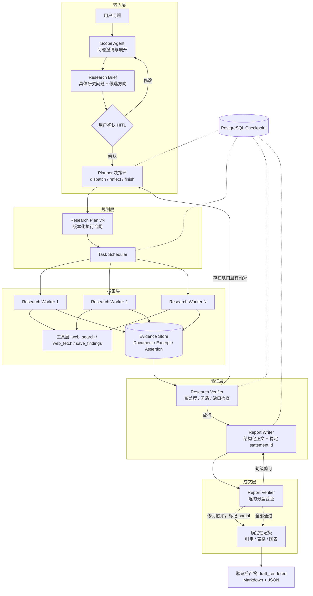

# Prospector

一个自动做深度调研的智能体：给它一个问题，它自己拆解、检索、交叉核对，最后写出一篇每句话都能查证出处的长篇报告。

## 它想解决的问题

让模型写一篇有理有据的调研报告并不难，难的是**读者没法核对**。数字是哪来的？这句话到底有没有材料支持？文末的参考文献和正文角标对得上吗？——这些问题一旦要人工逐条去查，报告的价值就打了对折。

Prospector 的全部设计围绕一件事：

> **报告里的每一句事实陈述，都能被机器追回到某个网页快照里的具体片段；核对不过关的句子会被单独标出来，而不是用漂亮的措辞盖过去。**

## 先看真实产出

[`examples/`](examples/) 里有两次完整运行的全部产物，没有任何人工修饰。下面是其中一篇的开头：

> "内卷"的学术源头是美国人类学家克利福德·格尔茨 1963 年出版的《农业内卷化》。格尔茨在该书中提出，
> 爪哇湿稻农业通过劳动密集型方法的过度精细化而发展，导致"静态扩张"；他借用 Goldenweiser 的
> "内卷"概念来描述这种"没有进步的变化"。`[^4]` 在中国经济史研究中，黄宗智将"内卷"定义为"亩产增长
> 但没有劳动生产率发展"，即"没有发展的增长"。`[^5]`

那些角标不是模型写的，是代码按来源第一次出现的顺序生成的。每个角标背后都存着一条原文片段、它所属的网页快照，以及这份快照的版本号。

**你可以自己验，不需要装依赖、连数据库或配 API：**

```bash
python3 examples/verify_lineage.py examples/verified-neijuan-semantic-shift/
```

这个脚本检查七件事，比如"正文每个角标都能在来源清单里找到"、"没通过核对的句子必须不带角标"、"Markdown 里的角标集合和 JSON 里记录的完全一致"（最后这条意味着报告一旦被手工润色过就会被抓出来）。它刻意不引用本项目的任何代码——**验算不该依赖被验算的东西**。

两次运行的对照本身就是重点：

| | 内卷语义演变 | 社交媒体与青少年心理健康 |
|---|---|---|
| 结论 | **verified**（全部通过核对） | **partial**（7 句没通过） |
| 报告 | 69 句，32 个来源 | 123 句，54 个来源 |
| 三轮核对的失败数 | 17 → 3 → **0** | 29 → 17 → **7** |
| 消耗 | 58 万 token，119 次工具调用 | 352 万 token，848 次工具调用 |

两次剩下的问题都集中在"基于前文做推理"的句子上，事实陈述都站住了。差别在于第一个问题有明确答案，能收敛到零；第二个问题学界本来就有分歧，系统没有硬凑一个干净结论，而是把七句它认为推过头的话标了出来。

**同一套机制，在有答案的题上收敛，在没答案的题上诚实止步。**

## 上手

需要 Docker 和 [uv](https://docs.astral.sh/uv/)。

```bash
cp .env.example .env        # 填入模型和检索服务的密钥
docker compose up -d        # PostgreSQL + MinIO
uv sync
uv run --env-file .env alembic upgrade head
uv run --env-file .env prospector-local setup
```

然后提问：

```bash
uv run --env-file .env prospector-local ask "一个需要多方查证的问题" --effort standard --language zh
```

它会先把你的问题改写成一份研究提纲，**停下来让你确认或修改**，确认后才开始检索。终端会实时打印它在做什么——派了哪些子任务、调了哪些工具、核对结果如何。跑完直接输出报告。

已经跑过的任务可以随时回看：

```bash
uv run --env-file .env prospector-local job events <job-id> --follow
```

想拿到结构化产物（报告 JSON、用量明细），用服务端模式：

```bash
uv run --env-file .env prospector serve                      # 一个终端
uv run --env-file .env prospector --effort standard          # 另一个终端，交互提问
```

跑完按任务号导出：

```bash
uv run --env-file .env prospector job status <job-id>
uv run --env-file .env prospector report export <job-id> --format json --output report.json
```

或者一条命令收齐全部四份产物并自动验算：

```bash
python3 examples/collect_run.py <job-id> examples/<目录名>/
```

## 它是怎么做到的

四个环节，每一环都在削减"模型说了算"的空间：

**一、证据必须落地成原文片段。** 检索到的网页会被整页存下来（内容哈希 + 版本号），worker 只能从存下来的原文里划出片段作为证据，不能凭记忆转述。报告里每个引用最终都指向"某网页某版本里的某一段"。

**二、写完之后逐句核对，而且分类型核对。** 报告里的句子被分成四类——直接引证材料的、基于前文推理的、承上启下的、说明局限的。不同类型的核对标准不同：引证句要看材料是否真的支持，推理句要看前提是否成立、有没有推过头。核对由另一个模型独立执行，看不到写作过程。

**三、引用编号由代码生成，模型碰不到。** 模型只负责说"这句话依据哪几条片段"，角标数字、来源清单、排序全部由渲染代码算出来。**模型写不错编号，因为它根本不负责写编号。**

**四、改不动就承认。** 核对不通过的句子最多返工两轮，还不通过就保留原文、**不给它引用角标**，整份报告标记为 `partial`。系统宁可交一份标注了瑕疵的报告，也不交一份看起来完美但经不起查的报告。

## 明确不做的事

- **不是通用 Agent 框架。** 它只做"查证型深度调研"这一件事。
- **不支持多人同时使用。** 目前是单进程跑单任务，多用户运行时的设计草案在 [docs/future/](docs/future/)，没有实现。
- **不做代码沙箱、数据计算和图表生成。** 设计文档里归属 M2 的部分都已就地标注未实现。
- **不快。** `standard` 档一次十几分钟到一小时，几十万到几百万 token。它换来的是可核对性，不适合要秒回的场景。
- **不保证可复现。** 同一个问题跑两次不会得到同一篇报告——检索结果和模型输出都不确定。`examples/` 里的是某两次具体运行的记录，不是基准。

## 架构



| 阶段 | 组件 | 说明 |
|------|------|------|
| 0 问题展开 | Scope Agent | 把用户问题改写成具体的研究提纲，主动展开候选方向 |
| 1 规划 | Planner 决策环 | 拆分子课题，写入带版本号的执行计划 |
| 2 搜集 | Research Worker ×N | 并行执行，把证据原子化写入证据库 |
| 3 验证 | Research Verifier | 对照计划检查覆盖度、找矛盾，有缺口就退回重新规划 |
| 4 成文 | Report Writer + Report Verifier | 写结构化正文，然后逐句核对 |
| 5 渲染 | 渲染代码 | 引用编号、角标、来源清单由代码生成 |

全流程状态存在 PostgreSQL 里，进程被杀掉之后可以从断点继续。

## 实现状态

- **工程基座（M0）已完成**：断点续跑、数据库迁移、对象存储、结构化日志、链路追踪、CI。
- **研究主流程（M1）已完成**：提纲生成、人工确认、规划-执行循环、证据核验与重新规划、报告撰写、逐句核对、最多两轮句级返工、代码生成引用。
- 后续里程碑（沙箱计算、评测基建、多用户运行时）**均未实现**，设计草案见 [docs/future/](docs/future/)，设计文档中相关章节已就地标注。

## 测试

```bash
# 单元测试，不需要 Docker
uv run pytest tests/unit -q

# 集成测试，需要 PostgreSQL + MinIO
docker compose up -d
uv run --env-file .env alembic upgrade head
uv run --env-file .env prospector-local setup
uv run --env-file .env pytest tests/integration -q -m "integration and not live"

# 与 CI 一致的四道质量门
uv run ruff check . && uv run ruff format --check . && uv run basedpyright
uv run pytest tests/unit -q && uv run --env-file .env pytest tests/integration -q -m "integration and not live"
```

仓库里还有一个不依赖历史任务的人工标注案例，用来检查逐句核对能否识别"有依据的事实""错误数字""推断过头"三类情况：

```bash
uv run --env-file .env python eval/run_report_verifier.py
```

判定标准见 [eval/README.md](eval/README.md)。

## 项目结构

```
src/prospector/
├── agents/          # 各个智能体（规划、执行、两个核验器、撰写）
│   └── prompts/     # 提示词模板
├── deterministic/   # 不经过模型的确定性逻辑（预算注入、引用渲染、补丁应用）
├── flow/            # LangGraph 状态图与状态定义
├── obs/             # 结构化日志与链路追踪
├── reporting/       # 报告渲染
├── runtime/         # 运行入口（命令行、人工确认、时间线）
├── schemas/         # 数据契约（提纲、计划、证据、报告等）
├── store/           # 存储层（PostgreSQL、对象存储、断点）
└── tools/           # 工具（检索、抓取、落证）
```

技术选型：Python 3.13、LangGraph（+ PostgreSQL 断点）、PostgreSQL 18、MinIO、Pydantic v2、SQLAlchemy + psycopg、Typer、structlog、OpenTelemetry。

## 文档

| 文档 | 内容 |
|------|------|
| [docs/design.md](docs/design.md) | 系统设计：架构、数据模型、关键决策与取舍、失败模式 |
| [docs/implementations/m1.md](docs/implementations/m1.md) | 研究主流程的实现合同：模块边界、控制流、验收判据 |
| [docs/implementations/m0.md](docs/implementations/m0.md) | 工程基座：断点、迁移、观测、CI |
| [docs/cli.md](docs/cli.md) | 服务端接口与命令行交互设计 |
| [docs/implementations/roadmap.md](docs/implementations/roadmap.md) | 里程碑范围与依赖顺序 |

尚未实现的设计草案放在 [docs/future/](docs/future/)：[评测基建](docs/future/eval.md)、[多用户运行时](docs/future/runtime-scaleout.md)。
