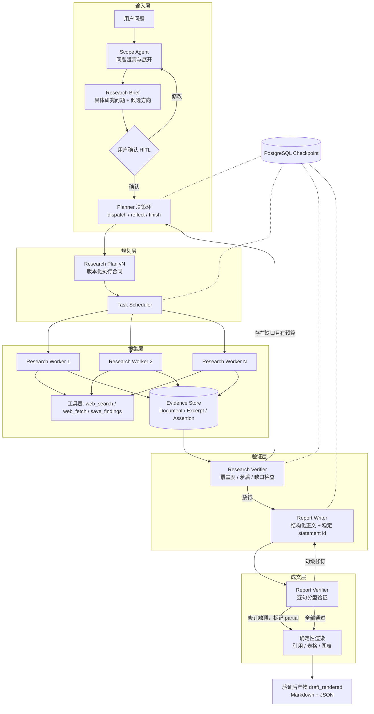

# Prospector

自动深度调研智能体：给定一个问题，它自行拆解、检索、交叉核对，最后产出一篇每句话都能查证出处（网页快照）的长篇报告。

## 背景

模型写一篇有理有据的报告并不难，难的是读者没法核对：数字从哪来？某句话有没有材料支撑？文末的参考文献和正文角标对得上吗？这些问题一旦要人工逐条去查，报告的价值就打了对折。

Prospector 的全部设计围绕一个约束：报告里的每句事实陈述都能被机器追回到某个网页快照的具体片段；核对不过关的句子会被单独标出，而不是用措辞盖过去。

## 工作方式

四个环节：

1. **证据只来自存档原文。** 检索到的网页整页保存（内容哈希 + 版本号），worker 只能从存档里划出片段作为证据，不能凭记忆转述。报告里的每个引用最终指向"某网页某版本的某一段"。
2. **逐句分型核对。** 报告句子分成四类：引证材料的、基于前文推理的、承上启下的、说明局限的。不同类型用不同标准核对：引证句看材料是否真的支持，推理句看前提是否成立、有没有推过头。核对由另一个模型独立执行，看不到写作过程。
3. **引用编号由代码生成。** 模型只声明"这句话依据哪几条片段"，角标数字、来源清单、排序全部由渲染代码计算，模型不接触编号。
4. **核对不过就标出来。** 不通过的句子最多返工两轮；仍不通过就保留原文、不带引用角标，整份报告标记为 `partial`。与其硬凑一个干净结论，不如如实标出哪些句子没通过核对。

## 快速开始

需要 Docker 和 [uv](https://docs.astral.sh/uv/)。

```bash
cp .env.example .env        # 填入模型和检索服务的密钥
docker compose up -d        # PostgreSQL + MinIO
uv sync
uv run --env-file .env alembic upgrade head
uv run --env-file .env prospector-local setup
```

提问：

```bash
uv run --env-file .env prospector-local ask "一个需要多方查证的问题" --effort standard --language zh
```

流程：问题先被改写成研究提纲，停下等你确认或修改，确认后才开始检索。终端实时打印子任务派发、工具调用和核对结果，跑完直接输出报告。

已跑过的任务可以随时回看：

```bash
uv run --env-file .env prospector-local job events <job-id> --follow
```

服务端模式提供结构化产物（报告 JSON、用量明细），并带一个同源 Web 界面：

```bash
uv run --env-file .env prospector serve                      # 终端 1，打开 http://127.0.0.1:7620/
uv run --env-file .env prospector --effort standard          # 终端 2，交互提问
```

前端开发（Vite 代理 `/api` 到 7620）：

```bash
cd web && npm ci && npm run dev
```

修改界面后重新构建并交给 `prospector serve` 托管：

```bash
cd web && npm ci && npm run build
```

导出产物：

```bash
uv run --env-file .env prospector job status <job-id>
uv run --env-file .env prospector report export <job-id> --format json --output report.json
```

## 架构



全流程状态存在 PostgreSQL 里，进程被杀掉之后可以从断点继续。

## 明确不做的事

- **不是通用 Agent 框架。** 只做"查证型深度调研"这一件事。
- **不支持多人同时使用。** 目前单进程单任务；多用户运行时的设计草案在 [docs/future/](docs/future/)，未实现。
- **不做代码沙箱、数据计算和图表生成。**
- **不快。** `standard` 档一次十几分钟到一小时，消耗几十万到几百万 token，不适合需要秒回的场景。
- **不保证可复现。** 同一问题跑两次不会得到同一篇报告，检索结果和模型输出都不确定。

## 实现状态

研究主流程已完成：断点续跑、提纲生成、人工确认、规划-执行循环、证据核验与重新规划、报告撰写、逐句核对与返工、代码生成引用。后续里程碑（沙箱计算、评测基建、多用户运行时）未实现，设计草案见 [docs/future/](docs/future/)。

## 测试

```bash
# 单元测试，不需要 Docker
uv run pytest tests/unit -q

# 集成测试，需要 PostgreSQL + MinIO
docker compose up -d
uv run --env-file .env alembic upgrade head
uv run --env-file .env prospector-local setup
uv run --env-file .env pytest tests/integration -q -m "integration and not live"

# 与 CI 一致的质量门
uv run ruff check . && uv run ruff format --check . && uv run basedpyright
uv run pytest tests/unit -q && uv run --env-file .env pytest tests/integration -q -m "integration and not live"
```

## 项目结构

```
src/prospector/
├── agents/          # 各个智能体（规划、执行、两个核验器、撰写）
│   └── prompts/     # 提示词模板
├── api/             # FastAPI：REST / SSE，并托管 web/dist
├── deterministic/   # 不经过模型的确定性逻辑（预算注入、引用渲染、补丁应用）
├── flow/            # LangGraph 状态图与状态定义
├── obs/             # 结构化日志与链路追踪
├── reporting/       # 报告渲染
├── runtime/         # 运行入口（命令行、人工确认、时间线）
├── schemas/         # 数据契约（提纲、计划、证据、报告等）
├── store/           # 存储层（PostgreSQL、对象存储、断点）
└── tools/           # 工具（检索、抓取、落证）
web/                 # React + Vite SPA（提问 / 监控 / 报告 / 任务列表）
```

技术选型：Python 3.13、LangGraph（+ PostgreSQL 断点）、PostgreSQL 18、MinIO、Pydantic v2、SQLAlchemy + psycopg、Typer、structlog、OpenTelemetry。

## 文档

| 文档 | 内容 |
|------|------|
| [docs/design.md](docs/design.md) | 系统设计：架构、数据模型、关键决策与取舍、失败模式 |
| [docs/implementations/m1.md](docs/implementations/m1.md) | 研究主流程的实现合同：模块边界、控制流、验收判据 |
| [docs/implementations/m0.md](docs/implementations/m0.md) | 工程基座：断点、迁移、观测、CI |
| [docs/cli.md](docs/cli.md) | 服务端接口与命令行交互设计 |
| [docs/implementations/roadmap.md](docs/implementations/roadmap.md) | 里程碑范围与依赖顺序 |

尚未实现的设计草案放在 [docs/future/](docs/future/)：[评测基建](docs/future/eval.md)、[多用户运行时](docs/future/runtime-scaleout.md)。
