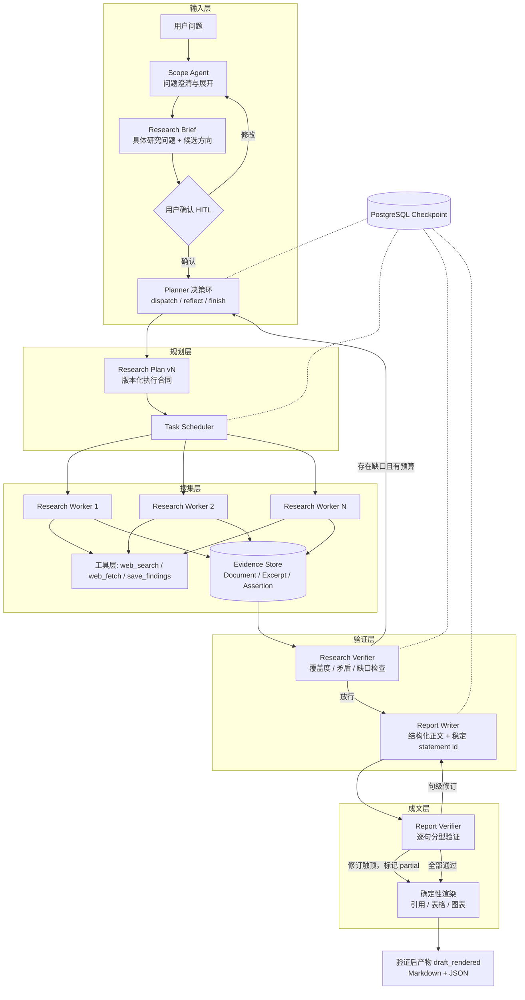

# Prospector

**可控、可审计、可恢复的深度研究智能体**

Prospector 是一个基于多智能体架构的深度研究系统，能够自动化完成复杂调研任务：从问题理解、多源信息搜集、证据交叉验证，到生成带完整引用的长篇报告。全流程支持断点恢复与成本可控。

## 系统架构



### 核心流程

| 阶段 | 组件 | 说明 |
|------|------|------|
| 0 问题展开 | Scope Agent | 将用户问题改写为具体的 Research Brief，主动展开候选研究维度 |
| 1 规划 | Planner 决策环 | 基于 Brief 收敛研究范围，按决策环拆分子课题并写入版本化 Plan |
| 2 搜集 | Research Worker ×N | 并行执行，通过工具搜集信息并将证据原子写入 Evidence Store |
| 3 验证 | Research Verifier | 对照 Plan 验证覆盖度、检测矛盾、评估可信度，缺口触发 Replan |
| 4 成文 | Report Writer + Report Verifier | 以 Brief 为纲写结构化正文，逐句验证事实正确性 |
| 5 渲染 | 确定性渲染器 | 引用编号、角标、表格由代码渲染，消灭引用格式幻觉 |

### 技术栈

| 类别 | 选型 |
|------|------|
| 语言 | Python 3.13 |
| 编排框架 | LangGraph + langgraph-checkpoint-postgres |
| 数据库 | PostgreSQL 18（状态持久化 + Evidence Store） |
| 对象存储 | MinIO（文档快照与报告产物） |
| LLM | OpenAI |
| ORM | SQLAlchemy + psycopg |
| CLI | Typer |
| 日志 | Structlog（JSON 结构化输出） |
| 数据验证 | Pydantic v2 |
| 遥测 | OpenTelemetry |

## 本地运行

```bash
cp .env.example .env
docker compose up -d
uv sync
uv run --env-file .env alembic upgrade head
uv run --env-file .env prospector-local setup
uv run --env-file .env prospector-local ask "研究一个需要多侧面检索的问题" --effort standard --language zh
```

`ask` 当前执行：问题输入 → 最多一轮澄清 → Brief 生成 → `c/e/i/q` 确认 →
Planner-Worker 研究 → Research Verifier → Report Writer → Report Verifier → 必要时句级修订 →
验证后确定性渲染。终端会显示研究与成文时间线，并在 `draft_rendered` 后输出 Markdown/JSON
的对象存储地址。

已创建的 Job 可随时回放或继续跟随同一条人类可读时间线：

```bash
uv run --env-file .env prospector-local job events <job-id> --follow
```

## 测试

```bash
# unit（不需要 Docker）
uv run pytest tests/unit -q

# integration（需要 PostgreSQL + MinIO）
docker compose up -d
uv run --env-file .env alembic upgrade head
uv run --env-file .env prospector-local setup
uv run --env-file .env pytest tests/integration -q -m "integration and not live"

# 与 CI 一致的质量门
uv run ruff check .
uv run ruff format --check .
uv run basedpyright
uv run pytest tests/unit -q
uv run pytest tests/integration -q -m "integration and not live"
```

M0 的 checkpoint kill/resume 能力由集成测试验证，不作为空流程产品命令暴露。

## 项目结构

```
src/prospector/
├── agents/          # LLM 智能体（Planner、Worker、Research/Report Verifier、Report Writer）
│   └── prompts/     # 各智能体的提示词模板
├── deterministic/   # 确定性逻辑（预算注入、质量门守卫）
├── flow/            # LangGraph 状态图定义与 ResearchState
├── obs/             # 可观测性（结构化日志、OpenTelemetry tracing）
├── reporting/       # 报告渲染（Markdown + JSON）
├── runtime/         # 运行时入口（CLI、HITL 确认、时间线）
├── schemas/         # Pydantic 数据模型（Brief、Plan、Evidence、Report 等）
├── store/           # 存储层（PostgreSQL Repository、对象存储、Checkpoint）
└── tools/           # Worker 工具（web_search、web_fetch、save_findings）
```

## 实现状态

- **M0 工程基座**已完成：PostgreSQL checkpointer、Alembic、MinIO、日志、trace 与 CI。
- **M1 已实现到成文质量门**：Brief 生成、interactive HITL、Planner-Worker、Research Verifier/Replan、Report Writer、Report Verifier、最多两次句级修订，以及验证后确定性引用渲染。
- 当前每个 revision 都会全量逐句验证。修订用尽后仍失败的句子以 `partial` 标记保留且不附已验证引用；渲染后主图停在 `draft_rendered`，正式 `completed` 报告出口尚未实现。

详细设计文档见 [docs/design.md](docs/design.md)，M1 实现合同见 [docs/implementations/m1.md](docs/implementations/m1.md)。
