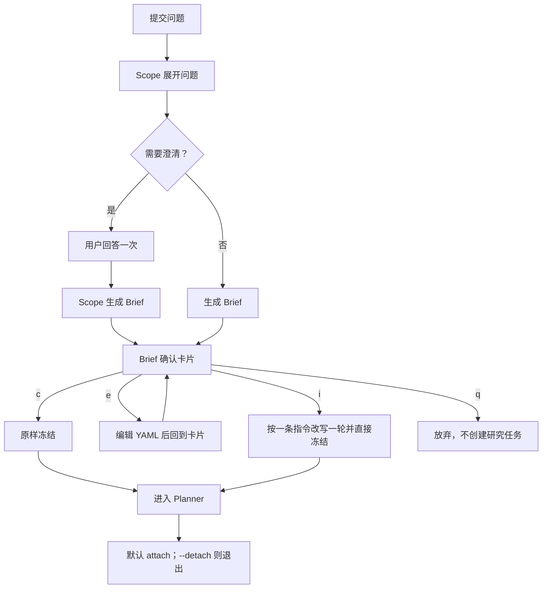

# Prospector CLI 设计

- **版本**：v1.2
- **日期**：2026-07-14
- **状态**：M1 目标合同；当前本地入口已实现 Scope、Brief 与 interactive HITL
- **关联文档**：[系统设计](./design.md)、[M1 实现设计](./implementations/m1.md)

---

## 1. 定位

M1 的产品 CLI 名为 `prospector`，是单进程 API 的瘦客户端：只负责提交、Brief 交互、SSE 展示和报告下载，不在客户端实现 Planner、Worker 或质量门。

当前开发入口 `prospector-local ask` 已实现问题输入、最多一轮澄清、Brief 生成与 `c/e/i/q` 确认。Planner-Worker 接入后，同一个 `ask` 流程从冻结 Brief 继续进入完整研究主图。

职责边界：

1. Scope 负责把问题具体化并展开研究空间。
2. 用户确认的是系统对问题的理解与研究输入快照。
3. Planner 才负责收敛实际研究范围，并以版本化 Plan 形成执行合同。
4. CLI 展示服务端事实，不自行推断任务状态、预算或研究结果。

---

## 2. M1 命令

```text
prospector
├── ask <question> [--effort quick|standard|deep] [--language <code>] [--detach] [--plain]
├── job
│   ├── list
│   ├── status <job_id>
│   ├── attach <job_id>
│   └── events <job_id> [--since <event_id>] [--follow]
├── report
│   ├── show <job_id>
│   └── export <job_id> --format md|json|html [-o <path>]
├── usage [--job <job_id>]
├── login
└── config [get|set <key> [value]]
```

M1 不提供 `kb`、Data Worker、沙箱计算、`followup`、跨进程 pause/resume 或 job debug 命令。

---

## 3. `prospector ask`

### 3.1 参数

| 参数 | 说明 |
|------|------|
| `<question>` | 自然语言研究问题 |
| `--effort` | `quick` / `standard` / `deep`，默认 `standard` |
| `--language` | 报告语言，默认 `zh` |
| `--detach` | Brief 冻结并创建任务后打印 job_id 退出 |
| `--plain` | 使用逐行事件展示，不启动 Live TUI |

`ask` 必须运行在交互终端，因为 Brief 确认不可跳过。brief-direct 是 API 与评测入口，不作为人类 CLI 参数暴露。

### 3.2 effort

运行时根据冻结 Brief 的 `effort` 注入三项硬限制：

| effort | Planner 决策轮 | 每轮并发 Worker | 每 Worker 工具次数 |
|--------|---------------:|------------------:|--------------------:|
| quick | 3 | 1 | 8 |
| standard | 6 | 3 | 15 |
| deep | 12 | 4 | 25 |

Replan 消耗 Planner 决策轮，不存在独立 replan 上限；Plan 不设独立最大任务数。token 和累计工具调用只展示与计量，不驱动停止。`deep` 卡片提示研究可能持续数小时，单次 LLM 与抓取仍受调用超时约束。

### 3.3 交互流程



### 3.4 Brief 卡片

```text
┌─ Research Brief（确认后作为本次研究输入快照）───────────────┐
│ question       评估竞品 2025–2026 年在亚太区的经营态势       │
│ effort         standard                                      │
│ language       zh                                            │
│ output_format  report_with_citations                         │
│                                                              │
│ brief_text:                                                  │
│   为区域投入决策提供依据，研究竞争格局、经营证据、反例……   │
└──────────────────────────────────────────────────────────────┘
  [c] 确认  [e] 直接编辑  [i] 指令修订一轮并定稿  [q] 放弃
```

- `c`：原样冻结。
- `e`：用 `$EDITOR` 编辑 YAML；schema 校验通过后回到卡片。
- `i`：输入一条修订意向，Scope 改写恰好一轮并直接冻结。
- `q`：退出，不创建研究任务。

Brief 冻结后不可修改。需求变化必须创建新任务。

---

## 4. 进度展示

### 4.1 Live TUI

```text
 job_20260714_042  评估 2025–2026 年亚太区竞品经营态势      [研究中]
 阶段  Brief ✔ → 规划 ✔ → 搜集 ● → 验证 ○ → 声明 ○ → 成文 ○
 计划  Plan v2（v1→v2：Verifier 检出商业化证据缺口）
 ┌────┬──────────────────────────────┬──────────────┬────────┐
 │ ID │ ResearchTask                 │ mode         │ 状态   │
 ├────┼──────────────────────────────┼──────────────┼────────┤
 │t_01│ 主要厂商区域收入与客户证据   │ factual      │ ✔ 完成 │
 │t_02│ 技术路线与产品差异           │ comparison   │ ● 运行 │
 │t_03│ 商业化数据的反方证据         │ counterargu… │ ○ 等待 │
 └────┴──────────────────────────────┴──────────────┴────────┘
 限额  planner 3/6 rounds · concurrency 2/3 · worker tools t_02 7/15
 用量  tokens 0.41M · tool_calls 38（只计量）
 事件  11:42:03  t_01 保存 2 条 Excerpt、3 条 Assertion
       11:43:05  Verifier 检出重大缺口 → 请求 Planner 决策
       11:43:40  Plan v2 派发 t_03
──────────────────────────────────────────────────────────────
 [q] 离开（任务继续）  [o] 完成后打开报告
```

限额区只显示三项研究硬闸。Plan 版本和 Replan 原因必须可见；Replan 统一消耗 Planner 决策轮。

### 4.2 Plain 模式

```text
11:40:12  plan.created        Plan v1 派发 3 个任务
11:42:03  evidence.persisted  t_01 保存 2 excerpts / 3 assertions
11:43:05  verifier.gap        商业化证据存在重大缺口
11:43:40  plan.created        Plan v2 派发补搜任务 t_03
12:02:31  job.completed       报告已生成
```

`job events --follow` 输出服务端原始 NDJSON；plain 模式只保证人类可读。

### 4.3 状态来源

| 界面信息 | 服务端事实 |
|----------|------------|
| 阶段 | job phase 事件 |
| Plan 与任务 | `plans` / `tasks` 及对应事件 |
| Planner 轮次 | `decision_round` 与上限 |
| Worker 工具次数 | Task budget 与已执行工具调用 |
| 缺口与冲突 | verifier run / gap artifact / ConflictResolution |
| 用量 | PG usage |

CLI 不根据事件文本重新计算状态。

---

## 5. 终态

### 5.1 完成

```text
✔ 完成（22 分 14 秒）
  报告：~/.prospector/reports/job_20260714_042/report.md
  引用：96 条
  信息局限：3 处，已在报告中披露
```

只有 Verifier 放行、事实 Claim 全部通过验证、冲突已处置且 no-new-facts 审计通过时才能完成。

### 5.2 失败

```text
✘ 失败：Planner 决策轮耗尽后仍存在不可接受的重大缺口
  已保存 partial report 与 gap artifact
```

失败原因包括：

- 决策轮耗尽且零 Excerpt；
- 仍存在不可接受的重大缺口；
- 存在未通过 Claim 验证的事实；
- 高优先级冲突没有处置记录；
- 平台错误导致任务失败。

可披露的信息局限不等于重大缺口，可以随已验证报告完成。预算耗尽只停止继续研究，不改变质量判定。

---

## 6. Job 与报告

| 命令 | 行为 |
|------|------|
| `job list` | 列出任务状态、阶段、开始时间和用量 |
| `job status <id>` | 查看阶段、Plan 版本、任务表、三项限制和最近事件 |
| `job attach <id>` | 通过 SSE 跟踪；Last-Event-ID 从 PG events 回放 |
| `job events <id>` | 输出原始业务事件；支持 `--since` 与 `--follow` |
| `report show <id>` | 拉取并终端显示报告 |
| `report export <id>` | 导出 Markdown、JSON 或 HTML |
| `usage --job <id>` | 展示 token、工具调用和成本，不参与终止判断 |

报告缓存目录：

```text
~/.prospector/reports/<job_id>/
├── report.md
├── report.json
├── meta.json
└── gaps.json        # 仅失败时存在
```

服务端产物是权威源，本地目录只是下载结果。

---

## 7. 退出码

| 退出码 | 含义 |
|--------|------|
| 0 | 任务完成，或用户离开仍在运行的 attach |
| 1 | CLI、网络、认证或服务端平台错误 |
| 2 | 参数错误，或非 TTY 运行 `ask` |
| 3 | 任务因重大缺口或零证据失败；partial/gap 已保存 |
| 4 | 用户取消任务 |
| 5 | 任务因 Claim/冲突/审计质量门失败 |
| 130 | Brief 冻结前被 Ctrl-C 中断，未创建研究任务 |

---

## 8. 服务端映射

| CLI | M1 服务端 |
|-----|-----------|
| `ask` | 创建 interactive job；Scope/HITL 冻结后进入研究图 |
| Brief `c/e/i/q` | LangGraph interrupt/resume 合同 |
| `job status` | `GET /jobs/{id}` |
| `job attach/events` | `GET /jobs/{id}/events`，PG events + Last-Event-ID |
| `report show/export` | 报告与产物接口 |
| `usage` | PG usage 查询 |

---

## 9. 后续里程碑命令

这些命令不属于 M1，只有对应服务端能力实现后才进入 CLI：

| 里程碑 | 命令 |
|--------|------|
| M2 | `ask --file`、`ask --kb`、`kb list/add/docs/ingest-status` |
| 后续研究能力 | `followup <job_id> <question>` |
| M4 | `job pause/resume/cancel`、跨副本 attach、`debug on/off` |

未来命令不得出现在 M1 的帮助文本、TUI 示例或验收清单中。
