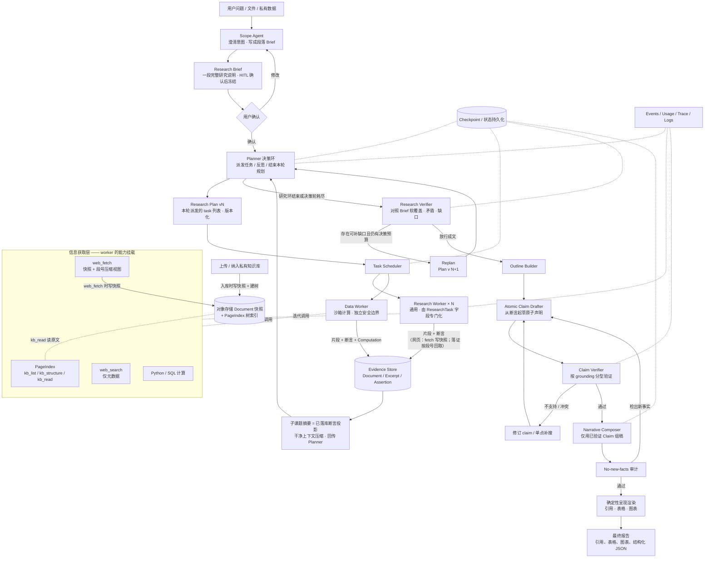
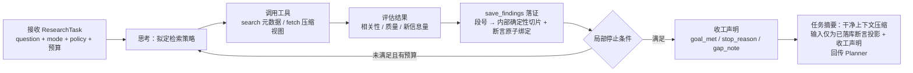
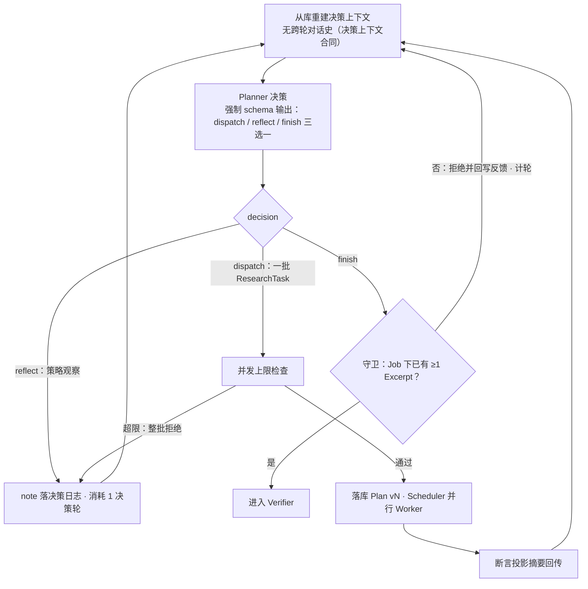
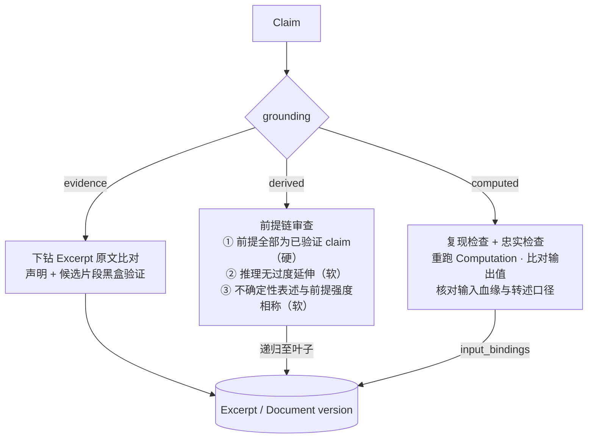
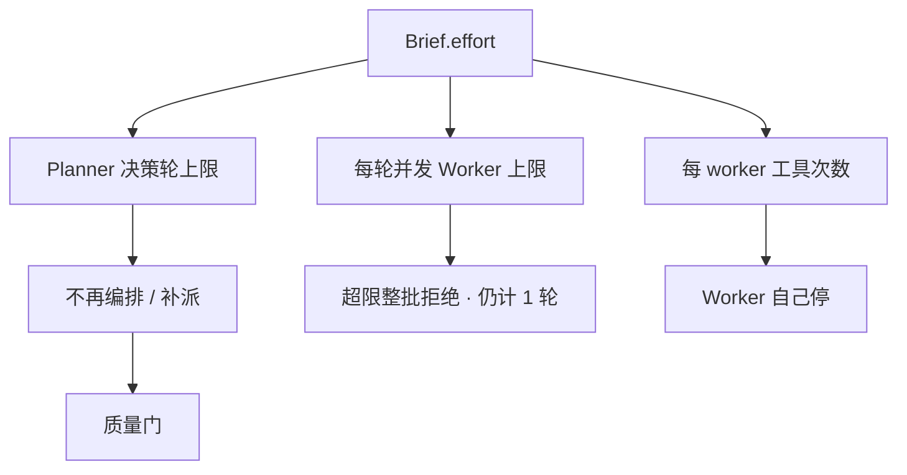
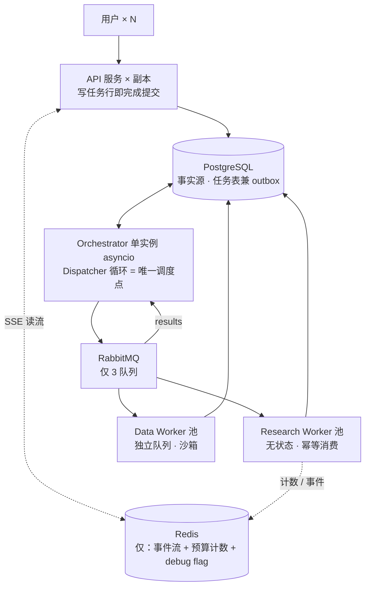

# 深度研究智能体（Deep Research Agent）设计文档

- **版本**：v4.7（草案）
- **v4.7 变更**：里程碑重排（§11）：原 M1 / M2 / M2.5 / M3 合并为新 **M1「深研智能体核心 + CLI」**（内部保留四个串行子切片 S1–S4 作为检查点，构建顺序不变）；原 M4 / M5 / M6 顺延更名为 **M2（计算与本地文档）/ M3（评测基建）/ M4（多用户运行时）**；CLI 界面（含 TUI 阶段流可视化）从原 M5 前移，随 M1 各子切片渐进交付；评测基建保持为多用户运行时的前置门。排期原则与硬规则不变，总工期口径 14–15 周（含分层 Brief 子切片一周）。同步文档：实现路线图 v1.4
- **v4.6 变更**：通读审校，修订两处合同接缝：(1) 收回落证双路径——`select_excerpts` 降回 `save_findings` 的**内部**确定性原语，不再作为独立 worker 工具暴露（§3.1 / §3.2 / §3.4 / §4.2 / §4.4 / D12 / §7 / §8 / §9.1.2 / §10），恢复「发现唯一入口」的字面严格性，消除「选了段、未断言」的孤儿 Excerpt 中间态，信息增益机器判定（只数 `save_findings`）重新封闭；(2) Planner 决策日志（§5.2 重建清单第 5 项）补入**格式错误反馈**——无状态重建下，解析失败的原因必须落日志才能被下一轮读到，否则 Planner 会重复同样的格式错误直至轮次耗尽
- **v4.5 变更**：Planner 决策上下文合同——每轮无状态重建，`reflect.note` 为唯一跨轮记忆通道（§5.2 / D7）。完整摘要见 git 历史
- **v4.4 变更**：Planner 决策输出合同——每轮强制 `dispatch` / `reflect` / `finish` 三选一结构化输出；空手 `finish` 守卫与零证据失败出口（§5.2 / §7）。完整摘要见 git 历史
- **v4.3 变更**：联网检索工具合同（D12，§3.2 / §3.3 / §10）——`web_fetch` 返回带段号的任务感知压缩视图，整页原文不进任何 LLM 上下文；`select_excerpts` 确定性落证原语；`web_search` 仅返回条目元数据。完整摘要见 git 历史
- **v4.2 变更**：Worker 产物合同精确化（§3.2 / §5.2）——发现唯一入口 `save_findings`（片段 + 断言原子入库）、结构化收工声明、回传摘要改为已落库断言投影的干净上下文压缩、信息增益停止条件机器化。完整摘要见 git 历史
- **v4.1 变更**：编排与合同面借鉴 Prospector-legacy 的核心思想（段落 Brief + 决策环委派），**对外名称不变**（仍称 Planner / Research Plan / Replan / Research Verifier）。详见 git 历史中的完整摘要；本版起变更日志只保留最近两条全文 + 更早版本索引
- **日期**：2026-07-13
- **状态**：待评审
- **适用项目**：Prospector v2（多智能体深度研究系统）

---

## 1. 背景与目标

### 1.1 背景

传统 RAG 与单轮搜索问答只能处理"一次检索即可回答"的问题。面对开放式研究任务（如"评估某行业的技术路线与竞争格局"），需要系统具备：多轮规划、并行信息搜集、证据交叉验证、以及生成带完整引用的长篇报告的能力。这类系统在业界被称为 Deep Research Agent（DRA），OpenAI Deep Research、Claude Research、Gemini Deep Research 均属此类。

本项目目标是构建一个**可控、可审计、可复现**的深度研究智能体，采用 Orchestrator-Worker（编排者-工作者）为核心的多智能体架构，在 LangGraph 上实现。

### 1.2 设计目标

1. **正确性优先**：报告中每一条事实性声明（claim）必须可回溯到具体证据来源，不允许模型凭空引入信息。
2. **广度与深度可扩展**：通过并行子智能体扩展信息搜集广度，通过 Verify-Replan 回路保证深度。
3. **成本可控**：研究档位与停止条件显式化，防止编排失控（过度并行、无限决策轮、无限循环搜索）；token 用量可观测，护栏以**Planner 决策轮、每轮并发 Worker 数、每 worker 工具次数**为主。
4. **工程可观测**：全链路 tracing、成本统计、事件流，支持离线评估与回归测试。
5. **面向长任务的鲁棒性**：状态持久化，任意节点崩溃后可从 checkpoint 恢复，不重跑全流程。

### 1.3 非目标（Non-goals）

- **不做端到端 RL 训练**。本项目走 prompt 编排 + 工作流范式，不训练模型权重（理由见 §6.6）。
- **不追求实时性**。深度研究任务的合理延迟为分钟级（5–30 分钟），不为秒级响应做优化。
- **不做通用 Agent 平台**。架构专为"研究→报告"这一类任务收敛设计，不支持任意开放任务。

---

## 2. 需求

### 2.1 功能需求

| 编号 | 需求 | 优先级 |
|------|------|--------|
| FR-1 | 接受自然语言研究问题，支持附带文件（PDF/表格）与私有知识库（PageIndex） | P0 |
| FR-2 | 研究开始前必须冻结 Research Brief 合同：interactive 模式经 Scope 澄清与用户确认/修改（HITL）；brief-direct 模式由调用方直接提交完整 Brief、schema 校验后即时冻结（§5.1）。Brief 主体是**一段完整研究说明**，确认后整体冻结；中途改需求 = 新任务（§4.1） | P0 |
| FR-3 | Planner 按决策环拆分子课题并写入版本化 Research Plan：每轮可派发若干自包含 ResearchTask（含运行时注入的工具预算）；同轮并行数受并发上限约束；结果压缩回传后由 Planner 决定补派、结束，或由 Verifier 缺口触发 Replan（§5.2） | P0 |
| FR-4 | 多个通用 Research Worker 并行执行，按 Plan 中的子课题分工，通过 ResearchTask 字段（research_mode / source_policy 等）完成专门化；Data Worker 因独立运行环境与安全边界单列 | P0 |
| FR-5 | 证据统一入库（Evidence Store），分层保存文档快照、精确片段与结构化断言，全链路血缘可追溯 | P0 |
| FR-6 | 覆盖度/矛盾/缺口检查，缺口触发定向补充检索（Replan 回路） | P0 |
| FR-7 | 报告由单一 Narrative Composer 基于**已验证 Claim 集**组织叙述；引用编号、角标与表格/图表由确定性代码渲染——图表经声明式 spec 绑定已验证 Claim 或 Computation（§5.5）；输出含表格、图表与结构化 JSON | P0 |
| FR-8 | 原子 Claim 在**成文之前**逐条通过 Claim 验证；成文后 no-new-facts 审计拦截 Claim 集合之外的新事实性表达，检出即回炉验证 | P0 |
| FR-9 | 支持中途取消、暂停、断点恢复 | P1 |
| FR-10 | 支持研究过程的 SSE 流式推送（步骤可视化） | P1 |
| FR-11 | 支持追问式的后续研究（复用已有 Evidence Store 与失败任务的结构化 gap artifact） | P2 |
| FR-12 | 多用户并发提交与多任务并行运行：任务生命周期与连接解耦、跨设备进度流重连、按用户计量 token 用量 | P1 |

### 2.2 非功能需求

| 编号 | 需求 | 指标 |
|------|------|------|
| NFR-1 | 成本上限 | 用户选择研究档位（quick / standard / deep），映射三项硬闸（Planner 决策轮上限、每轮并发 Worker 上限、每 worker 工具次数；standard 默认约 6 / 3）。**不设 Job 总工具/时长上限**；删除墙钟须以逐调用超时为前提。token / 累计工具只计量。收工只停止研究，不绕过质量门（§7） |
| NFR-2 | 引用准确率 | Claim 验证通过率 ≥ 95%（离线评估集） |
| NFR-3 | 可恢复性 | 任意节点失败后，从最近 checkpoint 恢复，已完成的子任务不重跑 |
| NFR-4 | 可观测性 | 每次独立 execution attempt 有 root trace，每次工具调用与 Agent 决策有 span；trace 与日志可按 job/task/attempt 关联，成本以 usage 表为准 |
| NFR-5 | 并发安全 | Evidence Store 支持多 worker 并发写入，Document / Excerpt 按内容哈希去重 |
| NFR-6 | 可评估性 | 全流程输入输出可序列化，支持离线回放与 LLM-as-judge 评估 |
| NFR-7 | 多租户公平性 | 单个用户的深研 fan-out 不得饿死其他用户的任务；per-user 并发上限可配置 |
| NFR-8 | 运行时弹性 | worker 池可水平扩缩容；滚动发布不中断在跑任务；进程崩溃后任务被接管而非丢失 |

### 2.3 约束

- 编排框架：LangGraph（有既有代码与经验积累）。
- 多智能体系统的 token 消耗约为普通对话的 15 倍量级，成本控制必须是一等公民而非事后补丁。

---

## 3. 总体架构

### 3.1 架构总览



关键修正说明（相对朴素画法）：**工具层不是流水线中的一站，而是 worker 的能力挂载**。工具结果回到 worker 上下文后被过滤与判断，再把精确 Excerpt 与 Assertion 写入 Evidence Store。本地/私有文档的 **Document 快照在入库时**写入对象存储并绑定 PageIndex 树；`kb_read` 只产出片段，不新建整份快照。网页路径在 **`web_fetch` 时**写入 Document 快照，Worker 上下文只收到带段号的压缩视图，权威 Excerpt 经 `save_findings`（内部调用确定性原语 `select_excerpts`）按段号从快照回取（D12）。**存储层留全量、上下文层做视图**——原文不进入下游 LLM 上下文，也**不进入 Worker 自身上下文**，但必须持久化（详见 §4 与 §6.2）。**拆分不在 Brief 字段里预制清单**：Planner 在决策环中按段落 Brief 动态派发 ResearchTask；Plan 版本记录的是各轮实际委派，而非一次性写完的完整 DAG（§5.2）。

### 3.2 Worker 内部循环

每个 Research Worker 内部是一个受限的 ReAct 循环，而非一次性调用：



**三条循环纪律（worker 产物合同）**：

1. **发现只有一个入口**：worker 在循环内通过 `save_findings(doc_id, [{片段定位, statement, topic_tags}])` 落证；运行时据此确定性切出 Excerpt（locator 见 §4.4）、创建 Assertion 并绑定 `excerpt_ids`——断言与其证据在同一次调用中出生、原子绑定，不存在"断言引用不存在的证据"的状态。落证发生在读到来源的当下而非任务收尾（抽取最忠实；崩溃时已交付证据在库、按内容哈希幂等）。未经该入口的内容没有任何通道进入 Planner 或下游视野。网页路径下，**片段定位即段号**（`para_ids` / 段号闭区间）；运行时在 `save_findings` 内部经确定性原语 `select_excerpts` 按段号从快照切出 Excerpt——该原语是内部实现，**不**单独暴露为 worker 工具，因此不存在「选了段、未断言」的孤儿中间态，「唯一入口」是字面严格的。压缩视图中的句子**不得**直接当作 Excerpt 文本入库。
2. **收工声明只汇报困难，不汇报发现**：`{goal_met, stop_reason, gap_note}`。`goal_met` 为对照 `expected_evidence` 的自评；`gap_note`（限长）承载检索地形观察——试过哪些路、为何不足——语义是标注过的"观察"，不是事实陈述。
3. **任务摘要 = 库投影的干净上下文压缩**：worker 收工时生成一段供 Planner 判断覆盖度的综合摘要，但该调用的 prompt **从零构建**，仅含本 task 已落库的断言列表（statement + assertion_id）与收工声明，**禁止携带消息轨迹**——轨迹在上下文里时，"只按库总结"就从结构保证退化为提示词祈祷。摘要用便宜档模型（§3.3）。可选加固：要求摘要中事实句内联引用 `assertion_id`，运行时确定性校验 id 存在于本 task 名下。摘要是库的纯函数：若崩溃发生在"断言已落库、摘要未生成"的间隙，恢复时只补摘要、不重跑研究。摘要失真的爆炸半径由此被钉死——最坏导致 Planner 对派发的轻微误判，Verifier 与成文线只读库，任何失真进不了证据链。

#### 联网工具合同（网页路径）

一句话：**Worker 上下文只消费「带段号的压缩视图」，证据永远从快照按段号确定性回取。**

| 工具 | 合同 |
|------|------|
| `web_search` | 只返回条目元数据（标题、URL、snippet 等），**不**触发抓取与压缩。Worker 自行判断哪些 URL 值得 `web_fetch`。与 legacy「搜索即抓取即摘要」不同：压缩成本只花在主动选中的页面上。 |
| `web_fetch(url)` | **不返回全文**。工具内部依次：(1) Exa `/contents` 取整页 `text` → 写 Document 快照（既有设计），并按段落**确定性切分编号**，段边界即 `char_span` 来源，段号为稳定 ID；(2) 用独立便宜档模型做**任务感知压缩**——注入当前 task 的 `question`，要求数字保留时间/单位/口径，禁止用模型知识补齐，目标约 25–30% 体积；每个要点必须标注来源段号（不再另设 LLM 产出的「关键摘录」字段——摘录职责由段号回取接管）；(3) 返回 Worker：`doc_id` + `version` + 压缩视图（要点 × 段号）+ 段号总数。 |
| `select_excerpts(doc_id, para_ids)`（内部原语） | **确定性代码，非 LLM 调用，不暴露为 worker 工具**。由 `save_findings` 内部调用：按段号从快照原文取字，落 `EvidenceExcerpt`；`locator.char_span` 由段边界构造。这是把「看到的线索」兑换成「权威证据」的唯一代码通道。 |

配套规则：

1. **预算**：`web_fetch` 内部的压缩模型调用**不计** `max_tool_calls`（属工具实现细节，不是 Worker 决策），但其 token **计入** `usage` 表。
2. **失败语义**：压缩模型失败时，降级返回「段号目录 + 每段首句」（纯确定性截取），**不**返回整页全文——保证任何路径下整页原文都不进 Worker 上下文。Exa 抓取失败则不产生 Document，Worker 按工具受阻换源。
3. **污染边界**：压缩模型没有污染证据链的能力。它撒谎、漏抓、曲解数字，最坏是 Worker 选错/漏选段——表现为证据薄，由 Verifier 软覆盖与 Claim 验证兜住；Excerpt 本身永远是快照原文的确定性切片（D12）。

停止判定分两层，**worker 停下来 ≠ 研究做完了**：

**Worker 局部停止条件**（满足其一即停，只结束当前任务）：

1. 当前子任务目标已满足（对照 `expected_evidence` 自评）；
2. 连续 2 轮未产生有效新 Evidence（信息增益衰减）——判定机器化：连续 2 轮 `save_findings` 未新增任何 Excerpt / Assertion 行（内容哈希去重后计），由运行时判定，不依赖 worker 自评；
3. Task 级预算耗尽；
4. 工具明确无法继续（目标来源全部拒访、解析持续失败等）。

**Job 全局完成条件**（全部满足才进入成文，由质量门判定而非 worker）：

1. Planner 研究环已结束（主动 `finish` 且通过空手守卫，或决策轮耗尽且已有研究来源——「已有研究来源」由运行时判定为 Job 下 ≥1 条 Excerpt；决策轮耗尽且零 Excerpt 不进 Verifier、直接判失败，§5.2 / §7），且 Research Verifier 对照段落 Brief 的**软覆盖判断**认为可放行（重大缺口须进入失败/部分报告出口，§5.3 / §7）；
2. 全部事实性 Claim 通过 Claim 验证；
3. 高优先级证据冲突已处理（并陈或裁决，以 ConflictResolution 记录为准，§4.12——不存在"有 contradict 关系、无覆盖 resolution"的高优先级 claim）；
4. 报告与引用结构校验通过。

Worker 停止后，其产出仍要经过 Verifier 检查；Verifier 可产出缺口建议，在**仍有 Planner 决策预算**时以 Replan（Plan 新版本）交回 Planner 再派发，不存在"最后一个 worker 停止即进入报告阶段"的隐式通路。全局完成条件与 §7 的预算语义共同构成闭环：**完成 = 通过所有门；预算耗尽 = 停止研究后看门的结果**。

### 3.3 分阶段职责

| 阶段 | 组件 | 输入 | 输出 | 模型档位 |
|------|------|------|------|----------|
| 0 澄清 | Scope Agent | 用户问题 | 段落 Research Brief（待确认） | 中档 |
| 1 规划 | Planner | 每轮从库重建：冻结 Brief + 任务台账 + 断言投影摘要 / Verifier gap + 决策日志（§5.2 决策上下文合同） | Research Plan vN（本轮派发的 ResearchTask） | 最强档 |
| 2 搜集 | Research / Data Worker ×N | ResearchTask | 片段 + 断言（经 `save_findings` 原子入库；网页经 fetch 写快照、按段号落证）+ 收工声明 + 断言投影摘要 | 中档（并行，成本敏感）；收工摘要压缩用便宜档 |
| — | 工具侧网页压缩 | `web_fetch` 内部：快照全文 + task.question | 带段号的压缩视图（或降级：段号目录 + 首句） | **便宜档**；每次成功 fetch 至多一调用；任务感知；不计 `max_tool_calls` |
| 3 验证 | Research Verifier | Evidence Store + Brief | 软覆盖判断 / gap 建议 / 放行；有预算则 Replan → Planner | 最强档 |
| 4 声明 | Outline + Claim Drafter + Claim Verifier | 断言 + Excerpt | 大纲 + 已验证 Claim 集 | 中档（可并行分片） |
| 5 成文 | Narrative Composer + no-new-facts 审计 + 引用渲染 | 已验证 Claim + 大纲 | 最终报告 | 最强档 / 中档 / 确定性代码 |

模型分档依据：编排与综合类决策（规划委派、验证放行、叙述统稿）集中在少数调用上、影响全局，用最强模型；worker 与 claim 级验证是大量并行的局部任务，用性价比档位；**工具侧网页压缩**与 **worker 收工摘要**都是小上下文、可容忍近似的派生视图，用独立配置的便宜档（二者职责不同：前者服务 Worker 选段，后者服务 Planner 看库投影，均不得污染 Excerpt 原文）；引用渲染不经过 LLM。业界同类系统采用"强编排者 + 较轻子智能体"的组合并验证了显著收益。

### 3.4 本地文档与 PageIndex

私有知识库与研究附件的**唯一**检索后端是 PageIndex。Prospector **不移植** PageIndex 实现，将其作为外部依赖（独立进程 / 可安装库 / MCP 传输均可）；本系统负责鉴权边界、Document 版本与 Evidence 落库。

**入库（控制面，一次性）**：

```text
上传或纳入私有知识库
→ 写入不可变 Document 快照（对象存储 + content_hash + version）
→ 基于该版本原文构建 PageIndex 树（structure + 可选 line→page 映射）
→ 树产物挂在同一 Document version 上；换 version 则重建树，禁止跨版本复用
```

**Worker 工具（运行时，仅三原语）**：

| 工具 | 作用 |
|------|------|
| `kb_list` | 当前研究可访问的私有知识库全部 Document：`doc_id`、description、页数等；创建时的 `seed_document_refs` 可置顶/优先展示，但不缩小可见集 |
| `kb_structure` | 返回无正文的目录树（省 token），供 Worker 定位节点 |
| `kb_read` | 按 `line_range`（或等价定位）读取原文，返回文本与 PDF `page` 等 locator |

**私有知识库即文档集**：同一私有知识库内的 Document 构成可检索语料；一次研究默认可检索该库全文，不另建 Job 级文档白名单。创建研究时可附带可选 `seed_document_refs`（用户点名的附件），只作 Scope/Planner/Worker 的**优先关注提示**并参与幂等输入摘要，**不**限制检索范围。树导航与相关性判断由 Research Worker 的 ReAct 循环完成，**不在 PageIndex 工具内再套一层 LLM 检索**，避免嵌套耗尽 Task 预算并保持可审计。跨文档粗选依赖各文档 description / 元数据与 Worker 推理，不另建向量私有库。多用户运行时（§13）下，私有知识库与用户/租户文档空间对应；本设计不引入 Job↔Document 关联表。

**落证**：本地文档经 `kb_read` 适配层写入 `EvidenceExcerpt`（锚定已有 `doc_id` + `version` + page/line locator），再经 `save_findings` 绑定 Assertion。网页路径在 **`web_fetch` 时**写 Document 快照；权威 Excerpt 仅能经 `save_findings`（段号定位，内部 `select_excerpts` 确定性回取）从快照切出——压缩视图不是证据。PageIndex 不进入引用链；权威链仍是 Claim → Excerpt → Document version。工具入参只接受本系统的 `doc_id`，后端按当前研究所属私有知识库裁剪可见集，禁止把未鉴权的存储根路径直接交给外部 PageIndex 进程。本次研究「实际用过哪些文档」由该 Job 下 EvidenceExcerpt 反查 Document，不维护独立关联表。

---

## 4. 数据模型

数据模型是本架构的"骨骼"。除任务侧的 Brief、Research Plan 与 ResearchTask 外，证据侧严格区分四个本体层次，对应五个核心实体与五张版本化的关系/判定表：

| 层次 | 实体 | 可变性 |
|------|------|--------|
| 世界的快照 | Document（原始文档版本） | 不可变，版本化 |
| 从快照中的选取 | EvidenceExcerpt（精确片段） | 不可变，锚定文档版本 |
| 确定性执行记录 | Computation（沙箱计算的执行事实） | 不可变，内容寻址 |
| 模型的判断 | Assertion / Claim + 关系与判定表（ClaimEvidence / ClaimPremise / ClaimComputation / ClaimVerdict / ConflictResolution） | 追加式演化，判断历史可审计 |

分层的原因：原始证据、模型抽取的事实、模型对证据的判断三者的生命周期与可信级别完全不同，混在一张表里会破坏 append-only 语义（判断演化时被迫回写"证据"），并让引用验证退化为"拿模型输出验证模型输出"。核心原则是**存储层留全量，上下文层做视图**——压缩只是投喂 LLM 时的派生视图，不是存储格式。

### 4.1 Research Brief

Scope Agent 的产物，也是用户确认的对象。它是后续所有阶段的**意图合同**：确认后整体冻结，中途改需求 = 新任务（可携带旧 Evidence Store）。合同主体是**一段完整研究说明**（`brief_text`），不是可逐项打勾的 `must_cover` 清单——开放式研究里，把手段焊成条目只会制造伪精确；覆盖是否充分改由 Verifier / Planner 对照这段话做软判断（§5.2 / §5.3），硬约束放在运行时预算与 Claim→证据链（§7）。

```json
{
  "brief_id": "rb_20260711_001",
  "question": "评估该竞品 2025–2026 年在亚太区的经营态势：收缩还是扩张？",
  "brief_text": "为区域投入决策提供依据：判断该竞品今年在亚太区是在收缩止损还是激进扩张。时间范围约 2025-01 至 2026-07，地理聚焦亚太。需要能支撑「收缩 vs 扩张」判断的公开证据（财报与官方公告优先，亦可经高管变动、招聘与市场活动等侧面路径论证）；不要求也不应死磕无法公开获得的分公司预算明细。不包含二级市场投资建议。报告须带引用，中文撰写。",
  "output_format": "report_with_citations",
  "language": "zh",
  "effort": "standard"
}
```

字段级说明：

- **`brief_text`**：用户确认的完整研究说明。Scope 应写成可读段落（可含边界与偏好），避免拆成机器 checklist。HITL 编辑的是这段话本身。
- **`question`**：短问句标题，便于列表展示与评测题库索引；语义上应被 `brief_text` 覆盖，不以独立结构化字段驱动覆盖检查。
- **`effort`**：用户侧唯一预算相关字段（`quick` \| `standard` \| `deep`）。历史字段 `budget: { max_tokens, max_tool_calls, max_wall_time_min }` 不再作为用户合同；运行时若遇到可忽略并以 `effort` 为准（缺省 `standard`）。
- 可选轻量元数据（如 `source_requirements`）若保留，仅为 Planner/Worker 的软提示，**不**构成 Verifier 的逐项必达表。

Brief **不版本化演进**：确认即定格。手段随检索地形调整发生在 Planner 决策环与 Replan 中，不回头改 Brief。

### 4.2 Research Plan 与 ResearchTask

**Research Plan 是版本化对象**：名称与审计形态不变——每次 Planner 决策轮实际派发的任务集落为一版 Plan；此后**唯一**的修改途径是 Verifier 驱动的 Replan 产生新版本（或 Planner 在同一研究环内的后续决策轮追加派发并落新版本），不允许原地改写已记录的 task 列表。审计对象是版本历史——与 §4.9 的 verifier_run 版本化是同一模式。`trigger_verifier_run` 为 null 即首轮规划；版本演进线性，前驱恒为 version-1。

**与旧语义的差别**：Plan **不是**「研究开始前一次性写完的完整 DAG」。每一版 Plan 记录的是**该决策轮要执行的一批 ResearchTask**；后续轮次按压缩发现与缺口再派发。可选 `depends_on` 仍保留——同轮内若确有前后依赖可表达，否则即为并行列表。

```json
{
  "plan_id": "pl_001",
  "version": 2,
  "trigger_verifier_run": "vr_003",
  "decision_round": 3,
  "task_ids": ["t_01", "t_02", "t_03", "t_07"]
}
```

**ResearchTask 通过字段完成专门化**——worker 是通用的，"查什么、怎么查、查到什么程度"全部由任务字段定义。任务书必须**自包含**（子 worker 看不到其他 task 的上下文）：`question` 写清完整子课题说明（建议至少一段），而非简短标题。

```json
{
  "task_id": "t_03",
  "question": "主要竞品 2024–2026 年的公开融资与商业化进展如何？请检索独立来源，区分公告与转述，并标明时间与金额口径。",
  "research_mode": "factual | comparison | counterargument | risk_scan | timeline",
  "source_policy": {
    "preferred_tiers": ["official", "industry"]
  },
  "allowed_tools": ["web_search", "web_fetch", "kb_list", "kb_structure", "kb_read"],
  "expected_evidence": "每家竞品 ≥ 2 条独立来源的融资与营收记录",
  "depends_on": [],
  "budget": { "max_tool_calls": 10 },
  "status": "pending | running | done | failed | skipped"
}
```

`ResearchTask.budget` 由运行时按 Brief.`effort` **注入**（Planner 不填写）。`max_tool_calls` 是 Worker 硬闸；`max_tokens` 若保留仅为观测兼容，**不触发停止**。

字段的正交性是刻意的：`source_policy` 回答"查什么来源"（academic / official / industry 属于此维度），`research_mode` 回答"用什么姿态查"（counterargument / risk_scan / comparison 属于此维度）——两者独立组合，而不是实体化为固定 worker 角色（决策理由见 §6.8）。Data Worker 是唯一的例外类型，因为沙箱运行环境与安全边界是真实的运行时差异，字段无法消化。

三条字段级说明：

- **任务不携带 plan_version**：任务与 Plan 版本是多对多关系（未执行任务被后续版本延续引用），归属由 `Plan.task_ids` 单向表达，任务上反向存版本号要么存不下要么存错。
- **不设 completion_criteria 字段**：四条 worker 局部停止条件（目标满足 / 信息增益衰减 / 预算耗尽 / 工具受阻）是系统行为，定义在 §3.2，对所有任务一致；任务级的个性化完成判据由 `expected_evidence` 承载（goal_met 自评的依据）。若未来某类任务需要调参（如增益衰减轮数），届时增加可选覆盖字段。
- **source_policy 为可选覆盖**：缺省可从 Brief 段落中的来源偏好理解；任务显式给出即覆盖。`expected_evidence` 是 Worker 自评提示，**不是** Verifier 对照 Brief 的硬 checklist。
### 4.3 Document（原始文档快照）

Document 是某次纳入系统时那份文件的**完整原文副本**，落库后不可变。同一逻辑来源内容变化（`content_hash` 不同）→ 产生新版本，旧版本不删。这是引用有效性的底线：网页会修改、会消失，报告的引用必须能指回**纳入当时的那个快照**。

快照写入时机：

- **上传 / 私有知识库文档**：在控制面入库时写入快照，并基于该版本构建 PageIndex 树（§3.4）。
- **网页等外部来源**：在 `web_fetch` 成功取回正文时写入快照（早于 Excerpt 落证；Worker 上下文不持有全文）。
- **PageIndex `kb_read`**：只读取已有快照对应的原文并产出 Excerpt，**不**新建 Document。

```json
{
  "doc_id": "doc_889",
  "source_ref": { "kind": "url | upload | private", "uri": "https://..." },
  "content_hash": "sha256:...",
  "version": 2,
  "retrieved_at": "2026-07-11T09:32:00Z",
  "media_type": "html | pdf | xlsx",
  "storage_ref": "s3://.../doc_889_v2",
  "index_ref": "s3://.../doc_889_v2/pageindex/",
  "source_meta": {
    "title": "...",
    "publisher": "...",
    "published_at": "2026-03-14"
  }
}
```

`source_ref` 统一表达网页、用户上传与私有库文档，避免把 URL 误设为所有 Document 的必填字段。`index_ref` 指向该 version 的 PageIndex 树产物（结构 JSON、line→page 映射等）；仅 `upload` / `private` 等需结构检索的文档必填，纯网页快照可为空。树是派生索引：丢失可按快照重建；快照丢失则引用链断裂。

**Document 不存 tier 字段**——v2.1 曾把 tier 放在 `source_meta` 里，这与"策略调整时无需回写任何证据"自相矛盾：字段固化即需回写。tier 在**读取时**由 `publisher` 经版本化的 tier 策略表解析得出（official / academic / major_media / industry / ugc），与"Assertion 是可从 Excerpt 重建的视图"遵循同一原则：**能从权威源推导的东西不固化为字段**。tier 的语义不变：它不是事实，是先验——由策略表或人工配置产生，只表示来源类别的基础优先级，用于检索排序与 Verifier 可信度检查的加权。高 tier 不意味着该来源的任意 Excerpt 支持任意 Claim——"某条 Excerpt 是否支持某条 Claim"永远由 Claim Verifier 逐条裁决，tier 不参与该裁决。否则系统会滑向"官方网站 = 任何主张都可信"。

### 4.4 EvidenceExcerpt（精确原文片段）

证据核对的最小权威单元。**原文照录、不改写**，锚定到具体文档版本的具体位置。不可变。

```json
{
  "excerpt_id": "ex_1042",
  "doc_id": "doc_889",
  "doc_version": 2,
  "text": "精确原文片段",
  "locator": { "page": 14, "line_span": [35, 78], "char_span": [1024, 1310] },
  "excerpt_hash": "sha256:...",
  "extracted_by": { "task_id": "t_03", "worker": "rw_02", "tool_call_id": "..." }
}
```

经 PageIndex `kb_read` 落证时，locator 至少包含 PDF `page`；`line_span` 在 Markdown/树定位可用时一并保存，便于回放与重建。网页路径经 `save_findings`（段号定位）落证时，locator 至少含 `char_span`，并宜同时保存 `segment_range` / `para_ids`（段号闭区间），以便审计与按同一切分规则重建。

### 4.5 Assertion（worker 的结构化抽取）

worker 在搜集阶段自底向上从片段中抽取的结构化事实，是 Planner、Coverage Verifier、Claim Drafter 检索和组织信息的**上下文经济载体**。Assertion 经 `save_findings` 与其锚定的 Excerpt 在同一次调用中原子创建（§3.2 纪律 1），`excerpt_ids` 由运行时绑定而非模型填写；回传 Planner 的任务摘要是本表内容的投影（§5.2）。它是派生的、非权威的缓存视图——可随时从 Excerpt 重建。**Assertion 不在引用链上**：它是纯侧车，被重建或删除不影响任何已出报告的引用有效性；一切最终裁决以 Excerpt 原文为准。

```json
{
  "assertion_id": "as_310",
  "statement": "公司 X 于 2026 年 3 月完成 B 轮融资，金额约 2 亿美元",
  "excerpt_ids": ["ex_1042"],
  "computation_ids": [],
  "topic_tags": ["融资", "竞品X"],
  "produced_by": { "task_id": "t_03", "worker": "rw_02" }
}
```

Data Worker 的计算结论同样以 Assertion 的形式进入起草线索：可选 `computation_ids` 与 `excerpt_ids` 并列，指向沙箱计算的 Computation 记录（§4.10）——没有这条通道，计算结果无法进入大纲与 Claim 起草流程。Assertion 的性质不变：仍是不在引用链上的侧车视图。

### 4.6 Claim（原子声明）

**成文之前**由 Claim Drafter 基于 Assertion 起草（验证时下钻 Excerpt）的原子论断，是报告叙述的唯一事实来源。与 Assertion 分表的原因：两者方向相反（自底向上抽取 vs 面向表达的起草）、生命周期不同（研究中间产物 vs 报告成品）、验证方式不同，合并会迫使所有查询依赖状态字段区分语义。

```json
{
  "claim_id": "c_017",
  "text": "……",
  "claim_type": "fact | number | causal | opinion_attributed",
  "grounding": "evidence | derived | computed",
  "report_section": "3.2",
  "produced_by": "claim_drafter | composition_audit"
}
```

`grounding` 与 `claim_type` 正交：后者描述声明的内容性质，前者描述**支撑形态**。声明的硬约束不是"必须有引用"，而是"**必须有据可依**"，据有三种形态：

- **evidence**：直接锚定证据，ClaimEvidence 直连 Excerpt（§4.7）；
- **derived**：推理型声明，支撑是**前提 claim**（经 ClaimPremise，§4.8）——推理链的中间节点可以是推导，但叶子节点必须最终落地到 Excerpt；
- **computed**：数值计算型，支撑是不可变的 Computation 执行记录（经 ClaimComputation，§4.10/§4.11）——代码、运行环境与输入数据的 Excerpt 血缘全部落库，可复现即可验证（沿用"LLM 不做算术"原则）。

`produced_by: composition_audit` 标记那些在成文阶段被 no-new-facts 审计检出、回炉验证后补录的声明（见 §5.4）——归纳性结论回炉后通常登记为 `derived`，而非被迫寻找不存在的直接证据。

### 4.7 ClaimEvidence（证据支撑关系，版本化）

Claim 与 Excerpt 之间的**行级关系**表。原方案中的 `confidence` / `corroborated_by` / `conflicts_with` 全部收敛到关系与判定表：它们不是证据的事实，而是**某次验证运行的产物**。每次 Verifier 运行（`verifier_run_id`）产生新一批记录，旧记录不删——判断的演化历史本身可审计。

```json
{
  "claim_id": "c_017",
  "excerpt_id": "ex_1042",
  "relation": "support | contradict | partial",
  "verifier_run_id": "vr_005",
  "created_at": "..."
}
```

注意本表**只存 pair 级事实**（这条 Excerpt 对这条 Claim 是什么关系），不存 claim 级判定——"unsupported"不是某个 (claim, excerpt) 对的属性，而是"没有任何 Excerpt 支持它"的汇总结论，层级放错会产生"relation=support 且 status=unsupported"这类无法解释的行。claim 级判定统一收敛到 §4.9 的 ClaimVerdict。

由此，权威引用解析链为 **Claim → ClaimEvidence → Excerpt → Document version**，每一跳可机器校验（computed 型的平行链见 §4.11）；Assertion 不在链上（Claim Drafter 起草时以 Assertion 为线索，但落库的 ClaimEvidence 必须直连 Excerpt）。

### 4.8 ClaimPremise（推理支撑关系，版本化）

derived 型 Claim 的支撑关系表——与 ClaimEvidence 平行：evidence 型声明经 ClaimEvidence 连向 Excerpt，derived 型声明经 ClaimPremise 连向**前提 claim**。同样按 verifier_run 版本化、append-only。

```json
{
  "claim_id": "c_021",
  "premise_claim_ids": ["c_017", "c_018"],
  "inference_note": "两家头部厂商同期收缩同一产品线 → 该细分市场需求走弱（归纳）",
  "depth": 1,
  "verifier_run_id": "vr_006",
  "created_at": "..."
}
```

`depth` 为推理链深度（前提中最深 derived claim 的 depth + 1，evidence/computed 型为 0），**硬上限默认 2**：每层推理审查是软判断，误差随深度累积，且远端声明离原始证据越来越远；超限的推理要求 Composer 拆解，或降格为显式标注的"待研究猜想"。该字段是**反规范化缓存**（可沿前提图重算）——因 claim 图 append-only、前提创建后不变，缓存不会失效，为深度上限这一热路径检查而保留。任意 derived claim 的支撑树展开到叶子，必须全部落在 Excerpt / Computation 的输入血缘（§4.10）上——"推理不是没有依据，它的依据是前提"。

### 4.9 ClaimVerdict（claim 级判定，版本化）

每次 Verifier 运行对每条 claim 产出一行**整体判定**，与 pair 级的关系行分离。质量门（§7）与出口判定读取的是本表的最新 run。

```json
{
  "claim_id": "c_021",
  "verifier_run_id": "vr_006",
  "status": "pass | unsupported | conflicted | overreach | miscalibrated",
  "reason": "...",
  "created_at": "..."
}
```

`status` 枚举覆盖三种 grounding 的失败形态：`unsupported` / `conflicted` 主要来自 evidence 型（无支撑 / 证据打架），`overreach` / `miscalibrated` 来自 derived 型（推理越界 / 校准失当）；computed 型复现失败记为 `unsupported`，忠实检查失败（数值、单位或口径转述失真）记为 `miscalibrated`（§4.11）。判定由该 run 下的关系行聚合 + Verifier 裁决产生，聚合口径：存在 `contradict` 关系且最新 run 中无覆盖该冲突的 ConflictResolution（§4.12）→ `conflicted`；无任何 `support` 关系 → `unsupported`。

### 4.10 Computation（确定性计算记录）

Data Worker 在沙箱中执行成功后落库的**执行事实**，不可变、内容寻址：`code_hash` + 输入集合共同构成内容哈希，与 Document 的 `content_hash`、Excerpt 的 `excerpt_hash` 同一去重模式。它与 Excerpt 同层——记录"算了什么、怎么算、算出了什么"，与任何验证判断无关；"这次计算是否支撑某条 Claim"是 Verifier 的判断，落在 §4.11 的关系表里。两者混入一张表会重演 §4.7 批评过的层级错误：判断演化时被迫回写事实行。

```json
{
  "computation_id": "cp_007",
  "code_hash": "sha256:...",
  "code_ref": "s3://.../cp_007/script.py",
  "runtime": { "image": "sandbox-py:1.4", "deps_lock": "sha256:..." },
  "input_bindings": [
    { "name": "revenue_2025", "excerpt_id": "ex_1042", "extracted_value": "2.01e8" },
    { "name": "revenue_2024", "excerpt_id": "ex_0983", "extracted_value": "1.47e8" }
  ],
  "output": { "value": 0.367, "unit": "yoy_growth" },
  "produced_by": { "task_id": "t_05", "worker": "dw_01", "tool_call_id": "..." }
}
```

- **`input_bindings` 是血缘的关键**：每个输入变量必须绑定 `excerpt_id`，并显式记录从该原文读出的数值（`extracted_value` 不是冗余：从原文读数是一次 LLM 判断，不可确定性重建，它是实际参与计算的权威输入——没有它，复现检查将依赖重新抽取、不再确定）。**计算不吃无源数据**——没有 Excerpt 血缘的输入不允许进入计算，这与"LLM 不做算术"是同级硬规则。
- **`runtime` 只含代码无法自我表达的复现条件**：镜像版本与依赖锁。随机种子等属于计算逻辑，一律钉死在代码内、由 `code_hash` 覆盖——种子外置会搅浑内容寻址的去重键定义（换 seed 算不算同一个计算？）。沙箱断网、依赖锁死，使确定性成为被强制的属性而非期望——复现即输出值比对（数值型可声明容差）。
- **`output` 是反规范化缓存**：严格说可由 code + inputs 重跑推导，但与 `ClaimPremise.depth`（§4.8）同属输入不可变、永不失效的缓存——忠实检查的热路径不能靠重跑代码来读输出。刻意不设标量输出的 digest：对标量存自身哈希无意义，且哈希只能字节级比对、与数值容差互斥。非标量输出的触发条件已由图表序列数据兑现（§5.5 computation 绑定模式）：表格/序列型输出落对象存储 `output_ref` 并附 digest（大产物的复现比对用字节级哈希），标量输出维持直接比值。
- Computation 的输入端锚定 Excerpt，因此它接入权威链而**不引入新的叶子类型**：任何支撑树展开到叶子，仍然全部落在 Excerpt → Document version 上。

### 4.11 ClaimComputation（计算支撑关系，版本化）

computed 型 Claim 的支撑关系表，与 ClaimEvidence / ClaimPremise 平行：按 verifier_run 版本化、append-only。

```json
{
  "claim_id": "c_030",
  "computation_id": "cp_007",
  "relation": "support | mismatch | irreproducible",
  "verifier_run_id": "vr_006",
  "created_at": "..."
}
```

Verifier 对 computed 型的验证由此精确化为两个检查：

1. **复现检查（完全确定性）**：按 `runtime` 重跑 `code_ref`，输入按 `input_bindings` 从 Excerpt 重新核取，输出值比对（容差见 §4.10）。复现结果是 **computation × run 级事实，不是 pair 级事实**——本表不为它单设字段（那会允许"同一 Computation 在同一 run 下两行复现结果互相矛盾"这类无法解释的行）：复现失败时，该 run 下所有引用此 Computation 的关系行统一记 `relation: irreproducible`（同源事实的一致重复，append-only 下无害），claim 级判定为 `unsupported`；重跑输出与差异细节属诊断信息，去向是 trace 与日志，不入权威表。
2. **忠实检查**：Claim 文本中的数值、单位与口径是否如实转述 `output`。数值/单位比对机器可查；口径转述失真（如把"样本内增速"写成"行业增速"）是轻量语义判断，但上下文极小（一条 claim + 一条输出记录），可靠性显著高于 derived 型的推理审查。失败记 `relation: mismatch`，claim 级判定为 `miscalibrated`。

computed 型的权威链为 **Claim → ClaimComputation → Computation → input_bindings → Excerpt → Document version**，除口径判断外每一跳可机器校验。三种 grounding 的支撑树叶子由此全部收敛到 Excerpt / Document version。

### 4.12 ConflictResolution（冲突裁决记录，版本化）

矛盾的**处置决定**此前只存在于 Verifier 的推理轨迹中——§5.3 说"裁决结果写入版本化的关系记录"、§4.9 依赖"已被裁决"这个状态、§3.2 完成条件 3 要求"冲突已处理"，但没有实体承载这个决定，Composer 无从读取，质量门也无法机器判定。本表补上这一层：处置决定是与 pair 级关系（ClaimEvidence）、claim 级判定（ClaimVerdict）并列的第三类判断，同样按 verifier_run 版本化、append-only——同一冲突可在后续 run 被改判，新行追加、读取取最新 run。

```json
{
  "conflict_key": "sha256:...",
  "disputed_point": "公司 X 2025 年营收（财报口径 vs 媒体报道口径）",
  "excerpt_ids": ["ex_1042", "ex_2088"],
  "decision": "present_both | adjudicated",
  "winning_excerpt_ids": ["ex_2088"],
  "rationale": "官方财报为一手来源且发布时间更晚；媒体数字系转引早期预估",
  "verifier_run_id": "vr_006",
  "created_at": "..."
}
```

- **`conflict_key`** 为冲突双方 `excerpt_ids` 排序后的哈希，幂等去重键（重复检测同一冲突不产生语义重复，§13.4 幂等纪律的自然延伸）。它可从 `excerpt_ids` 推导，是为 ClaimVerdict 聚合热路径保留的**反规范化缓存**（拿到 contradict 证据对 → 算哈希 → 查覆盖），与 `depth`（§4.8）同一辩护。行由 **(conflict_key, verifier_run_id)** 复合键标识，与其余关系/判定表同构，不设代理主键。锚定 Excerpt 而非 Claim，使研究期（§5.3 矛盾检测发生在 claim 尚不存在时）与声明期共用同一张表。
- **`decision` 只有两个终态**，正对应"并陈或裁决"。"需补搜裁决"不是第三种 decision——它表现为**本轮不写 resolution + 生成 gap 补搜任务**，补搜完成后的下一次 verifier run 再裁决。悬而未决的冲突就是没有 resolution 行的冲突，质量门据此拦截，无需 pending 状态。
- **adjudicated 必须给出 `winning_excerpt_ids` 与 `rationale`**——"择一"从此不可能静默：选了谁、为什么，都是可审计的落库事实。tier 可作为 rationale 的权衡输入（这与 §4.3"tier 不参与 claim 支撑裁决"不冲突：冲突裁决权衡的正是来源可信度先验）。

四个下游消费点：

| 消费者 | 读取方式 |
|--------|----------|
| ClaimVerdict 聚合（§4.9） | contradict 关系行的证据对被最新 run 的某条 resolution 覆盖（`excerpt_ids` 包含冲突双方）→ 不判 `conflicted` |
| Claim Drafter | present_both 的冲突起草为**双方各自的 `opinion_attributed` claim**（§4.6 已有类型），不择一、不调和成含混表述 |
| Narrative Composer（§5.4） | present_both 的 claim 对必须相邻并陈且各带来源归属；adjudicated 正常引用胜方，可选择性脚注分歧的存在 |
| 质量门（§3.2 条件 3 / §7） | 机器可查：不存在"有 contradict 关系、无覆盖 resolution"的高优先级 claim |

---

## 5. 关键流程细节

### 5.1 Phase 0：Scope 与 HITL 确认

- Scope Agent 最多进行 **1 轮**反问（避免拉锯），将模糊问题收敛为**一段完整的 Research Brief**（`brief_text`）。
- Brief 以可编辑文本呈现给用户，用户可直接修改段落与轻量元数据（`effort` / `language` 等）后确认。
- 确认后 Brief **整体冻结**，成为本次任务的意图合同。**中途改需求 = 新任务**（可携带旧 Evidence Store）。手段如何随检索地形调整，发生在 Planner 决策环与 Replan 中，不回头改 Brief。

**Scope 方法论：从业务困惑出发，而非从数据图表出发。** 段落 Brief 应说清「为什么研究、要回答什么、边界在哪」，并允许侧面取证路径写进叙述；避免写成「必须搜到某分公司预算比例」这类公开信息里大概率不存在的死指标清单。

- **不好操作**：把 Brief 写成一串搜不到就失败的硬指标清单。
- **具备实操性**：写成「判断亚太区是收缩还是扩张；可用财报/公告，也可经招聘、高管变动、市场活动等侧面论证；不要二级市场投资建议」。

任务提交有两种模式，共用同一条硬约束——**系统不得在未冻结合同的情况下开始研究**：

- **interactive**：提交自然语言问题，走上述 Scope 澄清 → 文本呈现 → HITL 确认流程。CLI `ask` 的唯一映射。
- **brief-direct**：调用方直接提交完整的、通过 schema 校验的 Brief（含 `brief_text`），即时冻结为合同、跳过 Scope 阶段。它**不是 HITL 的绕过**——确认环节的存在理由是意图对齐（D4），合同由调用方亲笔提供时，意图对齐由构造满足。该模式无任何特权语义：任何认证用户可用，预算强制、租户隔离与按用户计量与 interactive 完全一致。离线评测（评测文档 §4.3）、定时研究、系统集成等程序化场景由此承接。

### 5.2 Phase 1：Planner 决策环与 effort scaling

Planner 名称不变，行为改为**决策环委派**（借鉴 legacy Supervisor 思路）：



**决策输出合同（强制三选一 schema）**：Planner 每轮的输出不是自由的工具调用组合，而是运行时强制的单一结构化对象：

```json
{
  "decision": "dispatch | reflect | finish",
  "dispatch": { "tasks": ["<ResearchTask>", "..."] },
  "reflect":  { "note": "策略观察 / 下一步思路" },
  "finish":   { "reason": "结束研究环的理由" }
}
```

- **强制结构化输出**：Planner 没有「输出一段散文」这个选项。legacy 在 DeepSeek 上真实遇到过模型以自然语言宣布研究结束而不调收工工具，靠 `tool_choice="required"` 打补丁；本设计把这条用血换来的注释升格为合同——「用嘴结束循环」在结构上不可表达。无法解析的输出按格式错误回环、照常计轮。
- **计数与审计随之机器化**：每轮恰好产生一个决策对象（或一次解析失败），决策轮计数不再依赖识别自由输出的形态；`dispatch` 落库为 Plan vN（既有机制，零新增），`reflect.note` 与 `finish.reason` 落决策日志与事件流——中途策略与收工理由从推理轨迹升格为落库事实。
- **reflect 是动作之一，不是独立反思工具**：三选一互斥，反思天然消耗决策轮，且无法与派发同轮混发——legacy 中「think 工具与派发工具可在同一回复混合调用」带来的计数与语义模糊在此不存在。

**决策上下文合同（每轮无状态重建）**：Planner 节点不持有跨轮消息史。每个决策轮的 prompt 由运行时从库中**确定性组装**，输入清单封闭：

1. 冻结 Brief（不变前缀，对 prompt cache 友好）；
2. **已派发任务台账**：各 task 的 `question` 摘要 + 状态（running / done / failed）——缺了这份台账，无状态 Planner 会重复派发已覆盖的侧面，这是重建清单里最容易漏的一项；
3. 各已完成 task 的断言投影摘要 + 收工声明（§3.2 纪律 3，本就是库的投影）；
4. 最新 verifier run 的 gap list（处于 Replan 轮时）；
5. **决策日志**：历史轮次的 `reflect.note`、超并发 / 空手 `finish` 的拒绝反馈、**格式错误反馈**（解析失败的原因摘要——无状态重建下不落日志，下一轮就无从知道上一轮输出坏在哪，会重复同一错误直至轮次耗尽）；
6. 预算余额：决策轮剩余、并发上限。

除此之外什么都不进，尤其不携带上一轮的原始对话消息（legacy supervisor 靠不断增长的 `supervisor_messages` 维持跨轮记忆，6 轮 × 3 worker 的摘要全部堆在消息史里；本设计任务书更长，该问题只会更重）。

无状态化带来一个刻意的语义变化：**`reflect.note` 是唯一的跨轮记忆通道**——Planner 想跨轮记住的任何判断，必须显式写进 note，否则下一轮就不存在。这与 worker 侧 `save_findings` 是同一条纪律的镜像：worker 的发现不入库就不存在，Planner 的想法不写 note 就不存在；记忆从「环境自动积累」变成「刻意落库的账」，而账天然可审计。v4.4 的「`reflect.note` 落决策日志」由此从审计装饰升格为承重结构（重建清单第 5 项）。有界性免费获得：决策轮 ≤ 6、note 限长，日志规模是 O(轮数) 的小常数。

换来三项性质：(a) **上下文规模有界且形状固定**——每轮 prompt ≈ Brief + O(已完成 task 数) 摘要 + 小常数日志，与轮数解耦；(b) **恢复即重建**——checkpoint 里 Planner 侧只剩计数器与 ID，不序列化任何消息史，重建函数拿库中状态重新组装即可（D7）；(c) **每轮决策可回放**——给定库在某版本的快照，该轮 prompt 可逐字重现，离线评测与「为什么第 4 轮决定收工」的事后审计成为确定性操作（NFR-6）。

代价要诚实：消息史里除了冗余还有模型未写进 note 的隐性推理连续性，无状态重建一并删掉了。对策两半：prompt 明确告知 Planner「你每轮从零开始，想留给下一轮的判断请写入 reflect」；并接受 reflect 轮因此更常见、更有价值——reflect 计轮的既有规则恰好防止它被滥用成免费草稿纸。

三批合同至此收拢为一句话：v4.2 管 worker 回来的路（摘要 = 库投影），v4.4 管 Planner 出手的形（决策 = 强制 schema），v4.5 管 Planner 看世界的窗（上下文 = 库重建）——决策环的输入、输出、记忆全部收敛到库上，「存储层留全量、上下文层做视图」（§4）覆盖编排层全链路。

**每轮决策**：

1. 对照段落 Brief，判断还缺哪些可独立执行的子课题；
2. 同一回复可派发多个 ResearchTask（独立侧面并行）；简单问题倾向单 task；
3. 任务书必须自包含——Worker 看不到其他 task 或其他轮次的上下文；
4. 收到压缩结果后评估覆盖度：已充分的不重复派发，缺口进入下一决策轮或交 Verifier 结构化为 gap。

**回传摘要合同（断言投影）**：Planner 每轮读到的任务摘要不是对 worker 消息史的独立压缩，而是该 task **已落库 Assertion 的投影**——由 worker 收工时以干净上下文生成，输入仅为断言列表与收工声明（§3.2 纪律 3）。这保证 Planner 判断覆盖度所依据的每一句事实陈述都对应库中一条 Assertion：**Planner 与 Verifier 看的是同一份账本**，"摘要吹牛导致 Planner 提前收工、Verifier 查库发现证据薄、Replan 白烧决策轮"这条漂移通道在结构上被关闭。收工声明中的 `gap_note` 随摘要一并回传，作为标注过的检索地形观察（哪些路试过、为何不足）供 Planner 决定换角度补派而非同义重搜。

**effort scaling（提示词启发式，非程序固定表）**：

| 问题量级 | 判定特征 | 单轮派生倾向 | 建议对齐的用户档位 |
|----------|----------|--------------|--------------------|
| 简单事实核查 | 单一事实、单一来源可答 | 1 | `quick` |
| 对比 / 综述 | 多个可并行的独立侧面 | 2–3（受并发上限夹紧） | `standard` |
| 深度研究 | 多侧面 + 可能分多轮补派 | 多轮累计，每轮 ≤ 并发上限 | `deep` |

用户档位由 Brief.`effort` 给出；Planner **不**填写预算数字，task 工具帽与决策轮/并发上限由运行时按档位注入（§7）。

**Plan / schema 硬约束**：(1) 每个 ResearchTask 必须带运行时注入的 `budget`（至少 `max_tool_calls`）；(2) 同轮派发数不得超过并发上限——超限整批原子拒绝并回写反馈，该决策轮仍计数；(3) Plan 只通过 Planner 决策轮或 Verifier 驱动的 Replan 产生新版本，不允许隐式改写已记录 task 列表；(4) 畸形任务书（空 `question` 等）单条失败、不拖垮同批，但仍消耗本决策轮；(5) **空手不许 finish**：Job 下 Evidence Store 尚无任何 Excerpt 时，`finish` 被运行时拒绝、回写反馈、照常计轮——发现唯一入口 `save_findings`（§3.2 纪律 1）使「有没有研究来源」退化为一行 count，判定完全机器化；(6) **决策轮耗尽且零 Excerpt 直接判失败**：不进 Verifier 走软覆盖，直接走 §7 失败出口（partial report 为空 + gap artifact 记录零证据与已尝试路径）——legacy「无来源即 RuntimeError」拦截的对应物，出口语义换成既有失败通道。

**决策轮计数口径**（与 legacy 一致）：在 Planner 节点每次 LLM 出牌时 `+1`，包括——正常派发、只做反思、超并发被拒、空手 `finish` 被拒、格式错误后回环。计数的是「又做了一次编排决策」，不是「成功研究次数」。决策输出合同使该口径 trivially 机器可查：每轮恰好对应一个决策对象或一次解析失败，无需识别自由输出属于哪类动作。

### 5.3 Phase 3：Verifier 的四项检查

1. **覆盖度（软）**：对照段落 Brief，判断现有 Assertion / Excerpt 是否足以支撑研究说明中的核心关切。这是 LLM 整体判断，**不是**对 `must_cover` 条目的单元测试式打勾。可记录简短 coverage rationale 与缺口叙述，供 Composer 披露局限、供 Replan 定向补派；
2. **矛盾检测**：对语义冲突的 Assertion 簇下钻到各自的 Excerpt 原文比对，判定是"来源分歧需并陈"还是"需补搜裁决"——并陈与裁决写入版本化的 ConflictResolution（§4.12），补搜路径表现为本轮不写 resolution + 生成 gap 补搜建议，下一轮 Planner / verifier run 再裁决；
3. **可信度**：关键结论是否过度依赖低 tier 来源（tier 由 Excerpt 所属 Document 的 publisher 经策略表解析，仅作加权先验，见 §4.3）；
4. **缺口**：生成结构化 gap list（建议的补查子课题说明、已尝试路径、为何不足），转化为定向补派并生成新 Plan 版本交回 Planner。补搜建议优先**换取证角度 / 来源类型**，避免对同一死指标同义重搜。

Replan 消耗的是同一套 **Planner 决策轮预算**（§7），不再另设与决策轮脱钩的「最大 replan 次数」。决策轮耗尽后：若 Verifier 认为仅存在可披露的局限 → 可进入声明起草，报告显式声明信息局限；若仍存在不可接受的重大缺口 → 任务以**失败**结束，保存 partial report 与结构化 gap artifact（该 artifact 同时是 FR-11 追问式研究的天然入口）。决策轮上限与预算一样，只停止研究，不放行质量门（§7）。

### 5.4 Phase 4–5：声明起草、验证与成文
成文流水线为：**Verified Evidence → Outline → Atomic Claim Draft → Claim Verification → Narrative Composition → No-new-facts Audit → Deterministic Presentation Render**。核心规则：叙述只能由已验证 Claim 组织，任何新事实性表达必须回炉验证，不能直接出现在报告里。

- **Outline Builder** 基于 Assertion 的主题分布生成大纲并做一次"大纲级覆盖检查"，避免写到一半发现结构性缺料。
- **Atomic Claim Drafter** 按大纲章节从 Assertion 起草原子声明（Assertion 是起草线索，不是证据）。
- **Claim Verifier** 按 `grounding` 分型验证，三条路径最终都 bottom out 到证据：



  evidence 型只看"声明 + 候选 Excerpt"（最小上下文传递，天然可并行分片），关系行写入直连 Excerpt 的版本化 ClaimEvidence，整体判定写入 ClaimVerdict（§4.9）。computed 型的复现与忠实两项检查（§4.11）关系行写入 ClaimComputation，判定同样落 ClaimVerdict。derived 型关系写入 ClaimPremise（§4.8）、判定同样落 ClaimVerdict，其中前提审查①是机器可查的硬闸门；②③是 LLM 软判断——典型要拦的是"相关性前提推出因果结论""个例推出普遍规律"这类跳跃，以及"多家媒体报道"被写成"确凿事实"这类校准失当。**必须诚实承认：推理合理性验证的可靠性天然低于事实核对，这是引入推理能力的代价**，靠深度上限与人工抽检兜底。不通过的 claim 在**成文之前**处理：evidence 型换证或单点补搜后重验；derived 型收窄结论或补前提。修订粒度是 **claim 级**，不再有段落级重写。
- **Narrative Composer 是单一智能体**，输入为大纲 + 按章节分组的已验证 Claim 集（含 claim_id），组织叙述、衔接与过渡；它没有引入新事实的权限。**呈现规范随 grounding 分化**：evidence 型带引用角标；derived 型用"基于上述数据，我们认为……"类语言显式标记为分析结论，附前提而非引用编号；computed 型标注计算口径，角标解析到 Computation 记录，来源列表展示其 `input_bindings` 锚定 Excerpt 的原始来源。冲突处置的呈现同样受 ConflictResolution（§4.12）约束：present_both 的 claim 对相邻并陈、各带来源归属（"财报口径为 X，媒体报道为 Y"）；adjudicated 正常引用胜方，裁决理由已落库可审计，报告可选择性脚注分歧的存在。读者一眼可分"查到的"与"推出来的"——这本身是报告质量的一部分。
- **No-new-facts 审计**：叙述必然包含连接性、概括性表达，其中一部分会构成新的事实性陈述（如把两条 claim 归纳为一个更强的结论）。审计器逐句比对叙述与 claim 集合，检出集合之外的事实性表达 → 回炉 Claim 验证。审计拦截的不是推理，而是**未经审计的推理**：归纳性结论回炉后登记为 derived claim 走前提审查（通过则以 `composition_audit` 来源补录），而不是被迫寻找不存在的直接证据后删除——否则审计会系统性惩罚综合分析，把报告逼成事实流水账。
- **Deterministic Presentation Render**：claim 带着已验证的 ClaimEvidence 链接进入成文，引用编号、角标与文末来源列表由**确定性代码**渲染，LLM 完全退出引用格式化——消灭"引用格式幻觉"这一整类问题。表格与图表同属本层：经声明式 FigureSpec 绑定后确定性渲染（§5.5）。

### 5.5 表格与图表：声明式绑定与确定性渲染

图表不是新的事实来源，是**已验证 Claim 的另一种视图**——散文与图表只在呈现形态上不同，权限模型完全一致。§5.4 消灭引用格式幻觉的模式在此推广：Composer 产出的不是图，是**声明式 FigureSpec**——只含 claim/computation 绑定，**没有任何字面数值字段**；数值填充与绘图由确定性代码完成，LLM 彻底退出。"图上的数字与正文对不上"这类问题由此在结构上不可表达（spec 里没有地方写裸数字），而非依赖审计拦截。

```json
{
  "figure_id": "fig_03",
  "kind": "bar | line | table",
  "title": "主要竞品 2025 年营收对比",
  "takeaway_claim_id": "c_045",
  "data_binding": {
    "mode": "claims | computation",
    "points": [
      { "label": "竞品A", "claim_id": "c_031" },
      { "label": "竞品B", "claim_id": "c_032" }
    ],
    "computation_id": null
  },
  "produced_by": "narrative_composer"
}
```

**两种数据绑定，各自搭已有的验证轨道，不新增验证机制**：

- **claims 模式**（少量数据点，如对比柱状图/对比表）：每个点绑定一条 `number` 型已验证 claim。渲染前的机器检查只有一条：所有被绑定 claim 的最新 ClaimVerdict 为 pass——外键校验。
- **computation 模式**（序列数据，如时间线）：序列绑定一个 Computation 的非标量输出（`output_ref`，§4.10 的触发条件由此兑现），血缘经 `input_bindings` 完整、复现验证走 ClaimComputation 既有路径；不为每个数据点单建 claim。

**每张图必须锚定 `takeaway_claim_id`**：图希望读者得出的结论本身是一条 claim，走正常验证——图表不能成为"用视觉暗示未验证结论"的旁门。title 与图注是文本，本就在 no-new-facts 审计的逐句比对范围内。

**渲染与产物**：表格渲染为 markdown 表；图表渲染为 SVG 落报告 `assets/` 目录；图注角标由绑定 claim 的 ClaimEvidence 链解析，与正文共用同一套确定性引用渲染。FigureSpec 连同解析后的数值与血缘链进入 report.json——FR-7 的"结构化 JSON"由此获得明确 schema。分工无一新增：Data Worker 管数据（Computation），Composer 管"呈现什么"（spec），渲染层管"画出来"（代码）。FigureSpec 是报告成品的组成部分而非证据实体，不进入 §4 数据模型。

---

## 6. 关键设计决策与理由（ADR）

### 6.1 D1：Orchestrator-Worker 多智能体，而非单智能体

**决策**：采用编排者-工作者模式。

**理由**：深度研究是典型的广度优先（breadth-first）问题——答案需要同时探索多条独立路径，且信息总量超过单个上下文窗口。并行子智能体让推理分布在多个独立上下文中，这是单智能体无法实现的扩展方式。业界公开评测显示该架构相对单智能体有约 90% 的显著提升。

**代价与对策**：token 消耗约 15 倍；协调复杂度高。对策是 §5.2 的 effort scaling 与 §7 的决策轮 / 并发硬闸——简单问题退化为单 worker 路径，多智能体只在问题量级配得上成本时启用。

**反面论证（必须诚实面对）**：多智能体并非普适更优。强耦合任务（如写代码）上多智能体反而更差；不少团队用数月搭建复杂多智能体架构，最后发现单智能体 + 更好的提示词就能达到同样效果。本项目适用多智能体的前提是任务确实可分解为**低耦合的并行研究线**——这正是 Planner 每轮决定「派几个、派什么」时的第一判据。

### 6.2 D2：共享 Evidence Store，而非 Anthropic 式完全隔离

**决策**：所有 worker 的产出写入带血缘的中央证据库；Verifier、Claim Drafter 与 Narrative Composer 从库中读。

**背景**：Anthropic Research 的隔离哲学是 worker 之间零共享、只把压缩发现回传编排者，好处是协调成本极低、系统易推理。

**为什么偏离**：本项目的核心需求是**可审计**——覆盖度检查、矛盾检测、claim 级溯源都必须建立在统一证据池之上。隔离架构下这些能力无处安放。

**共享状态的代价与对策**：

| 代价 | 对策 |
|------|------|
| 并发写冲突 | 全部实体 append-only 且不可变；判断的演化表现为新增版本化关系记录（ClaimEvidence / verifier_run），不回写既有行 |
| 证据重复 | Document 按 `content_hash`、Excerpt 按 `excerpt_hash` 去重 |
| 下游上下文爆炸 | 分层解决：原文只存不喂，LLM 上下文消费 Assertion / 已验证 Claim 视图，按章节分组投喂；验证时才按需下钻 Excerpt |
| 存储成本 | 原始快照落对象存储（成本近乎可忽略），关系库只存元数据与片段 |

### 6.3 D3：版本化 Plan 记录决策环委派，而非一次性完整预规划

**决策**：保留 Research Plan 名称与版本化落库；Planner 以**决策环**逐轮派发自包含 ResearchTask，每轮实际派发落入一版 Plan；Verifier 驱动的 Replan 产生后续版本。不要求研究开始前写出完整任务图 / DAG。

**背景**：Anthropic Research 与 Prospector-legacy 采用动态派生——编排者根据阶段性发现决定下一批评行子课题。早期本方案曾强调「显式完整 Plan」，把**可审计的持久化**与**一次性预写完整图**绑在一起，后者在开放研究里过刚。

**约束的本质是「显式 + 版本化 + 决策轮预算」**：

(a) **预算挂载点**：每 worker 工具帽挂在 ResearchTask 上；编排失控由「每轮并发上限 + Planner 决策轮上限（凡决策皆计数）」兜住（§7），不靠 Brief 清单。

(b) **可复现与可审计**：各版 Plan 与 task 状态落库，版本历史可 diff / 回放（NFR-3 / NFR-6），计划是数据而非仅散落在推理轨迹中的行为。

(c) **动态性收敛到受控入口**：补派只能通过后续 Planner 决策轮或 Verifier→Replan，worker 内部保留受限 ReAct；方向可以随发现调整，但不能无审计地隐式改任务。

**代价与对策**：相对「一次性完整 Plan」，运行前更难估算总 task 数——对策是用决策轮与并发上限给出最坏上界，并用 `effort` 向用户传达档位预期。

### 6.4 D4：HITL 前置于研究开始之前
**决策**：系统不得在未冻结 Brief 合同的情况下开始研究；interactive 模式下，Brief 确认是唯一的强制人工卡点，研究过程中不打断。

**理由**：深度研究单次成本高（分钟级 + 15 倍 token），跑错方向的代价远大于一次确认交互的摩擦。把 HITL 放在最前面是性价比最高的位置；放在中间会打断并行执行且用户难以理解中间态。

**brief-direct（§5.1）不构成本决策的例外**：HITL 的保护对象是用户的意图与预算，不是系统。调用方直接提交完整 Brief 时，合同即意图，无可对齐之物。CLI 刻意不暴露该模式（CLI 文档原则 3）是产品立场——对人类用户，Scope 收敛环节有真实价值——而非服务端能力边界。

### 6.5 D5：Claim 验证前移至成文之前 + 单一 Composer 叙述组稿

**决策**：验证对象是成文前的原子 Claim，而非成文后的报告段落；Narrative Composer 只能使用已验证 Claim 组织叙述，新事实性表达由 no-new-facts 审计拦截回炉；引用由确定性代码渲染。叙述由单一智能体完成，不做"多 agent 分章节写作再拼接"。

**为什么前移**（v1.0 曾采用"先成文后核对"）：后置核对下，错误在成文阶段被放大成段落后才被拦截，修订粒度被迫是段落级，整段重写既贵又容易引入新错误；前移后验证对象是原子 claim，修订粒度是 claim 级。"Composer 不得引入 Claim 集合之外的新事实"与 FinSight-RAG 的"LLM 只组织叙述、不引入新数字"是同一条原则的推广——这才是"正确性优先"的完整落地。前移不等于取消成文后检查，而是改变其性质：末端保留轻量 no-new-facts 审计，只检测叙述中是否出现集合外的事实性表达，不再逐条核对引用。

**推理型声明的处理**：研究报告必然包含超出单条证据的分析与综合，硬性要求"每条声明必须挂 Excerpt"会把系统逼成事实罗列器。因此约束的准确表述是"每条声明必须有据可依"：evidence 型锚定 Excerpt，derived 型锚定前提 claim（推理链叶子仍必须落地到证据，深度上限 2），computed 型锚定可复现的 Computation 记录（§4.10/§4.11/§5.4）。Composer"不得引入新事实"的边界随之精确化——它不得引入**未经登记与验证支撑关系**的声明，无论该声明是查来的还是推出来的。

**确定性引用渲染的收益**：claim 携带已验证的 ClaimEvidence 进入成文，引用编号、角标、来源列表全部由代码渲染，LLM 彻底退出引用格式化，消灭引用格式幻觉这一整类问题。

**单一 Composer 的理由不变**：分章节写作产生风格断裂、重复叙述与跨章节逻辑矛盾，拼接协调成本高于收益（写作是强耦合任务，见 6.1 反面论证）。claim 级验证可并行分片、用更便宜的模型，因为每次验证只需要"声明 + 候选 Excerpt"的最小上下文。

### 6.6 D6：Prompt 编排范式，而非端到端 RL

**决策**：不训练模型，全部能力来自工作流设计与提示词工程。

**背景**：学术界的另一条路线是端到端 RL（DeepResearcher、Tongyi DeepResearch、Search-R1 等），把检索-推理策略内化进模型权重，泛化性更好。

**理由**：(a) 训练成本与数据构造成本远超本项目资源；(b) prompt 编排范式可控性、可审计性、可调试性显著更强，与本项目"正确性优先"的目标一致；(c) 两条路线不互斥——未来可将 worker 替换为经过 RL 训练的开源检索模型（如 Tongyi DeepResearch），编排层不变。这是架构上预留的演化路径。

### 6.7 D7：Checkpoint 与状态外化

**决策**：Research Plan 的全部版本、每个 Task 状态、Evidence Store、Claim 集、Planner 决策轮计数、决策日志（`reflect.note` / 拒绝反馈）与报告草稿全部持久化；LangGraph checkpointer 落地到 PostgreSQL。

**理由**：长任务的上下文管理靠"外化"而不是"扩窗"——关键状态在上下文填满或进程崩溃之前就已在库中，恢复时从最近 checkpoint 续跑，已完成子任务不重跑（NFR-3）。Planner 的无状态重建（§5.2 决策上下文合同）把这条原则推到极致：Planner 没有库外状态，checkpoint 中不序列化任何消息史，恢复即按重建函数从库中重组决策上下文——「可恢复」不再依赖消息史恰好可序列化。

### 6.8 D8：通用 Research Worker + 任务字段专门化，而非固定角色

**决策**：删除固定的来源型 worker 角色（学术官方 / 行业市场 / 反方观点），全部改为临时创建的通用 Research Worker，由 ResearchTask 字段（`research_mode`、`source_policy`、`allowed_tools`、`expected_evidence` 等）完成专门化；仅 Data Worker 独立保留。

**理由**：(a) 固定角色隐含"所有问题都沿来源类型分解最自然"的假设，但对比类问题按实体分解、演化类按时间段分解、技术评估按子系统分解——分解轴应由 Planner 按问题逐次选择，硬编码分工轴会导致重复检索与缝隙遗漏，常驻的"反方观点"角色在事实核查任务中空转。(b) 借鉴 Anthropic 的教训：子智能体质量取决于任务书是否自包含（目标、来源指引、边界、完成判据），本方案将其结构化为 schema 字段而非提示词约定。(c) `source_policy`（查什么来源）与 `research_mode`（用什么姿态查）是正交维度，实体化为角色会错误地把维度组合枚举成类型。(d) Data Worker 例外，因为沙箱运行环境与工具安全边界是字段无法消化的运行时差异。

**代价与对策**：失去了"按角色离线打磨提示词"的评估锚点。对策是锚点转移——评估集按 `research_mode × source_policy` 的代表性组合构造，回归对象是"通用 worker 提示词 + 字段注入"的组合行为（§9.2）。长文档精读不另开执行循环分支：本地文档经由 `kb_list` / `kb_structure` / `kb_read` 由通用 worker 自行树导航（§3.4、D10）。

### 6.9 D9：单写者 Dispatcher 的运行时职责划分（PostgreSQL + Redis + RabbitMQ）

**决策**：多用户多任务运行时（第 13 章）采用单实例 Dispatcher 循环作为唯一调度决策点；PostgreSQL 承载一切持久事实（任务表兼任 outbox），RabbitMQ 仅做工作分发（三条队列），Redis 仅承载可丢弃的热状态（事件流、预算计数、带过期时间的 job debug flag）。

**理由——单写者原则**：调度一旦收敛到单点串行循环，四类分布式机制同时失去存在必要：分布式锁（无竞争者）、per-user 并发信号量（Dispatcher 直接 count 数据库）、优先级队列（派发时排序 + 准入控制）、降级广播（worker 每次 LLM 调用前本就要读预算计数器，水位判断就地完成）。这与"所有研究决策收敛到编排者"（§6.1）是同一设计哲学在运行时层的重演。每个组件的职责收敛到一句话：PG 存一切事实，RabbitMQ 只把"有活干"送到 worker 池，Redis 只管可丢弃热状态，Dispatcher 是唯一调度大脑，worker 无状态幂等。debug flag 只是临时诊断开关，不承载任务状态；丢失时关闭增强诊断，不改变任何业务结果。

**否决的方案**：

- **PostgreSQL SKIP LOCKED 兼任任务队列**（`SELECT ... FOR UPDATE SKIP LOCKED`）：在本项目规模下完全可行，是最简方案。未采用的理由：(a) Data Worker 的安全边界需要一个只订阅数据任务的独立消费池，MQ 的队列订阅模型表达这一点比数据库轮询自然；(b) 削峰与消费者独立扩缩容是队列的原生能力；(c) 消费确认（ack/nack）语义让"worker 半途崩溃任务自动回收"零代码实现。若未来运维成本敏感，退回 SKIP LOCKED 是可行的降级路径。
- **Kafka**：这里需要的是**工作队列语义**（逐条 ack、消费者竞争、灵活路由），不是**日志流语义**（分区顺序、回放、高吞吐事件溯源）。任务分发用 Kafka 需要自己在消费侧补偿逐条确认与重试，属于用错范式。引入时机：需要研究过程全量事件溯源与回放分析时。

**代价与对策**：Orchestrator/Dispatcher 是单点。崩溃后由进程管理器拉起、从 checkpoint 恢复全部 in-flight job（D7），恢复窗口内新任务在 PG 排队不丢失——可用性损失是分钟级恢复窗口，而非任务丢失。演化触发条件见 §13.6。

### 6.10 D10：PageIndex 作为本地文档唯一检索后端

**决策**：私有知识库即文档集；附件与库内文档只通过 PageIndex 提供结构检索。不移植其实现进 Prospector 主仓库，而以外依赖接入。Worker 只挂载 `kb_list` / `kb_structure` / `kb_read`，可见范围为当前研究可访问的私有知识库全部 Document；树推理留在 Research Worker。不建 Job↔Document 白名单表，不以 Docling 或通用「MCP 私有数据源」作为本地检索主路径；不以 PageIndex 内层 LLM search 作为工具黑盒。

**理由**：(a) 长专业文档上 similarity ≠ relevance，目录树 + agent 导航比切块向量更贴「正确性优先」与可追溯 locator；(b) 三原语把「找哪一节」交给已有 ReAct 循环，避免工具内嵌套 LLM 与 Task 预算双计；(c) Document 快照仍是权威原文，PageIndex 树按 version 派生，引用链不依赖外部检索服务的会话状态；(d) 进程/库边界清晰，便于独立升级 PageIndex；(e) 创建研究时的 `seed_document_refs` 只作优先提示，避免每次研究重复勾选材料包，同时不人为缩小可检索范围。

**代价与对策**：跨文档召回弱于专用向量库、且库增大后选文档更难——首版以 description/元数据 + Worker 推理 + 可选 seed 置顶承接；PageIndex 不可用时本地精读工具失败并走 worker 停止条件（工具受阻），不降级到无血缘的全文糊弄。网页检索仍走搜索 API + 网页读取，与本地文档路径正交。

### 6.11 D11：（废止）Brief 分层冻结 + 前哨校准

v4.0 引入的分层 Brief / Phase 0.5 前哨校准在 v4.1 **废止**。理由：结构化 `must_cover` 与平替路径把「手段合同化」推得过远，与段落 Brief + Planner 决策环的主轴冲突；覆盖软判与运行时硬闸已承接其原本要解决的问题（信息真空、死指标）。历史讨论见 git 中的 v4.0 文档版本。

### 6.12 D12：工具侧压缩视图与确定性落证（整页原文不进任何 LLM 上下文）

**决策**：联网路径上，Worker（及一切编排/验证 LLM）的上下文**只**消费带段号的压缩视图或段号导航产物；整页原文只存在于 Document 快照存储。权威 Excerpt 只能经确定性原语 `select_excerpts` 从快照按段号回取——该原语是 `save_findings` 的内部实现，不作为独立 worker 工具暴露（发现唯一入口，§3.2 纪律 1）。`web_search` 与 `web_fetch` 职责拆开：搜索发现、fetch 抓取+压缩、`save_findings` 选段落证。

**硬规则**：整页原文不进任何 LLM 上下文——**包括 Worker 自身**。禁止「为提效把全文塞给 Worker」的捷径。

**理由**：(a) 把「存储层留全量、上下文层做视图」从下游（Composer / Verifier）推广到 Worker 循环本身；(b) 压缩模型没有污染证据链的能力——失真最多导致选错/漏选段，由覆盖判断与 Claim 验证兜住，Excerpt 仍是快照确定性切片；(c) 相对 legacy「搜索即对多结果各打一次摘要」，拆开后压缩成本只花在 Worker 主动 fetch 的页上；(d) 与 D5（Claim 前移验证）、D10（本地文档不经嵌套 LLM 糊弄）同构：能机器判/机器取的不经 LLM 手。

**否决的方案**：

- **Worker 直接读全文再自行摘抄**：上下文爆炸，且 LLM 摘抄可漂移出快照子串，破坏 `body[start:end] == text` 不变量。
- **压缩模型输出「关键摘录」当 EvidenceExcerpt**（legacy `key_excerpts`）：把软摘要抬成硬证据，污染引用链。
- **搜索结果一并抓取并摘要**：大量摘要永远不被 Worker 使用，浪费且放大压缩误差面。

**代价与对策**：Worker 必须学会「看压缩视图 → 选段号落证」两步；漏选表现为证据薄而非静默伪造。压缩失败降级为段号目录 + 首句（仍非全文）。压缩 token 进 usage、不计 `max_tool_calls`，避免 Worker 为省预算拒读页面。

## 7. 预算控制与降级策略

预算是**系统护栏**：用户只选研究档位，不填「整次研究一共多少工具 / token / 多久」。

**用户面**：`effort ∈ {quick, standard, deep}`（默认 `standard`）。档位映射下面三项硬闸（具体数字以实现合同为准；**standard 默认对齐 legacy：决策轮 6、每轮并发 3**）：

1. **Planner 决策轮上限**（凡 Planner LLM 决策皆计数，见 §5.2）  
2. **每轮并发 Worker 上限**（同轮派发超限则整批拒绝）  
3. **每个 worker 最大工具调用次数**

**不设**「整个 Job 一共能调多少次工具」，也**不设** Job 最长运行时间，也**不再**把「单次 Plan 最大 task 数 / 最大 replan 轮数」当作与决策环脱钩的独立闸——Replan 消耗的就是决策轮预算。累计工具次数与 token 写入 `usage`，只供展示与对账。

**工具侧网页压缩**（D12）：`web_fetch` 内部的便宜档压缩调用**不计**入该 worker 的 `max_tool_calls`，但其 input/output token **必须**写入 `usage`。Worker 主动发起的 `web_search` / `web_fetch` / `save_findings` 等决策性工具调用仍计入 `max_tool_calls`（`save_findings` 内部的 `select_excerpts` 切片与 `web_fetch` 内部的压缩调用同属工具实现细节，不另计）。

**前提**：删除 Job 墙钟之后，必须为每一次 LLM / 网页抓取设置显式超时（建议默认 120s / 30s）。否则一次卡住的上游调用即可把研究拖到无界。deep 档在三项硬闸与默认并发下，最坏运行时长仍可达**数小时**——须在 CLI 提示用户，而非再加第四项时长硬闸。



**核心语义：这些闸只负责停止继续研究，不能绕过质量门。** 收工后的出口由缺口与验证状态决定：

| 收工时的状态 | 出口 |
|--------------|------|
| Verifier 软覆盖可放行（可披露局限），且全部事实 Claim 通过验证 | **完成**，报告显式展示信息局限（若有） |
| 存在不可接受的重大缺口 | **失败**，保存 partial report + 结构化 gap artifact |
| 存在未通过 Claim 验证的事实声明 | **失败**——验证失败不能因轮次用尽转为成功 |
| 决策轮耗尽且 Evidence Store 零 Excerpt | **失败**（不进入 Verifier）：partial report 为空，gap artifact 记录零证据与已尝试路径（§5.2 空手守卫） |

失败不是丢弃：partial report 保留已验证部分，gap artifact 结构化记录缺什么、试过什么、为什么没拿到，两者共同构成 FR-11 续研的入口。所有降级与出口判定写入事件流。

旧版「按 Job 总工具用量打 80/95/100 水位」「阶段比例配额中断」「Job 墙钟硬停」「Brief 分层 / 前哨校准」均已废弃。
---

## 8. 失败模式与对策

| 失败模式 | 症状 | 对策 |
|----------|------|------|
| 编排失控 | 简单问题派生大量 worker | effort scaling 启发式 + 每轮并发上限 + 决策轮上限（凡决策皆计数，§5.2 / §7） |
| 检索死循环 | worker 反复搜索不存在的信息 | 信息增益停止条件机器判定（连续 2 轮 `save_findings` 无新增 Excerpt / Assertion 行即停，§3.2）+ 工具受阻即停 |
| 全文灌进 Worker | 为「提效」把网页全文塞进上下文 | D12 硬规则；`web_fetch` 只返回压缩视图或段号目录；压缩失败亦不返回全文 |
| 压缩当证据 | 把压缩要点直接当 Excerpt 入库 | 禁止；落证唯一路径为 `save_findings` 段号 → 内部 `select_excerpts` 确定性切片 |
| 证据污染 | 低质量来源支撑关键结论 | 来源 tier 先验 + Verifier 可信度检查；tier 不替代逐条验证（§4.3） |
| 声明无证据支撑 | claim 与 Excerpt 不符 | Claim 验证前移，成文前逐条拦截；验证失败不受预算豁免（§7） |
| 叙述引入新事实 | 报告中出现 claim 集合外的事实表达 | no-new-facts 审计逐句检出 → 回炉验证（归纳性结论登记为 derived），通过才补录，否则改写或删除 |
| 推理过度延伸 | derived claim 结论强于前提所能支撑 | 前提审查（硬查前提有效性 + 软查推理跳跃与校准）+ 推理链深度上限 2 + 呈现层显式标记为分析结论 |
| 上下文截断 | 长任务中途丢失计划 | 状态外化（D7），Plan 版本先落库再执行 |
| worker 单点失败 | 某子任务工具报错 | Task 级重试（1 次）→ 标记 failed → Verifier 软覆盖判断是否构成重大缺口（§5.3） |
| 结果冲突 | 多来源数据打架 | 冲突显式建模（版本化 ClaimEvidence 关系 + ConflictResolution 裁决记录，§4.12），并陈或补搜裁决，裁决理由落库，禁止静默择一 |
| 决策轮空转 | 反复反思或反复超并发被拒 | 凡决策皆计数，空转同样烧轮次（空手 `finish` 被拒亦计），触顶后进入质量门（§5.2 / §7） |
| 决策形态漂移 | Planner 以自然语言替代结构化决策（如用散文宣布研究结束） | 每轮强制三选一 schema 输出（§5.2 决策输出合同），无结构输出按格式错误回环并计轮；`finish` 是结束研究环的唯一入口且受空手守卫拦截 |
| 决策上下文膨胀 | 跨轮消息史随轮数与并发线性增长，挤占 Planner 判断质量 | 每轮无状态重建（§5.2 决策上下文合同）：prompt 从库中确定性组装，规模与轮数解耦；跨轮记忆仅经限长 `reflect.note` |
| 软覆盖误判 | Verifier 过早放行或过严卡死 | 覆盖 rationale 落库可审计；重大缺口走失败 + gap artifact；Claim 硬链兜住事实正确性；评测集跟踪人工不一致率 |
---

## 9. 可观测性与评估

### 9.1 运行时观测

运行时遥测分为四个通道。四者可以共享关联键，但不能互相替代：

| 通道 | 权威载体与去向 | 职责 | 一致性语义 |
|------|----------------|------|------------|
| 业务事件 | PostgreSQL 事件表；Redis Stream 仅作 SSE 实时分发 | 用户进度、已提交状态迁移、预算降级与质量门出口 | 与业务状态同事务提交，不采样；是恢复与回放的唯一事件依据 |
| Usage | PostgreSQL usage 表；Redis 可作展示用热状态 | token 与工具调用计量、对账、进度展示 | **不**用累计用量或墙钟打断 Job；最终计量以 usage 表为准 |
| Trace | OpenTelemetry SDK → Collector → Tempo | 执行结构、因果关系、耗时、错误、模型与工具统计 | 可采样、非权威；丢失不得改变任务状态或 RabbitMQ ACK |
| 结构化日志 | JSON stdout/stderr → Loki | 稀疏的运维检查点、异常和决策理由 | 非权威；不能用于恢复，不复制业务事件或研究正文 |

#### 9.1.1 Trace 边界与因果关系

Trace 的边界不是 job，也不是进程，而是**一次可独立调度、重试、恢复的 execution attempt**。同一 job 的 5–30 分钟生命周期由多条短 trace 构成：

- 一次 HTTP API 请求；
- Dispatcher 对一条 ready task 的一次派发 attempt；
- Research/Data Worker 对一条 task 的一次执行 attempt；
- Orchestrator 消费一次 result 或从 checkpoint 恢复后的一次推进 attempt；
- 一次独立调度的 claim 验证批次。

同步调用沿父子 span 传播；经过 PostgreSQL 持久化等待、RabbitMQ、重试或恢复后，新 execution attempt 创建新的 root trace，并用 **span link** 指向触发它的 producer context。进程边界本身不决定是否切 trace：跨进程的同步调用仍可保持父子关系，同进程内经过持久化等待且可独立重试的工作仍须切成新 trace。

`job_id` 是跨 trace 查询键，`task_id` 与 `attempt` 标识实际执行单位。暂停、恢复和重试不会续接旧 trace；每次 attempt 都产生新 root，并通过 link 与稳定 ID 还原因果关系。

#### 9.1.2 Span 树、命名与属性

Span 名称使用稳定、低基数的领域操作名，禁止拼入 ID。典型结构如下：

```text
task.execute
├── llm.call
├── tool.web_search | tool.web_fetch | tool.save_findings | tool.kb_read | tool.python | tool.sql
└── evidence.persist

orchestrator.advance
├── verifier.run
├── gate.check
└── claim.verify.batch
```

Dispatcher 使用 `dispatch.decide` / `dispatch.publish`；API 使用稳定路由模板而非实际 URL。`job_id`、`task_id`、`attempt`、`plan_version`、`verifier_run_id`、`tool_call_id` 等全部进入 span attribute。高基数 ID 允许用于 trace 查询和日志结构化字段，但禁止作为 metrics label 或 Loki label。

LLM span 遵循锁定版本的 OpenTelemetry GenAI 语义约定，至少记录 provider、请求/响应 model、input/output token、finish reason 与错误状态；耗时直接由 span duration 表达。GenAI 语义约定升级必须经过字段映射测试，禁止依赖升级时静默改名。span 中的 token 仅用于诊断，usage 表仍是成本与预算的权威来源。

#### 9.1.3 跨 HTTP、asyncio、PostgreSQL 与 RabbitMQ 传播

统一采用 W3C Trace Context：

1. HTTP 入口自动接收或创建 `traceparent` / `tracestate`。
2. asyncio 协程和并行 Task 通过 contextvars 传播并隔离上下文，不得串 job/task。
3. task 每次进入 ready（初次创建、replan 或重试）时，都在同一 PostgreSQL 事务中把当前 `traceparent` 与可选 `tracestate` 写入**任务表的投递元数据列**；它们不是 ResearchTask 领域字段。Dispatcher 稍后读取该上下文，为本次派发 root span 建立 link，旧 attempt 的 context 不得被下一次重试误用。
4. Dispatcher 发布 RabbitMQ 消息时，把当前 context 注入 message header；业务 payload 仍只携带 `task_id`。Worker 提取 header 后创建新的 root trace，并以 producer context 为 link，而不是把分钟级执行挂成 Dispatcher span 的子树。
5. Worker 发布 `results` 消息时执行同样的注入；Orchestrator 消费结果或恢复 checkpoint 后创建新的推进 root trace，并 link 回对应 worker attempt。

因此完整因果链为：

```text
API / Orchestrator 创建任务
  └─link→ Dispatcher 派发 attempt
       └─link→ Worker 执行 attempt
            └─link→ Orchestrator 推进 attempt
```

#### 9.1.4 结构化日志契约

API、Orchestrator、Dispatcher 与 Worker 只向 stdout/stderr 输出结构化 JSON，不在应用容器内写日志文件，也不在热路径同步调用远程日志 API。每条日志固定包含：

```json
{
  "timestamp": "2026-07-12T12:00:00.123Z",
  "level": "INFO",
  "service": "research-worker",
  "event": "task.retry_decided",
  "message": "Task will retry after a transient tool failure"
}
```

structlog processor 从当前 OTel/contextvars 上下文自动注入 `trace_id`、`span_id`、`job_id`、`task_id` 与 `attempt`；存在时再增加 `plan_version`、`verifier_run_id`、`tool_call_id`。业务代码不得在每次调用时手工重复传递公共关联键。

Trace 保存连续的执行结构；日志只保留稀疏的运维检查点、异常和决策理由，不为每个成功 span 再输出 INFO。日志必须同时保留稳定的 `event` 与可聚合字段（如 `outcome`、`reason_code`、`error_code`、`retryable`），`message` 只负责人类可读叙述。失败、重试、降级和生命周期边界允许与 span 重复最小事实，保证 trace 被采样或后端不可用时日志仍可独立解释问题。

日志级别固定为：

- `DEBUG`：仅本地或对指定 job 限时开启的增强诊断；
- `INFO`：已提交状态迁移的运维摘要与关键决策理由；
- `WARN`：可恢复异常、重试、重复投递、预算水位降级与 Redis 通知失败；
- `ERROR`：当前操作或 execution attempt 因平台或不可恢复错误失败；
- `CRITICAL`：进程无法继续保证正确性，必须停止。

研究质量门未通过、预期的 4xx 与幂等短路是业务结果，不得只因状态名为 failed 就记录为平台 ERROR。异常堆栈只在最终处理边界记录一次。涉及业务成功的日志必须在 PostgreSQL commit 后输出；日志或 trace 输出失败不能反向否定已经提交的事实。

#### 9.1.5 内容最小化与统一 debug 开关

日志与 span 默认禁止包含 Prompt、模型响应全文、网页/文件正文、Excerpt/Claim 文本、工具完整输入输出、认证 token、Cookie、连接串和带敏感 query 的 URL。默认只允许对象 ID、枚举、计数、长度、哈希、耗时、清洗后的错误码，以及最长 512 字符的脱敏错误摘要。

每个 job 只有一个限时 debug 开关：Redis `debug:job:{job_id}` key 必须带 TTL。开关同时控制：

1. 当前 job 的日志提升到 DEBUG；
2. 当前 job 的 trace 标记为 `debug.enabled=true`，Collector 必须完整保留；
3. 捕获 Prompt、模型响应与工具负载到现有对象存储的 Workspace 隔离诊断前缀；诊断对象使用独立的短保留期，span 仍只记录不可直接访问正文的 `payload_ref`。

完整负载永远不进入 Tempo、Loki 或 LangSmith。读取 `payload_ref` 必须经过应用 API 的 Workspace 权限校验。Redis 丢失或 key 到期时立即恢复默认日志级别并停止负载捕获，不影响正在执行的 job。

#### 9.1.6 Trace-log 关联与后端路由

Grafana 通过日志中的 `trace_id` / `span_id` 和 Tempo span 上的 `service.name` 配置双向关联：从日志跳转到对应 trace，从 span 按 trace/span 与时间窗查询 Loki 日志。`trace_id`、`span_id`、`job_id` 等只作为 JSON structured metadata，不建立 Loki 高基数索引标签。

应用只向 OpenTelemetry Collector 发送一次 OTLP trace。Collector 默认路由到 Tempo；需要 LangSmith 做 LLM 调优或离线评估时，由 Collector 选择性复制 trace 到 LangSmith OTLP endpoint，不在应用内并存两套 tracing SDK。日志独立从 JSON stdout/stderr 采集到 Loki，但复用同一 OTel context。

Collector、Tempo、Loki 或 LangSmith 不可用时，OTel exporter 与日志采集器都使用有界缓冲并允许丢弃诊断数据；不得无限增长内存或磁盘、反压阻断 API、停止 job 或改变 RabbitMQ ACK。事件表与 usage 表不适用该故障语义，它们仍按业务事务和预算契约执行。

#### 9.1.7 验证要求

- span 名称不含任何 ID，公共属性和日志关联键在 API、Orchestrator、Dispatcher、Research Worker、Data Worker 中保持一致；
- API → task/outbox → Dispatcher → RabbitMQ → Worker → results → Orchestrator 的 context/link 链可端到端验证；每次重试产生新 trace 且 `attempt` 递增；
- 并行 asyncio Task 的 `trace_id` / `span_id` / `task_id` 不串号；
- 默认路径的日志、span 和第三方异常不含研究正文与凭据；debug 路径只产生 `payload_ref`，权限与过期后访问测试通过；
- Tempo ↔ Loki 双向跳转生效，高基数关联键未进入 Loki label；
- 模拟 Collector/Tempo/Loki 不可用时，API、checkpoint、事件/usage 提交与 RabbitMQ ACK 语义不变。

### 9.2 离线评估

| 维度 | 方法 | 指标 |
|------|------|------|
| 引用忠实度 | Claim 验证自动核对 + 人工抽检 | 通过率 ≥ 95% |
| 覆盖度 | 评估集问题预标注「Brief 关切要点」（评测侧标注，非运行时 Brief 字段） | 关切命中率 / 重大缺口漏检率 |
| worker 行为回归 | 按 `research_mode × source_policy` 代表性组合构造评估子集 | 组合级证据质量与完成率回归 |
| 报告质量 | LLM-as-judge（评分维度：结构、深度、平衡性）+ 双评一致性校验 | 分数分布与回归对比 |
| 成本效率 | 同一评估集横向对比 | 每分质量的 token 成本 |

固定 worker 角色删除后（D8），"worker 提示词可离线评估"的锚点从角色转移到**字段组合**：回归对象是通用 worker 提示词 + 字段注入的组合行为，评估子集须覆盖 mode × policy 的代表性组合，防止某个组合的退化被总体指标掩盖。评估集建设复用 FinSight-RAG 的经验：按问题类型分层（事实核查 / 对比 / 综述 / 深度研究），每类 ≥ 30 题，全流程可回放。

**注意（评估污染）**：使用公开 benchmark 时需警惕搜索时污染——评估问题的答案可能已被收录进可检索的网页，导致指标虚高。自建评估集应包含发布日期晚于题目构造日期的"时效题"。

---

## 10. 技术选型

| 层 | 选型 | 理由 |
|----|------|------|
| 编排 | LangGraph | 显式图结构与 Planner 决策环 / 版本化 Plan / 受控 Replan 语义吻合；内置 checkpointer；团队已有积累 |
| 状态与证据库 | PostgreSQL（JSONB） | 承载 checkpoint、Excerpt/Assertion/Claim 元数据；不做向量私有库 |
| 原始文档存储 | 对象存储（S3 兼容） | Document 快照与 PageIndex 树产物按 version 落桶；debug 诊断负载使用 Workspace 隔离前缀和独立生命周期；PostgreSQL 只存业务对象的 `storage_ref` / `index_ref` |
| 任务分发 | RabbitMQ | 工作队列语义（逐条 ack、消费者竞争、独立消费池承接 Data Worker 安全边界）；否决方案见 D9 |
| 热状态 | Redis | 仅三职责：SSE 事件流（Stream）、预算原子计数、带 TTL 的 job debug flag；前两者可从 PG 重建，debug flag 可安全丢弃（§13.2） |
| 网页获取 | Exa（search + `/contents`）+ 工具侧压缩 | `web_search` 仅元数据；`web_fetch`：`/contents` 写快照并确定性切段 → 便宜档任务感知压缩（要点×段号）返回 Worker，全文不进上下文；失败降级为段号目录+首句；`save_findings` 内部经 `select_excerpts` 按段号确定性落 Excerpt，`char_span` 由段边界构造（D12）；抓取失败按逐 URL status 报错，由 worker 换源 |
| 本地/私有文档 | PageIndex（外依赖） | 入库建树；Worker 经 `kb_list` / `kb_structure` / `kb_read` 导航；不移植实现、不另建向量库 |
| 计算 | 沙箱化 Python / SQL | 数值结论一律代码算，LLM 不做算术（沿用既有原则） |
| 后端 | FastAPI + SSE | 异步并发 + 流式推送 |
| 遥测埋点 | OpenTelemetry SDK + structlog | OTel 提供统一 trace context 与 GenAI span；structlog 输出带 trace/span 关联键的 JSON 日志 |
| 观测后端 | OTel Collector + Tempo + Loki + Grafana | 应用只发送一次 OTLP trace；Tempo/Loki 在 Grafana 双向关联；观测故障不影响业务 |
| LLM 调优 | LangSmith（可选 OTLP 后端） | 仅在调优/离线评估期由 Collector 复制 trace，不在应用内引入第二套 tracing SDK |

---

## 11. 里程碑

### 11.0 里程碑分组（v4.7）

里程碑按交付物性质分四组：**M0 基础设施 → M1 深研智能体核心（完整研究流程 + CLI，功能完整的单机系统）→ M2 扩展能力（计算沙箱、PageIndex 本地文档、图表渲染）→ M3 评测基建 → M4 多用户运行时**。M1 对外是一个交付门，对内按四个串行子切片（S1 单 worker 验证闭环 → S2 广度与受控回路 → S3 Brief 分层合同 → S4 判断完整性）推进，每个子切片保留独立检查点——合并改变的是对外交付节奏，不改变 §11.1 排期原则所要求的构建顺序。评测基建（M3）是多用户化（M4）的**前置门**：质量未经门禁度量的系统不做规模化。子切片粒度的构建内容与检查点清单见实现路线图（v1.4）。

### 11.1 排期原则（v3.8 重构的依据，v4.7 分组下继续有效）

以下原则中"里程碑"在 v4.7 分组下读作"里程碑或 M1 子切片"：

1. **风险优先的垂直切片**：每个里程碑交付一条可运行的端到端切片，最早的切片必须包含本架构最核心的技术风险——claim 级验证闭环的成本与可靠性（设计目标 1 / NFR-2；§12.4 承认推理审查是最弱环节）。旧版把全部验证推至 M3（第 5–6 周），此前构建的是业界已验证的成熟部分（多 worker 并行、证据落库）；若核心命题不成立，返工最大化。
2. **验收判据在其时点必须可度量**：度量手段与被度量能力同期或更早交付。旧版 M3（旧编号）验收"引用通过率 ≥ 90%"，但按评测文档 §2.2（裁判与选手分离），通过率须以人工标注真值度量，而真值集与题库到评测里程碑（现 M3）才建成——在此之前唯一可用的度量是系统自评，恰是评测文档禁止充当真值的东西。定量门槛统一推迟到真值集落地之后；此前的验收只用机器可判的确定性检查与行为性判据。
3. **不可逆项自首次发生的里程碑起强制**：Document 快照与 Excerpt 血缘从第一个执行检索的里程碑（M1）起不可省略——错过抓取时刻，快照永远拿不回来。旧版 M1 无 Evidence Store 却要求"端到端产出带引用报告"，而权威链 Claim→ClaimEvidence→Excerpt→Document version 的实体到 M2/M3 才落库，该报告的引用无从解析，且 M1 期间全部检索血缘永久丢失，与本条自相矛盾。checkpoint 同理：LangGraph checkpointer 是选型内置能力（§10），从骨架起启用；后补的典型风险是图状态已积累不可序列化对象（D7 的"状态外化"本就要求从一开始设计进去），且验证回路的开发调试离不开断点续跑（任务跑 5–30 分钟）。
4. **每里程碑一个主战役**：Data Worker 沙箱与 PageIndex 集成（高方差的独立运行环境与外部依赖）各自独立成段，不与并行 worker、预算控制压进同一个两周。旧版 M3 是版本演进的"变更吸附点"——v3.3 / v3.4 / v3.7 每次新增机制都并入 M3 而不重估工期，最终 M3 以 2 周承载系统一半以上的新颖复杂度（全部 LLM 软判断点），却与 M1（成熟模式骨架）同价。

保留旧版的正确判断：运行时架构（M4）仍排在评测门禁跑通（M3）之后——单进程版本先验证研究逻辑，再做多用户化，运行时与研究逻辑正交（§13），后上不返工。

### 11.2 里程碑表

| 阶段 | 范围 | 验收标准 |
|------|------|----------|
| M0（1 周） | 工程基座：repo 骨架与 CI、PostgreSQL + 迁移框架、LangGraph + PG checkpointer 启用、structlog JSON 日志 + 基础 OTel、对象存储接入 | 空流程 job 的状态迁移跑通并落 checkpoint，kill 进程后恢复续跑；日志自动关联 trace/span |
| M1（7 周，四个串行子切片） | **深研智能体核心 + CLI**——完整研究流程一次交付到"功能完整的单机系统"。**S1 单 worker 验证闭环（2 周）**：Scope（interactive）→ 段落 Brief 冻结 → Planner Plan v1（单 task）→ 单 Research Worker（web 检索）→ Document 快照 + Excerpt 落库（血缘自此不可省略）→ 简化 Assertion → evidence 型 Claim 起草与验证 → Composer → 确定性引用渲染；brief-direct 双入口同批交付（§5.1）；CLI 基础命令。**S2 广度与受控回路（2 周）**：并行通用 worker（字段专门化）+ Planner 决策环 + Verifier 软覆盖/缺口 + Replan（Plan 版本化）+ 质量门出口语义（完成 / 失败 + partial report + gap artifact）+ 业务事件表与 SSE 基础推送 + CLI attach 阶段流。**S3 Brief 分层合同（1 周）**：objective / flexibility / fallback_paths、前哨期与校准、冻结层确定性校验（§4.1 / §5.1.5 / D11）。**S4 判断完整性（2 周）**：矛盾检测 + ConflictResolution、derived 型（ClaimPremise + 深度上限）、no-new-facts 审计（检出→回炉→`composition_audit` 补录）、verifier_run 版本化完备；CLI 收尾（TUI 阶段流可视化、报告导出）。评测侧于 S4 并行启动：以 S1–S2 真实产物构建忠实度 golden set 首版（评测文档 §3.2；刻意小规模——数十条 claim 级人工标注，只求基线数字、不求题型覆盖） | 各子切片检查点全部通过且在合并形态下回归通过（清单见实现路线图 v1.4），其中里程碑级判据：端到端产出带引用报告，权威链 Claim→ClaimEvidence→Excerpt→Document version 外键机器校验 100%，未通过验证的 claim 不进入成文；并行不串号、预埋缺口触发 Replan、预算降级不绕过质量门、required gap 走失败出口并产出 gap artifact；冻结层改写被确定性校验拒绝；预埋冲突正确产生 present_both / adjudicated 记录且质量门可依此拦截，超深 derived 被拆解或降格，审计检出集合外事实性表达并回炉补录；Claim Verifier 相对 golden set 首版完成一致率基线测量（记录数字，暂不设门槛）；CLI 可完成"提交 → attach 跟踪 → 查看/导出带引用报告"完整闭环；主流程具备 root trace，Agent/工具 span 可按 task/attempt 聚合 |
| M2（2 周） | 扩展能力——计算与本地文档（两条相互独立的战役，可按人力并行或对调）：(a) Data Worker 沙箱 + Computation（内容寻址、输入血缘）+ ClaimComputation 复现/忠实检查 + computed 呈现规范；(b) PageIndex 入库建树 + `kb_*` 三原语 + 私库落证；FigureSpec 表格/图表确定性渲染（§5.5，依赖 computed 与 number claim 齐备） | 无 Excerpt 血缘的输入被拒绝进入计算；复现检查跑通（重跑输出值比对）；本地文档经三原语落 Excerpt 且 locator 完整；FigureSpec 仅含绑定字段且渲染前 claim pass 校验生效 |
| M3（2 周） | 评测基建：题库首版（每类 ≥ 10 题，含冲突/无解陷阱题；经 M1 已交付的 brief-direct 入口提交）+ 录制-回放磁带 + eval_run 表 + 四门禁接入回归流程 + 评估看板。**本里程碑是 M4 多用户化的前置门** | 同一改动可在回放模式跑出可比的 eval_run；四门禁可执行，忠实率以人工真值集度量（评测文档 §6）；SSE 断线重连按 Last-Event-ID 回放（单实例） |
| M4（2–3 周） | 多用户运行时（第 13 章）：三进程三队列、任务表即 outbox、幂等消费、分布式预算、SSE 跨副本、跨 PG/MQ 遥测传播与 job debug | 两用户并发深研互不饿死；kill 任意 worker 任务被接管；kill Orchestrator 后恢复续跑；SSE 断线重连回放完整；API→Dispatcher→Worker→Orchestrator span link、Tempo↔Loki 跳转与限时 debug 负载指针通过测试 |
| 持续轨道（M1/S4 起并行，无终点） | 题库扩至每类 ≥ 30（含时效题/私库题）、裁判校准例行化、成本优化 | NFR-2 的忠实率 ≥ 95% 在题库与真值集达到规模后转为正式发布门禁；成本以"每分质量 token 成本"回归跟踪 |

### 11.3 分期说明

- **数据模型分期**：Document 快照与精确 Excerpt 从 M1/S1 起不可省略（不可逆）；Computation 执行记录自其引入的 M2 起同样不可省略；本地文档入库即建 PageIndex 树，`kb_read` 不新建快照；私有知识库即文档集，不设 Job↔Document 白名单。Assertion 在 S1–S3 用简化形态（Excerpt 附属字段），S4 拆独立表——可逆重构，允许后拆。旧版 M1 的"无验证回路成文路径"不再作为中间态构建：它会在引入验证时被整体推翻，属于纯返工。
- **定量门槛的时间线**：M1–M2 验收只用机器可判与行为性判据；M1/S4 产出一致率基线数字；M3 门禁开始以人工真值度量执行；持续轨道将 ≥ 95% 转为发布门禁。定量阶梯的起点必须等度量手段（人工真值集）在 M3 建成后才生效。
- **评测活动的成本分界**：消耗大量 token 的评测（题库端到端跑批 + LLM-as-judge）集中在 M3 与持续轨道，M1–M2 期间不做。此前出现在验收标准中的"评测"只有两类便宜活动：确定性机器检查（外键/哈希/行为判据，成本同集成测试，随机制落地即执行、不推迟）；真值集冷启动（M1/S4 的 golden set 首版，纯人工标注，原料复用开发期已产生的真实 claim 对，**不为标注重跑任何研究任务**，其瓶颈是日历时间而非 token——晚启动会把 M3 门禁整体后移数周而节省近零）。brief-direct 前移至 M1/S1 同属此逻辑：它是 Brief 冻结机制的第二入口而非评测设施，边际成本近零，且不改变昂贵评测的时点。
- **工期口径**：合计约 14–15 周（M1 内含分层 Brief 子切片一周）。估期颗粒度沿用旧版；绝对值应在 M0 与 M1/S1 的实际吞吐后校准。若 PageIndex 接口风险被判定更高，可在 M1 期间以低成本 spike 提前验证接口假设，不必等到 M2。
---

## 12. 风险与开放问题

1. **矛盾裁决的边界**：来源冲突时"并陈 vs 裁决"的判定规则目前依赖 LLM 判断。处置决定连同理由现已落 ConflictResolution（§4.12），误判率可对人工标注集直接度量（评测文档 §3.2），必要时引入来源 tier 加权规则。
2. **Assertion 视图与原文的漂移**：Claim Drafter 以 Assertion 为起草线索，若抽取阶段产生偏差，会体现为起草出的 claim 在验证时被高频驳回。前移后修订成本已降为 claim 级，但驳回率过高仍浪费预算。缓解：对 `number` / `fact` 类高风险断言在抽取时即做一次轻量 Excerpt 回验；监控 claim 验证驳回率作为抽取质量的代理指标。存储与回取成本（快照全量落库、验证时按需拉取 Excerpt）需在 M1 落地后观测，预期对象存储成本可忽略、主要关注验证阶段的读放大。
3. **research_mode 枚举集的充分性**：当前枚举（factual / comparison / counterargument / risk_scan / timeline）是否覆盖真实任务分布，是否需要 entity_profile 等新模式，由 M3 评测基建产出的评估数据驱动扩展。本地长文档精读已由 PageIndex 三原语承接（D10），不再预留独立 deep_read runtime。
4. **推理审查的软判断可靠性**：derived claim 的"过度延伸"与"校准失当"检测依赖 LLM 判断，无法像 Excerpt 比对那样机器化；深度上限 2 与人工抽检是兜底而非解决。需在评估集中专设推理型题目，监控 derived claim 的人工复核不一致率，过高则收紧深度上限或对高风险 claim_type（causal）禁用 derived。
5. **RL 路线的引入时机**：若开源检索特化模型（Tongyi DeepResearch 类）在 worker 角色上性价比反超通用模型 + 提示词，则按 D6 预留路径替换。
6. **单实例 Orchestrator 的恢复窗口**：崩溃到拉起期间新任务只排队不执行（分钟级）；需监控恢复时长与 checkpoint 恢复的正确性（in-flight 协程全量重建），若恢复窗口不可接受则触发 §13.6 的多实例演化。
7. **PageIndex 跨文档召回与可用性**：私有知识库增大后，仅靠 description/元数据选文档可能不够。若评估显示漏检，优先增强 description/元数据与 `seed_document_refs` 优先提示，而不是引入第二套向量索引或恢复 Job 级文档白名单。PageIndex 进程故障应映射为工具失败与可观测告警，不得静默跳过本地证据要求。
---

## 13. 运行时架构：多用户多任务

本章描述系统作为多用户服务运行的架构。**§1–§9 的研究控制流不受任何影响**——一个 job 内部仍是 Scope → Planner 决策环 / Plan → 搜集 → 验证 → 声明 → 成文的流水线，本章只回答"很多个这样的 job 如何在共享基础设施上并发运行"。运行时与研究逻辑正交，是分层正确的证明。

### 13.1 目标场景

1. **多用户并发**：多成员共用部署，高峰期数十个用户各自提交任务；单任务 fan-out 出 4–8 个 worker 子任务，系统真实并发单位是几十到上百个 ResearchTask。LLM 与搜索 API 配额是全局共享稀缺资源。
2. **提交-离开-回来**：任务跑 5–30 分钟，用户关页面、换设备是常态。任务生命周期与 HTTP 连接解耦；SSE 断线带 Last-Event-ID 重连回放；任意 API 副本可服务任意任务的进度流。
3. **异构负载混跑**：快速核查（单 worker、分钟内）与深研（15 倍 token）混跑，大任务的 fan-out 不得饿死小任务。
4. **运维现实**：滚动发布不杀在跑任务；worker 池按队列深度扩缩容；突发提交被削峰；per-user token 用量可计量。

### 13.2 核心原则

**单写者（single-writer）：所有调度决策收敛到一个 Dispatcher 循环**（理由与否决方案见 D9）。三条铁律：

1. **PostgreSQL 是唯一事实源**——消息只携带 task_id，负载永远在库里；
2. **Redis 随时可丢**——事件与预算可从 PG 重建，debug flag 可安全丢弃；丢失只降低实时性或诊断能力，不丢正确性；
3. **RabbitMQ 是 at-least-once**——所有消费者必须幂等（§13.4，v2.2 数据模型使此近乎免费）。

### 13.3 架构与进程



三类进程：

| 进程 | 实例数 | 职责 |
|------|--------|------|
| API 服务 | N 副本 | 提交（写 task 行即返回）、SSE 推送（读 Redis Stream）、查询 |
| Orchestrator | 1 实例 | 每 job 一个 asyncio 协程跑 LangGraph；内含 Dispatcher 循环；claim 验证在进程内 asyncio 并发 |
| Worker 池 | 各自水平扩缩 | Research 池订阅 `tasks.research`；Data 池订阅 `tasks.data`（D8 安全边界的运行时兑现：沙箱池物理上拿不到研究 worker 的凭证与工具权限） |

三条队列：`tasks.research`、`tasks.data`、`results`。消费参数：prefetch=1 + 手动 ack（长活重任务，预取无意义）+ publisher confirms。**没有**优先级队列、TTL 重试队列、DLX 拓扑——它们的职责由更简单的机制承担（§13.4），重新引入的触发条件见 §13.6。

### 13.4 七个关键机制

**任务表即 outbox**。API 提交只写 task 行（status=ready）并返回——落库与投递的双写问题不存在，因为 API 根本不投递。Dispatcher 从 PG 捞 ready 任务 → 投递 → 标记 dispatched；派发后超时未开始的任务自动重新捞起（worker 幂等，重投无害）。这是 outbox 模式的本质（事务性落库 + 异步中继），不需要额外的表和 relay 进程；用 PG LISTEN/NOTIFY 唤醒 Dispatcher 可消除轮询延迟，仍零新组件。task 每次因初次创建、replan 或重试进入 ready 时，任务表的投递元数据列都在同一事务中更新为当前 `traceparent` 与可选 `tracestate`，供 Dispatcher 为本次派发建立 span link；这些字段不进入 ResearchTask 领域 schema，也不参与业务幂等摘要。

**幂等消费是 v2.2 数据模型的红利**。at-least-once 意味着任务可能被重复执行（ack 前崩溃 → 重投，而前次副作用可能已部分落库）。证据侧全部 append-only + 内容哈希：Document 重抓同 hash 幂等、Excerpt 重抽去重、Computation 按 `code_hash` + 输入集合去重（重复执行幂等，§4.10）、Verdict 重验追加新行取最新 run。唯一新增：task 状态机的 CAS 收尾（`running → done` 带条件更新，防双消费者同时收尾）。

**调度与公平全部内聚于 Dispatcher**。出队排序：interactive 类任务优先；准入控制：per-user 并发上限（直接 count PG 中该用户 running 任务）、全局深研任务并发上限、全局 API 配额水位。无信号量、无分布式锁、无优先级队列——单写者使它们不必存在。

**分布式限额执行**。§7 无 Job 总工具帽、无 Job 墙钟硬停：每 worker 自守 `max_tool_calls`；编排侧共享 Planner 决策轮与每轮并发上限。Redis 可缓存 usage 热展示；权威仍在 PG。token 与累计 tool_calls 异步回写，**不**驱动停研究。

**SSE 跨副本**。事件双写：Redis Stream（`events:{job_id}`，任意 API 副本 XREAD 实时推送）+ PG 事件表（归档）。断线重连带 Last-Event-ID：Stream 内先回放，超出 Stream 保留窗口则从 PG 补。

**按 job 增强诊断**。Redis `debug:job:{job_id}` 是必须带 TTL 的临时开关，同时启用该 job 的 DEBUG 日志、完整 trace 保留与负载指针捕获。负载写入 Workspace 隔离的对象存储诊断前缀，日志和 span 只保存 `payload_ref`；开关丢失或到期即停止增强诊断，不回写 PG，也不影响任务推进。

**重试与失败出口**：重试即 task 行的 attempt 计数（Dispatcher 重新派发，退避间隔计算在行上），attempt 耗尽 → failed → 复用 §5.3 的软覆盖 / 重大缺口分流。毒消息的出口就是已有的缺口语义，无新机制。

### 13.5 分布式失败矩阵

| 故障 | 兜底 |
|------|------|
| worker 进程崩溃 | 消息未 ack 自动重投；幂等消费吸收半途副作用 |
| Orchestrator 崩溃 | 进程管理器拉起 → 全部 in-flight job 从 checkpoint 恢复（D7）；恢复窗口内新任务在 PG 排队 |
| Redis 整体丢失 | 预算计数从 PG usage 重建（保守上界）；SSE 从 PG 事件表回放；debug 自动关闭；无锁可丢 |
| RabbitMQ 不可用 | 任务表天然是缓冲区，Dispatcher 恢复后续投；worker 侧连接重试 |
| 任务反复失败（毒任务） | attempt 上限 → failed → §5.3 缺口分流 |

所有不可丢的业务事实与计量事实都回落到 PG；debug flag 直接安全丢弃——这才是"唯一事实源"的含义。

### 13.6 演化路径（按触发条件守门）

被本设计刻意排除的机制不是被否定，而是各自绑定了重新引入的触发条件：

| 触发条件 | 引入 |
|----------|------|
| 单实例 Orchestrator 承载不了并发 job 数（数千级） | LangGraph interrupt-resume 事件驱动 + Orchestrator 多实例（届时才需要分布式锁） |
| 交互式任务延迟 SLO 被深研持续压垮且准入控制调参无效 | 按量级拆分 `tasks.research.interactive` / `.deep` 队列 |
| claim 验证成为吞吐瓶颈 | 独立 `tasks.claims` 队列跨池分片 |
| 需要研究过程全量事件溯源与回放分析 | Kafka 承载事件日志（D9） |
| MQ 运维成本超出收益 | 降级回 PG SKIP LOCKED 队列（D9） |

这与 D8（删固定角色）、v2.2（删冗余字段）是同一动作：为想象中的需求预付的复杂度，退回到由触发条件守门。

---

## 附录 A：与业界方案的对照

| 维度 | 本方案 | Anthropic Research | OpenAI Deep Research | RL 路线（DeepResearcher 等） |
|------|--------|--------------------|-----------------------|------------------------------|
| 编排范式 | Planner 决策环委派 + 版本化 Plan 审计 + 受控 Replan（§6.3） | Orchestrator 动态派生 | 未公开（推测编排+训练结合） | 策略内化于权重 |
| worker 形态 | 通用 worker + 任务字段专门化 | 动态派生 + 提示词任务书 | 未公开 | 单模型内部 |
| worker 通信 | 经共享 Evidence Store | 完全隔离，仅回传编排者 | 未公开 | 单模型内部 |
| 引用保障 | 成文前 claim 级硬闸门 + no-new-facts 审计 + 确定性渲染；网页路径另有 D12（压缩视图 ≠ 证据） | 独立 citation pass | 引用内置于生成 | 训练目标约束 |
| HITL | 前置 Brief 确认 | 无强制卡点 | 前置澄清问答 | 无 |
| 可复现/审计 | 强（全状态落库） | 中 | 弱（黑盒） | 弱 |
