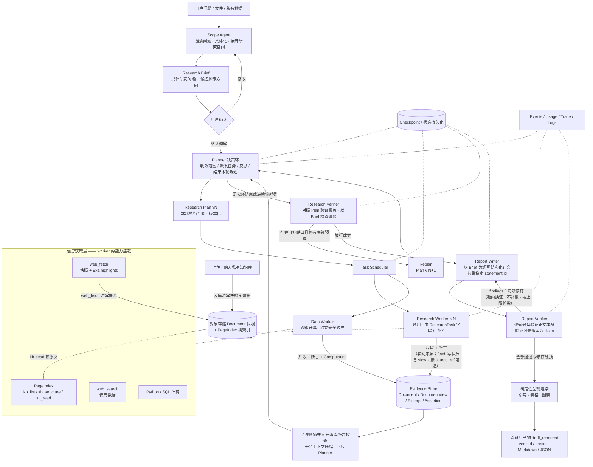
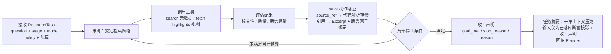
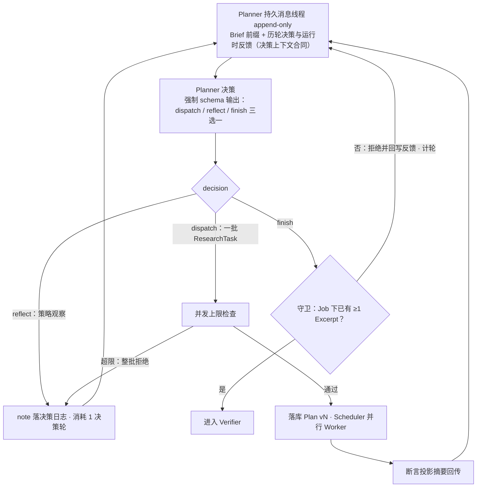
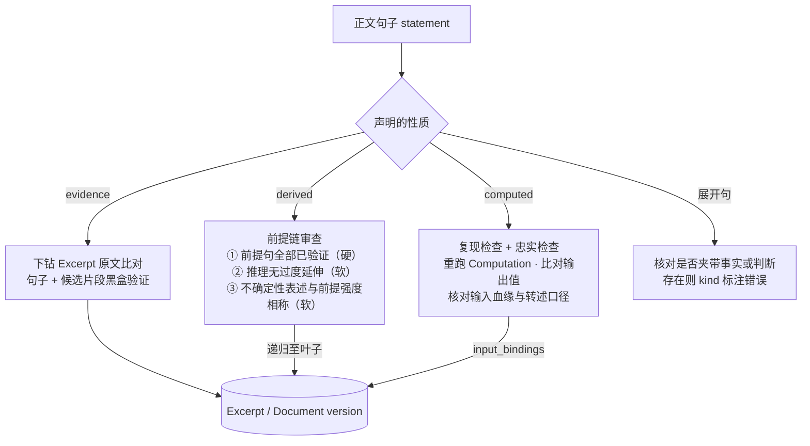
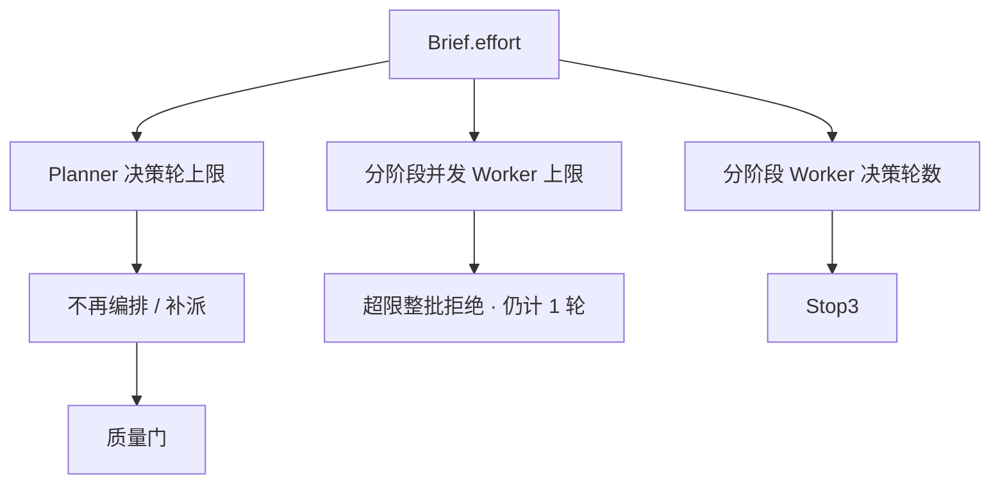

# 深度研究智能体（Deep Research Agent）设计文档

- **版本**：v4.16（草案）
- **实现状态**：M0 + M1 已实现（研究主图跑通到 `draft_rendered`，含 API/CLI 闭环）。
  M2（沙箱计算 / FigureSpec 图表 / PageIndex 建树）与 M4（多用户运行时）为设计草案，
  章节标题已就地标注；M3 评测见 [docs/future/eval.md](./future/eval.md)。
  未标注 M2/M4 的章节均对应已实现代码。
- **设计演进**：本文档经历 v4.6 → v4.16 的多次自我推翻（如 Brief 从"段落合同"改为
  "研究空间展开产物"、成文链重构为 prose-first 并取消四个模块），完整记录见文末
  [附录 B](#附录-b设计演进记录)。
- **日期**：2026-07-19
- **状态**：待评审
- **适用项目**：Prospector v2（多智能体深度研究系统）

---

## 1. 背景与目标

### 1.1 背景

传统 RAG 与单轮搜索问答只能处理"一次检索即可回答"的问题。面对开放式研究任务（如"评估某行业的技术路线与竞争格局"），需要系统具备：多轮规划、并行信息搜集、证据交叉验证、以及生成带完整引用的长篇报告的能力。这类系统在业界被称为 Deep Research Agent（DRA），OpenAI Deep Research、Claude Research、Gemini Deep Research 均属此类。

本项目目标是构建一个**可控、可审计、可复现**的深度研究智能体，采用 Orchestrator-Worker（编排者-工作者）为核心的多智能体架构，在 LangGraph 上实现。

### 1.2 设计目标

1. **验证状态透明**：报告逐句记录验证结果；通过验证的事实性声明（claim）必须可回溯到具体证据来源，未通过句保留时必须显式标记 `partial` 且不得生成已验证引用角标。
2. **广度与深度可扩展**：通过并行子智能体扩展信息搜集广度，通过 Verify-Replan 回路保证深度。
3. **成本可控**：研究档位与停止条件显式化，防止编排失控（过度并行、无限决策轮、无限循环搜索）；token 用量可观测，护栏以**Planner 决策轮、分阶段并发 Worker 数、分阶段 Worker 决策轮**为主。
4. **工程可观测**：全链路 tracing、成本统计、事件流，支持离线评估与回归测试。
5. **面向长任务的鲁棒性**：状态持久化，任意节点崩溃后可从 checkpoint 恢复，不重跑全流程。

### 1.3 非目标（Non-goals）

- **不做端到端 RL 训练**。本项目走 prompt 编排 + 工作流范式，不训练模型权重（理由见 §6.6）。
- **不追求实时性**。深度研究任务的合理延迟为分钟级（5–30 分钟），不为秒级响应做优化。
- **不做通用 Agent 平台**。架构专为"研究→报告"这一类任务收敛设计，不支持任意开放任务。

---

## 2. 需求

### 2.1 功能需求

| 编号 | 需求 | 优先级 |
|------|------|--------|
| FR-1 | 接受自然语言研究问题，支持附带文件（PDF/表格）与私有知识库（PageIndex） | P0 |
| FR-2 | Research Brief 必须把自然语言问题改写得更具体，并主动展开可能改变答案的研究维度、竞争假设、反例、边界条件与证据路径。interactive 模式经 Scope 澄清后由用户确认（原样通过、直接编辑，或一条指令修订且改完即定稿；§5.1）；brief-direct 模式由调用方直接提交完整 Brief、经 schema 校验后作为已确认的研究输入。Brief 不是覆盖合同，其中列出的候选方向不等于全部必达；Planner 对候选方向尽力而为地覆盖，预算不足时按价值排序舍弃，未覆盖不构成违约 | P0 |
| FR-3 | Planner 根据已确认 Brief 收敛实际研究范围，按决策环拆分子课题并写入版本化 Research Plan；Research Plan 是执行合同，每轮可派发若干自包含 ResearchTask（含运行时注入的 Worker 决策轮预算），明确本轮研究对象、研究阶段、证据期望与完成条件。同批任务只能属于一个阶段，数量受该阶段并发上限约束；结果压缩回传后由 Planner 决定补派、切换阶段、结束，或由 Verifier 缺口触发 Replan（§5.2） | P0 |
| FR-4 | 多个通用 Research Worker 并行执行，按 Plan 中的子课题分工，通过 ResearchTask 字段（subjects / research_stage / research_mode / source_policy 等）完成专门化；Data Worker 因独立运行环境与安全边界单列 | P0 |
| FR-5 | 证据统一入库（Evidence Store），分层保存文档快照、精确片段与结构化断言，全链路血缘可追溯 | P0 |
| FR-6 | 覆盖度/矛盾/缺口检查，缺口触发定向补充检索（Replan 回路） | P0 |
| FR-7 | 报告正文由单一 Report Writer 以 Brief 核心问题为纲直接写成**带稳定 statement id 的结构化正文**；引用编号、角标与表格/图表由确定性代码渲染——图表经声明式 spec 绑定已验证陈述或 Computation（§5.5）；输出含表格、图表与结构化 JSON | P0 |
| FR-8 | 最终正文在交付前由 Report Verifier **逐句分型验证**（验证对象即交付文本），每句验证产生落库的 claim 记录；Writer 最多修订两轮，每个 revision 全量重验。触顶后仍未通过的句子保留，产物标记为 `partial`，失败句不生成已验证引用角标 | P0 |
| FR-9 | 支持中途取消、暂停、断点恢复 | P1 |
| FR-10 | 支持研究过程的 SSE 流式推送：所有已提交业务事件按事件 id 实时、完整展示并可由 `Last-Event-ID` 重放；长耗时阶段必须在调用前提交开始/阶段事件，不把心跳、模型 Token、思维过程或调试日志当作业务事件 | P1 |
| FR-11 | 支持追问式的后续研究（复用已有 Evidence Store） | P2 |
| FR-12 | 多用户并发提交与多任务并行运行：任务生命周期与连接解耦、跨设备进度流重连、按用户计量 token 用量 | P1 |

### 2.2 非功能需求

| 编号 | 需求 | 指标 |
|------|------|------|
| NFR-1 | 成本上限 | 用户选择研究档位（quick / standard / deep），映射 Planner 决策轮上限，以及各研究阶段的并发 Worker 上限与每 Worker 决策轮上限。Worker 单轮最多并行 8 个工具调用，**不设 Worker/Job 工具调用总数或 Job 时长上限**；删除墙钟须以逐调用超时为前提。token / 累计工具只计量。收工只停止研究，不绕过质量门（§7） |
| NFR-2 | Claim 忠实度 | Claim 相对人工标注 Excerpt 真值的忠实率 ≥ 95%（M3 起作为发布门禁） |
| NFR-3 | 可恢复性 | 任意节点失败后，从最近 checkpoint 恢复，已完成的子任务不重跑 |
| NFR-4 | 可观测性 | 每次独立 execution attempt 有 root trace，每次工具调用与 Agent 决策有 span；trace 与日志可按 job/task/attempt 关联，成本以 usage 表为准 |
| NFR-5 | 并发安全 | Evidence Store 支持多 worker 并发写入，Document / Excerpt 按内容哈希去重 |
| NFR-6 | 可评估性 | 全流程输入输出可序列化，支持离线回放与 LLM-as-judge 评估 |
| NFR-7 | 多租户公平性 | 单个用户的深研 fan-out 不得饿死其他用户的任务；per-user 并发上限可配置 |
| NFR-8 | 运行时弹性 | worker 池可水平扩缩容；滚动发布不中断在跑任务；进程崩溃后任务被接管而非丢失 |

### 2.3 约束

- 编排框架：LangGraph（有既有代码与经验积累）。
- 多智能体系统的 token 消耗约为普通对话的 15 倍量级，成本控制必须是一等公民而非事后补丁。

---

## 3. 总体架构

### 3.1 架构总览



关键修正说明（相对朴素画法）：**工具层不是流水线中的一站，而是 worker 的能力挂载**。工具结果回到 worker 上下文后被过滤与判断，再把 Excerpt 与 Assertion 写入 Evidence Store。本地/私有文档的 **Document 快照在入库时**写入对象存储并绑定 PageIndex 树；`kb_read` 只产出片段，不新建整份快照。联网路径不区分普通网页与 PDF：`web_fetch` 统一请求 Exa 全文与任务相关 highlights，全文写入 Document 快照，highlights 以 `hN` 写入任务级 DocumentView。运行时为每个持久化 highlight 生成当前 Worker 内唯一的 `source_ref`；Worker 只选择 `source_ref`，由代码解析对应的 `doc_id`、`view_id` 与 `hN` 后调用 `save_findings` 落证（D12）。**存储层留全量、上下文层做视图**——全文不进入任何 Prospector LLM 上下文，但快照和 Worker 实际看到的视图都必须持久化（详见 §4 与 §6.2）。**Brief 只负责展开问题，不预制执行清单**：Planner 在决策环中从候选研究空间里选择方向、动态派发 ResearchTask；Plan 版本记录各轮实际形成的执行合同，而非一次性写完的完整 DAG（§5.2）。

### 3.2 Worker 内部循环

每个 Research Worker 内部是一个受限的 ReAct 循环，而非一次性调用：



**三条循环纪律（worker 产物合同）**：

1. **发现只有一个入口**：worker 输出严格 `save` 动作，只提交 `source_refs、statement、topic_tags`；运行时从当前 Worker 的来源注册表解析出 `doc_id、view_id、source_ids`，再调用内部 `save_findings` 落证。运行时验证 view 属于当前 Job、Task 与 Document version，再创建 Excerpt、Assertion 并绑定 `excerpt_ids`——断言与其证据在同一次调用中出生、原子绑定，不存在"断言引用不存在的证据"的状态。所有联网来源的 `source_ref` 都只能解析为该任务持久化的 Exa highlight。未经该入口的内容没有任何通道进入 Planner 或下游视野。
   Worker 必须按「单个证据缺口 → 搜索/抓取 → 立即落证 → 覆盖判断」循环推进，禁止积压已经发现的可用来源后继续扩展新方向。每次 `save_findings` 成功后，运行时只使用该任务全部已落库断言与 `expected_evidence` 做独立覆盖判断；必需证据已满足时主动收工，未满足时只把明确缺口回注给下一轮研究。
2. **收工声明只汇报决策原因，不汇报发现**：Worker 每轮通过 `response_format=json_schema + strict=true` 输出唯一 `WorkerAction`，只能选择 `search / save / finish` 之一；收工时选择 `finish` 并填写 `{goal_met, stop_reason, reason}`。`goal_met` 为对照 `expected_evidence` 的自评；`reason`（限长）用一句极短中文说明为何现在结束，持久化为 `finish_reason`。它是标注过的决策观察，不是事实陈述。
3. **任务摘要 = 库投影的干净上下文压缩**：worker 收工时生成一段供 Planner 判断覆盖度的综合摘要，但该调用的 prompt **从零构建**，仅含本 task 已落库的断言列表（statement + assertion_id）与收工声明，**禁止携带消息轨迹**——轨迹在上下文里时，"只按库总结"就从结构保证退化为提示词祈祷。摘要用中档模型（§3.3）。可选加固：要求摘要中事实句内联引用 `assertion_id`，运行时确定性校验 id 存在于本 task 名下。摘要是库的纯函数：若崩溃发生在"断言已落库、摘要未生成"的间隙，恢复时只补摘要、不重跑研究。摘要失真的爆炸半径由此被钉死——最坏导致 Planner 对派发的轻微误判，Verifier 与成文线只读库，任何失真进不了证据链。

#### 联网工具合同（网页路径）

一句话：**Worker 只消费持久化的任务级视图，并且只能用运行时代码为该视图生成的 source_ref 落证。**

| 工具 | 合同 |
|------|------|
| `web_search` | 只返回条目元数据（标题、URL、snippet 等），**不**触发抓取或内容抽取。Worker 自行判断哪些 URL 值得 `web_fetch`。与 legacy「搜索即抓取即摘要」不同：Exa contents 与 highlights 成本只花在主动选中的页面上。 |
| `web_fetch(url)` | **不返回全文**。工具对普通网页和 PDF 使用同一合同：请求 Exa `text` 与 `highlights.query=task.question`，全文写入 Document 快照，抽取片段编号为 `hN` 并写入任务级 DocumentView；Prospector 不调用额外 LLM、不自行切段。工具内部返回存储 ID 与 items，Worker 运行时只向模型暴露唯一 `source_ref` 和 highlight 原文。 |
| `save(source_refs, statement, topic_tags)` | 模型唯一落证动作。运行时从来源注册表解析存储 ID，校验当前 Worker 可见性，再调用内部 `save_findings` 验证 view 的 Job、Task、Document version 和 source_ids；`hN` 直接取回持久化 highlight，原子写入 Excerpt + Assertion。 |

配套规则：

1. **预算**：Worker 每次模型动作计入 `max_worker_rounds`，抛错失败的工具调用同样消耗当前决策轮。工具调用总数不设上限，但单轮最多并行 8 个独立调用。`web_fetch` 只发起一次 Exa contents 请求，不再产生 Prospector 压缩模型 token。
2. **失败语义**：媒体类型无法确认、Exa 抓取失败或 highlights 为空时，本次 `web_fetch` 明确失败，不返回其他形态的内容。
3. **污染边界**：所有联网 Excerpt 都直接使用任务级 DocumentView 中持久化的 Exa highlight；locator 只声明 `view_id + highlight_id`，不声明页码、段号或字符位置。引用精度为篇章级，Claim 验证仍使用 highlight 原文而不是整篇全文。

停止判定分两层，**worker 停下来 ≠ 研究做完了**：

**Worker 局部停止条件**（满足其一即停，只结束当前任务）：

1. 当前子任务目标已满足（对照 `expected_evidence` 自评）；
2. 连续 2 轮未产生有效新 Evidence（信息增益衰减）——判定机器化：连续 2 轮 `save_findings` 未新增任何 Excerpt / Assertion 行（内容哈希去重后计），由运行时判定，不依赖 worker 自评；
3. Task 级预算耗尽；
4. Worker 决策轮耗尽。工具错误会回到 Worker 上下文，由 Worker 更换来源、调整检索路径或主动声明证据不可得；运行时不再根据连续失败批次数提前收工。

**Job 全局完成条件**（全部满足才进入成文，由质量门判定而非 worker）：

1. Planner 研究环已结束（主动 `finish` 且通过空手守卫，或决策轮耗尽且已有研究来源——「已有研究来源」由运行时判定为 Job 下 ≥1 条 Excerpt；决策轮耗尽且零 Excerpt 不进 Verifier、直接判失败，§5.2 / §7），且 Research Verifier 判断现有证据已经履行 Planner 通过版本化 Plan 形成的**执行合同**，并确认没有偏离 Brief 中的原始问题（重大缺口须进入失败/部分报告出口，§5.3 / §7）；
2. 最终正文全部事实性陈述通过逐句验证（验证记录落库为 claim，§5.4）；
3. 高优先级证据冲突已处理（并陈或裁决，以 ConflictResolution 记录为准，§4.12——不存在"有 contradict 关系、无覆盖 resolution"的高优先级 claim）；
4. 报告与引用结构校验通过。

Worker 停止后，其产出仍要经过 Verifier 检查；Verifier 可产出缺口建议，在**仍有 Planner 决策预算**时以 Replan（Plan 新版本）交回 Planner 再派发，不存在"最后一个 worker 停止即进入报告阶段"的隐式通路。全局完成条件与 §7 的预算语义共同构成闭环：**完成 = 通过所有门；预算耗尽 = 停止研究后看门的结果**。

### 3.3 分阶段职责

| 阶段 | 组件 | 输入 | 输出 | 模型档位 |
|------|------|------|------|----------|
| 0 问题展开 | Scope Agent | 用户问题 | 具体化并展开研究空间的 Research Brief（待确认） | 中档 |
| 1 规划 | Planner | 持久消息线程：Brief 前缀 + 历轮决策 + 断言投影摘要 / Verifier gap / 拒绝反馈（§5.2 决策上下文合同） | Research Plan vN（本轮执行合同与派发的 ResearchTask） | 最强档 |
| 2 搜集 | Research / Data Worker ×N | ResearchTask | 片段 + 断言（经 `save_findings` 原子入库；联网来源由 source_ref 解析至持久化 view）+ 收工声明 + 断言投影摘要 | 中档（并行，成本敏感） |
| — | 工具侧来源视图 | `web_fetch` 内部：URL + task.question | 带 `hN` 的 Exa highlights | Exa contents 能力；Prospector 不调用额外 LLM |
| 3 验证 | Research Verifier | Evidence Store + Research Plan 版本历史 + Brief | 执行合同覆盖判断 / 偏题检查 / gap 建议 / 放行；有预算则 Replan → Planner | 最强档 |
| 4 成文 | Report Writer + Report Verifier（句级修订环） | usable 断言 + Brief + ConflictResolution | 已验证结构化正文 + claim 验证记录 | Writer 最强档 / 句级验证中档（可并行分片） |
| 5 渲染 | 确定性呈现渲染 | 已验证正文 + 证据链 | 最终报告 | 确定性代码 |

模型分档依据：编排与综合类决策（规划委派、验证放行、正文撰写）集中在少数调用上、影响全局，用最强模型；worker、收工摘要与句级验证属于大量局部调用，统一使用中档模型；联网来源视图直接使用 Exa highlights，引用渲染不经过 LLM。

### 3.4 本地文档与 PageIndex（M2，部分实现）

> 当前仅实现 `kb_read`（`tools/kb_read.py`）。入库建树、`kb_list` / `kb_structure`
> 与私库落证尚未实现。

私有知识库与研究附件的**唯一**检索后端是 PageIndex。Prospector **不移植** PageIndex 实现，将其作为外部依赖（独立进程 / 可安装库 / MCP 传输均可）；本系统负责鉴权边界、Document 版本与 Evidence 落库。

**入库（控制面，一次性）**：

```text
上传或纳入私有知识库
→ 写入不可变 Document 快照（对象存储 + content_hash + version）
→ 基于该版本原文构建 PageIndex 树（structure + 可选 line→page 映射）
→ 树产物挂在同一 Document version 上；换 version 则重建树，禁止跨版本复用
```

**Worker 工具（运行时，仅三原语）**：

| 工具 | 作用 |
|------|------|
| `kb_list` | 当前研究可访问的私有知识库全部 Document：`doc_id`、description、页数等；创建时的 `seed_document_refs` 可置顶/优先展示，但不缩小可见集 |
| `kb_structure` | 返回无正文的目录树（省 token），供 Worker 定位节点 |
| `kb_read` | 按 `line_range`（或等价定位）读取原文，返回文本与 PDF `page` 等 locator |

**私有知识库即文档集**：同一私有知识库内的 Document 构成可检索语料；一次研究默认可检索该库全文，不另建 Job 级文档白名单。创建研究时可附带可选 `seed_document_refs`（用户点名的附件），只作 Scope/Planner/Worker 的**优先关注提示**并参与幂等输入摘要，**不**限制检索范围。树导航与相关性判断由 Research Worker 的 ReAct 循环完成，**不在 PageIndex 工具内再套一层 LLM 检索**，避免嵌套耗尽 Task 预算并保持可审计。跨文档粗选依赖各文档 description / 元数据与 Worker 推理，不另建向量私有库。多用户运行时（§13）下，私有知识库与用户/租户文档空间对应；本设计不引入 Job↔Document 关联表。

**落证**：本地文档经 `kb_read` 适配层写入 `EvidenceExcerpt`（锚定已有 `doc_id` + `version` + page/line locator），再经 `save_findings` 绑定 Assertion。联网路径在 **`web_fetch` 时**写 Document 快照与任务级 DocumentView；运行时为 view 中的 `hN` 生成唯一 `source_ref`，模型只提交该引用，代码解析出存储 ID 后从持久化 Exa highlights 回取原文。PageIndex 不进入引用链；权威链仍是 Claim → Excerpt → Document version。内部存储工具只接受代码解析出的本系统 `doc_id` 和 `view_id`，后端校验 Job、Task、Document version 归属。

---

## 4. 数据模型

数据模型是本架构的"骨骼"。除任务侧的 Brief、Research Plan 与 ResearchTask 外，证据侧严格区分四个本体层次，对应五个核心实体与五张版本化的关系/判定表：

| 层次 | 实体 | 可变性 |
|------|------|--------|
| 世界的快照 | Document（原始文档版本） | 不可变，版本化 |
| 从快照中的选取 | EvidenceExcerpt（精确片段） | 不可变，锚定文档版本 |
| 确定性执行记录 | Computation（沙箱计算的执行事实） | 不可变，内容寻址 |
| 模型的判断 | Assertion / Claim + 关系与判定表（ClaimEvidence / ClaimPremise / ClaimComputation / ClaimVerdict / ConflictResolution） | 追加式演化，判断历史可审计 |

分层的原因：原始证据、模型抽取的事实、模型对证据的判断三者的生命周期与可信级别完全不同，混在一张表里会破坏 append-only 语义（判断演化时被迫回写"证据"），并让引用验证退化为"拿模型输出验证模型输出"。核心原则是**存储层留全量，上下文层做视图**——DocumentView 是投喂 LLM 的任务级视图，不是 Document 的存储格式；Assertion 的 usable 投影（§4.13）同理：废证判断追加落库，默认消费视图过滤 unusable。

### 4.1 Research Brief

Scope Agent 的产物，也是用户确认的对象。它的首要目标不是冻结范围，而是把用户的自然语言问题改写成一个**更具体、更有研究张力的问题**，帮助 Planner 看见足够宽的探索空间。Brief 应保留用户明确提出的对象、目标、时间、地域、输出要求与排除项，同时主动补出可能改变答案的候选维度、竞争假设、替代解释、反例、边界条件和多条相互独立的证据路径。

Brief **不是合同，也不是覆盖清单**。Scope 新增的内容表示「值得调查的可能方向」，不表示用户要求，也不表示 Planner 必须全部研究。Scope 不负责决定最终研究范围，不给候选方向排出不可更改的优先级，不预设结论；Planner 对候选方向的正确姿态是**尽力而为**：默认都值得覆盖，结合用户目标、研究档位和可获得证据按价值排序推进，预算不足时舍弃排序靠后的方向——不是自由挑选，未覆盖也不构成违约；每轮实际推进的方向写入版本化 Research Plan，形成可执行、可验证的合同（§4.2 / §5.2）。

```json
{
  "brief_id": "rb_20260711_001",
  "question": "评估该竞品 2025–2026 年在亚太区的经营态势：收缩还是扩张？",
  "brief_text": "为区域投入决策提供依据，具体研究某主要竞品在 2025-01 至 2026-07 期间于亚太区的经营态势。不要只在「收缩止损」与「激进扩张」之间二选一，还应检验选择性扩张、区域重组或资源转移等竞争解释；观察不同国家、业务线和时间阶段是否出现相反信号。可从财务披露与官方公告等直接证据出发，也可探索高管与组织变化、招聘、产品发布、渠道合作、市场活动、关停或撤资等相互独立的侧面路径，并主动寻找反例和无法由现有解释覆盖的异常。不预设必须获得公开信息中可能不存在的分公司预算明细。用户明确排除二级市场投资建议，并要求报告带引用、使用中文。上述探索方向是 Planner 应尽力覆盖的候选空间；预算受限时按证据价值排序推进，不是全部必达项。",
  "output_format": "report_with_citations",
  "language": "zh",
  "effort": "standard"
}
```

字段级说明：

- **`brief_text`**：具体化后的研究问题与候选探索空间。它既要完整保留用户明确要求，也要主动展开多种可能解释和取证方向；模型补充的方向必须保持开放，不得伪装成用户偏好、硬边界或预设结论。
- **`question`**：短问句标题，便于列表展示与评测题库索引；语义上应被 `brief_text` 覆盖，不以独立结构化字段驱动覆盖检查。
- **`effort`**：用户侧唯一预算相关字段（`quick` \| `standard` \| `deep`，缺省 `standard`）。
- 可选轻量元数据（如 `source_requirements`）只记录用户明确提出的要求；Scope 自行想到的来源与取证方式写入 `brief_text`，并明确为候选路径。

用户确认 Brief，表示系统对问题的理解和展开方向可以交给 Planner；确认后的文本作为本次任务的输入快照保持不变，目的是审计与复现，不是把候选方向冻结成合同。interactive 下确认交互见 §5.1（原样确认、直接编辑，或一条指令修订后即定稿）。研究取舍与执行约束只通过 Planner 决策环、Research Plan 版本和 Replan 演进，不回头把 Brief 改造成计划。

### 4.2 Research Plan 与 ResearchTask

**Research Plan 是 Planner 形成的执行合同，也是版本化对象**：Planner 以尽力覆盖 Brief 候选研究空间为目标，按价值排序确定当前轮要调查的方向，为每个方向写出自包含的 ResearchTask、证据期望与完成条件；只有进入 Plan 的内容才成为本轮执行承诺。每次 Planner 决策轮实际派发的任务集落为一版 Plan；此后**唯一**的修改途径是 Verifier 驱动的 Replan 产生新版本（或 Planner 在同一研究环内的后续决策轮追加派发并落新版本），不允许原地改写已记录的 task 列表。审计对象是版本历史——与 §4.9 的 verifier_run 版本化是同一模式。`trigger_verifier_run` 为 null 即首轮规划；版本演进线性，前驱恒为 version-1。

**与旧语义的差别**：Plan **不是**「研究开始前一次性写完的完整 DAG」。每一版 Plan 记录的是**该决策轮要执行的一批 ResearchTask**；后续轮次按断言投影与缺口再派发。可选 `depends_on` 仍保留——同轮内若确有前后依赖可表达，否则即为并行列表。

```json
{
  "plan_id": "pl_001",
  "version": 2,
  "trigger_verifier_run": "vr_003",
  "decision_round": 3,
  "task_ids": ["t_01", "t_02", "t_03", "t_07"]
}
```

**ResearchTask 通过字段完成专门化**——worker 是通用的，"查什么、怎么查、查到什么程度"全部由任务字段定义。任务书必须**自包含**（子 worker 看不到其他 task 的上下文）：`question` 写清完整子课题说明（建议至少一段），而非简短标题。

```json
{
  "task_id": "t_03",
  "question": "主要竞品 2024–2026 年的公开融资与商业化进展如何？请检索独立来源，区分公告与转述，并标明时间与金额口径。",
  "subjects": ["竞品 A"],
  "research_stage": "scout | deep_dive | verify",
  "research_mode": "factual | comparison | counterargument | risk_scan | timeline",
  "source_policy": {
    "preferred_tiers": ["official", "industry"]
  },
  "allowed_tools": ["web_search", "web_fetch", "kb_list", "kb_structure", "kb_read"],
  "expected_evidence": "每家竞品 ≥ 2 条独立来源的融资与营收记录",
  "depends_on": [],
  "budget": { "max_worker_rounds": 49 },
  "status": "pending | running | done | failed | skipped | cancelled"
}
```

`ResearchTask.budget` 由运行时按 Brief.`effort + research_stage` **注入**（Planner 不填写），只包含该 Worker 的 `max_worker_rounds`。工具调用总数不设上限；同一决策轮最多并行 8 个彼此独立的工具调用。

`cancelled` 只表示所属 Job 收到取消请求后，运行时终止尚未完成的任务；`skipped` 表示研究计划主动跳过该任务。两者不得互换。Job 取消收尾必须在同一事务中把 `pending/running` Task 写为 `cancelled`、记录 `stop_reason=job_cancelled`，并写入唯一 `job.stopped(status=cancelled)`。

字段的正交性是刻意的：`subjects` 回答“研究谁”，`research_stage` 回答“研究推进到哪一步”（scout / deep_dive / verify），`research_mode` 回答“用什么姿态查”（counterargument / risk_scan / comparison），`source_policy` 回答“优先查什么来源”（academic / official / industry）。这些字段独立组合，而不是实体化为固定 worker 角色（决策理由见 §6.8）。初始状态是 scout；尚无 scout 证据时 Planner 必须先派 scout。scout 可声明最多 6 个有界候选，deep_dive / verify 必须恰好一个 subject。Data Worker 是唯一的例外类型，因为沙箱运行环境与安全边界是真实的运行时差异，字段无法消化。

三条字段级说明：

- **任务不携带 plan_version**：任务与 Plan 版本是多对多关系（未执行任务被后续版本延续引用），归属由 `Plan.task_ids` 单向表达，任务上反向存版本号要么存不下要么存错。
- **expected_evidence 同时定义证据目标与完成依据**：Worker 按目标满足、信息增益衰减、主动声明证据不可得/受范围限制或决策轮耗尽停止；每次 `save_findings` 后由独立覆盖判断检查 goal_met，Verifier 再做全局语义判断，不把数量或措辞机械当成勾选表。
- **source_policy 为可选覆盖**：用户明确提出的来源要求来自 Brief 元数据或 `brief_text`；Scope 自行扩展的候选来源由 Planner 判断是否写入任务。
### 4.3 Document（原始文档快照）

Document 是某次纳入系统时那份文件的**完整原文副本**，落库后不可变。同一逻辑来源内容变化（`content_hash` 不同）→ 产生新版本，旧版本不删。这是引用有效性的底线：网页会修改、会消失，报告的引用必须能指回**纳入当时的那个快照**。

快照写入时机：

- **上传 / 私有知识库文档**：在控制面入库时写入快照，并基于该版本构建 PageIndex 树（§3.4）。
- **网页等外部来源**：在 `web_fetch` 成功取回正文时写入快照（早于 Excerpt 落证；Worker 上下文不持有全文）。
- **PageIndex `kb_read`**：只读取已有快照对应的原文并产出 Excerpt，**不**新建 Document。

```json
{
  "doc_id": "doc_889",
  "source_ref": { "kind": "url | upload | private", "uri": "https://..." },
  "content_hash": "sha256:...",
  "version": 2,
  "retrieved_at": "2026-07-11T09:32:00Z",
  "media_type": "html | pdf | xlsx",
  "storage_ref": "s3://.../doc_889_v2",
  "index_ref": "s3://.../doc_889_v2/pageindex/",
  "source_meta": {
    "title": "...",
    "author": "...",
    "published_at": "2026-03-14"
  }
}
```

`source_ref` 统一表达网页、用户上传与私有库文档，避免把 URL 误设为所有 Document 的必填字段。`index_ref` 指向该 version 的 PageIndex 树产物（结构 JSON、line→page 映射等）；仅 `upload` / `private` 等需结构检索的文档必填，纯网页快照可为空。树是派生索引：丢失可按快照重建；快照丢失则引用链断裂。

`DocumentView` 是某个 Task 实际看到的联网来源视图，记录 `view_id`、`job_id`、`task_id`、`doc_id`、`doc_version`、`view_kind` 与 items。所有联网来源的 items 都保存 Exa highlight 原文及其 `hN`。同一 Document 可因 task question 不同产生多个 view，禁止把任务相关 highlights 固化进 Document 版本。

**Document 不存 tier 字段，当前也不建设来源 tier 策略表。** Exa 不提供 publisher 字段；Research Verifier 读取 URL、标题、author、发布时间与 Excerpt 原文，并结合是否存在独立佐证直接判断来源可信度。来源身份只是先验：官方来源适合证明官方行为和表态，不自动证明效果或因果；低可信度来源可以提供线索，但关键结论不能只依赖它。"某条 Excerpt 是否支持某条 Claim"仍由 Claim Verifier 逐条裁决，Research Verifier 的来源判断不替代该裁决。

### 4.4 EvidenceExcerpt（精确原文片段）

证据核对的最小权威单元。**原文照录、不改写**，锚定到具体文档版本的具体位置。不可变。

```json
{
  "excerpt_id": "ex_1042",
  "doc_id": "doc_889",
  "doc_version": 2,
  "text": "精确原文片段",
  "locator": { "page": 14, "line_span": [35, 78], "char_span": [1024, 1310] },
  "excerpt_hash": "sha256:...",
  "extracted_by": { "task_id": "t_03", "worker": "rw_02", "tool_call_id": "..." }
}
```

经 PageIndex `kb_read` 落证时，locator 至少包含 PDF `page`。联网来源的 Exa highlight locator 只包含 `kind=exa_highlight`、`view_id` 与 `highlight_id`，明确只提供篇章级来源关联，不承诺页码、段号或字符位置。

### 4.5 Assertion（worker 的结构化抽取）

worker 在搜集阶段自底向上从片段中抽取的结构化事实，是 Planner、Coverage Verifier、Report Writer 检索和组织信息的**上下文经济载体**。Assertion 经 `save_findings` 与其锚定的 Excerpt 在同一次调用中原子创建（§3.2 纪律 1），`excerpt_ids` 由运行时绑定而非模型填写；回传 Planner 的任务摘要是本表内容的投影（§5.2）。它是派生的、非权威的缓存视图——可随时从 Excerpt 重建。**Assertion 不在引用链上**：它是纯侧车，被重建或删除不影响任何已出报告的引用有效性；一切最终裁决以 Excerpt 原文为准。

```json
{
  "assertion_id": "as_310",
  "statement": "公司 X 于 2026 年 3 月完成 B 轮融资，金额约 2 亿美元",
  "excerpt_ids": ["ex_1042"],
  "computation_ids": [],
  "topic_tags": ["融资", "竞品X"],
  "produced_by": { "task_id": "t_03", "worker": "rw_02" }
}
```

Data Worker 的计算结论同样以 Assertion 的形式进入写作素材：可选 `computation_ids` 与 `excerpt_ids` 并列，指向沙箱计算的 Computation 记录（§4.10）——没有这条通道，计算结果无法进入 Report Writer 的视野。Assertion 的性质不变：仍是不在引用链上的侧车视图。

### 4.6 Claim（正文陈述的验证记录）

Report Verifier 对**最终正文中每个事实性陈述**（statement）的验证记录（v4.15 起方向反转：claim 不再是成文前起草的中间产物，而是从交付文本提取的、可审计的验证产物）。`statement_id` 锚定正文中带稳定编号的句子，是报告事实正确性的唯一账本。与 Assertion 分表的原因：两者方向相反（自底向上抽取 vs 对交付文本的核验）、生命周期不同（研究中间产物 vs 报告成品）、验证方式不同，合并会迫使所有查询依赖状态字段区分语义。

```json
{
  "claim_id": "c_017",
  "statement_id": "s_042",
  "text": "……",
  "claim_type": "fact | number | causal | opinion_attributed",
  "grounding": "evidence | derived | computed",
  "report_section": "3.2",
  "produced_by": "report_verifier"
}
```

`grounding` 与 `claim_type` 正交：后者描述声明的内容性质，前者描述**支撑形态**。声明的硬约束不是"必须有引用"，而是"**必须有据可依**"，据有三种形态：

- **evidence**：直接锚定证据，ClaimEvidence 直连 Excerpt（§4.7）；
- **derived**：推理型声明，支撑是**前提 claim**（经 ClaimPremise，§4.8）——推理链的中间节点可以是推导，但叶子节点必须最终落地到 Excerpt；
- **computed**：数值计算型，支撑是不可变的 Computation 执行记录（经 ClaimComputation，§4.10/§4.11）——代码、运行环境与输入数据的 Excerpt 血缘全部落库，可复现即可验证（沿用"LLM 不做算术"原则）。

展开与过渡性文字不产生 claim 行——因此它不能承载需要材料核对的事实或分析判断。事实复述仍是 `evidence`，必须绑定 Excerpt；在前文事实之上形成的解释仍是 `derived`，必须绑定 premise。`elaboration` 只负责转折、预告和收束，`limitation` 只说明现有材料未覆盖什么。由 Report Verifier 逐句核对性质标注，防止 Writer 通过选择无引用 kind 绕过 ClaimEvidence 或 ClaimPremise。

### 4.7 ClaimEvidence（证据支撑关系，版本化）

Claim 与 Excerpt 之间的**行级关系**表。原方案中的 `confidence` / `corroborated_by` / `conflicts_with` 全部收敛到关系与判定表：它们不是证据的事实，而是**某次验证运行的产物**。每次 Verifier 运行（`verifier_run_id`）产生新一批记录，旧记录不删——判断的演化历史本身可审计。

```json
{
  "claim_id": "c_017",
  "excerpt_id": "ex_1042",
  "relation": "support | contradict | partial",
  "verifier_run_id": "vr_005",
  "created_at": "..."
}
```

注意本表**只存 pair 级事实**（这条 Excerpt 对这条 Claim 是什么关系），不存 claim 级判定——"unsupported"不是某个 (claim, excerpt) 对的属性，而是"没有任何 Excerpt 支持它"的汇总结论，层级放错会产生"relation=support 且 status=unsupported"这类无法解释的行。claim 级判定统一收敛到 §4.9 的 ClaimVerdict。

由此，权威引用解析链为 **statement → Claim → ClaimEvidence → Excerpt → Document version**，每一跳可机器校验（computed 型的平行链见 §4.11）；Assertion 不在链上（Report Writer 写作时以 Assertion 为素材线索，但 Report Verifier 落库的 ClaimEvidence 必须直连 Excerpt）。

### 4.8 ClaimPremise（推理支撑关系，版本化）

derived 型 Claim 的支撑关系表——与 ClaimEvidence 平行：evidence 型声明经 ClaimEvidence 连向 Excerpt，derived 型声明经 ClaimPremise 连向**前提 claim**。同样按 verifier_run 版本化、append-only。

```json
{
  "claim_id": "c_021",
  "premise_claim_ids": ["c_017", "c_018"],
  "inference_note": "两家头部厂商同期收缩同一产品线 → 该细分市场需求走弱（归纳）",
  "depth": 1,
  "verifier_run_id": "vr_006",
  "created_at": "..."
}
```

`depth` 为推理链深度（前提中最深 derived claim 的 depth + 1，evidence/computed 型为 0）。**默认可通过上限为 4**：每层推理审查是软判断，误差随深度累积，且远端声明离原始证据越来越远，所以上限必须存在；但一篇有论证的报告本身需要「事实 → 单条线索的判断 → 章节论点 → 全文论点」这四层，上限压到 2 等于在结构上禁止跨章节结论，把它们全部推给确定性 `overreach` 判定，报告因此退化为事实清单。深度上限管的是误差累积，不该顺手管掉报告的论证结构。Writer 如实保存任意深度的结构合法前提图；Report Verifier 确定性标记超限或未落到证据的 derived 句为 `overreach`，再交 Writer 句级修订；修订触顶时该句保留在 `partial` 产物中且不生成已验证引用。该字段是**反规范化缓存**（可沿前提图重算）——因 claim 图 append-only、前提创建后不变，缓存不会失效，为 Verifier 深度检查这一热路径保留。任意 derived claim 的支撑树展开到叶子，必须全部落在 Excerpt / Computation 的输入血缘（§4.10）上——"推理不是没有依据，它的依据是前提"。

### 4.9 ClaimVerdict（claim 级判定，版本化）

每次 Verifier 运行对每条 claim 产出一行**整体判定**，与 pair 级的关系行分离。确定性渲染读取最新 run：通过句生成引用，失败句进入 `partial` 状态记录且不生成已验证引用角标。

```json
{
  "claim_id": "c_021",
  "verifier_run_id": "vr_006",
  "status": "pass | unsupported | conflicted | overreach | miscalibrated",
  "reason": "...",
  "created_at": "..."
}
```

`status` 枚举覆盖三种 grounding 的失败形态：`unsupported` / `conflicted` 主要来自 evidence 型（无支撑 / 证据打架），`overreach` / `miscalibrated` 来自 derived 型（推理越界 / 校准失当）；computed 型复现失败记为 `unsupported`，忠实检查失败（数值、单位或口径转述失真）记为 `miscalibrated`（§4.11）。判定由该 run 下的关系行聚合 + Verifier 裁决产生，聚合口径：存在 `contradict` 关系且最新 run 中无覆盖该冲突的 ConflictResolution（§4.12）→ `conflicted`；无任何 `support` 关系 → `unsupported`。

### 4.10 Computation（确定性计算记录）（M2，未实现）

> Data Worker、沙箱与 Computation 表在当前代码中均无实现。

Data Worker 在沙箱中执行成功后落库的**执行事实**，不可变、内容寻址：`code_hash` + 输入集合共同构成内容哈希，与 Document 的 `content_hash`、Excerpt 的 `excerpt_hash` 同一去重模式。它与 Excerpt 同层——记录"算了什么、怎么算、算出了什么"，与任何验证判断无关；"这次计算是否支撑某条 Claim"是 Verifier 的判断，落在 §4.11 的关系表里。两者混入一张表会重演 §4.7 批评过的层级错误：判断演化时被迫回写事实行。

```json
{
  "computation_id": "cp_007",
  "code_hash": "sha256:...",
  "code_ref": "s3://.../cp_007/script.py",
  "runtime": { "image": "sandbox-py:1.4", "deps_lock": "sha256:..." },
  "input_bindings": [
    { "name": "revenue_2025", "excerpt_id": "ex_1042", "extracted_value": "2.01e8" },
    { "name": "revenue_2024", "excerpt_id": "ex_0983", "extracted_value": "1.47e8" }
  ],
  "output": { "value": 0.367, "unit": "yoy_growth" },
  "produced_by": { "task_id": "t_05", "worker": "dw_01", "tool_call_id": "..." }
}
```

- **`input_bindings` 是血缘的关键**：每个输入变量必须绑定 `excerpt_id`，并显式记录从该原文读出的数值（`extracted_value` 不是冗余：从原文读数是一次 LLM 判断，不可确定性重建，它是实际参与计算的权威输入——没有它，复现检查将依赖重新抽取、不再确定）。**计算不吃无源数据**——没有 Excerpt 血缘的输入不允许进入计算，这与"LLM 不做算术"是同级硬规则。
- **`runtime` 只含代码无法自我表达的复现条件**：镜像版本与依赖锁。随机种子等属于计算逻辑，一律钉死在代码内、由 `code_hash` 覆盖——种子外置会搅浑内容寻址的去重键定义（换 seed 算不算同一个计算？）。沙箱断网、依赖锁死，使确定性成为被强制的属性而非期望——复现即输出值比对（数值型可声明容差）。
- **`output` 是反规范化缓存**：严格说可由 code + inputs 重跑推导，但与 `ClaimPremise.depth`（§4.8）同属输入不可变、永不失效的缓存——忠实检查的热路径不能靠重跑代码来读输出。刻意不设标量输出的 digest：对标量存自身哈希无意义，且哈希只能字节级比对、与数值容差互斥。非标量输出的触发条件已由图表序列数据兑现（§5.5 computation 绑定模式）：表格/序列型输出落对象存储 `output_ref` 并附 digest（大产物的复现比对用字节级哈希），标量输出维持直接比值。
- Computation 的输入端锚定 Excerpt，因此它接入权威链而**不引入新的叶子类型**：任何支撑树展开到叶子，仍然全部落在 Excerpt → Document version 上。

### 4.11 ClaimComputation（计算支撑关系，版本化）（M2，未实现）

computed 型 Claim 的支撑关系表，与 ClaimEvidence / ClaimPremise 平行：按 verifier_run 版本化、append-only。

```json
{
  "claim_id": "c_030",
  "computation_id": "cp_007",
  "relation": "support | mismatch | irreproducible",
  "verifier_run_id": "vr_006",
  "created_at": "..."
}
```

Verifier 对 computed 型的验证由此精确化为两个检查：

1. **复现检查（完全确定性）**：按 `runtime` 重跑 `code_ref`，输入按 `input_bindings` 从 Excerpt 重新核取，输出值比对（容差见 §4.10）。复现结果是 **computation × run 级事实，不是 pair 级事实**——本表不为它单设字段（那会允许"同一 Computation 在同一 run 下两行复现结果互相矛盾"这类无法解释的行）：复现失败时，该 run 下所有引用此 Computation 的关系行统一记 `relation: irreproducible`（同源事实的一致重复，append-only 下无害），claim 级判定为 `unsupported`；重跑输出与差异细节属诊断信息，去向是 trace 与日志，不入权威表。
2. **忠实检查**：Claim 文本中的数值、单位与口径是否如实转述 `output`。数值/单位比对机器可查；口径转述失真（如把"样本内增速"写成"行业增速"）是轻量语义判断，但上下文极小（一条 claim + 一条输出记录），可靠性显著高于 derived 型的推理审查。失败记 `relation: mismatch`，claim 级判定为 `miscalibrated`。

computed 型的权威链为 **Claim → ClaimComputation → Computation → input_bindings → Excerpt → Document version**，除口径判断外每一跳可机器校验。三种 grounding 的支撑树叶子由此全部收敛到 Excerpt / Document version。

### 4.12 ConflictResolution（冲突裁决记录，版本化）

矛盾的**处置决定**此前只存在于 Verifier 的推理轨迹中——§5.3 说"裁决结果写入版本化的关系记录"、§4.9 依赖"已被裁决"这个状态、§3.2 完成条件 3 要求"冲突已处理"，但没有实体承载这个决定，成文线无从读取，质量门也无法机器判定。本表补上这一层：处置决定是与 pair 级关系（ClaimEvidence）、claim 级判定（ClaimVerdict）并列的第三类判断，同样按 verifier_run 版本化、append-only——同一冲突可在后续 run 被改判，新行追加、读取取最新 run。

```json
{
  "conflict_key": "sha256:...",
  "disputed_point": "公司 X 2025 年营收（财报口径 vs 媒体报道口径）",
  "excerpt_ids": ["ex_1042", "ex_2088"],
  "decision": "present_both | adjudicated",
  "winning_excerpt_ids": ["ex_2088"],
  "rationale": "官方财报为一手来源且发布时间更晚；媒体数字系转引早期预估",
  "verifier_run_id": "vr_006",
  "created_at": "..."
}
```

- **`conflict_key`** 为冲突双方 `excerpt_ids` 排序后的哈希，幂等去重键（重复检测同一冲突不产生语义重复，§13.4 幂等纪律的自然延伸）。它可从 `excerpt_ids` 推导，是为 ClaimVerdict 聚合热路径保留的**反规范化缓存**（拿到 contradict 证据对 → 算哈希 → 查覆盖），与 `depth`（§4.8）同一辩护。行由 **(conflict_key, verifier_run_id)** 复合键标识，与其余关系/判定表同构，不设代理主键。锚定 Excerpt 而非 Claim，使研究期（§5.3 矛盾检测发生在 claim 尚不存在时）与成文期共用同一张表。
- **`decision` 只有两个终态**，正对应"并陈或裁决"。"需补搜裁决"不是第三种 decision——它表现为**本轮不写 resolution + 生成 gap 补搜任务**，补搜完成后的下一次 verifier run 再裁决。悬而未决的冲突就是没有 resolution 行的冲突，质量门据此拦截，无需 pending 状态。
- **adjudicated 必须给出 `winning_excerpt_ids` 与 `rationale`**——"择一"从此不可能静默：选了谁、为什么，都是可审计的落库事实。来源身份、原文质量、时效性与独立佐证可作为 rationale 的权衡输入，但不能以来源身份代替对具体 Excerpt 的判断。

四个下游消费点：

| 消费者 | 读取方式 |
|--------|----------|
| ClaimVerdict 聚合（§4.9） | contradict 关系行的证据对被最新 run 的某条 resolution 覆盖（`excerpt_ids` 包含冲突双方）→ 不判 `conflicted` |
| Report Writer（§5.4） | present_both 的冲突必须忠实呈现各方及来源归属，不择一、不调和成材料不支持的新结论；具体句序、段落与章节位置由 Writer 按全文结构决定。adjudicated 正常引用胜方，可选择性说明分歧的存在 |
| Report Verifier（§5.4） | 核对上述语义规则是否被遵守：并陈冲突缺一侧、静默择一、来源归属错误或含混调和，按验证失败打回修订；不校验固定句序或物理相邻 |
| 质量门（§3.2 条件 3 / §7） | 机器可查：不存在"有 contradict 关系、无覆盖 resolution"的高优先级 claim |

研究期冲突由 Research Verifier 输出 `conflict_judgements`（只引用 `assertion_id`）；持久化前由代码按 `assertions.excerpt_ids` 绑定为 `ConflictResolution.excerpt_ids`，模型不得直接填写 excerpt UUID。

### 4.13 AssertionDisposition（断言证据资格，版本化）

Research Verifier 对**单条 Assertion** 的证据资格判断：伪学术、UGC 幻觉数字、或无独立佐证却支撑核心定量结论的断言，应被标为 `unusable`。Document / Excerpt / Assertion **不删**；资格判断按 `verifier_run` 追加，有效状态按 plan_version 升序 last-write-wins（`unusable` / `restored`；从未处置 → usable）。

```json
{
  "assertion_id": "as_310",
  "status": "unusable | restored",
  "reason": "来源为人人文库类 UGC 伪学术，定量数字无法在真实期刊复现",
  "verifier_run_id": "vr_006",
  "created_at": "..."
}
```

- **挂在 Assertion，不做 excerpt 绑定**：毒的是那句抽取事实；冲突（§4.12）才需要 excerpt 对撞服务于 Claim 期。
- **`source_credibility` 缺口必须带 `related_assertion_ids`**（任何 severity），禁止只填 excerpt 或含糊指代来绕过点名。
- **点名 ≠ 废证**：`related_assertion_ids` 表达"该缺口涉及哪些断言"，`assertion_dispositions` 才表达"还能不能用"。二者的关系由 severity 决定，且由代码而非模型维护：
  - `major`：这些断言按定义不可用于成文。代码在 `materialize_verifier_decision` 中把它们全部补标为 `unusable`（`derive_credibility_dispositions`），模型漏填即被纠正，而不是整轮判断被拒。
  - `minor`：可披露、不阻断，**不要求废任何证**。"来源偏弱、值得说明、但结论仍成立"是合法判断；把它定义为非法会消灭最常见的一类可信度结论。
- **校验分层**：`VerifierLlmDecision` 只校验模型能靠改写满足的规则（点名、去重、pass/major 一致）；"major 缺口的断言必须 unusable"作为推导后的不变量放在 `VerifierDecision` 上，此时它已由构造保证成立。
- **消费约定**：Verifier 覆盖度与后续成文线（Report Writer / Report Verifier）默认只读 usable 投影；Replan 时把 `unusable_assertions`（id/statement/reason）注入 Planner 线程，历史 worker_projection 中的假句不得再作覆盖依据。

---

## 5. 关键流程细节

### 5.1 Phase 0：Scope 与 HITL 确认

- Scope Agent 最多进行 **1 轮**反问（避免拉锯）。只有缺少研究对象、核心问题或会实质改变问题含义的信息时才询问；能够通过研究发现的事实不反问用户。
- Scope 把用户问题改写为更具体的 Research Brief：完整保留用户明确要求，同时主动展开候选研究维度、竞争假设、替代解释、反例、边界条件和多条证据路径。
- Brief 呈现给用户后，interactive 确认只有三条路径（CLI 键位见 CLI 文档 §4.3）：
  1. **原样确认**：接受当前 Brief，立即定稿。
  2. **直接编辑**：用户亲手修改 `brief_text` 与轻量元数据（`effort` / `language` 等）；编辑可多次，每次改完回到展示，仍须确认或改走其它路径。
  3. **指令修订（仅一轮）**：用户发送**一条**自然语言修订指令；Scope 按「当前 Brief + 指令」改写恰好一轮，**改完即定稿**，不再二次确认，也不允许多轮模型修订。
- 确认表示「系统正确理解并充分展开了问题」，不是确认一份执行合同。定稿后的 Brief 作为不可变输入快照交给 Planner。Planner 负责选择实际研究方向、形成执行合同；研究手段随检索地形调整也只发生在 Planner 决策环与 Replan 中。

**Scope 方法论：先把问题打开，再由 Planner 收敛。** Brief 应回答：「这个问题具体在问什么」「有哪些彼此竞争的可能答案」「哪些机制、主体、时间阶段或边界条件可能改变答案」「可以通过哪些相互独立的直接与间接路径取证」「什么反例会推翻当前直觉」。不得把常见印象写成结论，也不得把 Scope 自行补充的方向冒充成用户要求。

- **不好操作**：只把用户原句扩写成长句；或者把模型想到的维度全部写成必须完成的硬指标。
- **具备实操性**：把「收缩还是扩张」展开为可检验的竞争解释，提出财报、公告、组织、高管、招聘、产品、渠道、市场活动与撤资等候选证据路径，同时要求寻找相反信号；由 Planner 决定实际投入哪些方向。

任务提交有两种模式，共用同一条硬约束——**系统必须先得到已确认的具体研究问题，再由 Planner 生成合法 Research Plan，之后才能开始研究**：

- **interactive**：提交自然语言问题，走上述 Scope 澄清 → 问题展开 → HITL 确认流程。CLI `ask` 的唯一映射。
- **brief-direct**：调用方直接提交完整的、通过 schema 校验的 Brief（含 `brief_text`），把它视为已确认的具体研究输入并跳过 Scope。它**不是 HITL 的绕过**——确认环节的存在理由是确保问题被正确理解与展开；调用方亲自提供完整 Brief 时，这一条件已由输入本身满足。两种模式随后都必须进入同一个 Planner 决策环，由 Planner 生成 Research Plan 执行合同。该模式无任何特权语义：任何认证用户可用，预算强制、租户隔离与按用户计量与 interactive 完全一致。离线评测（评测文档 §4.3）、定时研究、系统集成等程序化场景由此承接。

### 5.2 Phase 1：Planner 决策环与 effort scaling

Planner 名称不变，行为改为**决策环委派**（借鉴 legacy Supervisor 思路）：



**决策输出合同（强制三选一 schema）**：Planner 每轮的输出不是自由的工具调用组合，而是运行时强制的单一结构化对象：

```json
{
  "decision": "dispatch | reflect | finish",
  "dispatch": { "tasks": ["<ResearchTask>", "..."] },
  "reflect":  { "note": "策略观察 / 下一步思路" },
  "finish":   { "reason": "结束研究环的理由" }
}
```

- **强制结构化输出**：Planner 没有「输出一段散文」这个选项。legacy 在 DeepSeek 上真实遇到过模型以自然语言宣布研究结束而不调收工工具，靠 `tool_choice="required"` 打补丁；本设计把这条用血换来的注释升格为合同——「用嘴结束循环」在结构上不可表达。无法解析的输出按格式错误回环、照常计轮。
- **计数与审计随之机器化**：每轮恰好产生一个决策对象（或一次解析失败），决策轮计数不再依赖识别自由输出的形态；`dispatch` 落库为 Plan vN（既有机制，零新增），`reflect.note` 与 `finish.reason` 落决策日志与事件流——中途策略与收工理由从推理轨迹升格为落库事实。
- **reflect 是动作之一，不是独立反思工具**：三选一互斥，反思天然消耗决策轮，且无法与派发同轮混发——legacy 中「think 工具与派发工具可在同一回复混合调用」带来的计数与语义模糊在此不存在。

**决策上下文合同（持久消息线程，v4.11）**：Planner 跨轮持有一条 **append-only 消息线程**，随图状态由 checkpointer 序列化（D7）。线程的组成受合同约束——前缀固定为系统提示 + 已确认 Brief 输入快照（不变前缀，对 prompt cache 友好；其中候选方向不自动成为执行义务）；此后每个决策轮按序追加：

1. Planner 本轮的决策对象（dispatch / reflect / finish 三选一，或一次解析失败的原始输出）；
2. 运行时对该决策的回应，作为该轮的"工具结果"进入线程：各已完成 task 的断言投影摘要 + 收工声明（§3.2 纪律 3，本就是库的投影）、超并发 / 空手 `finish` 的拒绝反馈、格式错误反馈（解析失败原因摘要）、处于 Replan 轮时最新 verifier run 的 gap list；
3. 预算余额提示：决策轮剩余、并发上限。

**线程准入封闭**：只允许"库的投影与运行时反馈"进入线程——worker 的原始消息轨迹、联网来源视图、Document 正文一律不得追加。Planner 读到的每句事实陈述仍必须对应库中一条 Assertion（回传摘要合同，见下）。这继承了 legacy supervisor 的消息线程形态，但收紧了 legacy 的两个漏洞：回传内容从"worker 自由压缩的文字"收紧为断言投影；决策输出从自由工具调用收紧为强制 schema。

**有界性由决策轮上限保证，而非无状态**：线程规模 ≈ Brief + O(决策轮数 × 每轮并发) 条限长摘要 + 小常数反馈；决策轮 ≤ 6 使膨胀有硬上界，无须为此放弃跨轮推理连续性。曾考虑过的"每轮从库无状态重建"（v4.5–v4.10）以删除消息史换取形状固定的上下文，但代价是同时删掉了模型未显式写下的隐性推理连续性，且台账一变 prompt 前缀即断、缓存反而更差；v4.11 撤回该方案。

**`reflect.note` 的语义随之回调**：它不再是唯一的跨轮记忆通道——模型在线程里天然保有前几轮的思路——而是落决策日志的**策略审计记录**，供事后回答"第 N 轮为什么这样决策"、供 Verifier 与续研（FR-11）读取。决策日志（`reflect.note`、`finish.reason`、各类拒绝与格式错误反馈）照常落库，这一点不因记忆载体改变。

**恢复与回放**：崩溃恢复即从 checkpoint 读回线程续跑，不再需要"从库重建上下文"的确定性组装函数及其测试面。代价要诚实：**"给定库快照逐字重现某轮 prompt"从确定性操作退化为记录性操作**——运行时必须把每轮实际发送给模型的完整 prompt 随该轮 `decision_log` 行持久化（PG 权威载体；每 Job ≤ 决策轮上限行，体量可忽略；trace 中的 LLM span 仅作诊断副本，可采样），离线评测与决策审计改为查记录（NFR-6 以记录满足）。这是本方案唯一真实让渡的性质；其余三项由别处分别承接：有界性靠决策轮上限，可恢复靠 checkpointer，可审计靠决策日志 + 全量 prompt 记录。

三批合同至此收拢为一句话：v4.2 管 worker 回来的路（摘要 = 库投影），v4.4 管 Planner 出手的形（决策 = 强制 schema），v4.11 管 Planner 看世界的窗（线程只进库投影与运行时反馈，全量 prompt 随决策日志落库）——决策环的输入与输出仍收敛到库上，记忆则完整持久于 checkpoint 并被逐轮记录，「存储层留全量、上下文层做视图」（§4）在编排层的形态由"重建视图"改为"受准入合同约束的累积视图"。

**每轮决策**：

1. 以尽力覆盖 Brief 展开的候选空间为目标：按对回答用户核心问题的价值排序，在与当前 `effort` 相称的节奏下逐轮推进；预算不足时舍弃排序靠后的方向，但不得无故弃掉候选方向，也不得一轮把所有角度机械转成任务；
2. 将选中的方向写入本轮 Research Plan，使其成为明确的执行合同；同一回复可派发多个 ResearchTask（独立侧面并行），简单问题倾向单 task；
3. 任务书必须自包含——Worker 看不到其他 task 或其他轮次的上下文；
4. 收到压缩结果后对照已形成的 Plan 合同评估覆盖度：已充分的不重复派发；新证据若暴露了更有价值的方向，通过下一决策轮或 Verifier gap 形成新 Plan 版本，不隐式扩大旧合同。

**回传摘要合同（断言投影）**：Planner 每轮读到的任务摘要不是对 worker 消息史的独立压缩，而是该 task **已落库 Assertion 的投影**——由 worker 收工时以干净上下文生成，输入仅为断言列表与收工声明（§3.2 纪律 3）。这保证 Planner 判断覆盖度所依据的每一句事实陈述都对应库中一条 Assertion：**Planner 与 Verifier 看的是同一份账本**，"摘要吹牛导致 Planner 提前收工、Verifier 查库发现证据薄、Replan 白烧决策轮"这条漂移通道在结构上被关闭。收工声明中的 `finish_reason` 随摘要一并回传，作为标注过的决策观察供 Planner 判断是否换角度补派。

**effort scaling（提示词启发式，非程序固定表）**：

| 问题量级 | 判定特征 | 单轮派生倾向 | 建议对齐的用户档位 |
|----------|----------|--------------|--------------------|
| 简单事实核查 | 单一事实、单一来源可答 | 1 | `quick` |
| 对比 / 综述 | 多个可并行的独立侧面 | 2–3（受并发上限夹紧） | `standard` |
| 深度研究 | 多侧面 + 可能分多轮补派 | 多轮累计，每轮 ≤ 并发上限 | `deep` |

用户档位由 Brief.`effort` 给出；Planner **不**填写预算数字，Planner 决策轮、分阶段 Worker 决策轮与并发上限由运行时按档位注入（§7）。

**Plan / schema 硬约束**：(1) 每个 ResearchTask 必须带运行时注入的 `budget.max_worker_rounds`；(2) 同批任务必须使用同一 `research_stage`，派发数不得超过该阶段并发上限——超限整批原子拒绝并回写反馈，该决策轮仍计数；(3) `subjects` 必填且最多 6 个，deep_dive / verify 必须恰好一个；(4) Plan 只通过 Planner 决策轮或 Verifier 驱动的 Replan 产生新版本，不允许隐式改写已记录 task 列表；(5) 畸形任务书单条失败、不拖垮同批，但仍消耗本决策轮；(6) **空手不许 finish**：Job 下 Evidence Store 尚无任何 Excerpt 时，`finish` 被运行时拒绝、回写反馈、照常计轮；(7) **决策轮耗尽且零 Excerpt 直接判失败**：不进 Verifier，直接走 §7 失败出口。

**决策轮计数口径**（与 legacy 一致）：在 Planner 节点每次 LLM 出牌时 `+1`，包括——正常派发、只做反思、超并发被拒、空手 `finish` 被拒、格式错误后回环。计数的是「又做了一次编排决策」，不是「成功研究次数」。决策输出合同使该口径 trivially 机器可查：每轮恰好对应一个决策对象或一次解析失败，无需识别自由输出属于哪类动作。

### 5.3 Phase 3：Verifier 的四项检查

1. **执行合同覆盖度**：对照 Research Plan 版本历史、任务完成条件与 Planner 的 `finish.reason`，判断现有 **usable** Assertion / Excerpt 是否足以履行 Planner 已作出的研究承诺（`unusable` 断言不得算作成绩，见 §4.13）；同时回看 Brief，检查 Planner 是否遗漏或偏离用户的核心问题。Brief 中由 Scope 补充的候选方向本身不构成缺口，只有被 Planner 纳入 Plan 的方向才进入覆盖判断。可记录简短 coverage rationale 与缺口叙述，供 Report Writer 披露局限、供 Replan 定向补派；
2. **矛盾检测**：对语义冲突的 Assertion 簇下钻到各自的 Excerpt 原文比对，判定是"来源分歧需并陈"还是"需补搜裁决"——并陈与裁决写入版本化的 ConflictResolution（§4.12），补搜路径表现为本轮不写 resolution + 生成 gap 补搜建议，下一轮 Planner / verifier run 再裁决；
3. **可信度**：结合 URL、标题、author、发布时间、Excerpt 原文与独立佐证，直接判断关键结论是否过度依赖不可靠来源（见 §4.3）。若断言本身不可采信，须同时写入 AssertionDisposition（`unusable`）；实质影响结论时再开 `source_credibility` 重大缺口并 Replan——**缺口负责补查，废证负责取消资格**，二者不可互相替代；
4. **缺口**：生成结构化 gap list（建议的补查子课题说明、已尝试路径、为何不足），转化为定向补派并生成新 Plan 版本交回 Planner。补搜建议优先**换取证角度 / 来源类型**，避免对同一死指标同义重搜。

Replan 消耗的是同一套 **Planner 决策轮预算**（§7），不再另设与决策轮脱钩的「最大 replan 次数」。决策轮耗尽后：若 Verifier 认为仅存在可披露的局限 → 可进入成文，报告显式声明信息局限；若仍存在不可接受的重大缺口 → 任务以**失败**结束。Report Writer、Report Verifier、最多两次句级修订与验证后确定性引用渲染均已接入；成文链以 `draft_rendered` 收口，修订触顶后的失败句以 `partial` 保留且不附已验证引用。决策轮上限与预算一样，只停止研究，不绕过 Research Verifier（§7）。

### 5.4 Phase 4–5：成文与逐句验证（prose-first）

成文流水线为：**Verified Evidence → Report Writing → Statement-level Verification →（句级修订环，有限轮）→ Deterministic Presentation Render**。核心规则：**被验证的对象就是交付给读者的文本**——Report Writer 直接写出最终正文，Report Verifier 逐句验证这份正文本身，通过后文本冻结、只做确定性渲染。正文定稿与验证之间不存在任何 LLM 改写环节，"验证过的内容被后续改写引入漂移"这类问题在结构上不可发生。成文链全程**不开搜索**：它是从证据库到报告的纯加工，不产生新证据。

- **Report Writer 是单一智能体**，输入为冻结的 Brief、Plan 历史摘要、全部 usable 断言的证据卡、ConflictResolution 与 minor gap。证据卡**按收集它的 Task 分组**（研究问题 + 该问题下的断言），并包含 Assertion、所绑定的 Excerpt ID、Document 来源元数据与**确定性裁剪后的 Excerpt 原文**；Excerpt 原文按 id 去重后集中为一份 library，证据卡只持 id 指向它。**Document 全文仍不进入任何 Prospector LLM 上下文（D12）**——进入 Writer 的是引用会解析到的那段 Excerpt，不是整页。早期方案只给 Assertion 一句话摘要、不给原文，理由是上下文经济；实测的代价是 Writer 只剩下把断言逐条转写成正文这一条路——一条断言一句话，报告退化为按时间排序的事实清单，数字的口径、事实的前因后果、来源自己的限定措辞全部丢失。上下文经济改由去重 library 加逐条裁剪上限（`WRITER_EXCERPT_CHAR_LIMIT`）承担，而不是靠不给原文。分组同理：平铺的断言流只留下日历这一条可用结构，Writer 因此按时间顺序组织报告；按研究问题分组才让研究本身的结构可见。Writer 先用 `introduction` 直接回答 Brief，再根据研究问题和材料性质自由决定 section → paragraph → statement 的叙事结构，最后用 `conclusion` 回收判断、反例、边界与行动含义。自由组织不等于取消章法：全文必须有清晰主线，各章承担明确且不同的论证作用，每段围绕一个中心展开，证据、分析与边界共同推进核心回答；系统不规定统一章节模板、段落数量或字符下限。同段 statements 渲染为自然段，每句带稳定编号（`statement_id`）与自我声明——
  - **性质标注**：`evidence`（包括事实复述，注明依据的断言/片段）、`derived`（包括解释与分析，注明依据的前文句子作为前提）、`computed`（计算结论，注明 Computation，M2）、或 `elaboration` / `limitation`（不挂引用，只承担转折、预告、收束或材料边界说明）；
  - **无引用 kind 不承载事实**：具体数字、年份、机构、人物、地点或事件必须进入 `evidence`；在已有事实之上形成的机制解释或判断必须进入 `derived`。自然语言可以充分展开，但其事实来源和推理前提不能隐去；
  - **推理链必须落到证据**：Writer 只校验 premise 指向此前已输出的 statement，保留完整前提图；Report Verifier 再检查 derived 前提是否最终落到证据，并对超过 `MAX_PREMISE_DEPTH` 的句子作 `overreach` 判定。超限句进入既有句级修订；触顶后保留在 `partial` 产物中但不生成已验证引用，不在 Writer 或 wire 层提前拒绝整份草稿；
  - **冲突呈现**：present_both 的冲突忠实呈现各方并带来源归属，不遗漏、静默择一或调和成材料不支持的新结论，具体位置与句序服从全文叙事；adjudicated 正常引用胜方；
  - **局限披露**：Verifier 确认的缺口写入"局限"部分，明说哪些问题未获回答。
- **Report Verifier 逐句验证正文**，按句子声明的性质分型，三条路径最终都 bottom out 到证据：



  每句验证的产物**落库为 claim 记录**（§4.6，`produced_by: report_verifier`，锚定 `statement_id`）：evidence 句只看"句子 + 候选 Excerpt"（最小上下文，天然可并行分片、用中档模型），关系行写入直连 Excerpt 的版本化 ClaimEvidence，判定写 ClaimVerdict（§4.9）；derived 句关系写 ClaimPremise（§4.8），前提审查①是机器可查的硬闸门，②③是 LLM 软判断。②③**先分类再定标准**（`inference_type`），因为用同一把尺子量所有推理会把报告写成清单：`causal`（A 导致 B）最严，只有时间先后或相关性即判 `overreach`；`generalization`（若干事实概括出模式）判的是**归纳范围是否如实标注**而非例子够不够多，写明依据范围即放行，用"普遍/必然/所有"等超出材料的全称表述才拦；`comparison` 只查双方事实齐备与口径一致；`restatement` 放行但标注其无新增判断。"多家媒体报道"被写成"确凿事实"这类校准失当仍判 `miscalibrated`。derived 句的输入除前提句外还包含**所在段落的全部句子**与**前提句绑定的 Excerpt 原文**：归纳概括的是整段事实，只给 Writer 点名的那几条前提，审查者除了判"以偏概全"别无选择；computed 句的复现与忠实检查（§4.11）关系写 ClaimComputation。展开句免建 claim 行，但必须通过"不承载事实或分析判断"核对；若含具体事实则打回改为 evidence，若含基于前文的解释或判断则打回改为 derived。它不需要接收整章 Excerpt 原文。**没有任何句子存在免检通道**——引言与结论同样逐句成句、逐句验证，不存在整段直出的自由文本字段——这一逐句核对使旧方案的末端 no-new-facts 审计不再需要。**必须诚实承认：推理合理性验证的可靠性天然低于事实核对，这是引入推理能力的代价**，靠深度上限与人工抽检兜底。
- **句级修订环（有限轮）**：存在未通过句时，Verifier 输出结构化 findings（statement_id、失败类型、原因）打回 Writer。修订只替换被点名的句子，换证仅限**既有 Excerpt 池**，成文期不补搜。每个新 revision 都对全部 statement 重新验证，最多允许两次修订，因此最多验证 revision 1–3。触顶后仍未通过的句子保留原文，报告标记为 `partial`，渲染器不给这些句子生成已验证引用角标；通过句仍按 ClaimEvidence 渲染引用。该硬上限保证修订环终止。**"全部通过"与"轮次耗尽"是两个不同的报告状态**（`verified` / `revisions_exhausted`）：两者都会进入渲染，但只有前者表示每一句都查过；把它们合并成同一个状态会让任何基于历史记录构建的 eval 集从一开始就掺入未通过样本。
- **验证器自身失败不等于正文失败**：只有通过输出契约的有效判定才能产生 `unsupported` 等 finding。单句判定返回残缺 JSON 或违反 schema 时，从原始输入独立重试一次；仍失败则将 Report Verifier Run、Report 与 Job 分别收口为 `failed` / `verification_failed` / `failed`，保存两次原始输出与结束原因，不驱动 Writer 修改正文。
- **Deterministic Presentation Render**：全部句子通过或修订轮次触顶后，正文文本**冻结**。渲染器按 statement_id 解析每句的验证状态与证据链：通过的 evidence 句插引用角标并生成文末来源列表；失败句保留但不生成已验证引用角标，报告整体标记为 `partial`；derived 句渲染为"基于上述数据，我们认为……"式显式分析标记，附前提索引而非引用编号；computed 句标注计算口径，角标解析到 Computation 记录，来源列表展示其 `input_bindings` 锚定 Excerpt 的原始来源。读者一眼可分"查到的"与"推出来的"——这本身是报告质量的一部分。引用编号、角标与来源列表全由**确定性代码**渲染，LLM 完全退出引用格式化——消灭"引用格式幻觉"这一整类问题。表格与图表同属本层：经声明式 FigureSpec 绑定后确定性渲染（§5.5）。

### 5.5 表格与图表：声明式绑定与确定性渲染（M2，未实现）

> FigureSpec 与图表渲染在当前代码中无实现。已实现的确定性渲染只覆盖正文引用编号与角标
> （`deterministic/citation_render.py`、`reporting/render.py`）。

图表不是新的事实来源，是**已验证陈述的另一种视图**——散文与图表只在呈现形态上不同，权限模型完全一致。§5.4 消灭引用格式幻觉的模式在此推广：Report Writer 产出的不是图，是**声明式 FigureSpec**——只含 statement/computation 绑定，**没有任何字面数值字段**；数值填充与绘图由确定性代码完成，LLM 彻底退出。"图上的数字与正文对不上"这类问题由此在结构上不可表达（spec 里没有地方写裸数字），而非依赖审计拦截。

```json
{
  "figure_id": "fig_03",
  "kind": "bar | line | table",
  "title": "主要竞品 2025 年营收对比",
  "takeaway_statement_id": "s_045",
  "data_binding": {
    "mode": "statements | computation",
    "points": [
      { "label": "竞品A", "statement_id": "s_031" },
      { "label": "竞品B", "statement_id": "s_032" }
    ],
    "computation_id": null
  },
  "produced_by": "report_writer"
}
```

**两种数据绑定，各自搭已有的验证轨道，不新增验证机制**：

- **statements 模式**（少量数据点，如对比柱状图/对比表）：每个点绑定正文中一句 `number` 型陈述。渲染前的机器检查只有一条：所有被绑定 statement 对应 claim 记录的最新 ClaimVerdict 为 pass——外键校验。
- **computation 模式**（序列数据，如时间线）：序列绑定一个 Computation 的非标量输出（`output_ref`，§4.10 的触发条件由此兑现），血缘经 `input_bindings` 完整、复现验证走 ClaimComputation 既有路径；不为每个数据点单建陈述。

**每张图必须锚定 `takeaway_statement_id`**：图希望读者得出的结论本身是正文中的一句陈述，走正常的逐句验证——图表不能成为"用视觉暗示未验证结论"的旁门。title 与图注是文本，同样以带编号陈述的形式进入 Report Verifier 的逐句验证范围。

**渲染与产物**：表格渲染为 markdown 表；图表渲染为 SVG 落报告 `assets/` 目录；图注角标由绑定陈述的 ClaimEvidence 链解析，与正文共用同一套确定性引用渲染。FigureSpec 连同解析后的数值与血缘链进入 report.json——FR-7 的"结构化 JSON"由此获得明确 schema。分工无一新增：Data Worker 管数据（Computation），Report Writer 管"呈现什么"（spec），渲染层管"画出来"（代码）。FigureSpec 是报告成品的组成部分而非证据实体，不进入 §4 数据模型。

---

## 6. 关键设计决策与理由（ADR）

### 6.1 D1：Orchestrator-Worker 多智能体，而非单智能体

**决策**：采用编排者-工作者模式。

**理由**：深度研究是典型的广度优先（breadth-first）问题——答案需要同时探索多条独立路径，且信息总量超过单个上下文窗口。并行子智能体让推理分布在多个独立上下文中，这是单智能体无法实现的扩展方式。业界公开评测显示该架构相对单智能体有约 90% 的显著提升。

**代价与对策**：token 消耗约 15 倍；协调复杂度高。对策是 §5.2 的 effort scaling 与 §7 的决策轮 / 并发硬闸——简单问题退化为单 worker 路径，多智能体只在问题量级配得上成本时启用。

**反面论证（必须诚实面对）**：多智能体并非普适更优。强耦合任务（如写代码）上多智能体反而更差；不少团队用数月搭建复杂多智能体架构，最后发现单智能体 + 更好的提示词就能达到同样效果。本项目适用多智能体的前提是任务确实可分解为**低耦合的并行研究线**——这正是 Planner 每轮决定「派几个、派什么」时的第一判据。

### 6.2 D2：共享 Evidence Store，而非 Anthropic 式完全隔离

**决策**：所有 worker 的产出写入带血缘的中央证据库；Verifier 与成文线（Report Writer / Report Verifier）从库中读。

**背景**：Anthropic Research 的隔离哲学是 worker 之间零共享、只把压缩发现回传编排者，好处是协调成本极低、系统易推理。

**为什么偏离**：本项目的核心需求是**可审计**——覆盖度检查、矛盾检测、claim 级溯源都必须建立在统一证据池之上。隔离架构下这些能力无处安放。

**共享状态的代价与对策**：

| 代价 | 对策 |
|------|------|
| 并发写冲突 | 全部实体 append-only 且不可变；判断的演化表现为新增版本化关系记录（ClaimEvidence / verifier_run），不回写既有行 |
| 证据重复 | Document 按 `content_hash`、Excerpt 按 `excerpt_hash` 去重 |
| 下游上下文爆炸 | 分层解决：原文只存不喂，LLM 上下文消费 Assertion / 已验证 Claim 视图，按章节分组投喂；验证时才按需下钻 Excerpt |
| 存储成本 | 原始快照落对象存储（成本近乎可忽略），关系库只存元数据与片段 |

### 6.3 D3：版本化 Plan 记录决策环委派，而非一次性完整预规划

**决策**：保留 Research Plan 名称与版本化落库；Planner 以**决策环**逐轮派发自包含 ResearchTask，每轮实际派发落入一版 Plan；Verifier 驱动的 Replan 产生后续版本。不要求研究开始前写出完整任务图 / DAG。

**背景**：Anthropic Research 与 Prospector-legacy 采用动态派生——编排者根据阶段性发现决定下一批评行子课题。早期本方案曾强调「显式完整 Plan」，把**可审计的持久化**与**一次性预写完整图**绑在一起，后者在开放研究里过刚。

**约束的本质是「显式 + 版本化 + 决策轮预算」**：

(a) **预算挂载点**：每 Worker 决策轮预算挂在 ResearchTask 上；编排失控由「分阶段并发上限 + Planner 决策轮上限（凡决策皆计数）」兜住（§7），不靠 Brief 清单。

(b) **可复现与可审计**：各版 Plan 与 task 状态落库，版本历史可 diff / 回放（NFR-3 / NFR-6），计划是数据而非仅散落在推理轨迹中的行为。

(c) **动态性收敛到受控入口**：补派只能通过后续 Planner 决策轮或 Verifier→Replan，worker 内部保留受限 ReAct；方向可以随发现调整，但不能无审计地隐式改任务。

**代价与对策**：相对「一次性完整 Plan」，运行前更难估算总 task 数——对策是用决策轮与并发上限给出最坏上界，并用 `effort` 向用户传达档位预期。

### 6.4 D4：HITL 前置于研究开始之前
**决策**：系统不得在用户尚未确认 Brief 对问题的理解与展开、或 Planner 尚未生成合法 Research Plan 执行合同时开始研究；interactive 模式下，Brief 确认是唯一的强制人工卡点，研究过程中不打断。

**理由**：深度研究单次成本高（分钟级 + 15 倍 token），跑错方向的代价远大于一次确认交互的摩擦。把 HITL 放在最前面是性价比最高的位置；放在中间会打断并行执行且用户难以理解中间态。

**brief-direct（§5.1）不构成本决策的例外**：HITL 的保护对象是系统对用户问题的理解与展开是否正确。调用方直接提交完整 Brief 时，问题已经被调用方具体化，无需再次经 Scope 对齐；但它仍然不是执行合同，随后必须由 Planner 生成 Research Plan。CLI 刻意不暴露该模式（CLI 文档原则 3）是产品立场——对人类用户，Scope 的澄清与问题展开有真实价值——而非服务端能力边界。

### 6.5 D5：最终正文是验证对象（prose-first 成文）+ 单一 Report Writer

**决策**：验证对象是**交付给读者的最终正文**，逐句进行；Report Writer 直接写出带稳定 statement id 的结构化正文，Report Verifier 分型验证每一句并把验证记录落库为 claim；句级修订环有限轮，每个 revision 全量重验，触顶失败句保留并标记 `partial`；引用由确定性代码渲染，失败句不生成已验证引用角标。正文由单一智能体完成，不做"多 agent 分章节写作再拼接"。

**演化路径（三个版本的教训）**：v1.0 采用"先成文后核对"，核对对象是段落，错误被放大成段落后才拦截，修订被迫整段重写。v4.x 曾把验证前移到成文之前：起草原子 Claim → 验证 → Composer 组稿 → no-new-facts 审计。它修正了粒度问题，但引入了一个结构性缺陷——**被验证的对象（claim）和交付的对象（Composer 改写后的散文）不是同一份文本**：改写就是语义漂移的通道，末端必须再设审计去追这个漂移，等于同一内容验证两遍，且 Outline/Drafter/Composer/审计四个浅模块的接口开销接近其实现本身。v4.15 的 prose-first 吸收两者：保留句级粒度（对 v1.0 的修正），把验证对象换回最终文本（消灭 claim→散文的漂移缝隙）——**验证的就是交付的**，零漂移是构造性的，不再依赖末端审计检测。

**代价与对策（必须诚实面对）**：(a) 修订环放回了流程中央——采用句级修订和硬上限轮数保证终止，每个 revision 全量重验以保持实现直接；(b) 若正文主干论点验证失败，句级修订可能无法修复，触顶后报告会以 `partial` 交付并显式记录失败 statement，调用方必须据此识别未验证内容；(c) claim 表体系原样保留，只是生产方向反转：claim 从"成文前起草的中间产物"变为"从最终正文提取的验证记录"，通过句仍保留完整权威链。

**推理型陈述的处理**：研究报告必然包含超出单条证据的分析与综合，硬性要求"每句必须挂 Excerpt"会把系统逼成事实罗列器。因此约束的准确表述是"每句必须有据可依"：evidence 句锚定 Excerpt，derived 句锚定前提句（推理链叶子仍必须落地到证据，深度上限 2），computed 句锚定可复现的 Computation 记录（§4.10/§4.11/§5.4）。"不得引入新事实"的边界随之精确化——正文不得包含**未通过逐句验证**的事实性陈述，无论它是查来的还是推出来的；每句必须声明自己的性质，衔接句也要通过"无事实内容"核对，不存在免检通道。

**确定性引用渲染的收益**：正文冻结后，引用编号、角标、来源列表全部由代码按 statement id 解析证据链渲染，LLM 彻底退出引用格式化，消灭引用格式幻觉这一整类问题。

**单一 Writer 的理由不变**：分章节写作产生风格断裂、重复叙述与跨章节逻辑矛盾，拼接协调成本高于收益（写作是强耦合任务，见 6.1 反面论证）。句级验证可并行分片、用更便宜的模型，因为每次验证只需要"句子 + 候选 Excerpt"的最小上下文。Writer 的写作立场是自顶向下的：以 Brief 核心问题为纲先立回答（§5.4），综合分析以 derived 句显式登记，而不是被验证机制逼成事实流水账。

### 6.6 D6：Prompt 编排范式，而非端到端 RL

**决策**：不训练模型，全部能力来自工作流设计与提示词工程。

**背景**：学术界的另一条路线是端到端 RL（DeepResearcher、Tongyi DeepResearch、Search-R1 等），把检索-推理策略内化进模型权重，泛化性更好。

**理由**：(a) 训练成本与数据构造成本远超本项目资源；(b) prompt 编排范式可控性、可审计性、可调试性显著更强，与本项目"正确性优先"的目标一致；(c) 两条路线不互斥——未来可将 worker 替换为经过 RL 训练的开源检索模型（如 Tongyi DeepResearch），编排层不变。这是架构上预留的演化路径。

### 6.7 D7：Checkpoint 与状态外化

**决策**：Research Plan 的全部版本、每个 Task 状态、Evidence Store、Claim 集、Planner 决策轮计数、决策日志（`reflect.note` / 拒绝反馈）与报告草稿全部持久化；LangGraph checkpointer 落地到 PostgreSQL。

**理由**：长任务的上下文管理靠"外化"而不是"扩窗"——关键状态在上下文填满或进程崩溃之前就已在库中，恢复时从最近 checkpoint 续跑，已完成子任务不重跑（NFR-3）。Planner 的消息线程是刻意的例外（§5.2 决策上下文合同，v4.11）：线程随图状态由 checkpointer 一并序列化，恢复即读回续跑；其规模由决策轮上限与限长摘要硬性有界，不构成"扩窗"倒退。可审计性不依赖线程本身——决策日志逐轮落库，且每轮发送给模型的完整 prompt 随 `decision_log` 行持久化（§5.2），事后审计与离线评测查记录即可。

### 6.8 D8：通用 Research Worker + 任务字段专门化，而非固定角色

**决策**：删除固定的来源型 worker 角色（学术官方 / 行业市场 / 反方观点），全部改为临时创建的通用 Research Worker，由 ResearchTask 字段（`research_stage`、`research_mode`、`source_policy`、`allowed_tools`、`expected_evidence` 等）完成专门化；仅 Data Worker 独立保留。

**理由**：(a) 固定角色隐含"所有问题都沿来源类型分解最自然"的假设，但对比类问题按实体分解、演化类按时间段分解、技术评估按子系统分解——分解轴应由 Planner 按问题逐次选择，硬编码分工轴会导致重复检索与缝隙遗漏，常驻的"反方观点"角色在事实核查任务中空转。(b) 借鉴 Anthropic 的教训：子智能体质量取决于任务书是否自包含（目标、来源指引、边界、完成判据），本方案将其结构化为 schema 字段而非提示词约定。(c) `research_stage`（研究到哪一步）、`research_mode`（用什么姿态查）与 `source_policy`（查什么来源）是正交维度，实体化为角色会错误地把维度组合枚举成类型。(d) Data Worker 例外，因为沙箱运行环境与工具安全边界是字段无法消化的运行时差异。

**代价与对策**：失去了"按角色离线打磨提示词"的评估锚点。对策是锚点转移——评估集按 `research_stage × research_mode × source_policy` 的代表性组合构造，回归对象是"通用 worker 提示词 + 字段注入"的组合行为（§9.2）。长文档精读不另开执行循环分支：本地文档经由 `kb_list` / `kb_structure` / `kb_read` 由通用 worker 自行树导航（§3.4、D10）。

### 6.9 D9：单写者 Dispatcher 的运行时职责划分（PostgreSQL + Redis + RabbitMQ）

**决策**：多用户多任务运行时（第 13 章）采用单实例 Dispatcher 循环作为唯一调度决策点；PostgreSQL 承载一切持久事实（任务表兼任 outbox），RabbitMQ 仅做工作分发（三条队列），Redis 仅承载可丢弃的热状态（事件流、带过期时间的 job debug flag）。

**理由——单写者原则**：调度一旦收敛到单点串行循环，分布式锁（无竞争者）、per-user 并发信号量（Dispatcher 直接 count 数据库）和优先级队列（派发时排序 + 准入控制）都失去存在必要。这与"所有研究决策收敛到编排者"（§6.1）是同一设计哲学在运行时层的重演。每个组件的职责收敛到一句话：PG 存一切事实，RabbitMQ 只把"有活干"送到 worker 池，Redis 只管事件流和限时诊断，Dispatcher 是唯一调度大脑，worker 无状态幂等。研究限制由 Planner 状态和 Task budget 执行，不依赖 Redis。debug flag 只是临时诊断开关，不承载任务状态；丢失时关闭增强诊断，不改变任何业务结果。

**否决的方案**：

- **PostgreSQL SKIP LOCKED 兼任任务队列**（`SELECT ... FOR UPDATE SKIP LOCKED`）：在本项目规模下完全可行，是最简方案。未采用的理由：(a) Data Worker 的安全边界需要一个只订阅数据任务的独立消费池，MQ 的队列订阅模型表达这一点比数据库轮询自然；(b) 削峰与消费者独立扩缩容是队列的原生能力；(c) 消费确认（ack/nack）语义让"worker 半途崩溃任务自动回收"零代码实现。若未来运维成本敏感，退回 SKIP LOCKED 是可行的降级路径。
- **Kafka**：这里需要的是**工作队列语义**（逐条 ack、消费者竞争、灵活路由），不是**日志流语义**（分区顺序、回放、高吞吐事件溯源）。任务分发用 Kafka 需要自己在消费侧补偿逐条确认与重试，属于用错范式。引入时机：需要研究过程全量事件溯源与回放分析时。

**代价与对策**：Orchestrator/Dispatcher 是单点。崩溃后由进程管理器拉起、从 checkpoint 恢复全部 in-flight job（D7），恢复窗口内新任务在 PG 排队不丢失——可用性损失是分钟级恢复窗口，而非任务丢失。演化触发条件见 §13.6。

### 6.10 D10：PageIndex 作为本地文档唯一检索后端

**决策**：私有知识库即文档集；附件与库内文档只通过 PageIndex 提供结构检索。不移植其实现进 Prospector 主仓库，而以外依赖接入。Worker 只挂载 `kb_list` / `kb_structure` / `kb_read`，可见范围为当前研究可访问的私有知识库全部 Document；树推理留在 Research Worker。不建 Job↔Document 白名单表，不以 Docling 或通用「MCP 私有数据源」作为本地检索主路径；不以 PageIndex 内层 LLM search 作为工具黑盒。

**理由**：(a) 长专业文档上 similarity ≠ relevance，目录树 + agent 导航比切块向量更贴「正确性优先」与可追溯 locator；(b) 三原语把「找哪一节」交给已有 ReAct 循环，避免工具内嵌套 LLM 与 Task 预算双计；(c) Document 快照仍是权威原文，PageIndex 树按 version 派生，引用链不依赖外部检索服务的会话状态；(d) 进程/库边界清晰，便于独立升级 PageIndex；(e) 创建研究时的 `seed_document_refs` 只作优先提示，避免每次研究重复勾选材料包，同时不人为缩小可检索范围。

**代价与对策**：跨文档召回弱于专用向量库、且库增大后选文档更难——首版以 description/元数据 + Worker 推理 + 可选 seed 置顶承接；PageIndex 不可用时本地精读工具失败并走 worker 停止条件（工具受阻），不降级到无血缘的全文糊弄。网页检索仍走搜索 API + 网页读取，与本地文档路径正交。

### 6.11 D11：（废止）Brief 分层冻结 + 前哨校准

v4.0 引入的分层 Brief / Phase 0.5 前哨校准在 v4.1 **废止**。理由：结构化 `must_cover` 与平替路径错误地把 Scope 提出的探索方向固化为执行义务，混淆了 Brief 的扩题职责与 Planner 的合同职责。当前由 Brief 充分打开研究空间，由 Planner 选择实际方向并写入版本化 Plan；覆盖判断和运行时硬闸只约束 Planner 已形成的执行合同。历史讨论见 git 中的 v4.0 文档版本。

### 6.12 D12：Exa highlights 来源视图与原子落证（整页原文不进 Prospector LLM 上下文）

**决策**：联网路径上，Worker（及一切编排/验证 LLM）的上下文只消费持久化 DocumentView。普通网页和 PDF 统一使用带 `hN` 的 Exa highlights，Excerpt 直接使用该任务持久化的抽取片段。Worker 运行时只向模型暴露唯一 `source_ref`；代码解析后，`save_findings` 必须同时校验 `doc_id`、`view_id`、当前 Job/Task 与 source_ids。`web_search` 与 `web_fetch` 职责拆开：搜索发现、fetch 请求 Exa 全文与 highlights 并形成 view、`save_findings` 落证。

**硬规则**：整页原文不进入 Worker、Planner、Verifier、成文模型或任何其他 Prospector LLM 上下文。全文由 Exa 处理，Prospector 中的模型只看到 highlights。

**理由**：(a) 把「存储层留全量、上下文层做视图」从下游（成文线 / Verifier）推广到 Worker 循环本身；(b) Exa highlight 原文直接成为联网 Excerpt，Prospector 不再用第二个模型改写来源内容；(c) 相对本地切段再压缩，统一 highlights 删除了媒体类型分支、段号漂移和额外模型成本；(d) 句级验证仍以 highlight 原文为最小上下文，避免整篇全文进入验证模型。

**否决的方案**：

- **Worker 直接读全文再自行摘抄**：上下文爆炸，且 LLM 摘抄会引入来源改写。
- **Prospector 再调用 LLM 压缩网页正文**：与 Exa highlights 重复，增加成本，并引入段号漂移与二次改写。
- **搜索结果一并抓取并摘要**：大量摘要永远不被 Worker 使用，浪费且放大压缩误差面。

**代价**：联网 Excerpt 只能证明“该 highlight 属于这个 DocumentView 与 Document version”，不能按页码或字符位置从快照确定性重建。最终引用精度为篇章级；Claim Verifier 仍逐条比较 Claim 与 highlight 原文。任一来源的 highlights 为空时 `web_fetch` 明确失败，不产生其他形态的返回值。

## 7. 预算控制与终止

预算是**系统护栏**：用户只选研究档位，不填「整次研究一共多少工具 / token / 多久」。

**用户面**：`effort ∈ {quick, standard, deep}`（默认 `standard`）。档位映射下面三类硬闸（具体数字以实现合同为准）：

1. **Planner 决策轮上限**（凡 Planner LLM 决策皆计数，见 §5.2）  
2. **分阶段并发 Worker 上限**（同批派发超限则整批拒绝）
3. **分阶段 Worker 决策轮上限**（每次模型动作计一轮，工具失败同样计轮）

**不设**「整个 Job 一共能调多少次工具」，也**不设** Job 最长运行时间，也**不再**把「单次 Plan 最大 task 数 / 最大 replan 轮数」当作与决策环脱钩的独立闸——Replan 消耗的就是决策轮预算。累计工具次数与 token 写入 `usage`，只供展示与对账。

**工具侧来源视图**（D12）：所有联网来源由一次 Exa contents 请求同时返回全文与 highlights，Prospector 不调用本地压缩模型。Worker 工具调用总数不设上限；同一决策轮最多并行 8 个独立调用。失败结果返回 Worker 上下文并消耗当前 Worker 决策轮。

**前提**：删除 Job 墙钟之后，必须为每一次 LLM / 网页抓取设置显式超时（建议默认 120s / 30s）。否则一次卡住的上游调用即可把研究拖到无界。deep 档在上述硬闸与默认并发下，最坏运行时长仍可达**数小时**——须在 CLI 提示用户，而非增加墙钟硬闸。



**核心语义：这些闸只负责停止继续研究，不能绕过 Research Verifier。** 收工后的出口由研究覆盖与成文验证状态决定：

| 收工时的状态 | 出口 |
|--------------|------|
| Verifier 软覆盖可放行（可披露局限），且正文全部 statement 通过逐句验证 | 渲染 `verified` 产物，Job 以 `draft_rendered` 结束 |
| Verifier 软覆盖可放行，但正文修订触顶后仍有失败句 | 渲染 `partial` 产物；失败句保留且不生成已验证引用角标，Job 以 `draft_rendered` 结束 |
| 存在不可接受的重大缺口 | **失败**，记录失败原因与 Verifier 结果 |
| 决策轮耗尽且 Evidence Store 零 Excerpt | **失败**（不进入 Verifier，§5.2 空手守卫） |

所有停止原因与出口判定写入事件流；追问式后续研究直接复用已有 Evidence Store。
---

## 8. 失败模式与对策

| 失败模式 | 症状 | 对策 |
|----------|------|------|
| 编排失控 | 简单问题派生大量 worker | effort scaling 启发式 + 每轮并发上限 + 决策轮上限（凡决策皆计数，§5.2 / §7） |
| 检索死循环 | Worker 反复搜索不存在的信息或工具持续失败 | 信息增益停止条件机器判定（连续 2 轮 `save_findings` 无新增 Excerpt / Assertion 行即停，§3.2）+ Worker 决策轮硬上限 |
| 全文灌进 Worker | 为「提效」把网页全文塞进上下文 | D12 硬规则；`web_fetch` 只返回持久化的任务级来源视图 |
| 未经 view 落证 | Worker 提交未见过的 source_ref 或任意文本 | 运行时先校验 source_ref 属于当前 Worker，再由 `save_findings` 校验 view 的 Job、Task、Document version 与 source_ids |
| 证据污染 | 低质量来源支撑关键结论 | Verifier 结合来源元数据、Excerpt 原文与独立佐证直接判断；来源身份不替代逐条验证（§4.3） |
| 陈述无证据支撑 | 正文事实句与 Excerpt 不符 | 正文逐句验证（§5.4），未过句打回句级修订；触顶后报告标记 `partial`，失败句不生成已验证引用角标 |
| 展开句夹带事实或判断 | 声明为"展开"的句子写入数字、机构、事件或因果结论，却没有 Excerpt 或 premise | Report Verifier 逐句核对 kind；事实改为 evidence，解释或判断改为 derived，无免检通道（含引言与结论） |
| 推理链落空 | derived 句以展开句为前提，整条链没有任何出处 | `ReportDraft` 在草稿成形时判定：premise 只能是 evidence / derived，链深不超过 2，wire 层同步拦截；不在验证输入构造处做静默截断 |
| 修订环不收敛 | Writer 反复改写、验证反复打回 | 句级修订 + 每个 revision 全量重验 + 轮数硬上限（默认 2）；触顶后生成 `partial` 产物，环必然终止 |
| 推理过度延伸 | derived 句结论强于前提所能支撑 | Report Verifier 前提链审查（硬查是否落到证据、深度上限 2 + 软查推理跳跃与校准）→ Writer 定向修订 → 触顶后 `partial` 呈现 |
| 上下文截断 | 长任务中途丢失计划 | 状态外化（D7），Plan 版本先落库再执行 |
| worker 单点失败 | 某子任务工具报错 | Task 级重试（1 次）→ 标记 failed → Verifier 软覆盖判断是否构成重大缺口（§5.3） |
| 流式回答被掐断 | 深度思考必须以 stream=True 调用，响应头到达后 SDK 的重试预算已用尽，供应商中途断连（如 `peer closed connection without sending complete message body`）会直接抛到调用方 | 以「轮」为重试单位重发本轮请求（默认 3 次、指数退避）；Planner / Research Verifier / Writer 都逐轮折叠模型输出，重放一轮不影响已接受的内容。仅重试连接类异常，模型侧拒绝与格式错误照旧交给各自的契约回环 |
| 结果冲突 | 多来源数据打架 | 冲突显式建模（版本化 ClaimEvidence 关系 + ConflictResolution 裁决记录，§4.12），并陈或补搜裁决，裁决理由落库，禁止静默择一 |
| 决策轮空转 | 反复反思或反复超并发被拒 | 凡决策皆计数，空转同样烧轮次（空手 `finish` 被拒亦计），触顶后进入质量门（§5.2 / §7） |
| 决策形态漂移 | Planner 以自然语言替代结构化决策（如用散文宣布研究结束） | 每轮强制三选一 schema 输出（§5.2 决策输出合同），无结构输出按格式错误回环并计轮；`finish` 是结束研究环的唯一入口且受空手守卫拦截 |
| 决策上下文膨胀 | 跨轮消息史随轮数与并发线性增长，挤占 Planner 判断质量 | 线程准入封闭 + 硬上界（§5.2 决策上下文合同）：只允许断言投影摘要与运行时反馈追加，worker 原始轨迹 / 联网来源视图 / Document 正文不入线程；决策轮上限与限长摘要给出规模硬上界 |
| 软覆盖误判 | Verifier 过早放行或过严卡死 | 覆盖 rationale 落库可审计；重大缺口失败；Claim 验证记录暴露逐句结果；评测集跟踪人工不一致率 |
---

## 9. 可观测性与评估

### 9.1 运行时观测

运行时遥测分为四个通道。四者可以共享关联键，但不能互相替代：

| 通道 | 权威载体与去向 | 职责 | 一致性语义 |
|------|----------------|------|------------|
| 业务事件 | PostgreSQL 事件表；Redis Stream 仅作 SSE 实时分发 | 用户进度、已提交状态迁移、预算降级与质量门出口 | 与业务状态同事务提交，不采样；是恢复与回放的唯一事件依据 |
| Usage | PostgreSQL usage 表；Redis 可作展示用热状态 | token 与工具调用计量、对账、进度展示 | **不**用累计用量或墙钟打断 Job；最终计量以 usage 表为准 |
| Trace | OpenTelemetry SDK → Collector → Tempo | 执行结构、因果关系、耗时、错误、模型与工具统计 | 可采样、非权威；丢失不得改变任务状态或 RabbitMQ ACK |
| 结构化日志 | JSON stdout/stderr → Loki | 稀疏的运维检查点、异常和决策理由 | 非权威；不能用于恢复，不复制业务事件或研究正文 |

#### 9.1.1 Trace 边界与因果关系

Trace 的边界不是 job，也不是进程，而是**一次可独立调度、重试、恢复的 execution attempt**。同一 job 的 5–30 分钟生命周期由多条短 trace 构成：

- 一次 HTTP API 请求；
- Dispatcher 对一条 ready task 的一次派发 attempt；
- Research/Data Worker 对一条 task 的一次执行 attempt；
- Orchestrator 消费一次 result 或从 checkpoint 恢复后的一次推进 attempt；
- 一次独立调度的 claim 验证批次。

同步调用沿父子 span 传播；经过 PostgreSQL 持久化等待、RabbitMQ、重试或恢复后，新 execution attempt 创建新的 root trace，并用 **span link** 指向触发它的 producer context。进程边界本身不决定是否切 trace：跨进程的同步调用仍可保持父子关系，同进程内经过持久化等待且可独立重试的工作仍须切成新 trace。

`job_id` 是跨 trace 查询键，`task_id` 与 `attempt` 标识实际执行单位。暂停、恢复和重试不会续接旧 trace；每次 attempt 都产生新 root，并通过 link 与稳定 ID 还原因果关系。

#### 9.1.2 Span 树、命名与属性

Span 名称使用稳定、低基数的领域操作名，禁止拼入 ID。典型结构如下：

```text
task.execute
├── llm.call
├── tool.web_search | tool.web_fetch | tool.save_findings | tool.kb_read | tool.python | tool.sql
└── evidence.persist

orchestrator.advance
├── verifier.run
├── gate.check
├── report.write
└── report.verify.batch
```

Dispatcher 使用 `dispatch.decide` / `dispatch.publish`；API 使用稳定路由模板而非实际 URL。`job_id`、`task_id`、`attempt`、`plan_version`、`verifier_run_id`、`tool_call_id` 等全部进入 span attribute。高基数 ID 允许用于 trace 查询和日志结构化字段，但禁止作为 metrics label 或 Loki label。

LLM span 遵循锁定版本的 OpenTelemetry GenAI 语义约定，至少记录 provider、请求/响应 model、input/output token、finish reason 与错误状态；耗时直接由 span duration 表达。GenAI 语义约定升级必须经过字段映射测试，禁止依赖升级时静默改名。span 中的 token 仅用于诊断，usage 表仍是成本与预算的权威来源。

#### 9.1.3 跨 HTTP、asyncio、PostgreSQL 与 RabbitMQ 传播

统一采用 W3C Trace Context：

1. HTTP 入口自动接收或创建 `traceparent` / `tracestate`。
2. asyncio 协程和并行 Task 通过 contextvars 传播并隔离上下文，不得串 job/task。
3. task 每次进入 ready（初次创建、replan 或重试）时，都在同一 PostgreSQL 事务中把当前 `traceparent` 与可选 `tracestate` 写入**任务表的投递元数据列**；它们不是 ResearchTask 领域字段。Dispatcher 稍后读取该上下文，为本次派发 root span 建立 link，旧 attempt 的 context 不得被下一次重试误用。
4. Dispatcher 发布 RabbitMQ 消息时，把当前 context 注入 message header；业务 payload 仍只携带 `task_id`。Worker 提取 header 后创建新的 root trace，并以 producer context 为 link，而不是把分钟级执行挂成 Dispatcher span 的子树。
5. Worker 发布 `results` 消息时执行同样的注入；Orchestrator 消费结果或恢复 checkpoint 后创建新的推进 root trace，并 link 回对应 worker attempt。

因此完整因果链为：

```text
API / Orchestrator 创建任务
  └─link→ Dispatcher 派发 attempt
       └─link→ Worker 执行 attempt
            └─link→ Orchestrator 推进 attempt
```

#### 9.1.4 结构化日志契约

API、Orchestrator、Dispatcher 与 Worker 只向 stdout/stderr 输出结构化 JSON，不在应用容器内写日志文件，也不在热路径同步调用远程日志 API。每条日志固定包含：

```json
{
  "timestamp": "2026-07-12T12:00:00.123Z",
  "level": "INFO",
  "service": "research-worker",
  "event": "task.retry_decided",
  "message": "Task will retry after a transient tool failure"
}
```

structlog processor 从当前 OTel/contextvars 上下文自动注入 `trace_id`、`span_id`、`job_id`、`task_id` 与 `attempt`；存在时再增加 `plan_version`、`verifier_run_id`、`tool_call_id`。业务代码不得在每次调用时手工重复传递公共关联键。

Trace 保存连续的执行结构；日志只保留稀疏的运维检查点、异常和决策理由，不为每个成功 span 再输出 INFO。日志必须同时保留稳定的 `event` 与可聚合字段（如 `outcome`、`reason_code`、`error_code`、`retryable`），`message` 只负责人类可读叙述。失败、重试、降级和生命周期边界允许与 span 重复最小事实，保证 trace 被采样或后端不可用时日志仍可独立解释问题。

日志级别固定为：

- `DEBUG`：仅本地或对指定 job 限时开启的增强诊断；
- `INFO`：已提交状态迁移的运维摘要与关键决策理由；
- `WARN`：可恢复异常、重试、重复投递与 Redis 通知失败；
- `ERROR`：当前操作或 execution attempt 因平台或不可恢复错误失败；
- `CRITICAL`：进程无法继续保证正确性，必须停止。

研究质量门未通过、预期的 4xx 与幂等短路是业务结果，不得只因状态名为 failed 就记录为平台 ERROR。异常堆栈只在最终处理边界记录一次。涉及业务成功的日志必须在 PostgreSQL commit 后输出；日志或 trace 输出失败不能反向否定已经提交的事实。

#### 9.1.5 内容最小化与统一 debug 开关

日志与 span 默认禁止包含 Prompt、模型响应全文、网页/文件正文、Excerpt/Claim 文本、工具完整输入输出、认证 token、Cookie、连接串和带敏感 query 的 URL。默认只允许对象 ID、枚举、计数、长度、哈希、耗时、清洗后的错误码，以及最长 512 字符的脱敏错误摘要。

每个 job 只有一个限时 debug 开关：Redis `debug:job:{job_id}` key 必须带 TTL。开关同时控制：

1. 当前 job 的日志提升到 DEBUG；
2. 当前 job 的 trace 标记为 `debug.enabled=true`，Collector 必须完整保留；
3. 捕获 Prompt、模型响应与工具负载到现有对象存储的 Workspace 隔离诊断前缀；诊断对象使用独立的短保留期，span 仍只记录不可直接访问正文的 `payload_ref`。

完整负载永远不进入 Tempo、Loki 或 LangSmith。读取 `payload_ref` 必须经过应用 API 的 Workspace 权限校验。Redis 丢失或 key 到期时立即恢复默认日志级别并停止负载捕获，不影响正在执行的 job。

#### 9.1.6 Trace-log 关联与后端路由

Grafana 通过日志中的 `trace_id` / `span_id` 和 Tempo span 上的 `service.name` 配置双向关联：从日志跳转到对应 trace，从 span 按 trace/span 与时间窗查询 Loki 日志。`trace_id`、`span_id`、`job_id` 等只作为 JSON structured metadata，不建立 Loki 高基数索引标签。

应用只向 OpenTelemetry Collector 发送一次 OTLP trace。Collector 默认路由到 Tempo；需要 LangSmith 做 LLM 调优或离线评估时，由 Collector 选择性复制 trace 到 LangSmith OTLP endpoint，不在应用内并存两套 tracing SDK。日志独立从 JSON stdout/stderr 采集到 Loki，但复用同一 OTel context。

Collector、Tempo、Loki 或 LangSmith 不可用时，OTel exporter 与日志采集器都使用有界缓冲并允许丢弃诊断数据；不得无限增长内存或磁盘、反压阻断 API、停止 job 或改变 RabbitMQ ACK。事件表与 usage 表不适用该故障语义，它们仍按业务事务和预算契约执行。

#### 9.1.7 验证要求

- span 名称不含任何 ID，公共属性和日志关联键在 API、Orchestrator、Dispatcher、Research Worker、Data Worker 中保持一致；
- API → task/outbox → Dispatcher → RabbitMQ → Worker → results → Orchestrator 的 context/link 链可端到端验证；每次重试产生新 trace 且 `attempt` 递增；
- 并行 asyncio Task 的 `trace_id` / `span_id` / `task_id` 不串号；
- 默认路径的日志、span 和第三方异常不含研究正文与凭据；debug 路径只产生 `payload_ref`，权限与过期后访问测试通过；
- Tempo ↔ Loki 双向跳转生效，高基数关联键未进入 Loki label；
- 模拟 Collector/Tempo/Loki 不可用时，API、checkpoint、事件/usage 提交与 RabbitMQ ACK 语义不变。

### 9.2 离线评估（M3，未实现）

> 完整评测设计见 [docs/future/eval.md](./future/eval.md)。下表是目标指标口径，当前无实现。

| 维度 | 方法 | 指标 |
|------|------|------|
| Claim 忠实度 | 人工标注 Excerpt—Claim 真值集 + 经校准裁判 | 忠实率 ≥ 95% |
| Plan 承诺履约 | 对照每次运行的最终 Plan 检查 Evidence 与报告 | `plan_commitment_coverage` / `major_gap_recall` |
| Brief 对齐 | 人工审定核心问题、决策目的与边界，仅作为评测标注 | `brief_alignment` |
| worker 行为回归 | 按 `research_stage × research_mode × source_policy` 代表性组合构造评估子集 | 组合级证据质量与完成率回归 |
| 报告质量 | 候选与基线成对比较，AB/BA 位置交换双评 | `win_rate_vs_baseline` |
| 成本效率 | 同一评估集横向对比 | 每分质量的 token 成本 |

固定 worker 角色删除后（D8），"worker 提示词可离线评估"的锚点从角色转移到**字段组合**：回归对象是通用 worker 提示词 + 字段注入的组合行为，评估子集须覆盖 stage × mode × policy 的代表性组合，防止某个组合的退化被总体指标掩盖。评估集建设复用 FinSight-RAG 的经验：按问题类型分层（事实核查 / 对比 / 综述 / 深度研究），每类 ≥ 30 题，全流程可回放。

**注意（评估污染）**：使用公开 benchmark 时需警惕搜索时污染——评估问题的答案可能已被收录进可检索的网页，导致指标虚高。自建评估集应包含发布日期晚于题目构造日期的"时效题"。

---

## 10. 技术选型

| 层 | 选型 | 理由 |
|----|------|------|
| 编排 | LangGraph | 显式图结构与 Planner 决策环 / 版本化 Plan / 受控 Replan 语义吻合；内置 checkpointer；团队已有积累 |
| 状态与证据库 | PostgreSQL（JSONB） | 承载 checkpoint、Excerpt/Assertion/Claim 元数据；不做向量私有库 |
| 原始文档存储 | 对象存储（S3 兼容） | Document 快照与 PageIndex 树产物按 version 落桶；debug 诊断负载使用 Workspace 隔离前缀和独立生命周期；PostgreSQL 只存业务对象的 `storage_ref` / `index_ref` |
| 任务分发 | RabbitMQ *(M4，未实现)* | 工作队列语义（逐条 ack、消费者竞争、独立消费池承接 Data Worker 安全边界）；否决方案见 D9。当前为单进程内 asyncio 并发 |
| 热状态 | Redis *(M4，未实现)* | 仅两项职责：SSE 事件流（Stream）与带 TTL 的 job debug flag；事件可从 PG 重建，debug flag 可安全丢弃。当前 SSE 直接读 PG 事件表 |
| 网页获取 | Exa（search + `/contents`）+ 任务级来源视图 | `web_search` 仅元数据；所有联网来源通过一次 `/contents` 请求取得全文与 task-aware highlights，全文写 Document 快照，带 `hN` 的 highlights 写任务级 DocumentView。运行时向 Worker 暴露唯一 source_ref，并由代码解析至同一 view 的 source_ids 后调用 `save_findings`（D12）；Prospector 不调用额外压缩 LLM |
| 本地/私有文档 | PageIndex（外依赖）*(M2，仅 `kb_read` 已实现)* | 入库建树；Worker 经 `kb_list` / `kb_structure` / `kb_read` 导航；不移植实现、不另建向量库 |
| 计算 | 沙箱化 Python / SQL *(M2，未实现)* | 数值结论一律代码算，LLM 不做算术（沿用既有原则） |
| 后端 | FastAPI + SSE | 异步并发 + 流式推送 |
| 遥测埋点 | OpenTelemetry SDK + structlog | OTel 提供统一 trace context 与 GenAI span；structlog 输出带 trace/span 关联键的 JSON 日志 |
| 观测后端 | OTel Collector + Tempo + Loki + Grafana *(未部署)* | 应用只发送一次 OTLP trace；Tempo/Loki 在 Grafana 双向关联；观测故障不影响业务。当前应用侧埋点已就绪，本地用 console exporter |
| LLM 调优 | LangSmith（可选 OTLP 后端） | 仅在调优/离线评估期由 Collector 复制 trace，不在应用内引入第二套 tracing SDK |

---

## 11. 里程碑

### 11.1 排期原则

1. **M1 只交付完整研究主图**：Planner 决策环、并行 Worker、Verifier/Replan、正文写作与逐句验证在同一里程碑统一验收，不建立可合并的裁剪形态。
2. **不可逆数据从首次发生起强制**：Document 快照与精确 Excerpt 从 M1 首次抓取起保存；checkpoint 从 M0 起启用。
3. **验收判据必须可度量**：M1–M2 使用机器检查与行为测试；以人工真值为依据的定量门禁从 M3 起执行。
4. **研究逻辑先于运行时扩展**：M3 通过质量门禁后再进入 M4 多用户运行时，避免把正确性未知的系统规模化。
5. **工程顺序不产生子产品**：M1 可以按 schema、工具、Planner-Worker、Verifier、Writer/Report-Verifier、CLI 的依赖顺序开发，但任何局部完成都不构成里程碑出口。

### 11.2 里程碑表

| 阶段 | 状态 | 范围 | 验收标准 |
|------|------|------|----------|
| M0（1 周） | **已实现** | 工程基座：repo 骨架与 CI、PostgreSQL + 迁移框架、LangGraph + PG checkpointer 启用、structlog JSON 日志 + 基础 OTel、对象存储接入 | 空流程 job 的状态迁移跑通并落 checkpoint，kill 进程后恢复续跑；日志自动关联 trace/span |
| M1（7 周） | **已实现** | **深研智能体核心 + CLI**：Research Brief 输入快照；Planner `dispatch/reflect/finish` 决策环；版本化 Plan；并行通用 Research Worker；Document/Excerpt/Assertion 证据链；Verifier/Replan；ConflictResolution；Report Writer 结构化正文 + 逐句验证（evidence/derived）+ 句级修订环；确定性引用渲染；单进程 API、PG 事件 SSE 与 CLI 闭环 | 端到端产出带引用报告；通过句的权威链机器校验 100%；并行不串号；预埋缺口形成新 Plan 版本；空手 finish 和零证据耗尽正确失败；每个 revision 全量逐句验证；修订触顶后生成 `partial` 产物并列出失败 statement，失败句不生成已验证引用角标；CLI 完成提交、跟踪和报告导出 |
| M2（2 周） | 未开始 | 扩展能力——计算与本地文档（两条相互独立的战役，可按人力并行或对调）：(a) Data Worker 沙箱 + Computation（内容寻址、输入血缘）+ ClaimComputation 复现/忠实检查 + computed 呈现规范；(b) PageIndex 入库建树 + `kb_*` 三原语 + 私库落证；FigureSpec 表格/图表确定性渲染（§5.5，依赖 computed 与 number claim 齐备） | 无 Excerpt 血缘的输入被拒绝进入计算；复现检查跑通（重跑输出值比对）；本地文档经三原语落 Excerpt 且 locator 完整；FigureSpec 仅含绑定字段且渲染前 claim pass 校验生效 |
| M3（2 周） | 未开始 | 评测基建：题库首版（每类 ≥ 10 题，含冲突/无解陷阱题；经 M1 已交付的 brief-direct 入口提交）+ 录制-回放磁带 + eval_run 表 + 四门禁接入回归流程 + 评估看板。**本里程碑是 M4 多用户化的前置门** | 同一改动可在回放模式跑出可比的 eval_run；四门禁可执行，忠实率以人工真值集度量（[评测文档](./future/eval.md) §6）；SSE 断线重连按 Last-Event-ID 回放（单实例） |
| M4（2–3 周） | 未开始 | 多用户运行时（[docs/future/runtime-scaleout.md](./future/runtime-scaleout.md)）：三进程三队列、任务表即 outbox、幂等消费、SSE 跨副本、跨 PG/MQ 遥测传播与 job debug | 两用户并发深研互不饿死；kill 任意 worker 任务被接管；kill Orchestrator 后恢复续跑；SSE 断线重连回放完整；API→Dispatcher→Worker→Orchestrator span link、Tempo↔Loki 跳转与限时 debug 负载指针通过测试 |
| 持续轨道（M1 完成后启动） | 未开始 | 题库扩至每类 ≥ 30（含时效题/私库题）、裁判校准例行化、成本优化 | NFR-2 的忠实率 ≥ 95% 在题库与真值集达到规模后转为正式发布门禁；成本以"每分质量 token 成本"回归跟踪 |

### 11.3 分期说明

- **数据模型**：Document 快照、精确 Excerpt 与独立 Assertion 在 M1 按最终合同建立；Computation 在 M2 引入；本地文档入库即建 PageIndex 树，`kb_read` 不新建快照。
- **定量门槛**：M1–M2 只使用机器可判与行为性判据；M1 完成后可用真实 Claim 对开始人工标注；M3 建成真值集和裁判校准后启用忠实率门禁。
- **评测成本**：M1–M2 不跑题库端到端批量评测与 LLM-as-judge；M3 统一建立录制回放与评测运行。
- **工期**：合计约 14–15 周；绝对值按实际吞吐调整。PageIndex 接口验证属于 M2 开工准备，不进入 M1 验收。
---

## 12. 风险与开放问题

1. **矛盾裁决的边界**：来源冲突时"并陈 vs 裁决"的判定规则目前依赖 LLM 判断。处置决定连同理由现已落 ConflictResolution（§4.12），误判率可对人工标注集直接度量（评测文档 §3.2）。
2. **Assertion 视图与原文的漂移**：Report Writer 以 Assertion 为写作素材，若抽取阶段产生偏差，会体现为写出的事实句在逐句验证时被高频打回。修订成本已是句级，但打回率过高仍浪费修订轮预算。缓解：对 `number` / `fact` 类高风险断言在抽取时即做一次轻量 Excerpt 回验；监控句级验证打回率作为抽取质量的代理指标。存储与回取成本（快照全量落库、验证时按需拉取 Excerpt）需在 M1 落地后观测，预期对象存储成本可忽略、主要关注验证阶段的读放大。
3. **research_mode 枚举集的充分性**：当前枚举（factual / comparison / counterargument / risk_scan / timeline）是否覆盖真实任务分布，是否需要 entity_profile 等新模式，由 M3 评测基建产出的评估数据驱动扩展。本地长文档精读已由 PageIndex 三原语承接（D10），不再预留独立 deep_read runtime。
4. **推理审查的软判断可靠性**：derived claim 的"过度延伸"与"校准失当"检测依赖 LLM 判断，无法像 Excerpt 比对那样机器化；深度上限 2 与人工抽检是兜底而非解决。需在评估集中专设推理型题目，监控 derived claim 的人工复核不一致率，过高则收紧深度上限或对高风险 claim_type（causal）禁用 derived。
5. **RL 路线的引入时机**：若开源检索特化模型（Tongyi DeepResearch 类）在 worker 角色上性价比反超通用模型 + 提示词，则按 D6 预留路径替换。
6. **单实例 Orchestrator 的恢复窗口**：崩溃到拉起期间新任务只排队不执行（分钟级）；需监控恢复时长与 checkpoint 恢复的正确性（in-flight 协程全量重建），若恢复窗口不可接受则触发 §13.6 的多实例演化。
7. **PageIndex 跨文档召回与可用性**：私有知识库增大后，仅靠 description/元数据选文档可能不够。若评估显示漏检，优先增强 description/元数据与 `seed_document_refs` 优先提示，而不是引入第二套向量索引或恢复 Job 级文档白名单。PageIndex 进程故障应映射为工具失败与可观测告警，不得静默跳过本地证据要求。
---

## 13. 运行时架构：多用户多任务（M4，未实现）

当前运行时是**单进程** FastAPI + PostgreSQL 事件表 SSE，足以支撑单机深研与 CLI 闭环。
把它扩展为多用户服务的设计——单写者 Dispatcher、三进程三队列（RabbitMQ）、任务表即
outbox、幂等消费、Redis Stream 跨副本 SSE、跨进程 trace 传播——抽出到
[docs/future/runtime-scaleout.md](./future/runtime-scaleout.md)，**尚未实现**。

关键前提在这里重申一次：**运行时与研究逻辑正交**。§1–§9 的研究控制流不依赖任何
多用户组件，一个 job 内部始终是 Scope → Planner 决策环 / Plan → 搜集 → 验证 → 成文
→ 渲染。这条边界是分层正确的证明，也是把 M4 整体后置而不影响前面所有里程碑的原因。

---

## 附录 A：与业界方案的对照

| 维度 | 本方案 | Anthropic Research | OpenAI Deep Research | RL 路线（DeepResearcher 等） |
|------|--------|--------------------|-----------------------|------------------------------|
| 编排范式 | Planner 决策环委派 + 版本化 Plan 审计 + 受控 Replan（§6.3） | Orchestrator 动态派生 | 未公开（推测编排+训练结合） | 策略内化于权重 |
| worker 形态 | 通用 worker + 任务字段专门化 | 动态派生 + 提示词任务书 | 未公开 | 单模型内部 |
| worker 通信 | 经共享 Evidence Store | 完全隔离，仅回传编排者 | 未公开 | 单模型内部 |
| 引用保障 | 最终正文逐句验证硬闸门（验证对象 = 交付文本）+ 确定性渲染；联网路径另有 D12（持久化 Exa highlight → Excerpt） | 独立 citation pass | 引用内置于生成 | 训练目标约束 |
| HITL | 前置 Brief 确认 | 无强制卡点 | 前置澄清问答 | 无 |
| 可复现/审计 | 强（全状态落库） | 中 | 弱（黑盒） | 弱 |

---

## 附录 B：设计演进记录

按版本倒序。记录被推翻的设计与推翻理由；v4.6 及更早见 git 历史。

- **v4.18 变更**：Writer 只负责报告流结构、引用对象和前向 premise 关系，不在成文阶段判断推理是否越界；Report Verifier 保存真实 premise depth，并确定性将深度超过 2 或未落到证据的 derived 句判为 `overreach`，复用既有句级修订与 `partial` 出口。
- **v4.17 变更**：研究监控以 PG 业务事件为唯一实时来源；客户端完整投影事件账本，不截断或静默丢弃事件。Planner 在模型调用前写 `planner.started`，成文链在 writing / verifying / revising / rendering 等真实阶段转换时写 `job.phase_changed`；SSE 心跳只表示连接存活。
- **v4.16 变更**：成文链按当前实现收口：每个 revision 全量逐句验证，Writer 最多修订两轮；修订触顶后仍未通过的句子保留在正文中，报告标记为 `partial`，这些句子不生成已验证引用角标；验证后产物以 `draft_rendered` 结束。取消合同同步收口：未完成 Task 使用独立终态 `cancelled`，取消来源进入持久事件，单条 Job 收尾失败不得杀死调度循环。
- **v4.15 变更**：成文链重构为 **prose-first**（§5.4 / D5 / §3.1 / §3.3）：Report Writer 以 Brief 核心问题为纲直接产出带稳定 statement id 的结构化正文，Report Verifier 逐句分型验证**这份正文本身**——被验证对象与交付对象合一；Claim 表体系保留但生产方向反转（claim 是从最终正文提取的验证记录，`produced_by: report_verifier`）；Writer↔Verifier 修订环句级、全量重验并设硬上限轮数；成文期不开搜索（换证仅限既有 Excerpt 池）；Outline Builder / Claim Drafter / Narrative Composer / no-new-facts 审计四个模块取消
- **v4.14 变更**：新增 AssertionDisposition（§4.13）：Research Verifier 可将不可信断言标为 unusable（存储不删）；覆盖判断与成文投影只认 usable 断言；冲突侧 LLM 只点 assertion_id、代码绑定 excerpt（与实现对齐）
- **v4.13 变更**：与 Planner-Worker 实现对齐：ResearchTask 增加 `subjects`；同批任务只能属于一个研究阶段；`effort` 映射全局 Planner 决策轮和分阶段并发/Worker 决策轮；取消 Worker 工具调用总数上限，单轮并行工具调用固定限 8；联网证据统一通过任务级 DocumentView 中的 Exa highlights 落库
- **v4.12 变更**：ResearchTask 增加必填 `research_stage`（scout / deep_dive / verify），与 `research_mode`、`source_policy` 正交；跨任务综合仍由 Planner 基于断言投影完成，不设 synthesize Worker；任务目标与局部完成判断统一由 `expected_evidence` 承担
- **v4.11 变更**：Planner 决策上下文从「每轮无状态从库重建」改为**持久 append-only 消息线程**（随 checkpoint 序列化）：保留强制三选一 schema、决策日志落库与「摘要 = 断言投影」三条纪律不变；有界性改由决策轮上限与限长摘要保证；`reflect.note` 从唯一跨轮记忆通道回调为策略审计记录；「逐字回放某轮 prompt」由确定性重建降级为每轮全量 prompt 随 `decision_log` 持久化的记录性满足（§3.3 / §5.2 / §6.7 / §8）
- **v4.10 变更**：清除旧 M1 子切片、预算水位与 Redis 预算计数语义；M1 只保留完整主图的单一交付门；当时的工具次数预算已由 v4.13 的分阶段 Worker 决策轮合同替代；NFR-2 改为相对人工真值的 Claim 忠实率
- **v4.9 变更**：明确 interactive Brief HITL 交互合同（§5.1 / §4.1 / FR-2）：用户可原样确认、直接编辑 Brief，或发送**一条**修订指令由 Scope 改写一轮后即定稿（不再二次确认、不允许多轮模型修订）；确认结果仍是交给 Planner 的输入快照，不是执行合同
- **v4.8 变更**：纠正 Scope / Brief / Planner 的职责边界：Research Brief 不再被定义为段落合同，而是把用户问题具体化并主动展开研究空间的中间产物；Scope 负责澄清问题、提出候选维度、竞争假设、反例、边界条件与多条证据路径，Planner 负责从中选择实际研究方向并以版本化 Research Plan 形成执行合同。Brief 的用户确认只确认系统对问题的理解与展开方向，不把所有候选角度冻结成必达项；Verifier 以 Planner 已形成的执行合同判断覆盖度，并以 Brief 检查是否偏离原始问题（§4.1 / §4.2 / §5.1 / §5.2 / §5.3 / D4）
- **v4.6 及更早**：见 git 历史
