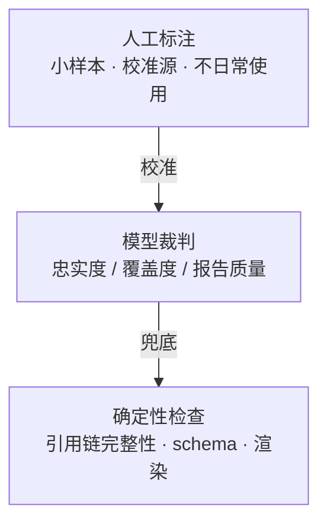

# 深度研究智能体评测设计文档

- **版本**:v1.0(草案)
- **日期**:2026-07-12
- **状态**:待评审
- **适用项目**:Prospector v2(多智能体深度研究系统)
- **上游文档**:`docs/design.md`(下称"设计文档");本文档细化其 §9.2 离线评估,评测指标兑现 NFR-2 / NFR-6

---

## 1. 目标与问题

### 1.1 评测回答的唯一问题

**改动(提示词、模型、编排逻辑)之后,系统是变好了还是变坏了。** 评测的核心不是给单份报告打分,而是让两个系统版本在同一输入上**可比较**,且比较结果**可信**。一切设计从"可比较"与"可信"两个词展开。

### 1.2 三个根本困难

| 困难 | 表现 | 对应解法 |
|------|------|----------|
| 输出没有标准答案 | 报告是长文本,同一题存在多种"都算好"的写法,无法与参考答案比对 | 判定金字塔(§2) |
| 世界在变 | 网页会更新、消失;两次运行检索结果不同,指标波动无法归因到改动 | 录制-回放(§4) |
| 系统自带裁判 | NFR-2 的"Claim 验证通过率"由系统自己的 Claim Verifier 判出;Verifier 变松则指标虚高 | 裁判与选手分离(§2.2) |

---

## 2. 设计原则

### 2.1 评测不另起炉灶

系统为可审计性已将全流程输入输出序列化(NFR-6):Brief、Plan 版本、Excerpt、Claim、Verdict、usage、trace 全部落库。评测**不新增任何观测点**——评测 = 固定输入 + 回放 + 打分器读同一批表。生产写什么,评测读什么。系统为可审计付过的成本,评测直接复用。

### 2.2 裁判与选手分离

**任何出现在被测系统内部的判断,都不能直接当评测真值。** Claim Verifier 是系统组件(选手),忠实度真值必须来自人工标注的 (claim, excerpt, relation) 集合;Verifier 相对该集合的一致率是它自己的成绩单。NFR-2 的 ≥ 95% 以人工标注为度量基准,而非系统自评。同一纪律套用于评测自身的模型裁判(§5)。

### 2.3 判定金字塔

把"报告好不好"分解为正交维度,每个维度交给**能可靠判定它的最低成本裁判**;信任自上而下传递——人校准模型,模型覆盖规模,机器兜住底线:



- **机器可判的绝不用模型判**:权威引用链 Claim → ClaimEvidence → Excerpt → Document version 每一跳是外键,代码即可校验;computed 型的平行链 Claim → ClaimComputation → Computation → input_bindings → Excerpt(设计文档 §4.10/§4.11)同为外键链,复现检查亦是确定性代码。该层是 bug 指标而非质量指标——必须 100%。
- **模型判可判的**:claim 与 Excerpt 原文相符性、must_cover 命中、报告整体质量等语义判断。
- **人工只做校准**:定期抽样测模型裁判与人的一致率;达标则裁判有大规模打分资格,不达标先修裁判。

---

## 3. 四个评测面

| 评测面 | 对象 | 回答的问题 | 标注成本 |
|--------|------|------------|----------|
| A. 端到端套件 | 全流程(题目 → 报告) | 整体变好还是变坏 | 题目级预标注 |
| B. 判定点单测 | 系统内每个 LLM 软判断点 | 哪个组件退化了(归因) | golden set,一次性 |
| C. 元评测 | 评测自身的模型裁判 | 裁判判得准不准 | 人工校准集 |
| D. 过程诊断 | trace / usage 聚合指标 | 退化的线索在哪 | 零 |

### 3.1 A:端到端套件

固定题库回放模式跑全流程(§4),产出报告后依 §6 打分。LLM 采样随机性用统计对付:每题跑 k 次(默认 3),指标报分布、门禁看中位数。

### 3.2 B:判定点单测

系统的每个 LLM 软判断点输入输出天然可序列化,各建独立 golden set:

| 判定点 | golden set 形态 | 指标 |
|--------|----------------|------|
| Scope Agent | 固定模糊问题集,人工标注 Brief 要点(must_cover 及优先级、范围边界、来源要求) | 生成 Brief 与标注要点的一致率 |
| Claim Verifier(evidence 型) | 人工标注的 (claim, excerpt, relation) 对,含刻意构造的"似是而非"负例 | 与人工标注一致率 |
| Claim Verifier(derived 型) | 人工标注推理链:合理 / 过度延伸(overreach)/ 校准失当(miscalibrated)——设计文档 §12.4 承认的最弱环节 | 一致率,按失败形态分列 |
| Claim Verifier(computed 型) | 固定 (claim, computation) 对,含数值转述正确但口径夸大的负例 | 复现检查为确定性代码,无需 golden set;口径忠实判定与人工标注一致率 |
| Verifier 矛盾处置 | 预埋冲突的 excerpt 对,人工标注 decision(并陈/裁决及胜方)——设计文档 §12.1 点名的观察对象 | ConflictResolution 与人工标注一致率 |
| Coverage 检查 | 预标注 must_cover 的题 + 固定证据集 | required / optional 判定准确率 |
| No-new-facts 审计 | 人工标注"含 claim 集合外事实"的叙述段落 | 查全率 / 查准率 |
| Worker 行为 | `research_mode × source_policy` 代表性组合(D8 确立的评估锚点) | 组合级证据质量与完成率 |

注意:端到端套件从冻结 Brief 起跑(§4.3),Scope Agent 不再被 E2E 覆盖——其质量由本表首行单独承接,这是用确定性换来的显式补偿。

E2E 指标回归时,先看本层哪个单测变红——组件单测负责把"整体变差"归因到具体判定点,避免从报告反推。

### 3.3 C:元评测

见 §5。

### 3.4 D:过程诊断指标

从已有 trace 与业务表直接聚合,零标注、不设门禁,仅作归因线索:replan 轮次分布、claim 验证驳回率(设计文档 §12.2 点名的抽取质量代理指标)、derived claim 深度分布、预算水位触发频率、各工具失败率、composition_audit 补录比例。

---

## 4. 录制-回放:冻结世界

### 4.1 机制

评测适配层拦截 worker 的全部工具调用(`web_search` / `web_fetch` / `kb_list` / `kb_structure` / `kb_read` / 沙箱计算的外部输入),以"磁带"(cassette)持久化:

- **录制模式**:工具真实出网,请求与响应按 `(tool, 规范化参数哈希)` 落磁带;
- **回放模式**:工具调用从磁带查表返回,不出网。两个系统版本面对完全相同的世界,指标差异只能来自改动本身。

这是设计文档 Document 快照哲学("引用必须指回纳入当时的快照")向整个工具层的推广。

### 4.2 两条纪律

1. **磁带未命中显式失败**,不静默放行真实检索。agent 搜了磁带没有的词即行为漂移,评测应暴露而非掩盖;漂移合理时(如提示词刻意改变检索策略)重录磁带并升级 `cassette_version`。
2. **磁带随题库版本化**:磁带是题目的一部分,`(eval_set_version, cassette_version)` 绑定;换磁带的运行结果不与旧磁带基线直接比较。

### 4.3 评测入口与环境隔离

- 评测任务经 brief-direct 模式(设计文档 §5.1)提交题库中的冻结 Brief,不经过 Scope 与 HITL。这不是绕过确认,而是合同由题库直接提供——确认环节在该场景下没有对象。
- 录制与回放是**评测专属部署的环境配置**:评测适配层在该部署中包裹工具层,生产 API 不存在任何 replay 开关或请求参数。安全边界由"生产环境不存在该能力"保证,而非权限管控。

---

## 5. 模型裁判的可信度

LLM-as-judge 有三个已知病:绝对分数漂移、位置偏差、长度偏差。对策:

1. **成对比较代替绝对分**:报告质量不打分,将候选版本与基线版本报告并排比较,统计 win-rate。"A 和 B 谁好"远比"A 打几分"稳定。
2. **位置交换双评**:每对比较两次(AB / BA),不一致判平,消位置偏差。
3. **裁判持证上岗**:每个模型裁判绑定人工标注校准集与一致率阈值;裁判提示词或底层模型升级必须先过校准——与设计文档"GenAI 语义约定升级必须经过字段映射测试"同一纪律。

忠实度与覆盖度裁判判的是相对客观的语义比对,校准达标后可用绝对判定;整体质量裁判永远只出 win-rate。

---

## 6. 指标与门禁

指标分两档,门禁刻意少——门禁只挂"正确性优先"(设计目标 1)与钱:

| 档 | 指标 | 真值来源 | 语义 |
|----|------|----------|------|
| 门禁 | claim 忠实率 ≥ 95%(NFR-2) | 人工标注集校准过的忠实度裁判 | 挡发布 |
| 门禁 | 引用链与 figure 绑定机器校验 = 100%(FigureSpec 绑定 claim 全部 pass、spec 无字面数值字段,设计文档 §5.5) | 确定性代码 | bug 指标,挡发布 |
| 门禁 | required 覆盖命中率不回归 | 题目预标注 + 覆盖裁判 | 挡发布 |
| 门禁 | 每分质量 token 成本不超预算 | usage 表 | 挡发布 |
| 观察 | 报告 win-rate vs 基线 | 成对比较裁判 | 看趋势 |
| 观察 | optional 覆盖、组件单测一致率、全部过程诊断指标 | 各 golden set / trace | 看趋势与归因 |

主观性最强的报告质量刻意不入门禁:其裁判可信度低于忠实度层,入门禁会产生误杀。

---

## 7. 题库

### 7.1 分层与规模

沿用设计文档 §9.2:按问题类型分层(事实核查 / 对比 / 综述 / 深度研究),每类 ≥ 30 题,全流程可回放;评估子集覆盖 `research_mode × source_policy` 代表性组合,防止单组合退化被总体指标掩盖。

每道题的组成为**问题 + 冻结 Brief + 预标注 + 磁带**:Brief 由 Scope Agent 生成初稿、人工审定后冻结,随 `eval_set_version` 版本化,与磁带同一纪律;must_cover 预标注锚定该冻结 Brief,不受 Scope 重新生成的方差影响。

### 7.2 防污染

自建题库包含发布日期晚于题目构造日期的"时效题",对抗搜索时污染(答案已被收录进可检索网页导致指标虚高)。回放模式使污染只可能发生在录制时刻,重录磁带时需重新审查。

### 7.3 私库题

固定一套私有知识库语料,预标注 ground truth Excerpt 位置(文档 + 页码/行号),专测 PageIndex 三原语路径的召回——设计文档 §12.7 跨文档漏检风险唯一的量化手段。

### 7.4 陷阱题

深研系统最贵的失败在边界行为,题库主动超采样三类:

| 陷阱 | 测什么 | 对应失败模式 |
|------|--------|--------------|
| 冲突题:预埋来源互相打架 | 诚实并陈 vs 静默择一;ConflictResolution(设计文档 §4.12)使判分部分机器化——预埋冲突必须存在覆盖它的处置记录 | 设计文档 §8"结果冲突" |
| 无解题:答案不存在 | 承认"未查到" vs 编造 | 幻觉的终极测试 |
| 过度推理诱导题:证据仅支持弱结论 | derived 深度纪律与校准语言 | 设计文档 §12.4 推理审查 |

---

## 8. 结果模型与运行流程

### 8.1 eval_run(append-only)

每次评测落一行,与 verifier_run 同一版本化模式——评测历史本身可审计,基线曲线由本表直接绘出:

```json
{
  "eval_run_id": "er_042",
  "eval_set_version": "es_v3",
  "cassette_version": "cas_v3.1",
  "system_version": "git:abc1234",
  "k_runs": 3,
  "metrics": { "claim_faithfulness": 0.962, "citation_chain_valid": 1.0, "required_coverage": 0.91, "win_rate_vs_baseline": 0.58, "cost_per_quality": "..." },
  "gate_result": "pass | fail",
  "created_at": "..."
}
```

### 8.2 一道题的完整旅程

```text
建题(一次性)   题目 + Scope 生成 Brief 初稿 → 人工审定冻结 + 预标注 must_cover(required/optional);私库题另标 ground truth Excerpt
录制(一次性)   真实跑全流程 → 工具 I/O 落磁带;产生的 (claim, excerpt) 对送人工标注入忠实度真值集
回归(每次改动) 回放跑 k 次 → 引用链机器校验 → 忠实度/覆盖度裁判 → 报告成对比较
               → 组件 golden set 单测 → 过程指标聚合 → 写入 eval_run
判决           4 门禁看中位数,过则放行;观察指标进看板
维护(周期性)   抽样校准模型裁判;research_mode 枚举扩展时补题;题库改版时重录磁带
```

---

## 9. 与里程碑的衔接

评测能力随设计文档 §11 里程碑渐进落地,不要求一次建成:

| 阶段 | 评测侧交付 |
|------|-----------|
| M1/S1 | 引用链机器校验(随最小验证闭环与确定性渲染同批落地,即 M1/S1 检查点的度量手段);brief-direct 提交入口(设计文档 §5.1,与 Brief 冻结同批交付——开发期免 HITL 重跑与本评测共用同一入口);工具适配层预留录制钩子 |
| M1/S4 | Claim Verifier / no-new-facts 审计 golden set 首版(利用 S1–S2 产生的真实 claim 对启动人工标注;刻意小规模,数十条 claim 级,只求基线数字、不求题型覆盖);Verifier 一致率基线测量(记录数字,暂不设门槛) |
| M3 | 题库首版(每类 ≥ 10 题,经 M1 已交付的 brief-direct 入口提交) + 磁带 + eval_run 表 + 门禁接入回归流程 + 评估看板(即设计文档 M3 验收物);忠实率门禁自此以人工真值集度量;本里程碑是 M4 多用户运行时的前置门 |
| 持续轨道(M1/S4 起并行) | 题库扩至每类 ≥ 30;裁判校准例行化;陷阱题与私库题扩充;win-rate 基线滚动更新;NFR-2 的 ≥ 95% 转为正式发布门禁 |

---

## 10. 风险与开放问题

1. **人工标注的规模瓶颈**:忠实度真值集与各 golden set 依赖人工,首版规模有限(每判定点数百对级)。缓解:标注集从真实评测运行的产物中抽取(而非凭空构造),边运行边积累;优先覆盖门禁指标依赖的忠实度集。
2. **磁带的维护成本**:题库或检索策略大改即需重录,时效题尤其频繁。缓解:磁带按题隔离,支持单题重录;把重录纳入题库改版流程而非临时操作。
3. **回放对 agent 行为的扭曲**:回放模式下工具延迟与失败分布和真实世界不同,可能掩盖超时/重试路径的回归。缓解:磁带保留录制时的延迟与错误响应并按需重放;基础设施类回归(设计文档 §9.1.7、M4 多用户运行时验收)由独立的运行时测试承担,不混入本评测。
4. **成对比较的基线漂移**:win-rate 永远相对基线,基线版本更替后历史 win-rate 不可直接比较。缓解:基线更替视为评测大版本事件,记录于 eval_run,看板分段展示。
5. **k=3 的统计功效**:小差异在 k=3 下不显著,可能漏检缓慢退化。缓解:门禁指标看趋势窗口(连续多个 eval_run 的滑动中位数),而非单次运行;必要时对可疑改动临时提高 k。
