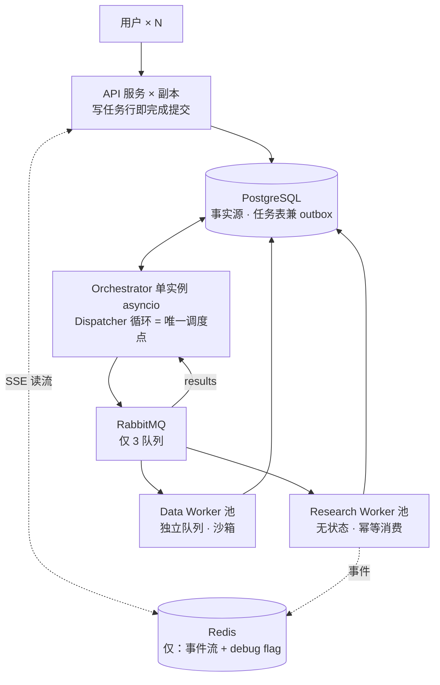

# 运行时架构：多用户多任务

> **状态：设计草案，尚未实现。** RabbitMQ、Redis、三进程拆分、Dispatcher 单写者循环、
> SSE 跨副本回放在当前代码中均无对应实现。当前运行时是单进程 FastAPI + PG 事件 SSE。
> 本文从设计文档 §13 抽出，保留为演进方向记录。

- **归属里程碑**：M4
- **原位置**：[设计文档](../design.md) §13
- **前提**：§1–§9 的研究控制流不受本章影响——一个 job 内部仍是 Scope → Planner 决策环 / Plan
  → 搜集 → 验证 → 成文（写作 + 逐句验证）→ 渲染的流水线。本章只回答"很多个这样的 job
  如何在共享基础设施上并发运行"。运行时与研究逻辑正交，是分层正确的证明。

---

## 1. 目标场景

1. **多用户并发**：多成员共用部署，高峰期数十个用户各自提交任务；单任务 fan-out 出 4–8 个 worker 子任务，系统真实并发单位是几十到上百个 ResearchTask。LLM 与搜索 API 配额是全局共享稀缺资源。
2. **提交-离开-回来**：任务跑 5–30 分钟，用户关页面、换设备是常态。任务生命周期与 HTTP 连接解耦；SSE 断线带 Last-Event-ID 重连回放；任意 API 副本可服务任意任务的进度流。
3. **异构负载混跑**：快速核查（单 worker、分钟内）与深研（15 倍 token）混跑，大任务的 fan-out 不得饿死小任务。
4. **运维现实**：滚动发布不杀在跑任务；worker 池按队列深度扩缩容；突发提交被削峰；per-user token 用量可计量。

## 2. 核心原则

**单写者（single-writer）：所有调度决策收敛到一个 Dispatcher 循环**（理由与否决方案见 D9）。三条铁律：

1. **PostgreSQL 是唯一事实源**——消息只携带 task_id，负载永远在库里；
2. **Redis 随时可丢**——事件可从 PG 重建，debug flag 可安全丢弃；丢失只降低实时性或诊断能力，不丢正确性；
3. **RabbitMQ 是 at-least-once**——所有消费者必须幂等（§13.4，v2.2 数据模型使此近乎免费）。

## 3. 架构与进程

三类进程：

| 进程 | 实例数 | 职责 |
|------|--------|------|
| API 服务 | N 副本 | 提交（写 task 行即返回）、SSE 推送（读 Redis Stream）、查询 |
| Orchestrator | 1 实例 | 每 job 一个 asyncio 协程跑 LangGraph；内含 Dispatcher 循环；claim 验证在进程内 asyncio 并发 |
| Worker 池 | 各自水平扩缩 | Research 池订阅 `tasks.research`；Data 池订阅 `tasks.data`（D8 安全边界的运行时兑现：沙箱池物理上拿不到研究 worker 的凭证与工具权限） |

三条队列：`tasks.research`、`tasks.data`、`results`。消费参数：prefetch=1 + 手动 ack（长活重任务，预取无意义）+ publisher confirms。**没有**优先级队列、TTL 重试队列、DLX 拓扑——它们的职责由更简单的机制承担（§13.4），重新引入的触发条件见 §13.6。

## 4. 七个关键机制

**任务表即 outbox**。API 提交只写 task 行（status=ready）并返回——落库与投递的双写问题不存在，因为 API 根本不投递。Dispatcher 从 PG 捞 ready 任务 → 投递 → 标记 dispatched；派发后超时未开始的任务自动重新捞起（worker 幂等，重投无害）。这是 outbox 模式的本质（事务性落库 + 异步中继），不需要额外的表和 relay 进程；用 PG LISTEN/NOTIFY 唤醒 Dispatcher 可消除轮询延迟，仍零新组件。task 每次因初次创建、replan 或重试进入 ready 时，任务表的投递元数据列都在同一事务中更新为当前 `traceparent` 与可选 `tracestate`，供 Dispatcher 为本次派发建立 span link；这些字段不进入 ResearchTask 领域 schema，也不参与业务幂等摘要。

**幂等消费是 v2.2 数据模型的红利**。at-least-once 意味着任务可能被重复执行（ack 前崩溃 → 重投，而前次副作用可能已部分落库）。证据侧全部 append-only + 内容哈希：Document 重抓同 hash 幂等、Excerpt 重抽去重、Computation 按 `code_hash` + 输入集合去重（重复执行幂等，§4.10）、Verdict 重验追加新行取最新 run。唯一新增：task 状态机的 CAS 收尾（`running → done` 带条件更新，防双消费者同时收尾）。

**调度与公平全部内聚于 Dispatcher**。出队排序：interactive 类任务优先；准入控制：per-user 并发上限（直接 count PG 中该用户 running 任务）与全局深研任务并发上限。无信号量、无分布式锁、无优先级队列——单写者使它们不必存在。

**限额执行**。§7 无 Worker/Job 工具总帽、无 Job 墙钟硬停：每 Worker 自守 `max_worker_rounds`，单轮最多并行 8 个工具调用；编排侧共享 Planner 决策轮与按 effort 注入的批次并发上限。token 与累计 tool_calls 写入 PG usage，**不**驱动停研究。

**SSE 跨副本**。事件双写：Redis Stream（`events:{job_id}`，任意 API 副本 XREAD 实时推送）+ PG 事件表（归档）。断线重连带 Last-Event-ID：Stream 内先回放，超出 Stream 保留窗口则从 PG 补。

**按 job 增强诊断**。Redis `debug:job:{job_id}` 是必须带 TTL 的临时开关，同时启用该 job 的 DEBUG 日志、完整 trace 保留与负载指针捕获。负载写入 Workspace 隔离的对象存储诊断前缀，日志和 span 只保存 `payload_ref`；开关丢失或到期即停止增强诊断，不回写 PG，也不影响任务推进。

**重试与失败出口**：重试即 task 行的 attempt 计数（Dispatcher 重新派发，退避间隔计算在行上），attempt 耗尽 → failed → 复用 §5.3 的软覆盖 / 重大缺口分流。毒消息的出口就是已有的缺口语义，无新机制。

## 5. 分布式失败矩阵

| 故障 | 兜底 |
|------|------|
| worker 进程崩溃 | 消息未 ack 自动重投；幂等消费吸收半途副作用 |
| Orchestrator 崩溃 | 进程管理器拉起 → 全部 in-flight job 从 checkpoint 恢复（D7）；恢复窗口内新任务在 PG 排队 |
| Redis 整体丢失 | SSE 从 PG 事件表回放；debug 自动关闭；研究限制与任务推进不受影响 |
| RabbitMQ 不可用 | 任务表天然是缓冲区，Dispatcher 恢复后续投；worker 侧连接重试 |
| 任务反复失败（毒任务） | attempt 上限 → failed → §5.3 缺口分流 |

所有不可丢的业务事实与计量事实都回落到 PG；debug flag 直接安全丢弃——这才是"唯一事实源"的含义。

## 6. 演化路径（按触发条件守门）

被本设计刻意排除的机制不是被否定，而是各自绑定了重新引入的触发条件：

| 触发条件 | 引入 |
|----------|------|
| 单实例 Orchestrator 承载不了并发 job 数（数千级） | LangGraph interrupt-resume 事件驱动 + Orchestrator 多实例（届时才需要分布式锁） |
| 交互式任务延迟 SLO 被深研持续压垮且准入控制调参无效 | 按量级拆分 `tasks.research.interactive` / `.deep` 队列 |
| claim 验证成为吞吐瓶颈 | 独立 `tasks.claims` 队列跨池分片 |
| 需要研究过程全量事件溯源与回放分析 | Kafka 承载事件日志（D9） |
| MQ 运维成本超出收益 | 降级回 PG SKIP LOCKED 队列（D9） |

这与 D8（删固定角色）、v2.2（删冗余字段）是同一动作：为想象中的需求预付的复杂度，退回到由触发条件守门。

