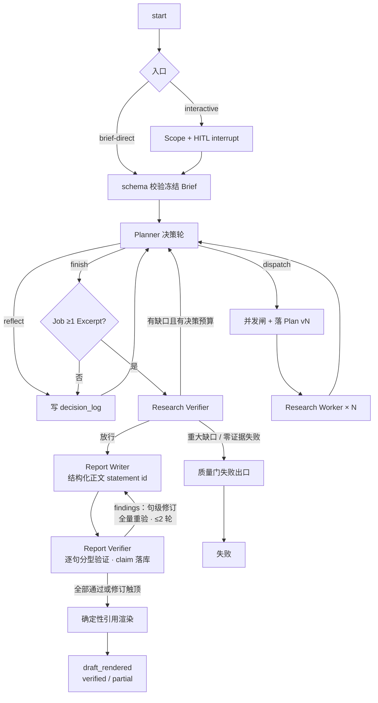

# M1 深研智能体核心 + CLI — 实现设计

- **版本**：2.0
- **状态**：已实现。研究主图从冻结 Brief 跑到终态 `draft_rendered`，产出 `verified` 或 `partial` 的 Markdown/JSON；API + CLI 闭环已接通。变更史见 git log。
- **依据**：[设计文档](../design.md)（§3–§5、§7、D7/D8/D12、§11）、[路线图](./roadmap.md) §4、[CLI 文档](../cli.md)、[M0 实现设计](./m0.md)
- **读者**：实现 M1 的工程师。本文把「功能完整的单机深研系统」落到**目录、模块边界、数据模型、主图、工具与编排合同、工程推进顺序、验收与明确不做**。

---

## 0. 分阶段实现记录

本节只记录 M1 的实际工程推进状态。M1 的验收出口仍是 §12 的完整主图，不把阶段记录解释为可独立交付的裁剪产品。

### 0.1 Brief 生成（已完成）

- `ResearchBrief` 已收敛为 `question / brief_text / output_format / language / effort`；Brief 是用户确认后的研究输入快照，不承载任务清单或执行预算。
- Scope 先判断是否必须澄清，最多向用户提一个问题；有回答后直接生成 Brief，没有必要澄清时直接生成 Brief。
- 本地 `prospector-local ask` 已实现 `c/e/i/q`：原样确认、YAML 编辑、按一条指令修订一轮并定稿、放弃。
- 确认后的 Brief 写入 `app.briefs` 并关联 `app.jobs.brief_id`，同事务写入 `brief.confirmed` 事件；冻结后由 Planner 只读使用。
- 已完成对应 schema、Scope 与 HITL 单元测试；当前交互入口在进程内完成确认，产品 API 的 brief-direct 与 LangGraph interrupt/resume 仍属于后续 M1 工作。

### 0.2 Planner-Worker（已完成）

- 冻结 Brief 已接入唯一研究图：初始化后进入 Planner，Planner 每轮强制选择 `dispatch / reflect / finish`，全量 prompt、原始输出、结构化决策与拒绝反馈写入 `decision_log`。
- Planner 已按 `scout / deep_dive / verify` 三阶段派发；同一批次只能属于一个阶段。任务显式声明 `subjects`：`scout` 可处理最多 6 个有界候选，`deep_dive` 与 `verify` 必须恰好一个对象。
- 运行时根据 `effort + research_stage` 注入 `max_worker_rounds`，并按阶段执行并发上限；Worker 工具调用总数不设上限，单轮最多并行 8 个独立调用。
- 通用 Worker 每轮通过严格 JSON Schema 输出唯一 `search / save / finish` 动作；运行时执行 `web_search → web_fetch → save_findings`。`web_fetch` 将全文快照写入对象存储，将 Exa highlights 写入任务级 DocumentView；`save_findings` 只接受该视图真实存在的 `hN`，并原子写入 Excerpt 与 Assertion。
- 每次成功落证后，运行时以任务全部已落库断言独立检查 `expected_evidence`；满足时立即收工，否则只把明确缺口回注下一轮。主动收工必须选择 `finish` 动作，运行时记录 `finish_reason`、轮次、工具调用计数与断言摘要。
- 同轮 Worker 并发、任务隔离、恢复幂等、严格动作格式、失败工具调用、轮次耗尽、落证后覆盖判断和事件时间线已有单元/集成测试。数据库迁移已增加 `document_views`、`tasks.subjects`，并将 `gap_note` 重命名为 `finish_reason`。
- `ask` 在 Brief 确认后直接跟随 PG 事件账本；`job events <job_id> --follow` 可回放同一条人类可读时间线。Planner `finish` 或有证据时决策轮耗尽都会进入 Research Verifier；重大缺口且仍有轮次时 Replan，放行后进入 Report Writer。

### 0.3 Research Verifier（已完成）

- `VerifierDecision` / `VerifierLlmDecision` schema 已落地：`release_decision`（pass / needs_research）、`decision_reason`、`brief_alignment`、`coverage_rationale`、`brief_alignment_rationale`、`credibility_rationale`、`gaps`（VerifierGap）、`conflict_judgements`→`conflict_resolutions` 与 `assertion_dispositions`（AssertionDisposition）。Pydantic 模型校验强制 pass 不含 major 缺口、needs_research 至少一个 major 缺口、misaligned 必须有 major brief_alignment 缺口；`source_credibility` 缺口必须引用 `related_assertion_ids` 且同轮将这些断言标为 `unusable`。
- `ConflictResolution` schema 支持 `present_both` / `adjudicated` 两种终态；模型只点 `assertion_id`，代码绑定 `excerpt_ids`；`conflict_key` 由 excerpt_ids 排序哈希生成，幂等去重。
- `AssertionDisposition`：`unusable` / `restored`，按 verifier_run 版本化；有效资格 last-write-wins；`list_assertions(..., usable_only=True)` 与 snapshot 的 `effective_unusable_assertion_ids` 供覆盖判断与后续成文投影。
- `validate_verifier_references` 在 verifier run 完成时确定性校验全部 gap、conflict 与 disposition 引用的 task / assertion / excerpt ID 是否属于当前 Job。
- Research Verifier LLM 适配器（`OpenAIResearchVerifier`）使用强模型流式输出，失败时以中档模型做 JSON 修复回退；`VerifierModel` Protocol 支持测试替换。
- Prompt 构造（`research_verifier_messages`）将完整快照序列化为 JSON，系统提示明确四项核验职责、废证规则、来源可信度规则和 ID 引用约束。
- 主图（`research_graph.py`）已集成 verifier 节点：Planner `finish`（有证据时）和决策轮耗尽都会进入 Verifier；Verifier `pass` 进入 `composition_pending`；有重大缺口且仍有决策预算时 Replan（major gaps + `unusable_assertions` 注入 Planner 消息线程）；决策轮耗尽则抛出 `VerifierMajorGapError`。
- `verifier_runs` 表持久化：`begin_verifier_run` → `complete_verifier_run`；幂等重放（同 job + plan_version 不重复创建）；全量 prompt 随 run 落库。
- `conflict_resolutions` / `assertion_dispositions` 表按 verifier_run_id 落库。
- `build_verifier_snapshot` 从库中重建 Brief、Plan 版本历史、Task、Assertion、Excerpt（含来源元数据）、prior/effective 废证与 Planner finish reason，作为 Verifier 的唯一输入。
- 事件时间线已覆盖 `verifier.completed`（run_id、放行结论、极短理由、major/minor/conflict/废证计数、重大缺口摘要、冲突摘要与废证摘要）和 `replan.triggered`（verifier_run_id + 新 plan_version）。
- CLI `ask` 已处理 `VerifierMajorGapError`；`job events --follow` 可回放含 Verifier 进入/通过/缺口树/废证/放行的完整时间线。
- 已完成 Verifier 单元测试（schema 校验、引用校验、ConflictResolution / Disposition 约束）和集成测试（Replan 回路、废证过滤、预算耗尽失败）。
- Report Writer 草稿链与 Report Verifier 已接入后续成文回路，详见 §0.4–§0.5。

### 0.4 Report Writer（已完成）

- Writer 输入为冻结 Brief、Plan 历史摘要、全部 usable Assertion 的轻量证据卡、ConflictResolution 与 minor gap；证据卡只含 Excerpt ID 和 Document 来源元数据，不含 Excerpt 原文。
- 强模型在一次调用内输出 `introduction`、自由组织的 section → paragraph → statement 正文及 `conclusion`；prompt 要求全文有清晰主线、各章承担明确且不同的论证作用、每段围绕一个中心展开，并综合竞争解释、反例、机制、边界与局限，但不规定统一章节模板、段落数量或字符下限。
- 确定性 Writer 校验只拦截候选 Excerpt 越界；present_both / adjudicated 的语义履约由 Writer 负责并交给 Report Verifier 核对，不以固定句序或物理相邻代替语义判断。
- 草稿、revision 与 statement 已落库；初稿生成后进入 Report Verifier。Verifier 返回失败项时，Writer 只替换明确失败的 statement，其他句子及稳定 `statement_id` 保持不变。

### 0.5 Report Verifier（已完成）

- `ReportVerifierSnapshot` 以当前 revision 的结构化正文为核验对象；每条输入带稳定 `statement_id`、句子性质、候选 Excerpt 原文、前提句与前提深度，成文期不新增搜索或证据。
- 中档模型按 statement 独立分型验证：`evidence` 对全部候选 Excerpt 标注 `support / contradict / partial` 并给出 verdict；`derived` 检查推理与前提风险；`elaboration / limitation` 检查是否夹带事实。单轮最多并发 8 个调用，并按前提依赖分波执行。
- Evidence 输入先把 UUID 映射为 `E1 / E2 / ...` 短代码，模型输出后再还原；schema、statement id、kind 和候选 Excerpt 全覆盖均由代码校验。结构错误只进行一次中档模型 JSON 修复，仍不合法时以 `report_verifier_contract_error` 结束 Job。
- `report_verifier_runs` 按 `(report_id, revision, round)` 幂等持久化 dirty statement 集、findings 与逐句判定；判定同步写入 `claims`、`claim_evidence`、`claim_premises`、`claim_verdicts`，其中 Claim 由 Report Verifier 从正文反向生成并锚定 `statement_id`。
- 初稿 revision 1 全量核验；存在失败项时，Report Writer 只接收失败句与允许使用的既有 Excerpt，生成句级 patch 后形成新 revision。最多允许两次修订，因此最多核验 revision 1–3；主图对每个新 revision 全量重验。
- 全部句子通过时进入 `verified`；修订次数用尽仍有失败句时也结束修订并进入渲染，产物标为 `partial`，保留失败句原文且不给这些句子附已验证引用角标。
- 确定性渲染只从最新完成 verifier run 中状态为 `pass` 且关系为 `support` 的 ClaimEvidence 生成引用，输出 Markdown/JSON 到对象存储；JSON 同时记录 `verification_status`、`failed_statement_ids` 与引用到 Excerpt 的映射。
- 主图已形成 `writer → report_verifier → writer（最多两次修订）/ render → END` 回路，恢复时复用已生成 revision 与已完成 verifier run。渲染后 Report 与 Job 记录为 `draft_rendered`，这是成文链的终态。
- 已覆盖 Report Verifier 分型判定、前提波次、短 ID 编解码、结构修复、句级 patch、持久化与主图端到端测试，并保留真实模型 replay/live 测试。

---

## 1. 目标与演示口径

**目标**：一次交付功能完整的单机深研系统——从提问到带引用报告的**完整**研究控制流（设计 §3.1），含并行广度、受控回路、矛盾/推理/正文逐句验证，并配齐日常可用 CLI。其后里程碑只做扩展（M2）、度量（M3）、规模化（M4），**不再回头改研究主流程**。

**演示口径**：

> 在 CLI 里提一个需要多侧面调研的真实问题 → 并行 worker → 预埋缺口可见自动补搜 → 预算触顶不绕过 Research Verifier → 来源打架时并陈或落库裁决 → 「查到的」与「推出来的」呈现可区分 → 报告逐句展示验证状态，通过句可点开引用且权威链机器可校验。全程：`ask` 提交 → `attach` 跟踪 → 查看/导出报告。

**整体性原则（本里程碑硬约束）**：

1. **没有「单 worker 产品形态」**。主图从第一天就按「决策环 + 并发闸 + Worker × N」设计；`effort` 映射的并发上限与决策轮上限始终生效。简单问题可以由 Planner **自然**只派 1 个 task，那是行为结果，不是架构裁剪。
2. **没有「未经逐句检查的报告出口」**。正文每句都经过 Report Verifier；通过句生成可追溯引用，修订触顶后仍失败的句子保留在 `partial` 产物中且不生成已验证引用角标。Document 快照与 Excerpt 血缘从首次检索起强制。
3. **验收只认里程碑出口**（§12）。周内可用 mock/桩加速开发，但合并主干的目标始终是完整图，不为中间演示永久短路 Verifier / 并行 / 质量门。
4. M1 验收只用机器可判与行为性判据；昂贵评测与定量门槛留给 M3。

---

## 2. 范围总览

### 2.1 必达（同一里程碑）

| # | 交付物 |
|---|--------|
| 1 | Research Brief 输入快照冻结：interactive HITL + brief-direct（同一主图） |
| 2 | Planner 决策环：强制 `dispatch` / `reflect` / `finish`；持久消息线程（随 checkpoint 序列化，准入封闭）；决策日志（含格式错误反馈 + 每轮全量 prompt）；版本化 Plan |
| 3 | 并行通用 Research Worker（字段专门化）+ 运行时注入 `task.budget` + 并发硬闸 |
| 4 | 联网工具 D12：`web_search` / `web_fetch` / `save_findings`（统一 Exa highlights） |
| 5 | Evidence Store：Document 快照 + Excerpt + 简化 Assertion；内容哈希去重 |
| 6 | Research Verifier：软覆盖 / 缺口 / 矛盾 → Replan 或放行；ConflictResolution |
| 7 | Research Verifier 出口：可放行则进入成文，重大缺口或零证据则失败；预算只停止继续研究 |
| 8 | Report Writer 结构化正文（statement id）→ Report Verifier 逐句验证（**evidence + derived**）→ 句级修订环（≤2 轮，每个 revision 全量重验）→ `verified` / `partial` 确定性引用渲染 |
| 9 | 业务事件 + 单进程 SSE；usage 表；root/task/tool span |
| 10 | CLI 闭环：`ask` → `attach`（含 TUI 或 plain）→ 查看/导出报告 |

### 2.2 明确不做（防膨胀）

| 项 | 归属 |
|----|------|
| Data Worker / Computation / FigureSpec 图表渲染 | M2 |
| PageIndex / `kb_*` / CLI `kb` | M2（允许低成本 spike，不进验收） |
| Redis / RabbitMQ / 三进程 / SSE 跨副本 | M4 |
| 题库跑批、LLM-as-judge、eval_run 门禁 | M3 |
| FR-11 `followup` | P2，后置 |
| 完整 pause/resume 产品化（可留钩子） | FR-9 P1，可后置 |
| 已废止的分层 Brief / 前哨校准 / `must_cover` 硬清单 | **D11，禁止实现** |
| Prospector 模型生成的摘要当 Excerpt；Worker 读整页全文 | **D12 硬禁止** |
| Job 总工具帽 / Job 墙钟硬停 | §7 已废弃 |
| 「单 worker 专用图」或「跳过 Verifier 的成文捷径」作为合并主干 | **本里程碑禁止** |

### 2.3 文档职责

- [设计文档](../design.md) 定义跨里程碑架构、领域语义与决策记录。
- 本文定义 M1 的目录、数据模型、控制流、工程顺序与验收合同。
- [路线图](./roadmap.md) 只定义里程碑范围和先后关系，不重复机制细节。
- [CLI](../cli.md) 定义交互合同；[评测](../future/eval.md) 是 M3 的设计草案，尚未实现。

所有文档使用同一现行合同，不存在运行时兼容旧 Brief、旧工具或旧预算语义的分支。

---

## 3. 承接 M0 的交接面

| M0 留下 | M1 怎么接 |
|---------|-----------|
| `flow/research_graph.py` 空探针图 | 替换为**完整研究图**；PG checkpointer 常开 |
| `flow/state.py` | 扩展为可序列化 `ResearchState`（§6） |
| `store/checkpoint.py` / `object_store.py` | 复用；快照 key = `{workspace_id}/docs/{doc_id}/v{n}` |
| `app.jobs` | 扩展状态机；邻表承载 Brief/Plan/Evidence/Events |
| `obs/` | job root span + 按 `task_id`/`attempt` 的 agent/tool span |
| compose PG+MinIO | 不变；不引入 Redis/MQ |
| `runtime/entrypoints/local.py` | 保留调试；日常路径 = API + CLI |

依赖方向：

```text
schemas  ← 零业务逻辑
   ↑
store / obs / tools / deterministic
   ↑
agents
   ↑
flow
   ↑
runtime（api / cli）
```

`flow/` ↛ `runtime/`。`deterministic/` 禁止 LLM。

---

## 4. 目录与模块边界

```text
src/prospector/
├── schemas/
│   ├── brief.py              # ResearchBrief（已确认的研究输入快照）
│   ├── plan.py               # Plan + ResearchTask
│   ├── evidence.py           # Document / Excerpt / 简化 Assertion
│   ├── claims.py             # Claim（锚定 statement_id）+ ClaimEvidence
│   │                         # + ClaimVerdict + ClaimPremise + ConflictResolution
│   ├── events.py             # 业务事件（§5.1 谱系）
│   ├── decisions.py          # 三选一决策 + 决策日志行
│   └── report.py             # 结构化正文（statement id + 性质标注）+ 报告产物
│
├── store/
│   ├── repositories/         # briefs, plans, documents, excerpts,
│   │                         # assertions, claims, events, usage, decisions
│   ├── object_store.py
│   ├── checkpoint.py
│   └── jobs.py
│
├── tools/
│   ├── base.py               # 协议 + 录制/回放钩子（M3 预留）
│   ├── web_search.py
│   ├── web_fetch.py
│   └── save_findings.py      # 唯一落证入口
│
├── agents/
│   ├── llm.py
│   ├── scope.py
│   ├── planner.py
│   ├── research_worker.py
│   ├── research_verifier.py
│   ├── report_writer.py      # 结构化正文（statement id + 性质标注）
│   ├── report_verifier.py    # 逐句分型验证：evidence + derived + 衔接句核对
│   └── prompts/
│
├── deterministic/
│   ├── chain_checks.py
│   ├── citation_render.py    # 按 statement id 解析证据链渲染引用
│   ├── budget.py             # effort + stage → 并发/轮次；注入 task.budget
│   ├── gates.py
│   └── brief_freeze.py
│
├── flow/
│   ├── state.py
│   ├── research_graph.py     # 完整主图（唯一研究图）
│   └── nodes/                # 可选拆分，便于单测
│
├── runtime/
│   ├── api/                  # jobs + HITL + SSE + report
│   └── entrypoints/
│
└── cli/                      # Typer；只调 HTTP/SSE
```

---

## 5. 数据模型（`app` schema，一次建齐）

M1 开始即可按完整合同建表（允许迁移分批提交，但**不要**按「先单 task 再并行」拆两套 schema）。

| 表 | 要点 |
|----|------|
| `jobs` | status、effort、brief_id、outcome、thread_id |
| `briefs` | question、brief_text、output_format、language、effort、frozen_at；冻结后业务字段不可改 |
| `plans` | version、decision_round、trigger_verifier_run、task_ids |
| `tasks` | ResearchTask 全字段（含 `subjects`）；`max_worker_rounds` 由运行时写入；status、finish_reason |
| `documents` / `document_views` | 全文快照按 content_hash 去重；任务级视图持久化 Exa highlights 与 `hN` |
| `excerpts` | locator、excerpt_hash 去重、extracted_by |
| `assertions` | 简化可投影形态 |
| `claims` | 从最终正文提取的验证记录（`produced_by: report_verifier`，锚定 statement_id）；grounding ∈ {evidence, derived}（computed 留给 M2） |
| `claim_evidence` / `claim_verdicts` / `claim_premises` | §4.7–4.9 / §4.8；depth 上限 2 |
| `conflict_resolutions` | §4.12 |
| `assertion_dispositions` | §4.13 |
| `verifier_runs` | 极短判断理由、覆盖 rationale、gap list、放行结论 |
| `decision_log` | reflect.note、拒绝反馈、格式错误反馈、该轮完整 prompt（回放权威载体，§5.2） |
| `events` | append-only；SSE 数据源；事件谱系与载荷合同见 §5.1 |
| `reports` / `usage` | `verified` / `partial` 报告产物与计量 |

信息增益停止：连续 2 轮 `save_findings` 未新增 Excerpt/Assertion 行 → Worker 停（机器判定）。

### 5.1 事件谱系（研究过程追踪合同）

`events` 表是研究过程叙事的**主线通道**：回答「Planner 计划了什么、Worker 在解决什么、搜到了什么资料、反馈回去后 Planner 怎么想」这类追踪问题，靠的是它，而不是 stdout 日志（运维通道，禁研究正文）或 trace（可采样、非权威）。三条纪律：

1. **事件与业务写同事务提交**，append-only，事件 id 单调（SSE `Last-Event-ID` 依赖）；
2. **事件行只存 ID + 轻量业务元数据**（枚举、计数、搜索词、URL、首行摘录），正文一律引用权威表：决策正文与全量 prompt 在 `decision_log`，任务书在 `plans`/`tasks`，资料与证据在 `documents`/`excerpts`/`assertions`。渲染时间线时按 ID join，保证叙事与库账永远一致；
3. **事件量受轮次约束**：最密的 `task.tool_used` 受 Worker 决策轮与单轮并行工具调用上限约束。

| 事件 | 关键载荷 | 回答的追踪问题 |
|------|----------|----------------|
| `job.phase_changed` | phase、outcome、error_code；进入 `verifier` 时附 plan_version + trigger（planner_finish / budget_exhausted） | 整体走到哪一步 |
| `brief.confirmed` | brief_id、effort、confirm_mode（c/e/i） | 研究输入是什么 |
| `planner.decided` | decision_round、decision（dispatch/reflect/finish）；dispatch 附 plan_version + task_ids + reason 首行；reflect 附 note 首行；finish 附 reason 首行 | Planner 计划了什么、怎么想 |
| `planner.rejected` | decision_round、reason_code（over_concurrency / schema_error / empty_finish） | 这轮为何没派活、轮次为何被烧 |
| `task.started` | task_id、research_stage、research_mode、subjects、source_policy、question 首行、budget | Worker 在解决什么问题 |
| `task.tool_used` | task_id、tool_call_id、tool（web_search/web_fetch/save_findings）、query 或 URL、结果计数、doc_id、可选 error | 搜到/抓到了什么资料，工具在哪一步失败 |
| `task.evidence_saved` | task_id、assertion_ids、excerpt 计数 | 落了什么证据 |
| `task.finished` | task_id、stop_reason（expected_evidence_satisfied / worker_rounds_exhausted / no_public_evidence / low_information_gain / blocked_by_scope / tool_error）、Worker 决策轮用量、成功工具调用计数、断言总数、finish_reason 首行 | Worker 干得如何、为何收工 |
| `verifier.completed` | verifier_run_id、放行结论、极短判断理由、major/minor/conflict/废证计数；重大缺口摘要（kind/severity/description/recommended_research 首行）、冲突摘要（decision/disputed_point 首行）与废证摘要（assertion_id/reason 首行） | 质量门结果 |
| `replan.triggered` | verifier_run_id、新 plan_version | 缺口如何转化为下一轮计划 |
| `report.draft_rendered` | report_id、verification_status、Markdown/JSON 引用 | 验证后产物及其状态 |

M1 的追踪分两层，逐层下钻：默认看事件时间线（CLI `job events --follow` 渲染，见 §9.2）；深究某轮时按 `job_id + decision_round` 查 `decision_log` 的全量 prompt（逐字回放该轮 Planner 所见），按 `task_id` 查任务书与断言列表。依赖 Redis 的 per-job 限时 debug 开关及 Worker 原始轨迹捕获属于 M4，不进入 M1 实现范围。

**准入澄清**：搜索词、URL、标题、note/reason 首行属业务元数据，允许进 events 表——design §9.1.5 的内容最小化约束的是 Loki/Tempo 等第三方诊断后端，不约束 PG 业务表（后者本就持有网页全文快照）。网页正文、Excerpt 全文、prompt 全文不进 events。

---

## 6. 图状态与主流程（唯一形态）

### 6.1 `ResearchState`（可序列化）

ID、计数器、枚举、短字符串，外加 Planner 消息线程：

```text
job_id, phase, current_research_stage, brief_id, plan_version, decision_round,
decision_round_limit, stage_budgets, active_task_ids,
last_verifier_run_id, outcome, error_code,
planner_messages  # append-only 消息线程，随 checkpoint 序列化（design §5.2）
```

`planner_messages` 准入封闭：只允许决策对象、断言投影摘要 + 收工声明、拒绝/格式错误反馈、verifier gap list 与预算余额提示追加；禁止 worker 原始轨迹、联网来源视图、Document 正文、客户端句柄。规模由决策轮上限与限长摘要硬性有界。决策日志照常落库（审计与回放载体），但不再是唯一跨轮记忆。

### 6.2 主图



这就是合并主干上的**唯一**研究图。开发期可用桩替换个别节点加速，但不得另建「永久单 worker 捷径图」进主干。

### 6.3 HITL

- interactive：interrupt（或等价）停在 Brief 确认。交互合同（design §5.1 / CLI §4.3）：
  - `c` 原样确认定稿
  - `e` 直接编辑（可多次，改完回卡片）
  - `i` 一条修订指令 → Scope 改写一轮 → **直接定稿**（不再二次确认）
  - `q` 放弃
- CLI `ask` 只走 interactive；不暴露 brief-direct。
- brief-direct：HTTP 提交完整 Brief，schema 校验后冻结，**同一主图**。

---

## 7. 核心合同

### 7.1 联网工具（D12）

| 工具 | 行为 |
|------|------|
| `web_search` | Exa 元数据 only |
| `web_fetch` | 普通网页和 PDF 统一请求 Exa 全文与 `highlights.query=task.question`；全文写 Document 快照，带 `hN` 的 highlights 按 Task 持久化为 DocumentView；Prospector 不调用额外 LLM，全文不进 Worker |
| `save` / `save_findings` | 模型提交代码生成的 `source_ref`；运行时解析 `doc_id + view_id + source_ids`，内部工具按 `hN` 取持久化 highlight；Excerpt + Assertion 原子写入 |

`allowed_tools` 默认上述三者（无 `kb_*`）。

### 7.2 Worker

局部停止：满足 expected_evidence / 无公开证据 / 信息增益过低 / 被任务范围阻断 / Worker 决策轮耗尽。工具错误返回 Worker 上下文，不按连续失败批次数提前收工。
动作：每轮以 `response_format=json_schema + strict=true` 输出唯一 `WorkerAction`，只能选择 `search / save / finish` 之一；运行时生成 `tool_call_id` 并执行，不接收供应商 Function Calling 参数。
收工：选择 `finish` 并填写 `{goal_met, stop_reason, reason}`；持久化为 `finish_reason`，再附断言投影干净摘要（禁止消息轨迹）。

并行：同轮多个 task 独立上下文；单个 Worker 每轮可以并行执行多个彼此独立的工具调用，存在数据依赖的调用必须等待前一轮结果；`produced_by.task_id`、`tool_call_id` 与 span 不得串号。

### 7.3 Planner（§5.2）

三选一 schema；持久 append-only 消息线程（`planner_messages`，随 checkpoint 序列化）：前缀为系统提示 + Brief 快照，逐轮追加决策对象与运行时反馈（断言投影摘要 + 收工声明、拒绝/格式错误反馈、verifier gap、预算余额）；准入封闭（§6.1）。每轮实际发送的完整 prompt 随 `decision_log` 行落库（回放权威载体）。

硬闸：同批任务必须处于同一研究阶段；超出该阶段并发上限时整批拒绝且仍计轮；空手 finish 拒绝；Planner 决策轮耗尽且零 Excerpt → 失败不进 Verifier；畸形 task 单条失败仍计轮。
`budget` 由 `deterministic/budget.py` 按 `effort + research_stage` 注入，只包含统计每次模型动作的 `max_worker_rounds`。工具调用总数不设上限；单轮并行调用固定最多 8 个。

**standard 默认**：Planner 决策轮 12；scout 为并发 6 / Worker 21 轮，deep_dive 为并发 3 / Worker 49 轮，verify 为并发 3 / Worker 17 轮。完整映射见 §14。

### 7.4 Verifier / 质量门 / 成文

- Verifier：对照 Plan 历史检查履约、以 Brief 检查偏题，并处理结构化缺口与矛盾（ConflictResolution：present_both / adjudicated）。来源可信度直接结合 URL、Exa 可用来源元数据、Excerpt 原文和独立佐证判断，不使用来源 tier 策略表。
- Research Verifier 出口：重大缺口失败、零证据失败；可披露局限允许进入成文；无 resolution 的高优先级 contradict 可拦截。预算耗尽只停止继续研究，不自动放行。
- 成文（prose-first，设计 §5.4）：Report Writer 以 Brief 核心问题为纲产出带 statement id 的结构化正文（每句标注 evidence/derived/衔接）；Report Verifier 逐句验证——evidence 下钻 Excerpt、derived 经 ClaimPremise（depth≤2）、衔接句核对无事实内容；验证记录落库为 claim（`produced_by: report_verifier`）。
- 修订环：句级 findings 打回、换证仅限既有 Excerpt 池（**不补搜**）、每个 revision 全量重验、硬上限 2 轮；触顶未过句保留在 `partial` 产物中且不生成已验证引用角标。
- 通过句的权威链 `chain_checks` 100%；全部通过或修订触顶后文本冻结，引用仅确定性渲染，LLM 不再触碰文本。

---

## 8. 工程推进顺序（建议，非交付切片）

以下按依赖排周，方便并行与联调；**每周结束没有独立验收门**。目标始终是 §2.1 全表。

| 周 | 建议焦点 | 说明 |
|----|----------|------|
| 1 | schemas + 迁移 + repositories + `budget`/`gates`/`chain_checks` 单测 | 骨骼先立；并发与质量门逻辑用纯单测钉死 |
| 2 | 工具层 D12 + `save_findings` + object_store 快照；Worker ReAct | 工具与落证按最终合同写，不做「搜索即摘要」临时路径 |
| 3 | Scope / Brief 冻结双入口；Planner 决策环 + 消息线程准入 + 决策日志（含全量 prompt）；并发调度 | **调度器按 N worker 实现**，即使用 fixture 先跑 1 个 task |
| 4 | Verifier + Replan + 事件/SSE + usage/span | 回路与观测接上 |
| 5 | Report Writer + Report Verifier（evidence/derived）+ 有限修订环 + citation_render | 成文链一次接完 |
| 6 | 主图联调；API 全套；CLI ask/attach/report；冲突与质量门行为测 | 行为性集成测试为主 |
| 7 | CLI TUI/导出打磨；live E2E；回归；golden set 人工标注启动；文档回写 | 里程碑出口 |

允许调序与人力并行（例如工具与 schema 同周），但禁止：

- 合并「无逐句验证的报告出口」；
- 合并「写死 concurrency=1 的专用编排」；
- 把并行/Verifier/逐句验证留到「下一个里程碑再补」。

---

## 9. API 与 CLI

### 9.1 API（单进程 FastAPI）

- `POST /jobs`（interactive）、`POST /jobs/brief-direct`
- Brief 确认继续（resume：`c` / 编辑后的 Brief / `i` 指令一轮定稿）
- `GET /jobs/{id}`、`GET /jobs/{id}/events`（SSE + Last-Event-ID，读 PG）
- `GET /jobs/{id}/report` 及导出/产物打包

鉴权：固定 token + 假租户。SSE 不引入 Redis；事件 id 单调，便于日后换 Stream。

### 9.2 CLI

里程碑内交付完整闭环（可先 plain attach，再补 TUI，但出口须可演示阶段流）：

- `login`、`ask`、`job list|status|attach|events`、`report show|export`
- `job events --follow` 把 §5.1 事件谱系渲染为人类可读的研究时间线（按 decision_round / task_id 分组缩进：派发 → 搜索/抓取/落证 → 收工 → 下一轮决策）
- 不做：`kb *`、`followup`、`debug`、CLI 暴露 brief-direct
- Brief：TTY 下 `c/e/i/q`（`e` 编辑 YAML；`i` 一轮指令定稿）；`deep` 提示可能数小时

---

## 10. 观测与 usage

- Root span：`job.execute`；Worker：`task.execute` → `llm.call` / `tool.*` / `evidence.persist`
- 默认不含 Prompt/正文/Excerpt 全文
- 全部 LLM/工具写 `usage`
- 超时：LLM ~120s，Exa ~30s

---

## 11. 测试与 CI

| 层 | 内容 |
|----|------|
| Unit | schema、去重、DocumentView source_ids 校验、budget/gates、chain_checks、planner 线程准入（禁止项不入线程）与 prompt 落 decision_log、摘要 prompt 构造、premise depth |
| Integration（默认 CI） | **完整图** + mock LLM/Exa：并行不串号、Replan、空手 finish、Research Verifier 出口、冲突 resolution、句级修订环（全量重验 + 触顶 `partial`）、SSE 顺序；事件时间线可还原 Planner 派发理由 → Worker 问题 → 搜索/抓取/落证 → Worker 收工 → Planner 下一轮决定 → Verifier/Replan 或结束 |
| Live（`@pytest.mark.live`） | 真实多侧面问题 E2E；缺密钥 skip；不进默认 CI |

建议文件（按能力命名，不按 S1/S2）：

- `tests/unit/test_chain_checks.py`
- `tests/unit/test_budget_and_gates.py`
- `tests/unit/test_planner_context.py`
- `tests/integration/test_m1_decision_loop.py`
- `tests/integration/test_m1_parallel_workers.py`
- `tests/integration/test_m1_report_verification.py`
- `tests/integration/live/test_m1_e2e.py`

---

## 12. 验收清单（唯一出口）

> 下列判据绝大多数已有对应实现与测试覆盖（见 §0 分阶段实现记录），但尚未逐条对照测试套件
> 勾验。逐项核对并回链到具体测试是 M1 收尾的待办。

### 12.1 机器可判

- [ ] 通过的 evidence statement→Claim→ClaimEvidence→Excerpt→Document 外键/哈希 100%
- [ ] Document/Excerpt 哈希去重
- [ ] 零 Excerpt 不能成功 finish；耗尽则失败
- [ ] 预算耗尽不绕过 Research Verifier
- [ ] contradict 无覆盖 resolution 可拦截
- [ ] derived depth>2 被拆解或降格
- [ ] 每句必须声明性质；衔接句夹带事实可被检出打回
- [ ] 每个 revision 全量逐句验证；修订环 ≤2 轮必然终止
- [ ] 修订触顶后的失败句保留在 `partial` 产物中，列入 `failed_statement_ids` 且不生成已验证引用角标
- [ ] 正文冻结后无 LLM 触碰文本（引用仅确定性渲染）

### 12.2 行为可演示

- [ ] interactive 与 brief-direct 同一主流程
- [ ] 多 worker 并行且不串号（演示用标准档即可）
- [ ] 预埋缺口 → Replan（Plan 版本可见）
- [ ] CLI：提交 → attach 跟踪 → 查看/导出带引用报告
- [ ] 「查到的 / 推出来的」呈现可区分
- [ ] 主路径 root trace；工具 span 含 task/attempt

### 12.3 明确不验收

- [ ] 引用通过率 ≥ 95%（M3）
- [ ] 多用户 / kill 接管（M4）
- [ ] 私库页码引用 / 沙箱计算 / 图表（M2）

---

## 13. 与后续里程碑的交接面

| M1 留下 | 被谁接走 |
|---------|----------|
| 完整研究主图 + Evidence/Claim 闭环 | M2：Data Worker / `kb_*` / FigureSpec |
| `tools/base.py` 录制钩子 | M3 磁带 |
| brief-direct | M3 题库 |
| PG events SSE | M4 Redis Stream 双写 |
| 单进程 API+图 | M4 三进程 |
| 开发期真实产物 → golden set | 持续轨道 / M3 门禁 |

---

## 14. 已锁定实现细节

1. **`effort + research_stage →` 硬限制数字表**（`deterministic/budget.py`）：

   | effort | Planner 决策轮 | scout（并发 / Worker 轮） | deep_dive（并发 / Worker 轮） | verify（并发 / Worker 轮） |
   |--------|---------------:|----------------------------:|--------------------------------:|---------------------------:|
   | quick | 8 | 6 / 13 | 3 / 25 | 3 / 13 |
   | standard | 12 | 6 / 21 | 3 / 49 | 3 / 17 |
   | deep | 24 | 8 / 25 | 5 / 73 | 5 / 21 |

   Worker 每轮最多并行 8 个彼此独立的工具调用；工具调用总数不设上限，也不写入 `TaskBudget`。
2. **简化 Assertion**：独立 `assertions` 表；`excerpt_ids` / `topic_tags` / `produced_by` 用 JSONB。
3. **HITL**：交互合同为 `c/e/i/q`（`i` 一轮定稿，design §5.1）。主图落地后用 LangGraph `interrupt()`（`kind: brief_confirm`）；CLI/API 以 `Command(resume=…)` 继续。开发期 local `ask` 可先用进程内确认环实现同一合同。
4. **SSE**：读 PG `events` 表短间隔轮询（约 0.5s）+ `Last-Event-ID`；不做 `LISTEN/NOTIFY`（留给 M4）。
5. **CLI attach**：Rich Live（plain 模式可选）；不做 Textual。

---

## 15. 参考

- [设计 §3–§5、§7、D7/D8/D11/D12、§11](../design.md)
- [路线图 §4 M1](./roadmap.md)
- [CLI](../cli.md)
- [评测（M3 草案）](../future/eval.md)
- [M0](./m0.md)
