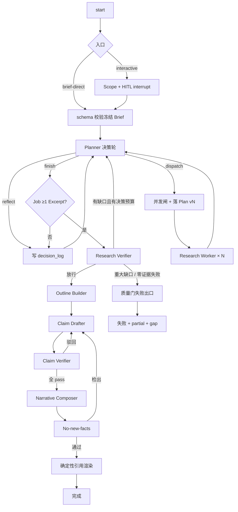

# M1 深研智能体核心 + CLI — 实现设计

- **版本**：1.4
- **日期**：2026-07-14
- **工期**：约 7 周（**一个整体里程碑**，不分「单 worker 先行」等对外/对内交付切片）
- **状态**：实施中（M0 已验收；Scope、Brief 与 HITL 已完成；Planner-Worker 及其后续链路待实现）
- **依据**：[设计文档](../design.md)（§3–§5、§7、D7/D8/D12、§11）、[路线图](./roadmap.md)（§4 M1）、[开工确认清单](./preflight.md)、[CLI 文档](../cli.md)、[M0 实现设计](./m0.md)
- **读者**：实现 M1 的工程师。本文把「功能完整的单机深研系统」落到**目录、模块边界、数据模型、主图、工具与编排合同、工程推进顺序、验收与明确不做**。

### v1.4 变更

- 新增 §5.1 事件谱系：把「研究过程可追踪」落成 `events` 表的明确合同——哪些节点必须发事件、载荷带什么字段；事件只存 ID + 轻量业务元数据，正文一律引用权威表。Worker 侧 `task.tool_used` / `task.evidence_saved` 明确进 events 表（搜索词、URL、doc_id 属业务元数据，与 design §9.1.5 对 Loki/Tempo 的内容最小化约束不冲突）。

### v1.3 变更

- 清除旧路线图、旧 CLI 与旧 Preflight 的临时裁决内容；本文与上游设计、路线图及专项文档采用同一合同。
- 明确 Brief 是已确认的研究输入快照，不是执行合同；执行承诺只由版本化 Plan 形成。
- 回写当前实现状态：Scope、Brief schema、interactive HITL 已完成，Planner-Worker 是当前实现边界。

### v1.2 变更

- Brief HITL 交互与 design v4.9 / CLI v1.1 对齐：`c` 原样确认 / `e` 直接编辑 / `i` 指令修订（一轮定稿）/ `q` 放弃；废除 `r` 多轮重新收敛。

### v1.1 变更

- **取消**「S1 单 worker → S2 再加并行」的分期形态与检查点门禁。
- M1 **目标架构一次到位**：Planner 决策环、并行通用 Worker、Verifier/Replan、质量门、证据/声明/成文全链路、CLI 闭环，作为**同一交付物**验收。
- 文中的周次顺序只是**工程推进建议**（先骨架后接线），不是可独立验收的中间产品；任一周结束都不要求「先能跑单 worker 再开下一阶段」。

---

## 1. 目标与演示口径

**目标**：一次交付功能完整的单机深研系统——从提问到带引用报告的**完整**研究控制流（设计 §3.1），含并行广度、受控回路、矛盾/推理/成文审计，并配齐日常可用 CLI。其后里程碑只做扩展（M2）、度量（M3）、规模化（M4），**不再回头改研究主流程**。

**演示口径**：

> 在 CLI 里提一个需要多侧面调研的真实问题 → 并行 worker → 预埋缺口可见自动补搜 → 预算触顶不绕过质量门 → 来源打架时并陈或落库裁决 → 「查到的」与「推出来的」呈现可区分 → 报告每条事实可点开引用且权威链机器可校验。全程：`ask` 提交 → `attach` 跟踪 → 查看/导出报告。

**整体性原则（本里程碑硬约束）**：

1. **没有「单 worker 产品形态」**。主图从第一天就按「决策环 + 并发闸 + Worker × N」设计；`effort` 映射的并发上限与决策轮上限始终生效。简单问题可以由 Planner **自然**只派 1 个 task，那是行为结果，不是架构裁剪。
2. **没有「先无验证成文、后补验证」**。Claim 验证不过不成文、Document 快照与 Excerpt 血缘从首次检索起强制——与设计 §11.1 一致，但不因此引入「窄切片交付门」。
3. **验收只认里程碑出口**（§12）。周内可用 mock/桩加速开发，但合并主干的目标始终是完整图，不为中间演示永久短路 Verifier / 并行 / 质量门。
4. M1 验收只用机器可判与行为性判据；昂贵评测与定量门槛留给 M3。

---

## 2. 范围总览

### 2.1 必达（同一里程碑）

| # | 交付物 |
|---|--------|
| 1 | Research Brief 输入快照冻结：interactive HITL + brief-direct（同一主图） |
| 2 | Planner 决策环：强制 `dispatch` / `reflect` / `finish`；持久消息线程（随 checkpoint 序列化，准入封闭）；决策日志（含格式错误反馈 + 每轮全量 prompt）；版本化 Plan |
| 3 | 并行通用 Research Worker（字段专门化）+ 运行时注入 `task.budget` + 并发硬闸 |
| 4 | 联网工具 D12：`web_search` / `web_fetch` / `save_findings`（内部 `select_excerpts`） |
| 5 | Evidence Store：Document 快照 + Excerpt + 简化 Assertion；内容哈希去重 |
| 6 | Research Verifier：软覆盖 / 缺口 / 矛盾 → Replan 或放行；ConflictResolution |
| 7 | 质量门出口：完成 / 失败 + partial report + gap artifact；预算只停研究不绕过质量门 |
| 8 | Outline → Claim 起草/验证（**evidence + derived**）→ Composer → no-new-facts 审计 → 确定性引用渲染 |
| 9 | 业务事件 + 单进程 SSE；usage 表；root/task/tool span |
| 10 | CLI 闭环：`ask` → `attach`（含 TUI 或 plain）→ 查看/导出报告 |

### 2.2 明确不做（防膨胀）

| 项 | 归属 |
|----|------|
| Data Worker / Computation / FigureSpec 图表渲染 | M2 |
| PageIndex / `kb_*` / CLI `kb` | M2（允许低成本 spike，不进验收） |
| Redis / RabbitMQ / 三进程 / SSE 跨副本 | M4 |
| 题库跑批、LLM-as-judge、eval_run 门禁 | M3 |
| FR-11 `followup` | P2，后置 |
| 完整 pause/resume 产品化（可留钩子） | FR-9 P1，可后置 |
| 已废止的分层 Brief / 前哨校准 / `must_cover` 硬清单 | **D11，禁止实现** |
| 压缩要点当 Excerpt；Worker 读整页全文 | **D12 硬禁止** |
| Job 总工具帽 / Job 墙钟硬停 | §7 已废弃 |
| 「单 worker 专用图」或「跳过 Verifier 的成文捷径」作为合并主干 | **本里程碑禁止** |

### 2.3 文档职责

- [设计文档](../design.md) 定义跨里程碑架构、领域语义与决策记录。
- 本文定义 M1 的目录、数据模型、控制流、工程顺序与验收合同。
- [路线图](./roadmap.md) 只定义里程碑范围和先后关系，不重复机制细节。
- [CLI](../cli.md)、[评测](../eval.md) 与 [Preflight](./preflight.md) 分别定义交互、评测和已锁定工程选择。

所有文档使用同一现行合同，不存在运行时兼容旧 Brief、旧工具或旧预算语义的分支。

---

## 3. 承接 M0 的交接面

| M0 留下 | M1 怎么接 |
|---------|-----------|
| `flow/research_graph.py` 空探针图 | 替换为**完整研究图**；PG checkpointer 常开 |
| `flow/state.py` | 扩展为可序列化 `ResearchState`（§6） |
| `store/checkpoint.py` / `object_store.py` | 复用；快照 key = `{workspace_id}/docs/{doc_id}/v{n}` |
| `app.jobs` | 扩展状态机；邻表承载 Brief/Plan/Evidence/Events |
| `obs/` | job root span + 按 `task_id`/`attempt` 的 agent/tool span |
| compose PG+MinIO | 不变；不引入 Redis/MQ |
| `runtime/entrypoints/local.py` | 保留调试；日常路径 = API + CLI |

依赖方向：

```text
schemas  ← 零业务逻辑
   ↑
store / obs / tools / deterministic
   ↑
agents
   ↑
flow
   ↑
runtime（api / cli）
```

`flow/` ↛ `runtime/`。`deterministic/` 禁止 LLM。

---

## 4. 目录与模块边界

```text
src/prospector/
├── schemas/
│   ├── brief.py              # ResearchBrief（已确认的研究输入快照）
│   ├── plan.py               # Plan + ResearchTask
│   ├── evidence.py           # Document / Excerpt / 简化 Assertion
│   ├── claims.py             # Claim + ClaimEvidence + ClaimVerdict
│   │                         # + ClaimPremise + ConflictResolution
│   ├── events.py             # 业务事件（§5.1 谱系）+ gap artifact
│   ├── decisions.py          # 三选一决策 + 决策日志行
│   └── report.py
│
├── store/
│   ├── repositories/         # briefs, plans, documents, excerpts,
│   │                         # assertions, claims, events, usage, decisions
│   ├── object_store.py
│   ├── checkpoint.py
│   └── jobs.py
│
├── tools/
│   ├── base.py               # 协议 + 录制/回放钩子（M3 预留）
│   ├── web_search.py
│   ├── web_fetch.py
│   ├── save_findings.py      # 唯一落证入口
│   └── _excerpts.py          # 切段 / select_excerpts（不注册为 tool）
│
├── agents/
│   ├── llm.py
│   ├── scope.py
│   ├── planner.py
│   ├── research_worker.py
│   ├── research_verifier.py
│   ├── outline.py
│   ├── claim_drafter.py
│   ├── claim_verifier.py     # evidence + derived
│   ├── composer.py
│   ├── audit.py              # no-new-facts
│   └── prompts/
│
├── deterministic/
│   ├── chain_checks.py
│   ├── citation_render.py
│   ├── budget.py             # effort → 三闸；注入 task.budget
│   ├── gates.py
│   ├── segment.py
│   └── brief_freeze.py
│
├── flow/
│   ├── state.py
│   ├── research_graph.py     # 完整主图（唯一研究图）
│   └── nodes/                # 可选拆分，便于单测
│
├── runtime/
│   ├── api/                  # jobs + HITL + SSE + report
│   └── entrypoints/
│
└── cli/                      # Typer；只调 HTTP/SSE
```

---

## 5. 数据模型（`app` schema，一次建齐）

M1 开始即可按完整合同建表（允许迁移分批提交，但**不要**按「先单 task 再并行」拆两套 schema）。

| 表 | 要点 |
|----|------|
| `jobs` | status、effort、brief_id、outcome、thread_id |
| `briefs` | question、brief_text、output_format、language、effort、frozen_at；冻结后业务字段不可改 |
| `plans` | version、decision_round、trigger_verifier_run、task_ids |
| `tasks` | ResearchTask 全字段；budget 由运行时写入；status |
| `documents` | content_hash 去重、storage_ref、source_ref、source_meta |
| `excerpts` | locator、excerpt_hash 去重、extracted_by |
| `assertions` | 简化可投影形态 |
| `claims` | grounding ∈ {evidence, derived}（computed 留给 M2） |
| `claim_evidence` / `claim_verdicts` / `claim_premises` | §4.7–4.9 / §4.8；depth 上限 2 |
| `conflict_resolutions` | §4.12 |
| `verifier_runs` | 覆盖 rationale、gap list、放行结论 |
| `decision_log` | reflect.note、拒绝反馈、格式错误反馈、该轮完整 prompt（回放权威载体，§5.2） |
| `events` | append-only；SSE 数据源；事件谱系与载荷合同见 §5.1 |
| `gap_artifacts` / `reports` / `usage` | 失败出口与计量 |

信息增益停止：连续 2 轮 `save_findings` 未新增 Excerpt/Assertion 行 → Worker 停（机器判定）。

### 5.1 事件谱系（研究过程追踪合同）

`events` 表是研究过程叙事的**主线通道**：回答「Planner 计划了什么、Worker 在解决什么、搜到了什么资料、反馈回去后 Planner 怎么想」这类追踪问题，靠的是它，而不是 stdout 日志（运维通道，禁研究正文）或 trace（可采样、非权威）。三条纪律：

1. **事件与业务写同事务提交**，append-only，事件 id 单调（SSE `Last-Event-ID` 依赖）；
2. **事件行只存 ID + 轻量业务元数据**（枚举、计数、搜索词、URL、首行摘录），正文一律引用权威表：决策正文与全量 prompt 在 `decision_log`，任务书在 `plans`/`tasks`，资料与证据在 `documents`/`excerpts`/`assertions`。渲染时间线时按 ID join，保证叙事与库账永远一致；
3. **事件量有界**：最密的 `task.tool_used` 受每 Worker 工具上限约束，整个 Job 事件数为几百行量级。

| 事件 | 关键载荷 | 回答的追踪问题 |
|------|----------|----------------|
| `job.phase_changed` | phase、outcome、error_code | 整体走到哪一步 |
| `brief.confirmed` | brief_id、effort、confirm_mode（c/e/i） | 研究输入是什么 |
| `planner.decided` | decision_round、decision（dispatch/reflect/finish）；dispatch 附 plan_version + task_ids + reason 首行；reflect 附 note 首行；finish 附 reason 首行 | Planner 计划了什么、怎么想 |
| `planner.rejected` | decision_round、reason_code（over_concurrency / schema_error / empty_finish） | 这轮为何没派活、轮次为何被烧 |
| `task.started` | task_id、research_stage、research_mode、source_policy、question 首行、budget | Worker 在解决什么问题 |
| `task.tool_used` | task_id、tool（web_search/web_fetch/save_findings）、query 或 URL、结果计数、doc_id | 搜到/抓到了什么资料 |
| `task.evidence_saved` | task_id、assertion_ids、excerpt 计数 | 落了什么证据 |
| `task.finished` | task_id、stop_reason（expected_evidence_satisfied / budget_exhausted / no_public_evidence / low_information_gain / blocked_by_scope / tool_error）、工具用量 used/limit、断言总数 | Worker 干得如何、为何收工 |
| `verifier.completed` | verifier_run_id、gap 计数、放行结论 | 质量门结果 |
| `replan.triggered` | verifier_run_id、新 plan_version | 缺口如何转化为下一轮计划 |
| `report.generated` / `gap_artifact.written` | report_id / artifact_id | 最终产出或失败出口 |

M1 的追踪分两层，逐层下钻：默认看事件时间线（CLI `job events --follow` 渲染，见 §9.2）；深究某轮时按 `job_id + decision_round` 查 `decision_log` 的全量 prompt（逐字回放该轮 Planner 所见），按 `task_id` 查任务书与断言列表。依赖 Redis 的 per-job 限时 debug 开关及 Worker 原始轨迹捕获属于 M4，不进入 M1 实现范围。

**准入澄清**：搜索词、URL、标题、note/reason 首行属业务元数据，允许进 events 表——design §9.1.5 的内容最小化约束的是 Loki/Tempo 等第三方诊断后端，不约束 PG 业务表（后者本就持有网页全文快照）。网页正文、Excerpt 全文、prompt 全文不进 events。

---

## 6. 图状态与主流程（唯一形态）

### 6.1 `ResearchState`（可序列化）

ID、计数器、枚举、短字符串，外加 Planner 消息线程：

```text
job_id, phase, brief_id, plan_version, decision_round,
decision_round_limit, max_concurrency, active_task_ids,
last_verifier_run_id, outcome, error_code,
planner_messages  # append-only 消息线程，随 checkpoint 序列化（design §5.2）
```

`planner_messages` 准入封闭：只允许决策对象、断言投影摘要 + 收工声明、拒绝/格式错误反馈、verifier gap list 与预算余额提示追加；禁止 worker 原始轨迹、网页压缩视图、Document 正文、客户端句柄。规模由决策轮上限与限长摘要硬性有界。决策日志照常落库（审计与回放载体），但不再是唯一跨轮记忆。

### 6.2 主图



这就是合并主干上的**唯一**研究图。开发期可用桩替换个别节点加速，但不得另建「永久单 worker 捷径图」进主干。

### 6.3 HITL

- interactive：interrupt（或等价）停在 Brief 确认。交互合同（design §5.1 / CLI §4.3）：
  - `c` 原样确认定稿
  - `e` 直接编辑（可多次，改完回卡片）
  - `i` 一条修订指令 → Scope 改写一轮 → **直接定稿**（不再二次确认）
  - `q` 放弃
- CLI `ask` 只走 interactive；不暴露 brief-direct。
- brief-direct：HTTP 提交完整 Brief，schema 校验后冻结，**同一主图**。

---

## 7. 核心合同

### 7.1 联网工具（D12）

| 工具 | 行为 |
|------|------|
| `web_search` | Exa 元数据 only |
| `web_fetch` | `/contents` → 快照 + 确定性切段 → 中档模型压缩视图（失败则段号目录+首句）；全文永不进 Worker；压缩 token 进 usage、不计 `max_tool_calls` |
| `save_findings` | 段号定位 → 内部 `select_excerpts` → Excerpt + Assertion 原子写入 |

`allowed_tools` 默认上述三者（无 `kb_*`）。

### 7.2 Worker

局部停止：满足 expected_evidence / 无公开证据 / 信息增益过低 / 被任务范围阻断 / 工具预算耗尽 / 工具错误。
收工：`{goal_met, stop_reason, gap_note}` + 断言投影干净摘要（禁止消息轨迹）。

并行：同轮多个 task 独立上下文；单个 Worker 每轮可以并行执行多个彼此独立的工具调用，存在数据依赖的调用必须等待前一轮结果；`produced_by.task_id`、`tool_call_id` 与 span 不得串号。

### 7.3 Planner（§5.2）

三选一 schema；持久 append-only 消息线程（`planner_messages`，随 checkpoint 序列化）：前缀为系统提示 + Brief 快照，逐轮追加决策对象与运行时反馈（断言投影摘要 + 收工声明、拒绝/格式错误反馈、verifier gap、预算余额）；准入封闭（§6.1）。每轮实际发送的完整 prompt 随 `decision_log` 行落库（回放权威载体）。

硬闸：超并发整批拒绝仍计轮；空手 finish 拒绝；决策轮耗尽且零 Excerpt → 失败不进 Verifier；畸形 task 单条失败仍计轮。  
`budget` 由 `deterministic/budget.py` 按 effort 注入。

**standard 默认**：决策轮 6、每轮并发 3、每 worker `max_tool_calls` 15；完整映射见 §14。

### 7.4 Verifier / 质量门 / 成文

- Verifier：软覆盖、缺口、矛盾（ConflictResolution：present_both / adjudicated）、可信度加权可先做轻量版。
- 质量门：完成 / 重大缺口失败 / Claim 失败 / 零证据失败；**预算耗尽不把 Claim 失败变成成功**；无 resolution 的高优先级 contradict 可拦截。
- Claim：evidence 下钻 Excerpt；derived 经 ClaimPremise，depth≤2。
- 权威链 `chain_checks` 100%；未 pass 不进 Composer；引用仅确定性渲染；审计检出 → 回炉 → `composition_audit`。

---

## 8. 工程推进顺序（建议，非交付切片）

以下按依赖排周，方便并行与联调；**每周结束没有独立验收门**。目标始终是 §2.1 全表。

| 周 | 建议焦点 | 说明 |
|----|----------|------|
| 1 | schemas + 迁移 + repositories + `budget`/`gates`/`chain_checks`/`segment` 单测 | 骨骼先立；并发与质量门逻辑用纯单测钉死 |
| 2 | 工具层 D12 + `save_findings` + object_store 快照；Worker ReAct | 工具与落证按最终合同写，不做「搜索即摘要」临时路径 |
| 3 | Scope / Brief 冻结双入口；Planner 决策环 + 消息线程准入 + 决策日志（含全量 prompt）；并发调度 | **调度器按 N worker 实现**，即使用 fixture 先跑 1 个 task |
| 4 | Verifier + Replan + 事件/SSE + usage/span | 回路与观测接上 |
| 5 | Outline + Claim（evidence/derived）+ Composer + audit + citation_render | 成文链一次接完 |
| 6 | 主图联调；API 全套；CLI ask/attach/report；冲突与质量门行为测 | 行为性集成测试为主 |
| 7 | CLI TUI/导出打磨；live E2E；回归；golden set 人工标注启动；文档回写 | 里程碑出口 |

允许调序与人力并行（例如工具与 schema 同周），但禁止：

- 合并「无 Claim 验证的成文路径」；
- 合并「写死 concurrency=1 的专用编排」；
- 把并行/Verifier/审计留到「下一个里程碑再补」。

---

## 9. API 与 CLI

### 9.1 API（单进程 FastAPI）

- `POST /jobs`（interactive）、`POST /jobs/brief-direct`
- Brief 确认继续（resume：`c` / 编辑后的 Brief / `i` 指令一轮定稿）
- `GET /jobs/{id}`、`GET /jobs/{id}/events`（SSE + Last-Event-ID，读 PG）
- `GET /jobs/{id}/report` 及导出/产物打包

鉴权：固定 token + 假租户。SSE 不引入 Redis；事件 id 单调，便于日后换 Stream。

### 9.2 CLI

里程碑内交付完整闭环（可先 plain attach，再补 TUI，但出口须可演示阶段流）：

- `login`、`ask`、`job list|status|attach|events`、`report show|export`
- `job events --follow` 把 §5.1 事件谱系渲染为人类可读的研究时间线（按 decision_round / task_id 分组缩进：派发 → 搜索/抓取/落证 → 收工 → 下一轮决策）
- 不做：`kb *`、`followup`、`debug`、CLI 暴露 brief-direct
- Brief：TTY 下 `c/e/i/q`（`e` 编辑 YAML；`i` 一轮指令定稿）；`deep` 提示可能数小时

---

## 10. 观测与 usage

- Root span：`job.execute`；Worker：`task.execute` → `llm.call` / `tool.*` / `evidence.persist`
- 默认不含 Prompt/正文/Excerpt 全文
- 全部 LLM/工具写 `usage`
- 超时：LLM ~120s，Exa ~30s

---

## 11. 测试与 CI

| 层 | 内容 |
|----|------|
| Unit | schema、去重、切段、budget/gates、chain_checks、planner 线程准入（禁止项不入线程）与 prompt 落 decision_log、摘要 prompt 构造、premise depth |
| Integration（默认 CI） | **完整图** + mock LLM/Exa：并行不串号、Replan、空手 finish、质量门、冲突 resolution、审计回炉、SSE 顺序；事件时间线可还原 Planner 派发理由 → Worker 问题 → 搜索/抓取/落证 → Worker 收工 → Planner 下一轮决定 → Verifier/Replan 或结束 |
| Live（`@pytest.mark.live`） | 真实多侧面问题 E2E；缺密钥 skip；不进默认 CI |

建议文件（按能力命名，不按 S1/S2）：

- `tests/unit/test_chain_checks.py`
- `tests/unit/test_budget_and_gates.py`
- `tests/unit/test_planner_context.py`
- `tests/integration/test_m1_decision_loop.py`
- `tests/integration/test_m1_parallel_workers.py`
- `tests/integration/test_m1_claims_and_audit.py`
- `tests/integration/live/test_m1_e2e.py`

---

## 12. 验收清单（唯一出口）

### 12.1 机器可判

- [ ] 权威链 Claim→ClaimEvidence→Excerpt→Document 外键/哈希 100%
- [ ] Document/Excerpt 哈希去重
- [ ] 未 pass claim 不进成文
- [ ] 零 Excerpt 不能成功 finish；耗尽则失败
- [ ] 预算耗尽不绕过 Claim 失败
- [ ] contradict 无覆盖 resolution 可拦截
- [ ] derived depth>2 被拆解或降格
- [ ] 审计检出集合外事实可回炉补录

### 12.2 行为可演示

- [ ] interactive 与 brief-direct 同一主流程
- [ ] 多 worker 并行且不串号（演示用标准档即可）
- [ ] 预埋缺口 → Replan（Plan 版本可见）
- [ ] 失败出口含 gap artifact + partial report
- [ ] CLI：提交 → attach 跟踪 → 查看/导出带引用报告
- [ ] 「查到的 / 推出来的」呈现可区分
- [ ] 主路径 root trace；工具 span 含 task/attempt

### 12.3 明确不验收

- [ ] 引用通过率 ≥ 95%（M3）
- [ ] 多用户 / kill 接管（M4）
- [ ] 私库页码引用 / 沙箱计算 / 图表（M2）

---

## 13. 与后续里程碑的交接面

| M1 留下 | 被谁接走 |
|---------|----------|
| 完整研究主图 + Evidence/Claim 闭环 | M2：Data Worker / `kb_*` / FigureSpec |
| `tools/base.py` 录制钩子 | M3 磁带 |
| brief-direct | M3 题库 |
| PG events SSE | M4 Redis Stream 双写 |
| 单进程 API+图 | M4 三进程 |
| 开发期真实产物 → golden set | 持续轨道 / M3 门禁 |

---

## 14. 已锁定实现细节

1. **`effort →` 三闸数字表**（`deterministic/budget.py`）：
   - `quick`：决策轮 3 / 并发 1 / `max_tool_calls` 8
   - `standard`：决策轮 6 / 并发 3 / `max_tool_calls` 15
   - `deep`：决策轮 12 / 并发 4 / `max_tool_calls` 25
2. **简化 Assertion**：独立 `assertions` 表；`excerpt_ids` / `topic_tags` / `produced_by` 用 JSONB。
3. **HITL**：交互合同为 `c/e/i/q`（`i` 一轮定稿，design §5.1）。主图落地后用 LangGraph `interrupt()`（`kind: brief_confirm`）；CLI/API 以 `Command(resume=…)` 继续。开发期 local `ask` 可先用进程内确认环实现同一合同。
4. **SSE**：读 PG `events` 表短间隔轮询（约 0.5s）+ `Last-Event-ID`；不做 `LISTEN/NOTIFY`（留给 M4）。
5. **CLI attach**：Rich Live（plain 模式可选）；不做 Textual。

---

## 15. 参考

- [设计 §3–§5、§7、D7/D8/D11/D12、§11](../design.md)
- [路线图 §4 M1](./roadmap.md)
- [Preflight](./preflight.md)
- [CLI](../cli.md)
- [评测](../eval.md)
- [M0](./m0.md)
