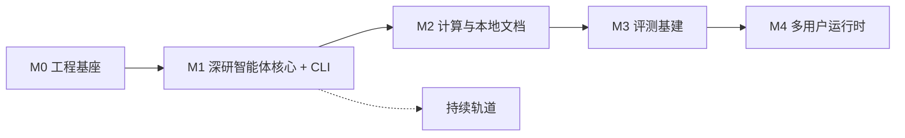
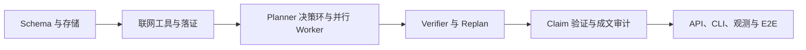

# Prospector v2 实现路线图

- **版本**：1.6
- **日期**：2026-07-16
- **依据**：[设计文档](../design.md)（§11）、[M1 实现设计](./m1.md)、[评测文档](../eval.md)、[CLI 文档](../cli.md)、[开工确认清单](./preflight.md)
- **实现设计**：[M0](./m0.md)、[M1](./m1.md)
- **用途**：定义里程碑范围、依赖顺序和完成出口。机制细节由设计文档与对应实现设计负责，本文不建立第二套合同。

---

## 1. 总览

项目按五个里程碑推进：

| 里程碑 | 工期 | 唯一目标 |
|--------|------|----------|
| M0 | 1 周 | 建立可恢复、可观测、可测试的工程基座 |
| M1 | 7 周 | 一次交付完整单机深研系统与 CLI |
| M2 | 2 周 | 增加沙箱计算、本地文档和图表能力 |
| M3 | 2 周 | 建立可重复评测、人工真值门禁和看板 |
| M4 | 2–3 周 | 将已验证的单机系统扩展为多用户运行时 |
| 持续轨道 | M1 完成后启动 | 扩充题库、校准裁判、跟踪质量与成本 |



M1 是一个整体里程碑。工程上可以按依赖顺序推进，但不存在单 Worker、无 Verifier、分层 Brief 等可交付中间形态，也不设置子切片验收门。

---

## 2. 排期原则

1. **先锁定不可逆数据，再接控制流**：首次抓取起就保存 Document 快照和精确 Excerpt；checkpoint 从 M0 起常开。
2. **研究主图一次成形**：M1 合并主干只接受 Planner 决策环、并行 Worker、Verifier/Replan、Claim 验证和成文审计组成的完整图。
3. **执行承诺只来自 Plan**：Brief 负责展开研究空间；Planner 负责取舍并形成版本化 Plan；Verifier 对照 Plan 检查履约，并以 Brief 检查偏题。
4. **预算与质量分离**：`effort` 映射 Planner 决策轮，以及各研究阶段的并发数与 Worker 决策轮；工具调用总数、token 和累计工具调用只计量。停止研究不能绕过质量门。
5. **验收必须可度量**：M1–M2 使用机器检查和行为测试；M3 建成人工真值集后才启用定量质量门禁。
6. **运行时后置**：先验证单机研究逻辑，再在 M4 引入多进程、队列和多用户调度。

---

## 3. 代码组织

```text
prospector/
├── migrations/                 # Alembic
├── docs/
├── src/prospector/
│   ├── schemas/                # Pydantic 合同，零业务逻辑
│   ├── store/                  # PostgreSQL、对象存储、checkpoint
│   ├── tools/                  # 外部能力适配与录制钩子
│   ├── agents/                 # LLM 判断
│   ├── deterministic/          # 预算、门禁、引用、血缘检查；LLM 禁入
│   ├── flow/                   # LangGraph 主图
│   ├── runtime/                # API、调度和进程入口
│   ├── obs/                    # 日志、trace、usage
│   └── cli/                    # HTTP/SSE 瘦客户端
├── eval/                       # 题库、磁带、裁判、评测运行
└── tests/
```

依赖方向固定为：

```text
schemas
   ↑
store / tools / deterministic / obs
   ↑
agents
   ↑
flow
   ↑
runtime / cli
```

`deterministic/` 不调用 LLM，`flow/` 不导入 `runtime/`。目录按架构边界组织，不按里程碑拆包。

---

## 4. 里程碑

### M0：工程基座（已完成）

实现设计：[m0.md](./m0.md)

交付：

- Python 工程骨架、CI、Alembic。
- PostgreSQL 与 LangGraph PG checkpointer。
- structlog、OpenTelemetry 和对象存储。
- 空流程 kill/resume 集成验证。

完成标准：checkpoint 恢复不重跑已完成节点；日志可关联 trace/span；对象存储读写和 CI 门禁通过。

### M1：深研智能体核心 + CLI（实施中）

实现设计：[m1.md](./m1.md)

当前已完成 Brief 生成、interactive HITL、Planner-Worker、Research Verifier/Replan 与 ConflictResolution，研究图可从冻结 Brief 运行到 `outline_pending`。Claim 验证与成文链是下一实现边界；M1 最终交付仍按完整主图统一验收。

交付：

1. interactive 与 brief-direct 产生同一 Research Brief 输入快照并进入同一主图。
2. Planner 每轮强制输出 `dispatch`、`reflect` 或 `finish`，记录决策日志并生成版本化 Plan。
3. 运行时按 `Brief.effort + ResearchTask.research_stage` 注入结构性限制：

   | effort | Planner 决策轮 | scout（并发 / Worker 轮） | deep_dive（并发 / Worker 轮） | verify（并发 / Worker 轮） |
   |--------|---------------:|----------------------------:|--------------------------------:|---------------------------:|
   | quick | 8 | 6 / 13 | 3 / 25 | 3 / 13 |
   | standard | 12 | 6 / 21 | 3 / 49 | 3 / 17 |
   | deep | 24 | 8 / 25 | 5 / 73 | 5 / 21 |

   Worker 工具调用总数不设上限；每个 Worker 决策轮最多并行 8 个独立调用。

4. 并行通用 Research Worker 只使用 `web_search`、`web_fetch`、`save_findings`；所有联网来源统一使用持久化 Exa highlights。
5. Document 快照、Excerpt、Assertion、Plan、Verifier run、Claim 与报告产物全链路落库。
6. Verifier 检查 Plan 承诺、Brief 偏题、缺口与冲突；可补缺口在仍有决策预算时回到 Planner 形成新 Plan 版本。
7. Claim 验证、冲突处置、no-new-facts 审计和确定性引用渲染共同构成质量门。
8. 单进程 API、PG 事件 SSE、usage/span 和 CLI `ask → attach → report` 闭环。

依赖顺序：



这只是工程接线顺序，不产生可独立验收的中间产品。

完成标准：

- 端到端产出带引用报告，Claim→ClaimEvidence→Excerpt→Document 权威链机器校验 100%。
- 多 Worker 并行不串号；预埋缺口产生 Plan 新版本并补搜。
- Planner 空手 `finish` 被拒绝；决策轮耗尽且零 Excerpt 直接失败。
- Worker 按目标满足、连续两轮无新证据、主动声明证据不可得/受范围限制或决策轮耗尽停止；工具错误回到上下文，不单独触发提前收工。
- 重大缺口进入失败出口并保存 partial report 与 gap artifact；可披露的信息局限进入报告。
- 未通过 Claim 验证的事实不进入成文；预算耗尽不改变该规则。
- CLI 可以提交、跟踪并查看或导出报告。

### M2：计算与本地文档

两条独立能力在同一里程碑汇合：

- Data Worker 沙箱、Computation 输入血缘、复现检查和 computed Claim。
- PageIndex 入库建树、`kb_list` / `kb_structure` / `kb_read` 与私库精确引用。
- FigureSpec 只绑定已验证 Claim 或 Computation，由确定性代码渲染。

完成标准：无 Excerpt 血缘的输入不能计算；计算可复现；本地文档 locator 完整；FigureSpec 不包含未绑定字面数值。

### M3：评测基建

交付题库、录制回放磁带、人工真值集、裁判校准、`eval_run` 和评估看板。M3 是 M4 的前置门。

完成标准：同一磁带下不同系统版本可比较；Claim 忠实率由人工真值衡量；Plan 承诺覆盖和 Brief 对齐可评估；质量与成本门禁可执行。

### M4：多用户运行时

交付 API 多副本、单写者 Orchestrator、Research/Data Worker 池、RabbitMQ 三队列、幂等消费、Redis Stream SSE、跨进程 trace 与限时 debug。

三项研究限制仍由任务与 Planner 状态执行；PG 保存权威 usage，Redis 不参与研究终止判断。

完成标准：多用户并发公平；任意 Worker 或 Orchestrator 崩溃后任务可恢复；SSE 可跨副本回放；跨进程 trace 可关联。

---

## 5. 全程硬规则

| 规则 | 起点 |
|------|------|
| checkpoint 常开，图状态只存可序列化数据 | M0 |
| Document 快照与精确 Excerpt 从首次抓取起不可省略 | M1 |
| Brief 不是覆盖合同，Plan 才是执行合同 | M1 |
| Planner 决策轮、分阶段并发与分阶段 Worker 决策轮是研究硬闸 | M1 |
| 停止研究不能绕过 Verifier、Claim 验证或成文审计 | M1 |
| Computation 必须记录代码、输入血缘和输出 | M2 |
| 定量忠实率门禁必须以人工真值为依据 | M3 |
| 研究逻辑不依赖多用户运行时组件 | 全程 |

---

## 6. 工期与变更

- 总工期约 14–15 周；绝对估期根据实际吞吐更新，但里程碑依赖顺序不变。
- M2 的计算链和本地文档链可以按人力并行或对调。
- 里程碑范围变化时，同步修改设计文档的里程碑表和对应实现设计；不得通过保留旧合同兼容分支解决文档冲突。
