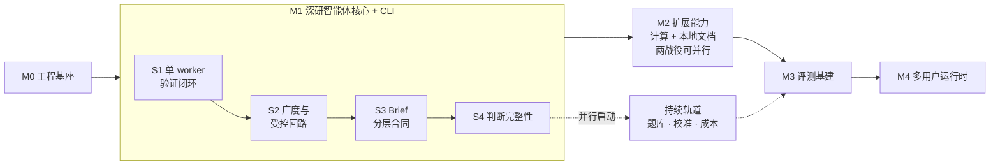

# Prospector v2 实现路线图

- **版本**：1.4（里程碑重排：原 M1 / M2 / M2.5 / M3 合并为新 M1「深研智能体核心」，CLI 界面并入 M1 交付；原 M4 / M5 / M6 顺延更名为 M2 / M3 / M4；评测基建保持在多用户运行时之前）
- **日期**：2026-07-13
- **依据**：[设计文档](../design.md)（§11 里程碑）、[评测文档](../eval.md)（§9 里程碑衔接）、[CLI 文档](../cli.md)、[开工确认清单](./preflight.md)
- **实现设计**：[M0](./m0.md)、[M1](./m1.md)（其余里程碑的实现设计文档随开工前编写）
- **读者**：参与实现的工程师。本文回答四个问题：**先做什么、后做什么、为什么是这个顺序、做到什么程度算完成**。机制细节不在本文重复，一律链接到设计文档对应章节。**实现开始前的工程与供应商锁定项见 [preflight.md](./preflight.md)。**

---

## 1. 一页总览

项目要构建的是一个**可控、可审计、可复现**的深度研究智能体（设计文档 §1）。实现分 5 个里程碑加 1 条持续轨道，总工期 **14–15 周**：

| 里程碑 | 工期 | 主战役（一句话） |
|--------|------|------------------|
| M0 | 1 周 | 工程基座：库、checkpoint、日志、CI 全部就位，先能"崩了能恢复" |
| M1 | 7 周 | 深研智能体核心：完整研究流程（验证闭环 → 广度与回路 → Brief 分层合同 → 判断完整性）+ CLI 界面，里程碑结束即"一个功能完整的单机深研系统" |
| M2 | 2 周 | 扩展能力：沙箱 Computation、PageIndex 本地文档、图表渲染 |
| M3 | 2 周 | 评测基建：题库、录制回放、四门禁、评估看板 |
| M4 | 2–3 周 | 多用户运行时：三进程三队列、幂等消费、分布式预算 |
| 持续轨道 | M1/S4 起，无终点 | 题库扩容、裁判校准、成本优化 |

**M1 对外是一个交付门，对内按四个串行子切片推进**（S1–S4，每个都有独立的可演示检查点）。合并改变的是交付节奏——中间形态不再作为对外里程碑验收——但**不改变构建顺序**：仍然先打穿最小验证闭环，再逐层加宽加深。



**每个里程碑结束时应能演示的效果**：

- **M0**：启动一个空流程 job，中途 kill 进程，重启后从 checkpoint 续跑。
- **M1**：在 CLI 里提一个需要多侧面调研的真实问题：系统派出并行 worker，故意留缺口能看到自动补搜，预算压到水位线能看到降级但质量门不放水；两个来源数据打架时报告并陈双方或给出有落库理由的裁决；"推出来的结论"与"查到的事实"呈现形态可区分；最终报告每条事实都有可点开的引用、引用链逐跳可机器校验。全程可用 CLI 提交（interactive 与 brief-direct 双入口）、attach 跟踪阶段流、导出报告。
- **M2**：数值结论由沙箱代码算出且可一键复现；私有 PDF 的内容能被精确引用到页码；报告里出现图表且图上数字与正文必然一致。
- **M3**：改一行提示词，回放模式下跑完题库得到一份与上次可比的评测报告；忠实率以人工真值度量。
- **M4**：两个用户同时提交深研任务互不干扰；kill 任意 worker 或 Orchestrator，任务不丢、续跑。

---

## 2. 为什么是这个顺序：四条排期原则

这是理解整个路线图的钥匙，改动排期前必须先对照这四条（完整论证见设计文档 §11.1）：

1. **风险优先的垂直切片**。本架构最大的技术风险不是工程，而是 **claim 级验证闭环的成本与可靠性**（设计文档 §12.4 承认推理审查是最弱环节）。所以 M1 的第一个子切片（S1）不是"先搭成熟的部分"，而是直接打穿一条含验证闭环的最小端到端切片——如果核心命题不成立，第 3 周就知道，而不是第 10 周。
2. **验收判据在其时点必须可度量**。"引用通过率 ≥ 95%"这类定量指标需要人工真值集才能度量，而真值集 M3 才建成——所以 M1–M2 的验收只用**机器可判的确定性检查**（外键、哈希、行为判据）；定量门槛统一从 M3 起生效。
3. **不可逆项自首次发生的切片起强制**。Document 快照与 Excerpt 血缘从 M1/S1（首个执行检索的切片）起不可省略——错过抓取时刻，快照永远拿不回来。checkpoint 同理，从 M0 起启用，因为后补的典型风险是图状态已积累不可序列化对象。
4. **每个子切片 / 里程碑一个主战役**。这条纪律在 M1 内部以子切片形式保留：并行回路（S2）、Brief 分层合同（S3）、判断完整性（S4）各自独立成段、独立检查点，不因为对外合并成一个里程碑就压成一锅粥。M2 的 Data Worker 沙箱与 PageIndex 集成这类高方差工作同理，两条战役相互独立。

另有一条贯穿性的**评测成本分界**（设计文档 §11.3）："评测"一词在 M1–M2 期间只指两类便宜活动——确定性机器检查（成本同集成测试，随机制落地即执行）与真值集人工标注（不消耗 token，瓶颈是日历时间，所以 M1/S4 就要启动）。消耗大量 token 的题库跑批与 LLM-as-judge 集中在 M3 之后，此前不做。

---

## 3. 项目结构与代码组织

单仓库、单 Python 包（CLI 文档明确 CLI 与服务端同语言、复用 schema，没有拆包的理由）。树中 §x 指设计文档章节：

```
prospector/
├── pyproject.toml
├── migrations/                    # Alembic 数据库迁移（M0 起）
├── docs/                          # 设计 / 评测 / CLI / 实现文档
│
├── src/prospector/
│   ├── schemas/                   # ① 合同层：全部 Pydantic 模型，零业务逻辑
│   │   ├── brief.py               #    Brief（interactive 与 brief-direct 共用同一校验）
│   │   ├── plan.py                #    Plan / ResearchTask
│   │   ├── evidence.py            #    Document / Excerpt / Assertion
│   │   ├── claims.py              #    Claim 及五张关系/判定表（§4.6–4.12）
│   │   ├── computation.py         #    Computation（§4.10）
│   │   ├── figures.py             #    FigureSpec（§5.5）
│   │   └── events.py              #    业务事件 / gap artifact
│   │
│   ├── store/                     # ② 持久层
│   │   ├── repositories/          #    按实体分文件；append-only 与内容哈希去重在此强制
│   │   ├── object_store.py        #    Document 快照 / PageIndex 树产物 / debug 负载
│   │   └── checkpoint.py          #    LangGraph PG checkpointer 装配（M0）
│   │
│   ├── agents/                    # ③ LLM 判断层：所有"软判断"集中于此
│   │   ├── scope.py               #    Scope Agent
│   │   ├── planner.py             #    Planner + effort scaling（§5.2）
│   │   ├── research_worker.py     #    受限 ReAct 循环（§3.2）
│   │   ├── research_verifier.py   #    覆盖度/矛盾/可信度/缺口（§5.3）
│   │   ├── outline.py
│   │   ├── claim_drafter.py
│   │   ├── claim_verifier.py      #    按 grounding 分型（§5.4）
│   │   ├── composer.py            #    Narrative Composer + FigureSpec 产出
│   │   ├── audit.py               #    no-new-facts 审计
│   │   └── prompts/               #    提示词独立成资产，随代码版本化
│   │
│   ├── tools/                     # ④ 外部世界适配层
│   │   ├── base.py                #    工具协议 + 录制/回放钩子
│   │   ├── web_search.py          #    搜索 API
│   │   ├── web_fetch.py           #    网页读取 + 首次落证写快照
│   │   ├── kb.py                  #    PageIndex 三原语适配（kb_list/structure/read，D10）
│   │   └── sandbox.py             #    Data Worker 沙箱执行（M2）
│   │
│   ├── deterministic/             # ⑤ 确定性代码层：LLM 禁入
│   │   ├── citation_render.py     #    引用编号/角标/来源列表（§5.4）
│   │   ├── figure_render.py       #    FigureSpec → markdown 表 / SVG（§5.5）
│   │   ├── chain_checks.py        #    权威链外键/哈希校验（M1/S1 验收的度量手段）
│   │   ├── budget.py              #    三层预算与水位（§7）
│   │   └── gates.py               #    质量门出口判定：完成/失败 + gap artifact
│   │
│   ├── flow/                      # ⑥ 编排层：LangGraph 图装配
│   │   ├── research_graph.py      #    把 agents 与 deterministic 接成 §3.1 的主流程
│   │   └── state.py               #    图状态定义（必须可序列化，D7）
│   │
│   ├── runtime/                   # ⑦ 运行时层（§13）：M4 前只有薄壳
│   │   ├── api/                   #    FastAPI + SSE（M1/S2 起有基础版）
│   │   ├── dispatcher.py          #    M4：单写者派发循环
│   │   ├── queues.py              #    M4：RabbitMQ 装配
│   │   └── entrypoints/           #    进程入口：M0–M3 单进程；M4 拆 api/orchestrator/worker
│   │
│   ├── obs/                       #    structlog processor + OTel 装配（§9.1）
│   └── cli/                       #    Typer + Rich/Textual（M1 起，TUI 随 S2–S4 渐进）
│
├── eval/                          # ⑧ 评测：刻意放在 src 之外
│   ├── question_bank/             #    题库（冻结 Brief 形式）
│   ├── tapes/                     #    录制-回放磁带
│   ├── judges/                    #    LLM-as-judge 与 golden set
│   └── harness/                   #    eval_run 组装、四门禁
│
└── tests/
    ├── unit/
    └── integration/               #    "预埋缺口触发 replan"这类行为性验收在此
```

### 3.1 四条组织原则（每条都来自设计文档）

1. **schema 是最底层，所有模块只向下依赖它**。设计文档称"数据模型是本架构的骨骼"（§4），代码里让它成为字面意义上的骨骼：`schemas/` 零逻辑、被所有层导入、不导入任何层。这同时兑现两个具体需求——brief-direct 的"schema 校验即冻结"与 CLI 复用服务端 schema 定义。
2. **LLM 判断与确定性代码物理隔离**（`agents/` vs `deterministic/`）。设计反复强调引用渲染、图表填数、预算水位、质量门"LLM 彻底退出"；分成两个顶层目录后，这条纪律成为可机械审查的规则——`deterministic/` 里出现任何 LLM 调用即违规。同时 M1–M2 验收所依赖的确定性检查全部落在一个无需 mock LLM 即可测试的目录里。
3. **运行时是薄壳，研究逻辑不知道它的存在**。设计文档 §13"运行时与研究逻辑正交"要求依赖方向单向：`runtime/` 导入 `flow/`，`flow/` 及其下层永远不导入 `runtime/`。M4 把单进程拆成三进程时，改动被限制在 `runtime/` 内部——这是本路线图敢把 M4 排在最后、断言"后上不返工"的结构性保证。
4. **工具全部走适配层，评测放在包外**。`tools/base.py` 的录制/回放钩子对应评测文档"M1 工具适配层预留录制钩子"，M3 磁带录的就是这一层的进出流量。`eval/` 置于 `src/` 之外对应评测文档"裁判与选手分离"：评测代码只通过 brief-direct 入口与回放配置驱动系统，不伸手进 `agents/` 内部。

### 3.2 目录与里程碑的对应

| 里程碑 / 子切片 | 新建/充实的目录 |
|--------|----------------|
| M0 | `migrations/`、`store/checkpoint.py`、`obs/`、`flow/` 骨架、CI |
| M1/S1 | `schemas/` 大部、`agents/`（scope→composer 主线）、`tools/`（web + base 录制钩子）、`deterministic/`（citation_render + chain_checks）、`cli/` 基础命令 |
| M1/S2 | `agents/research_verifier.py`、`deterministic/`（budget + gates）、`schemas/events.py`、`runtime/api/`（SSE 基础）、`cli/` attach 阶段流 |
| M1/S3 | `schemas/brief.py` 分层字段、前哨期回路、冻结层确定性校验（`deterministic/`） |
| M1/S4 | `agents/audit.py` / `conflict_resolver.py`、ConflictResolution / ClaimPremise、`cli/` TUI 阶段流可视化收尾 |
| M2 | `tools/`（kb + sandbox）、`schemas/`（computation + figures）、`deterministic/figure_render.py` |
| M3 | `eval/` 全部、评估看板 |
| M4 | `runtime/` 补全（dispatcher、queues、多进程 entrypoints） |

M1/S1 之后几乎没有"新目录"，只有"往既有目录里加文件"——分层切在了变化的自然边界上，这是结构对齐架构的信号。

### 3.3 两个刻意不做的决定

- **不按里程碑组织目录**：里程碑是交付节奏，不是架构边界；按它组织会把 S4 的矛盾裁决和 S1 的 claim 验证拆到两处。
- **暂不拆多包 workspace**：CLI 独立分发是想象中的需求，按设计文档 §13.6 的精神绑定触发条件——真需要单独分发 CLI 时再拆。

---

## 4. 里程碑详述

### M0：工程基座（1 周）

> **实现设计**（目录、空流程、验收用例、明确不做）：[m0.md](./m0.md)

**目标**：让后续所有里程碑都在"可恢复、可观测"的地基上开发，而不是先写业务再补基建。

**构建内容**：

- Repo 骨架与 CI
- PostgreSQL + 数据库迁移框架
- LangGraph 接入，**PG checkpointer 从第一天启用**（设计文档 D7）
- structlog JSON 日志 + 基础 OpenTelemetry 埋点（§9.1.4）
- 对象存储（S3 兼容）接入

**验收标准**：

- [ ] 空流程 job 的状态迁移跑通并落 checkpoint，kill 进程后恢复续跑
- [ ] 日志自动关联 trace/span

**注意**：checkpoint 不是 M0 的"可选优化"。任务跑 5–30 分钟，M1 起验证回路的开发调试就离不开断点续跑——这一周是在给自己省后面十几周的调试时间。

### M1：深研智能体核心 + CLI（7 周，内部四个串行子切片）

**目标**：交付一个**功能完整的单机深研系统**——从提问到带引用报告的整条流程（含并行广度、受控回路、分层 Brief、矛盾裁决与审计）全部建立，并配齐日常可用的 CLI 界面。M1 结束时，系统对单个用户已经"能用、可信、可演示"；其后的里程碑只做扩展（M2）、度量（M3）与规模化（M4），不再回头改研究主流程。

**为什么内部还要切四刀**：合并为一个里程碑改变的是对外交付节奏，不是构建方法。四个子切片是严格串行的依赖链，每个保留独立的可演示检查点——这是 §2 排期原则 1 和 4 在 M1 内部的延续。任何子切片的检查点不过，后续子切片不开工。

**CLI 是贯穿 M1 的横向主线**（而非某个子切片的附属）：S1 交付基础命令（提交 interactive / brief-direct、查看结果）；S2 起依托 SSE 交付 attach 阶段流跟踪；S4 收尾交付 TUI 阶段流可视化与报告导出（CLI 文档）。原则是：**每个子切片新增的能力，当期就能从 CLI 触达**，不积攒到最后补界面。

#### M1/S1：单 worker 垂直切片 = 最小验证闭环（2 周）

**目标**：打穿一条最窄但完整的路径，让架构的核心命题（claim 级验证可行且成本可接受）第一时间接受检验。

**构建内容**（一条流水线，按序）：

1. Scope Agent（interactive 模式）→ Brief 冻结（§5.1）
2. **brief-direct 提交入口**——与 Brief 冻结同一机制的第二入口，schema 校验即冻结。它的第一个用户是你自己：S2–S4 与 M2 调试需要反复重跑流水线，不能每次都走交互确认
3. Planner 生成 Plan v1（§5.2）
4. 单个 Research Worker，仅 web 检索（§3.2）
5. **Document 快照 + Excerpt 落库**——血缘自此不可省略（§4.3/§4.4），这是本切片的不可逆项
6. 简化 Assertion（暂作 Excerpt 附属字段，S4 才拆独立表）
7. evidence 型 Claim 起草与验证：ClaimEvidence + ClaimVerdict（§4.6/§4.7/§4.9）
8. Narrative Composer → 确定性引用渲染（§5.4）
9. CLI 基础命令：提交（两入口）、状态查询、报告查看

**检查点**：

- [ ] 端到端产出带引用报告
- [ ] 权威链 Claim→ClaimEvidence→Excerpt→Document version 外键机器校验 100%（度量脚本随本切片同批交付）
- [ ] 未通过验证的 claim 不进入成文
- [ ] brief-direct 提交的 Brief 经 schema 校验即时冻结并走同一主流程
- [ ] 快照/片段按内容哈希去重生效
- [ ] 主流程具备 root trace

**注意**：本切片刻意不做的东西——并行、Replan、预算降级、derived/computed 型 claim、矛盾处理。窄没关系，**完整**才重要：任何一跳（如"验证不过就不成文"）被临时短路，切片就失去了验证核心风险的意义。

#### M1/S2：广度与受控回路（2 周）

**目标**：从"一条线"变成"一张受控的网"——并行、回路、预算三件事都有失控的天然倾向，本切片的全部意义是给它们装上闸门。

**构建内容**：

- 并行通用 worker（ResearchTask 字段专门化，D8）
- Verifier 覆盖度/缺口检查（§5.3）
- Replan 回路：Plan 版本化演进，全局轮次上限默认 2（§4.2/§5.3）
- 三层预算与水位降级（§7）
- 质量门出口语义：完成 / 失败 + partial report + gap artifact（§7）
- 业务事件表与 SSE 基础推送（§9.1）
- CLI attach：基于 SSE 的阶段流跟踪

**检查点**：

- [ ] 4 worker 并行且上下文不串号
- [ ] 预埋缺口触发 replan，且全局轮次上限生效
- [ ] 预算水位降级可触发，**且不绕过质量门**（这是 §7 的核心语义：预算只停止研究，不放行质量）
- [ ] required gap 正确走失败出口并产出结构化 gap artifact
- [ ] CLI attach 可跟踪 SSE 阶段流
- [ ] Agent/工具 span 可按 task/attempt 聚合

#### M1/S3：Brief 分层合同（1 周）

> **设计依据**：设计文档 §4.1 分层 Brief、§5.1.5 前哨期与校准、D11 决策记录。排在 S2 收尾后、S4 开工前。

**目标**：把 Brief 从"一次冻结的扁平清单"升级为"目标死板、手段灵活"的分层合同，解决"required 项拆成公开信息中不存在的指标 → replan 同义重搜 → 失败出口"的指标性死锁。

**构建内容**（两步，前者失败可整体回退）：

1. **纯扩展部分**：schema 增加 `objective` / `version` / `flexibility` / `fallback_paths`（老 Brief 兼容缺省，行为与 S2 完全等价）；Scope 提示词改造（从业务困惑出发 + 预置平替路径）；Verifier 覆盖判定接受平替路径侧面证据；Planner/Verifier gap 建议优先换路径。
2. **前哨期回路**：侦察 task 注入（复用通用 worker，quick 档工具帽）、校准器（只改 substitutable 项，落库 Brief v2 + diff）、冻结层跨版本不变性的确定性校验（`deterministic/`，LLM 禁入）、Brief 版本表迁移。

**检查点**：

- [ ] 老 Brief（无分层字段）行为与 S2 完全等价（回归测试）
- [ ] 直接指标无证据但平替路径证据充分的覆盖项判 supported，coverage 标注所走路径
- [ ] 预埋信息真空的 substitutable 项经前哨期被替换并落库 Brief v2（diff 可查）
- [ ] 试图改写冻结层（objective / fixed 项 / out_of_scope / 来源合同）的校准输出被确定性校验拒绝落库
- [ ] quick 档与无弹性项 Brief 跳过前哨期

#### M1/S4：判断完整性（2 周）

**目标**：补齐系统"作判断"的最小闭环——冲突可审计、推理可登记、成文不偷料；同时收尾 CLI 界面。

**构建内容**：

- 矛盾处置 + ConflictResolution（§4.12）：并陈或裁决必须落库，禁止静默择一；本切片以 **Claim 期** contradict 闭环为主
- derived 型 claim：ClaimPremise + 推理链深度上限 2（§4.8）
- no-new-facts 审计：检出 → 回炉验证 → `composition_audit` 补录（§5.4）
- CLI 收尾：TUI 阶段流可视化、报告导出（CLI 文档）

**本切片明确不做**：Assertion 独立表、完整可信度检查、研究期矛盾簇全量流水线（可后置）。

**评测侧并行（不阻塞代码验收）**：以 S1–S2 真实产物构建忠实度 golden set 首版——**刻意小规模**（数十条 claim 级人工标注，只求基线数字、不求题型覆盖），不为标注新跑任务。持续轨道自此启动。

**检查点（同时是 M1 里程碑验收）**：

- [ ] 预埋冲突正确产生 present_both / adjudicated 记录，质量门可依此拦截
- [ ] 超深 derived claim 被拆解或降格为"待研究猜想"
- [ ] 审计检出集合外事实性表达并回炉补录
- [ ] （可选并行）Claim Verifier 相对 golden set 首版完成一致率基线测量（**记录数字，暂不设门槛**）
- [ ] verifier/gate/claim batch span 可关联领域 run
- [ ] CLI 可完成"提交 → attach 跟踪 → 查看/导出带引用报告"的完整闭环
- [ ] S1–S3 的全部检查点在合并形态下仍然通过（回归）

### M2：扩展能力——计算与本地文档（2 周，两战役相互独立，可按人力并行或对调）

**目标**：接入两类高方差的外部环境——沙箱运行时与 PageIndex 外部依赖，各自独立推进，互不拖累。

**战役 (a)：计算链路**

- Data Worker 沙箱（独立安全边界，D8）
- Computation 实体：内容寻址、输入血缘（§4.10）——**计算不吃无源数据**，每个输入必须绑定 Excerpt
- ClaimComputation 复现/忠实检查（§4.11）
- computed 型呈现规范（§5.4）

**战役 (b)：本地文档链路**

- PageIndex 入库建树（外部依赖，不移植实现，D10）
- `kb_list` / `kb_structure` / `kb_read` 三原语挂载（§3.4）
- 私库落证：kb_read → Excerpt（锚定已有 Document version + locator）

**汇合项**：FigureSpec 表格/图表确定性渲染（§5.5）——依赖 computed 与 number claim 齐备，故置于本里程碑收尾。

**验收标准**：

- [ ] 无 Excerpt 血缘的输入被拒绝进入计算
- [ ] 复现检查跑通（按 runtime 重跑，输出值比对）
- [ ] 本地文档经三原语落 Excerpt 且 locator 完整（PDF 至少含 page）
- [ ] FigureSpec 仅含绑定字段（无字面数值），渲染前 claim pass 校验生效

**风险提示**：若 PageIndex 接口风险被判定较高，**不必等到 M2**——可在 M1 期间以低成本 spike 提前验证接口假设（设计文档 §11.3）。

### M3：评测基建（2 周）

**目标**：让"改动是否造成回归"从感觉变成数字。这是全项目第一次系统性消耗 token 做评测——此前刻意不做，因为度量手段（真值集）与被度量系统直到现在才同时齐备。**本里程碑是 M4 多用户化的前置门**：质量未经门禁度量的系统不做规模化。

**构建内容**：

- 题库首版：每类 ≥ 10 题，含冲突/无解陷阱题；经 **M1 已交付的 brief-direct 入口**提交（评测文档 §4.3）
- 录制-回放磁带：评测专属部署配置，不进生产 API
- eval_run 表 + 四门禁接入回归流程（评测文档 §6/§7）
- 评估看板

**验收标准**：

- [ ] 同一改动可在回放模式跑出可比的 eval_run
- [ ] 四门禁可执行，忠实率以人工真值集度量
- [ ] SSE 断线重连按 Last-Event-ID 回放（单实例）

### M4：多用户运行时（2–3 周）

**目标**：把验证过的单进程系统变成多用户多任务服务。刻意排在最后：运行时与研究逻辑正交（设计文档 §13），后上不返工；而质量门未经 M3 门禁验证就先规模化，等于把一个正确性未知的系统放大。

**构建内容**（全部见设计文档 §13 与 D9）：

- 三进程（API × N / Orchestrator × 1 / Worker 池）+ 三队列（tasks.research / tasks.data / results）
- 任务表即 outbox，单写者 Dispatcher
- 幂等消费（append-only + 内容哈希的红利，唯一新增是 task 状态机 CAS 收尾）
- 分布式预算（Redis 原子计数 + PG usage 回写）
- SSE 跨副本（Redis Stream + PG 事件表双写）
- 跨 PG/MQ 遥测传播与限时 job debug（§9.1.3/§9.1.5）

**验收标准**：

- [ ] 两用户并发深研互不饿死
- [ ] kill 任意 worker，任务被接管；kill Orchestrator，恢复后续跑
- [ ] SSE 断线重连回放完整
- [ ] API→Dispatcher→Worker→Orchestrator 的 span link 链、Tempo↔Loki 双向跳转、限时 debug 负载指针全部通过测试

### 持续轨道（M1/S4 起并行，无终点）

- 题库扩至每类 ≥ 30 题（含时效题/私库题）
- 裁判校准例行化（评测文档）
- 成本优化，以"每分质量的 token 成本"回归跟踪
- **NFR-2 的忠实率 ≥ 95% 在题库与真值集达到规模后，转为正式发布门禁**

---

## 5. 贯穿全程的硬规则

这些规则不属于某个里程碑，一旦生效便约束其后所有工作：

| 规则 | 生效时点 | 违反的后果 |
|------|----------|-----------|
| Document 快照 + Excerpt 血缘不可省略 | M1/S1 | 快照错过抓取时刻永远拿不回来，引用链断裂不可修复 |
| checkpoint 常开 | M0 | 后补时图状态已积累不可序列化对象；长任务调试无法断点续跑 |
| 预算只停止研究，不绕过质量门 | M1/S2 | 验证失败因预算耗尽转为"成功"，正确性优先（设计目标 1）失守 |
| Computation 记录不可省略 | M2 | 计算结论失去复现能力，computed 型权威链断裂 |
| 定量门槛只在真值可度量后设立 | 全程 | 用系统自评充当真值，恰是评测文档禁止的循环 |
| M3 之前不跑昂贵评测（题库跑批 / LLM-as-judge） | 全程 | 在度量手段不齐备时烧 token，得到的数字不可信也不可比 |
| M1 子切片检查点不可跳过 | M1 全程 | 合并里程碑的前提是内部纪律不放松；检查点不过而继续开工，等于回到"变更吸附点"式的失控大里程碑 |

---

## 6. 工期与调整的约定

- **合计 14–15 周**（M1 内含 Brief 分层合同一周小切片）。估期颗粒度以同一团队产能为基准，重点是**相对配比**而非绝对值；绝对值应在 M0 与 M1/S1 的实际吞吐后校准（设计文档 §11.3）。
- **允许的弹性**：M2 两战役可并行或对调；PageIndex spike 可提前至 M1 期间；持续轨道节奏自适应；CLI 各能力在 M1 子切片间的具体归属可微调（但"当期能力当期可从 CLI 触达"的原则不变）。
- **不允许的弹性**：跳过 M1/S1 验证闭环直接铺广度；跳过任何子切片检查点；把血缘、checkpoint 等不可逆项后补；在 M3 之前给验收标准挂定量门槛；M4 提前到 M3 评测门禁之前。
- 若里程碑范围需要调整，先对照 §2 的四条排期原则与 §5 的硬规则，再改表；改动应同步回设计文档 §11 并记录版本变更。
